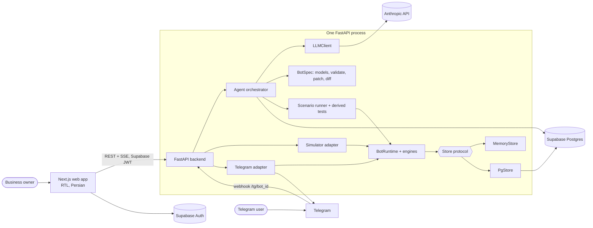
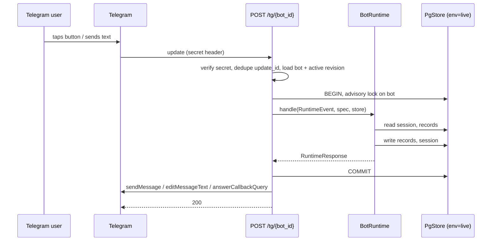
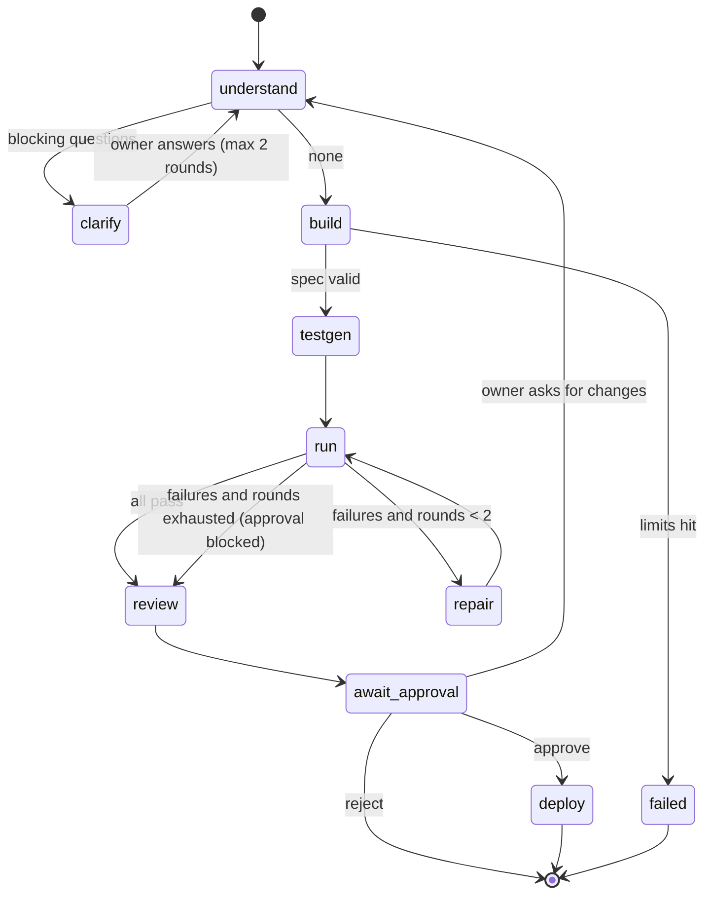
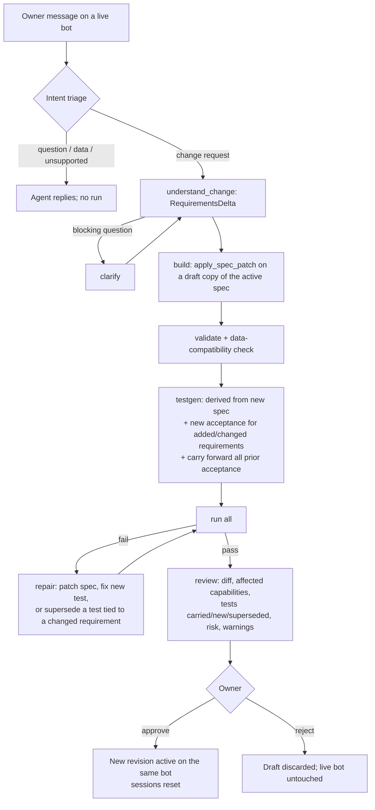
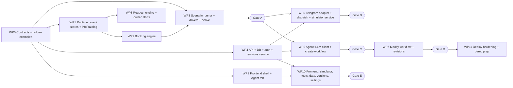

# BotForge — Implementation Roadmap

> **This document is the project's implementation source of truth.**
>
> Before making a major architectural or scope change:
> 1. read this document,
> 2. compare the proposed change against the existing decisions,
> 3. update the relevant sections,
> 4. append a [Decision Log](#decision-log) entry,
> 5. update the [Change Log](#change-log),
> 6. then implement.
>
> Do not let implementation drift silently away from the roadmap. The roadmap is not immutable: if implementation proves an assumption wrong, update the roadmap. Reality wins over old documentation.
>
> Two kinds of statement appear below. **Fixed competition constraints** cannot be changed by us. Everything else is a **current design decision** and can be changed through the process above.

Last updated: 2026-10-05 (Day 3 of 7).

---

## Current Status

**Start here.** This section is the handoff between working sessions. It says what is done, what is unproven, and what to do next. Whoever ends a session updates it.

As of 2026-10-05 (end of the first Linux session), on local branch `main` of `github.com/123100123/BotForge`. Everything below is merged into `main`; it has **not** been pushed yet.

### Done

- **Work packages:** WP0 through WP11 are built and merged. WP5 and WP4b had security reviews.
- **Batch-2 fixes re-verified** by a fresh `verifier`. 10 of the 12 checks held. The 2 that failed were fixed and merged:
  - **M2:** a requirement reworded during a clarify pause could keep its old-wording tests as coverage. Fixed with `AgentState.untested_touched`.
  - **F5:** after disconnect and reconnect, the fresh owner link was hidden. It was also usable, and silently replaced the linked owner. New rule: an owner code can establish an owner but never replace one (see the Decision Log).
- **Hanging test fixed.** It was a test bug, not a product bug: httpx's `ASGITransport` waits for a streaming response to finish, and the test opened the stream of a still-active run. The skip is removed, and a regression test proves a live stream closes when its run ends.
- **Small fixes:**
  - `FRONTEND_ORIGIN` accepts a comma-separated list; trailing slashes are stripped.
  - `scripts/load_spec.py --sample-data` stores sample data and loads it into the sandbox; `backend/scripts/workshop.sample_data.json` is provided.
  - Dispatch skips Telegram delivery to actor ids that are not ASCII integers.
  - Token redaction catches spaced bot tokens and runs in linear time.
  - The payload and response tables are up to date.
- **Headless Claude provider:** `ClaudeCodeLLM` (`LLM_PROVIDER=claude_cli`) runs the agent through the Claude Code login, with no API key (see LLM Strategy).
- **Gate A:** passed earlier.
- **Gate C passed on headless Claude:** `eval_golden.py --create --provider claude_cli --runs 3` passed 3/3. Each run produced 10 derived and 5 acceptance scenarios, all green, with 2 tool calls. Notional API cost was about $0.17 per run, and a run takes about 1 minute.
- **Gate D, automated part, passed on headless Claude:** `--modify --runs 3` passed 3/3, with both golden modifications in each run. It averaged 7 tool calls and a notional $0.19 per run. The manual Telegram half of Gate D is still open.
- **Backend suite:** 1158 passed, 0 skipped, ruff clean (`uv sync --group dbtest --group headless && uv run pytest -q`).
- **Frontend:** `npm ci`, lint and build (mock mode) pass on Linux.

### Built but not yet proven

- **Anthropic API path:** the agent has never run against the real API. Headless runs do not prove `output_config.format` acceptance of the BotSpec schema (O5), prompt caching, `fallbacks`, or real cost. This is the pre-deploy API check (see Milestone Gates).
- **No real Telegram and no deployment.** The webhook path is tested only with `FakeTelegramClient`. The Docker image has never been built.
- **The frontend has never talked to the real backend.**
- **Owner-link race safety** relies on Postgres READ COMMITTED re-checking a single `UPDATE ... WHERE` after a concurrent commit. Tests cover it; a human security review is still worthwhile.

### Open work, in order

1. **Push** `main` to GitHub, after the owner has looked at the changes.
2. **Follow-ups found this session** (small; none blocks the demo):
   - **Stream race:** `Orchestrator._save` commits a terminal status before it appends the `run_status` event, so a stream can close just before that event. The frontend also polls `GET /runs/{id}`, so the UI still settles.
   - **Telegram adapter:** `integrations/telegram/adapter.py` accepts Persian-digit ids through `isdigit()`/`int()`. Dispatch now filters them out first.
   - **JWT redaction** is quadratic on long inputs. Agent input is capped at 4000 characters, where it takes about 4 ms.
   - **npm:** `npm ci` reports 5 high-severity vulnerabilities. Triage them with a `security-executor`.
   - **Budget check:** on `claude_cli`, the tools of the response that crosses the run budget may already have run.
   - **`BotOut.owner_link_code`** (`GET /bots`, `api/bots.py`) returns the raw code instead of going through `armed_owner_code()`. Only the owner sees it, and the webhook rejects such codes, so it is not exploitable, but it should follow the same single rule.
   - **ClaudeCodeLLM:** no test covers a drain that hangs or raises after a successful interrupt. The code path is the same timeout block.
3. **Deploy** (needs the owner's accounts):
   - Set up Supabase (Auth with email confirmation off), Render (`render.yaml`) and Vercel (root `frontend`), following the README "Deployment checklist".
   - Register two BotFather bots.
   - Load the golden spec with `scripts/load_spec.py --sample-data scripts/workshop.sample_data.json`.
4. **Pre-deploy API check** (needs `ANTHROPIC_API_KEY`; costs real money; ask the owner first): run `scripts/spike_structured_output.py` (decides O5), then `scripts/eval_golden.py --create --runs 1 --provider anthropic`.
5. **Gates B, D (manual) and E:**
   - **Gate B:** the golden spec serves real Telegram.
   - **Gate D (manual):** both changes are made on a live bot.
   - **Gate E:** a new account completes the golden path in the deployed UI.
6. **Demo** (Days 6–7): feature freeze at the end of Day 6. Then the Demo Preparation Checklist, the video early on Day 7, and a check of the live link.

### Needs the owner

- Accounts for Supabase, Render (a paid always-on instance) and Vercel, or approval for an agent to create them through connectors. Supabase and Render connectors are available in Claude Code; Vercel's needs authorizing in claude.ai connector settings.
- Two BotFather bot tokens.
- An Anthropic API key with billing, needed only for the pre-deploy API check and the deployed app.
- Answers from the organizers on O1 (deadline, video rules) and O2 (whether the "agent builders" rule restricts only build tooling).

### Setting up a new machine

1. **Clone and test the backend:**
   - `git clone https://github.com/123100123/BotForge && cd BotForge/backend`.
   - Install uv with the official installer (`curl -LsSf https://astral.sh/uv/install.sh | sh`), so it lands in `~/.local/bin`. On Ubuntu, avoid the `astral-uv` snap: after a snap auto-refresh it exited with code 120 and no output.
   - Then `uv sync --group dbtest --group headless && uv run pytest -q`.
2. **Frontend:** Node 20.9 or newer, then `cd frontend && npm ci && npm run build`.
3. **Headless LLM:** log in to Claude Code once. The `claude-agent-sdk` package (group `headless`) bundles the CLI, so `claude` does not need to be on PATH. Set `LLM_PROVIDER=claude_cli` for local runs and evals.
4. **Agent orchestration:** in Claude Code, ask it to install conductor by following `conductor/install/AGENT-INSTALL.md`, then restart Claude Code. It installs globally under `~/.claude/`, and needs Python 3.9 or newer and Claude Code 2.1.284 or newer. On this machine the main model is `opus`; Fable 5.1 (`/model best`) is only for highly sensitive jobs.
5. **Local stack:** follow the README "Local setup" section.

---

## Project Overview

**Problem (official competition problem).** A business owner explains what they need in ordinary language and receives a usable Telegram bot. The agent must understand the request, detect ambiguity, ask follow-up questions only when needed, build the bot's behavior, test it in a sandbox, produce a deployed version, and later accept a natural-language change request, modify the same bot, test it again, and make the new behavior live.

**Product.** BotForge (placeholder name) is a web platform where a Persian-speaking small-business owner talks to an agent. The agent interviews the owner, models the workflow as requirements, composes a declarative bot specification from a fixed catalog of tested capabilities, verifies it with simulated multi-user scenarios, deploys it to the owner's Telegram bot, and safely evolves it when the owner asks for changes.

**Target user.** A non-technical owner of a small business (classes and workshops, events, appointments, repair or service requests) who speaks Persian.

**Core value.** A working, tested, stateful Telegram bot from a conversation, and safe changes to the live bot from a sentence, with no developer involved.

**Fixed competition constraints.**
- One official problem; stay inside it.
- A usable online MVP within one week: registration/login and the complete central workflow must work online.
- The agent must be the heart of the product, not a secondary feature.
- Website builders, agent builders, and automation platforms (n8n and similar) are prohibited. We read this as a restriction on what we build *with*; see [Open Decisions](#open-decisions).
- Frameworks and libraries are allowed.
- No locally run LLMs; LLM access goes through an external provider.
- The first version may support a predefined set of capabilities. We exploit this deliberately.

**Situation.** Solo developer working through Claude Code agents. Judging is by recorded video plus a live link. One day of the week has passed; Days 2–7 are assumed to be 2026-10-04 through 2026-10-09.

---

## Current Product Definition

V1 is:

1. A Persian, right-to-left web app with sign-up and login.
2. An agent that turns a Persian business description into a `Requirements` model, asks at most a few blocking questions, and shows the rest as editable assumptions.
3. A bounded tool-using build loop that writes a declarative `BotSpec` composed of four capability types: `info`, `catalog`, `booking`, `request`.
4. A deterministic runtime with one tested Python engine per capability type. The same runtime serves real Telegram traffic, the web simulator, and automated tests. It makes no LLM calls.
5. Automated verification: static validation, deterministic scenarios derived from the spec, and acceptance scenarios the LLM writes from the owner's requirements. A bounded repair loop fixes failures.
6. Deployment to the owner's own Telegram bot (token from BotFather) through one shared webhook backend.
7. Natural-language modification of the live bot: requirement delta → spec patch → validation → new and carried-forward tests → owner-readable diff → approval → new active revision on the same bot.
8. A generic data admin, version history with rollback, and owner alerts in Telegram.

---

## MVP Success Criterion

A new business owner can sign up and log in on the public site, describe a supported workflow in Persian, answer the agent's necessary clarification questions, watch the agent build and test the bot, try the draft in the web simulator, approve it, connect a BotFather token, and use the bot in real Telegram. The owner can then request a behavior change in Persian, see what will change and which tests ran, approve it, and observe the changed behavior on the same live Telegram bot. No developer edits application source code at any point, and no Telegram interaction calls an LLM.

---

## Demo Golden Path

The video shows one scenario done well, then one short second scenario.

**Golden prompt (create):**

> من یک آموزشگاه دارم و کارگاه‌های آموزشی برگزار می‌کنم. می‌خواهم مشتری‌ها در ربات تلگرام لیست کارگاه‌ها را ببینند و ثبت‌نام کنند. ظرفیت هر کارگاه ۱۰ نفر است. اگر ظرفیت پر شد وارد لیست انتظار شوند و اگر کسی انصراف داد، نفر اول لیست انتظار خودکار جایگزین شود. امکان لغو ثبت‌نام هم باشد.

**Sequence.**
1. Sign up, create a bot, paste the golden prompt.
2. Agent shows discovered requirements and assumptions; asks at most one or two blocking questions; owner answers.
3. Activity timeline: understanding → building → validating → generating tests → running tests → all green. The Tests tab shows scenarios as Persian narratives (for example: capacity 2; Ali and Sara confirmed; Reza waitlisted; Ali cancels; Reza promoted).
4. Owner tries the draft in the Simulator tab with two personas.
5. Owner approves (the revision becomes active), adds two real workshops in the Data tab, and pastes the BotFather token in Settings; the bot goes live.
6. Real Telegram on a phone: browse workshops, reserve, see "my reservations", cancel.
7. Owner adds another workshop in the Data tab while the bot is live; it appears in Telegram at once.
8. **Modification 1:** «ظرفیت هر کارگاه را ۱۲ نفر کن.» Diff shows capacity 10 → 12, affected capability, tests carried forward and new, risk low. Approve. Live bot reflects it.
9. **Modification 2:** «لغو ثبت‌نام فقط تا ۲ ساعت قبل از شروع کارگاه ممکن باشد.» Agent adds the deadline, writes a new acceptance scenario using simulated time, regression suite passes. Approve. In Telegram, cancelling a workshop that starts in one hour is refused.
10. Versions tab shows three revisions.
11. About 20 seconds: a second bot from a different prompt (appliance repair requests with owner approval), owner taps "approve" on a Telegram alert.

**Must work flawlessly:** steps 1–10. Step 11 is cut if the request engine is not solid by the end of Day 5.

**Capacity note.** "Capacity 10 → 12" is only a spec change if capacity lives in the spec. The golden prompt says every workshop has 10 seats, so the agent must choose `capacity.mode = "fixed"`. The agent never edits live business records.

---

## Scope

**MUST HAVE**
- Sign-up/login; bots list; bot workspace.
- CREATE agent workflow end to end, with visible activity.
- `info`, `catalog`, `booking` engines; `MemoryStore` and `PgStore`.
- Static validation, derived scenarios, LLM acceptance scenarios, bounded repair.
- Web simulator on the draft or active revision, with personas and reset.
- Telegram onboarding by token, webhook, multi-bot routing.
- Generic data admin for resources; bookings list.
- MODIFY agent workflow with patch, diff, carried-forward tests, approval, activation.
- Revision history.
- Honest handling of unsupported requests.
- Deployed, public, with a seeded demo account.

**SHOULD HAVE**
- `request` engine with owner actions, and owner alerts in Telegram with inline approve/reject.
- Rollback to an earlier revision from the Versions tab.
- Sample data generated by the agent into the sandbox.
- Fast-model routing for trivial LLM calls.
- Per-account daily run cap.

**NICE TO HAVE**
- Simulator time controls (advance the sandbox clock).
- Scheduled reminders before a booked item starts.
- Simple ordering through `request.item_resource`.
- Token usage and cost shown per run.

**OUT OF SCOPE (V1)**
- Generated or arbitrary code; custom predicate rules; arbitrary integrations or external API calls.
- Payments; multi-item carts; CRM integrations; Telegram Mini Apps; custom frontends.
- LLM calls at bot runtime; free-text understanding from bot users.
- Organizations, teams, roles; languages other than Persian; platforms other than Telegram.
- The agent editing live business records.

---

## Key Product Decisions

| # | Decision | Why |
|---|---|---|
| K1 | Capability-level BotSpec interpreted by per-capability Python engines; no generic flow graph, no compiler | A flow interpreter needs a query/binding/template mini-language designed correctly on day one. Engines give the same visible behavior with far less risk, and patches stay small and owner-readable. |
| K2 | Rules are typed parameters on capabilities, not a predicate DSL | Every rule on the golden path is a parameter. A DSL adds validation, testing, and LLM error surface with no demo value. |
| K3 | Zero LLM calls at runtime | Reliability, latency, and near-zero operating cost. |
| K4 | Hand-rolled phase state machine; no LangGraph | The graph is small (linear, two loops, two human pauses). A persisted state machine is easier to debug than framework resume semantics. |
| K5 | Bounded tool loop inside fixed phases | Visible, real autonomy (the agent edits, validates, tests, reads failures, repairs) with capped cost. |
| K6 | Requirements model between conversation and spec | Gives the owner something readable to approve, and requirement ids tie together tests, diffs, and the supersede guard. |
| K7 | Hybrid tests: derived from spec + acceptance from requirements | Derived tests verify the runtime against the spec. Acceptance tests verify the spec against the owner's intent, which is what gives the repair loop real work. |
| K8 | Tests are semantic actions executed through real RuntimeEvents by per-engine drivers | The LLM cannot be expected to know button labels and step order. Semantic steps are robust and readable, and still exercise the production runtime. |
| K9 | One runtime, two adapters (Telegram, simulator), two stores (`PgStore`, `MemoryStore`) with a shared contract suite | Passing simulation means passing production behavior; agent test runs stay in milliseconds. |
| K10 | Patches are `set/add/remove` on key-addressed paths; every revision stores a full spec snapshot | Key addressing survives reordering; snapshots make rollback and diff trivial. |
| K11 | The agent may supersede an old test only if it covers a requirement the current change touches | The agent cannot delete tests to get a green run. |
| K12 | Capacity is `fixed` (in spec) or `per_item` (resource field) | Makes "change capacity" a real behavior change when the owner states a uniform capacity. |
| K13 | Web data admin plus owner alerts in Telegram | The owner must be able to add items; alerts with inline actions make approval flows feel alive for little cost. |
| K14 | Supabase Auth and Postgres; backend on Render; frontend on Vercel; one backend process | Least infrastructure that satisfies "usable online with login". |
| K15 | Direct Telegram Bot API through httpx; no bot framework | We need six API methods and multi-bot webhook routing; a framework adds surface without benefit. |
| K16 | Anthropic API behind a thin `LLMClient` | Strong structured output and tool use; the interface keeps the provider swappable. |
| K17 | Persian only, RTL only | One language done properly beats two done halfway. |

---

## Open Decisions

| # | Question | Default until answered |
|---|---|---|
| O1 | Exact submission deadline and video requirements | End of 2026-10-09; video under five minutes |
| O2 | Does "agent builders are prohibited" restrict the product category or only build tooling? | Only build tooling, since the official problem is itself a bot-building product. Ask the organizers. |
| O3 | Paid always-on Render instance acceptable? | Yes |
| O4 | Anthropic API key with billing available? | Needed only for deployment and one pre-deploy API check; development and live evals use headless Claude Code (`LLM_PROVIDER=claude_cli`) |
| O5 | Strict structured output for the full BotSpec schema, or non-strict tool input with validation feedback? | Decided by the API spike (`scripts/spike_structured_output.py`, API-only), which runs as part of the pre-deploy API check; Pydantic validation is authoritative either way |
| O6 | Product name | BotForge |

---

## Assumptions

- One owner per account; a bot belongs to exactly one owner.
- The owner creates the Telegram bot in BotFather and pastes the token.
- All times are stored in UTC and displayed in `Asia/Tehran` with the Jalali calendar and Persian digits.
- Bot users interact through buttons and short form answers. Unrecognized text re-shows the main menu.
- Bot users never enter dates. Datetime fields exist only on owner-managed resources and are entered in the web admin.
- Traffic is hackathon scale: one backend process, events for a bot processed one at a time.
- An interrupted agent run (process restart) is marked `interrupted` and restarted by the owner; we do not resume mid-phase.
- Changing a spec resets in-flight bot-user sessions for that bot.

---

## Supported Business Capabilities

| Capability | What the bot user can do | Typical uses |
|---|---|---|
| `info` | Read static pages | About, address, hours, FAQ |
| `catalog` | Browse a resource: list → detail | Services, menu, price list |
| `booking` | Browse bookable items, reserve, see own reservations, cancel; capacity, duplicates, per-user limit, booking cutoff, waitlist with auto-promotion, cancellation deadline | Workshops, classes, events, appointment slots (capacity 1), consultations |
| `request` | Submit a form, track status; owner approves/rejects or moves status; user is notified | Repair/service requests, applications, simple single-item orders |

Cross-cutting: main menu, Persian text overrides, owner and user notifications on capability events.

## Unsupported Capabilities

Payments; carts with multiple items; arbitrary rules beyond the typed parameters; integrations and external APIs; file or photo uploads; broadcast messaging; free-text or AI chat inside the bot; recurring schedule generation (the owner adds each item); multi-admin roles; languages other than Persian.

When the owner asks for one of these, the agent records it under `Requirements.unsupported` with a reason and the closest supported alternative, and tells the owner plainly.

---

## System Architecture



| Component | Responsibility |
|---|---|
| Web app | Auth, bot workspace, agent chat and activity, simulator, tests, data admin, versions, settings |
| API | Auth check, ownership scoping, REST endpoints, SSE stream, Telegram webhook |
| Agent orchestrator | Phase state machine for CREATE and MODIFY; emits events; calls the LLM and deterministic services |
| LLMClient | `structured()` and `tool_loop()` over the Anthropic SDK; usage accounting; limits |
| BotSpec package | Pydantic models, semantic validation, patch application, diff, data-compatibility check |
| Runtime | `BotRuntime.handle(event, spec, store)` and one engine per capability type |
| Stores | `MemoryStore` for test runs; `PgStore` for live and sandbox |
| Testing package | Scenario models, drivers, runner, derived-scenario templates, report |
| Telegram adapter | Token onboarding, webhook, update ↔ RuntimeEvent conversion, sending |
| Simulator adapter | Persona events ↔ RuntimeEvent against `PgStore(env="sandbox")` |

---

## Build-Time Architecture

Build time is everything the owner triggers from the Agent tab. An agent run is a row in `agent_runs` with a `phase` and JSON `state`, executed as an asyncio task in the backend process. Each step appends rows to `agent_events`, which the frontend reads over SSE. The run pauses in two places: waiting for clarification answers and waiting for approval. See [Agent Architecture](#agent-architecture), [Creation Workflow](#creation-workflow), and [Modification Workflow](#modification-workflow).

LLM calls happen only here.

---

## Runtime Architecture



- `BotRuntime` is deterministic. Its only inputs are the event (including `now`), the spec, and the store.
- Routing inside the runtime: `/start` or unknown text → welcome and main menu; a callback → the engine named in the callback data; text while a session is active → the engine that owns the session.
- Each event is one database transaction under `pg_advisory_xact_lock` keyed by bot id. Outbound Telegram calls happen after commit.
- The webhook always returns 200. Failures are logged with the bot id and update id.

---

## BotSpec

**Purpose.** The complete, declarative description of one bot's behavior. It is data only: no code, no expressions, no templates beyond whitelisted placeholder substitution. The LLM writes and patches it; the runtime interprets it; the owner sees it as requirement statements and diffs.

**Structural rule.** Every collection is a list of objects with a unique `key`. Paths address elements by key, never by index. There are no free-form maps in LLM-facing models, so the schema stays compatible with strict structured output.

Location: `backend/app/botspec/models.py`.

```python
SPEC_VERSION = 1
Key = Annotated[str, StringConstraints(pattern=r"^[a-z][a-z0-9_]{0,23}$")]

class FieldType(StrEnum):
    text = "text"; long_text = "long_text"; integer = "integer"; decimal = "decimal"
    datetime = "datetime"; boolean = "boolean"; choice = "choice"; phone = "phone"

class FieldDef(BaseModel):
    key: Key
    label: str                       # Persian, shown to users and in the admin
    type: FieldType
    required: bool = True
    choices: list[str] | None = None # required iff type == choice
    default: str | None = None       # string form; coerced by type

class Resource(BaseModel):           # owner-managed entity
    key: Key
    label: str
    label_plural: str
    fields: list[FieldDef]
    title_field: Key

class BotMeta(BaseModel):
    name: str
    welcome_text: str
    timezone: str = "Asia/Tehran"
    language: Literal["fa"] = "fa"

class TextOverride(BaseModel):
    key: str                         # must be a text key the engine declares
    value: str                       # may use only that key's whitelisted placeholders

class InfoPage(BaseModel):
    key: Key; title: str; body: str

class InfoCapability(BaseModel):
    type: Literal["info"]
    key: Key; title: str
    pages: list[InfoPage]

class CatalogCapability(BaseModel):
    type: Literal["catalog"]
    key: Key; title: str
    resource: Key
    detail_fields: list[Key]
    upcoming_only_field: Key | None = None   # datetime field; hide past items
    sort_field: Key | None = None
    sort_desc: bool = False
    texts: list[TextOverride] = []

class Capacity(BaseModel):
    mode: Literal["fixed", "per_item"]
    value: int | None = None         # required iff fixed; >= 1
    field: Key | None = None         # required iff per_item; integer field on the resource

class Waitlist(BaseModel):
    enabled: bool = False
    auto_promote: bool = True

class Cancellation(BaseModel):
    enabled: bool = True
    deadline_hours: int | None = None  # cancel refused when now > start - deadline_hours

class BookingCapability(BaseModel):
    type: Literal["booking"]
    key: Key; title: str
    resource: Key                    # the bookable items
    capacity: Capacity
    start_field: Key | None = None   # datetime field on the resource
    detail_fields: list[Key]
    form_fields: list[FieldDef] = [] # asked at booking; no datetime type
    one_active_per_user_per_item: bool = True
    max_active_per_user: int | None = None
    closes_hours_before_start: int | None = None
    waitlist: Waitlist = Waitlist()
    cancellation: Cancellation = Cancellation()
    notify_owner_on: list[Literal["booked", "waitlisted", "cancelled"]] = []
    notify_user_on: list[Literal["promoted"]] = ["promoted"]
    texts: list[TextOverride] = []

class StatusDef(BaseModel):
    key: Key; label: str

class OwnerAction(BaseModel):
    key: Key; label: str
    from_statuses: list[Key]
    to_status: Key

class RequestCapability(BaseModel):
    type: Literal["request"]
    key: Key; title: str
    form_fields: list[FieldDef]
    item_resource: Key | None = None # optional: pick one item from a resource
    statuses: list[StatusDef]
    initial_status: Key
    owner_actions: list[OwnerAction]
    notify_owner_on: list[Literal["submitted"]] = ["submitted"]
    notify_user_on: list[Literal["status_changed"]] = ["status_changed"]
    texts: list[TextOverride] = []

Capability = Annotated[
    InfoCapability | CatalogCapability | BookingCapability | RequestCapability,
    Field(discriminator="type"),
]

class MenuItem(BaseModel):
    key: Key
    label: str
    capability: Key
    view: Literal["main", "mine"] = "main"  # "mine" = my reservations / my requests

class BotSpec(BaseModel):
    spec_version: Literal[1] = 1
    bot: BotMeta
    resources: list[Resource]
    capabilities: list[Capability]
    menu: list[MenuItem]
```

**Semantic validation** (`backend/app/botspec/validate.py`, `validate_spec(spec) -> list[SpecIssue]`; an issue has `path`, `code`, `message`, `severity: error|warning`). Errors block the build.

- Keys are unique within each collection.
- Every `resource`, `item_resource`, and `menu.capability` reference exists.
- `title_field`, `detail_fields`, `start_field`, `upcoming_only_field`, `sort_field`, `capacity.field` exist on the referenced resource and have a compatible type (`start_field`/`upcoming_only_field` datetime, `capacity.field` integer).
- `capacity` matches its mode; `value >= 1`.
- `choice` fields have at least two choices; non-choice fields have none.
- `form_fields` contain no `datetime` type.
- `deadline_hours` and `closes_hours_before_start` require `start_field`.
- `mine` menu items point at `booking` or `request` capabilities.
- `request`: `initial_status` and every status in `owner_actions` exist in `statuses`.
- `texts` keys exist in the registry `botspec/text_keys.py` for that capability type, and values use only that key's whitelisted placeholders. The registry is owned by WP0 and lists the keys for all four types; each engine must supply a default Persian string for exactly those keys.
- Resource keys and capability keys share the `records.collection` namespace: a resource key must not equal a capability key, and `menu` is reserved for both.
- Every `request` owner action must fit in callback data: `make_callback(cap.key, "own", "<12-digit id>." + action.key)` is at most 64 bytes.
- Menu has at least one item and at most eight; at least one capability exists.
- Warning: a `booking` with `cancellation.enabled` and no `mine` menu item.

**Outline** (`backend/app/botspec/outline.py`, `spec_outline(spec) -> SpecOutline`): keys, titles, types, resource field keys and types. It deliberately omits rule values. It is the only view of the spec the acceptance-test author sees.

---

## Requirements Model

Location: `backend/app/agent/requirements.py`. Retained.

```python
class Requirement(BaseModel):
    id: str                          # "R1", "R2", ... stable across revisions
    kind: Literal["capability", "rule", "data", "text", "notification"]
    statement: str                   # Persian, owner-readable, one sentence
    status: Literal["confirmed", "assumed"]

class Unsupported(BaseModel):
    statement: str; reason: str; alternative: str | None

class Question(BaseModel):
    id: str
    text: str                        # Persian
    why: str
    severity: Literal["blocking", "important"]
    options: list[str] | None = None

class Requirements(BaseModel):
    business_summary: str
    items: list[Requirement]
    unsupported: list[Unsupported]
    open_questions: list[Question]

class RequirementsDelta(BaseModel):  # MODIFY only
    added: list[Requirement]
    changed: list[Requirement]       # same id, new statement
    removed: list[str]               # ids
    unsupported: list[Unsupported]
    open_questions: list[Question]
```

**Clarification policy.**
- `blocking`: the answer changes which capability or which rule mode is built, and no sensible default exists. Asked. At most three per round and two rounds per run.
- `important`: a sensible default exists. Not asked; recorded as a requirement with `status = "assumed"` and shown in the assumptions card, where the owner can object in chat.
- Everything else: defaulted silently.

Requirement ids are the join key between requirements, scenarios (`requirement_ids`), and the modify-time supersede guard.

---

## Capability Catalog

A capability type is the unit of reuse. Each one consists of:

| Part | Location | Content |
|---|---|---|
| Spec model | `botspec/models.py` | The Pydantic model above |
| Engine | `runtime/engines/<type>.py` | Handles callbacks and session text for that type |
| Text keys | `botspec/text_keys.py` | Per type: text key → allowed placeholders (owned by WP0) |
| Default texts | `runtime/texts/<type>.py` | A default Persian string for every registered key of that type |
| Driver | `testing/drivers.py` | Performs semantic test actions through real events |
| Derived-scenario templates | `testing/derive.py` | Scenarios generated from the capability's config |
| Catalog entry | `agent/prompts/catalog.md` | What it does, its parameters, when to use it; part of the cached system prompt |

Adding a capability type after V1 means adding these six parts. The LLM composes bots only from catalog entries.

**Engine interface** (`runtime/engines/base.py`):

```python
class Engine(Protocol):
    type: ClassVar[str]
    async def open(self, ctx: Ctx, cap, view: str) -> None            # from the menu
    async def on_callback(self, ctx: Ctx, cap, action: str, arg: str) -> None
    async def on_text(self, ctx: Ctx, cap, text: str) -> None         # session-owned input
    async def owner_action(self, ctx: Ctx, cap, record_id: int, action: str) -> None
```

`Ctx` carries the event, spec, store, and a response builder (`ctx.reply(...)`, `ctx.notify(actor_id, notice, ...)`, `ctx.outcome(...)`, `ctx.effect(...)`).

Engine rules that tests and drivers rely on:
- **Registry.** `runtime/engines/__init__.py` maps each capability type to its module path and imports it on first use. Adding an engine means adding its module; no shared file is edited.
- **Rejected actions keep their button.** An engine shows the action button (book, cancel, owner action) even when the action will be refused, and answers with a Persian explanation plus an `Outcome(result="rejected", reason=...)`. A full item with no waitlist still shows "book"; a booking past the cancellation deadline still shows "cancel". This is what lets a scenario observe `capacity_full` or `cancel_deadline_passed`.
- **Owner actions have one path.** Telegram inline owner buttons (callback action `own`) and web-admin actions (event kind `admin`) both end in `engine.owner_action`. Booking has one fixed owner action, `cancel`.

**Booking semantics** (the part that must be exactly right):
- Record statuses: `confirmed`, `waitlisted`, `cancelled`.
- Book: reject with `booking_closed` if the cutoff has passed or the item has started; `duplicate` if the user has an active (confirmed or waitlisted) booking on the item and `one_active_per_user_per_item`; `user_limit` if `max_active_per_user` is reached. Then: confirmed count < capacity → `confirmed`; else waitlist enabled → `waitlisted`; else reject with `capacity_full`.
- Cancel: reject with `cancellation_disabled` or `cancel_deadline_passed` as applicable. Otherwise set `cancelled`. If the cancelled booking was `confirmed`, waitlist is enabled, and `auto_promote` is on, the oldest `waitlisted` booking on that item becomes `confirmed` and that user is notified.
- Capacity lowered below the current confirmed count: existing bookings stay; no new confirmations until the count drops below capacity.
- Owner cancelling a booking in the admin follows the same promotion rule and ignores the deadline.

---

## Runtime Contracts

Location: `backend/app/runtime/contracts.py`. Frozen at the end of Day 2; changes after that go through the Decision Log.

```python
class Actor(BaseModel):
    id: str                       # Telegram user id as string, or persona id ("ali")
    display_name: str
    is_owner: bool = False

class RuntimeEvent(BaseModel):
    bot_id: str
    env: Literal["live", "sandbox"]
    actor: Actor
    kind: Literal["start", "text", "callback", "admin"]  # admin: owner action from the web admin
    text: str | None = None
    data: str | None = None       # callback data (also used by kind="admin")
    now: datetime                 # timezone-aware UTC; always injected

class Button(BaseModel):
    label: str
    data: str                     # <= 64 bytes UTF-8

NoticeKind = Literal["booked", "waitlisted", "cancelled", "promoted", "submitted", "status_changed"]

class OutMessage(BaseModel):
    to_actor_id: str
    text: str                     # plain text; the adapter escapes it
    buttons: list[list[Button]] = []
    edit: bool = False            # replace the message that carried the callback
    notice: NoticeKind | None = None  # set on notifications to someone other than the acting actor

ReasonCode = Literal["capacity_full", "duplicate", "user_limit", "booking_closed",
                     "cancel_deadline_passed", "cancellation_disabled",
                     "not_found", "invalid_input", "not_allowed"]

class Outcome(BaseModel):         # machine-readable result of a business action
    capability: str
    action: Literal["book", "cancel", "submit", "owner_action"]
    result: Literal["confirmed", "waitlisted", "cancelled", "submitted", "ok", "rejected"]
    reason: ReasonCode | None = None
    record_id: int | None = None

class Effect(BaseModel):
    kind: Literal["record_created", "record_updated", "record_deleted", "notification"]
    collection: str | None = None
    record_id: int | None = None
    status: str | None = None
    to_actor_id: str | None = None

class RuntimeResponse(BaseModel):
    messages: list[OutMessage]
    outcomes: list[Outcome] = []
    effects: list[Effect] = []

class BotRuntime:
    async def handle(self, event: RuntimeEvent, spec: BotSpec, store: Store) -> RuntimeResponse: ...
```

**Callback data format:** `"<capability_key>:<action>:<arg>"`, split on the first two colons, at most 64 bytes. Engines and drivers build and parse callback data only through `make_callback` / `parse_callback` in `runtime/callbacks.py`, and use only this action vocabulary (constants in the same file):

| Scope | Action | Arg |
|---|---|---|
| pseudo-capability `menu` | `home` | — |
| | `open` | menu item key |
| `info` | `show` | page key |
| `catalog` | `list` | page number |
| | `item` | record id |
| `booking` | `list` | page number |
| | `item` | item record id |
| | `book` | item record id |
| | `mine` | — |
| | `cancel` | booking record id |
| `request` | `new` | — |
| | `pick` | item record id |
| | `mine` | — |
| | `own` | `<record_id>.<owner_action_key>` |
| form input (any engine) | `ans` | choice index |
| | `skip`, `stop` | — |

An `admin` event carries the same callback string in `data` (for example `book_workshop:cancel:42` or `repair:own:17.approve`) with the owner as actor.

**Owner identity.** A store's `owner_actor_id()` returns a value bound when the store is constructed: `"owner"` for `MemoryStore` and for the sandbox; the linked owner's Telegram user id for live, or `None` if the owner has not linked. V1 handles private chats only, so an actor's Telegram chat id equals `actor.id`.

**Store protocol** (`backend/app/runtime/store.py`). A store instance is bound to one `(bot_id, env)`.

```python
class Record(BaseModel):
    id: int
    collection: str               # resource key or capability key
    data: dict[str, Any]
    status: str | None = None
    actor_id: str | None = None
    item_id: int | None = None
    created_at: datetime
    updated_at: datetime

class Store(Protocol):
    async def list_records(self, collection: str, *, status_in: list[str] | None = None,
                           actor_id: str | None = None, item_id: int | None = None,
                           order_by: str = "id", limit: int | None = None) -> list[Record]: ...
    async def count_records(self, collection: str, *, status_in=None, actor_id=None, item_id=None) -> int: ...
    async def get_record(self, collection: str, record_id: int) -> Record | None: ...
    async def create_record(self, collection: str, data: dict, *, status=None, actor_id=None,
                            item_id=None, now: datetime) -> Record: ...
    async def update_record(self, collection: str, record_id: int, *, data: dict | None = None,
                            status: str | None = None, now: datetime) -> Record: ...
    async def delete_record(self, collection: str, record_id: int) -> None: ...
    async def get_session(self, actor_id: str) -> dict | None: ...
    async def set_session(self, actor_id: str, state: dict | None) -> None: ...
    async def upsert_user(self, actor: Actor) -> None: ...
    async def owner_actor_id(self) -> str | None: ...
```

**Session behavior.** One session per `(bot_id, env, actor_id)`: `{capability, step, vars}`. It exists only while a multi-step interaction (a form) is in progress. `/start` clears it. A session whose capability key no longer exists in the active spec is discarded.

**Persistence boundaries.** The runtime reads and writes only through `Store`. It never touches the database session, HTTP, Telegram, the clock, or the LLM. Adapters own transactions and I/O.

**Formatting.** `runtime/formatting.py` renders datetimes as Jalali in the bot timezone, renders numbers with Persian digits, and normalizes Persian and Arabic digits in user input to ASCII before parsing.

---

## Agent Architecture

Location: `backend/app/agent/`.

**Run state** (persisted in `agent_runs.state`):

```python
class RunState(BaseModel):
    kind: Literal["create", "modify"]
    phase: Phase
    conversation: list[ChatTurn]          # owner and agent messages
    requirements: Requirements | None
    delta: RequirementsDelta | None       # modify
    clarify_rounds: int = 0
    draft_spec: BotSpec | None
    patch_ops: list[PatchOp] = []         # modify: accumulated ops against the base spec
    scenarios: list[Scenario] = []
    superseded: list[SupersededScenario] = []
    test_report: TestReport | None
    repair_rounds: int = 0
    usage: Usage                          # tokens in/out/cached, tool calls
    error: str | None = None
```

**Phases.**



| Phase | Kind | What it does |
|---|---|---|
| `understand` | LLM, structured | CREATE: conversation → `Requirements`. MODIFY: change request + current requirements + spec outline → `RequirementsDelta`. |
| `clarify` | pause | Emits blocking questions; run status `waiting_user`. |
| `build` | LLM, tool loop | CREATE: writes the spec. MODIFY: patches a draft copy. Ends when `validate_spec` returns no errors and the model calls `finish`. |
| `testgen` | deterministic + one LLM structured call | Derived scenarios from the spec; acceptance scenarios from requirements + spec outline. MODIFY: acceptance scenarios for added and changed requirements; all prior acceptance scenarios carried forward. |
| `run` | deterministic | Runs every scenario on `MemoryStore`. |
| `repair` | LLM, tool loop | Reads failures, patches the spec, or corrects a wrong acceptance scenario with a stated reason. |
| `review` | deterministic + fast LLM calls | Builds the summary: requirements, diff, tests, risk, warnings. On CREATE (and when a MODIFY adds a resource) generates `sample_data: list[SeedRecord]` with relative datetimes. Writes the draft revision row and loads the sample data into the sandbox, so the simulator is usable at once. |
| `await_approval` | pause | Run status `waiting_approval`. The draft is usable in the simulator. Approval is refused while any scenario fails. |
| `deploy` | deterministic | Activates the draft revision through the revisions service. |

**Limits.** 15 tool calls per loop; 2 repair rounds; 3 questions per clarify round, 2 rounds; a per-run token budget (initially 400k input, 40k output); a per-account daily run cap (initially 30). When a limit is hit the run moves to `review` with approval blocked and the failures shown, or to `failed` with a Persian explanation. Nothing retries without the owner.

**Human approval points.** Clarification answers; approval before activation. The agent never activates a revision on its own, and a revision with a failing scenario cannot be activated by anyone: the owner can ask the agent to try again or reject the draft.

**Events** (`agent_events.type`): `owner_message`, `agent_message`, `phase_started`, `phase_finished`, `run_status`, `requirements`, `questions`, `tool_call`, `tool_result`, `spec_updated`, `tests_generated`, `test_report`, `diff`, `approval_requested`, `deployed`, `usage`, `error`. Payloads are JSON and are what the activity timeline renders.

Event envelope: `{id, run_id, ts, type, payload}`. Payload shapes (a contract between WP6/WP7 and the frontend):

| Type | Payload |
|---|---|
| `owner_message`, `agent_message` | `{text}` |
| `phase_started` | `{phase}` |
| `phase_finished` | `{phase, ok, summary?}` |
| `requirements` | `{requirements: Requirements}` |
| `questions` | `{questions: Question[]}` |
| `tool_call` | `{loop: "build" \| "repair", name, summary}` (a short Persian summary, never full arguments) |
| `tool_result` | `{name, ok, summary}` |
| `spec_updated` | `{outline: SpecOutline}` |
| `run_status` | `{status, phase}`; emitted on every run status transition (`running`, `waiting_user`, `waiting_approval`, `done`, `failed`, `rejected`, `interrupted`) |
| `tests_generated` | `{derived, acceptance}` (counts) |
| `test_report` | `{total, passed, failed, failures: [{id, title, message}]}` |
| `diff` | `{changes: [{label_fa, kind}], affected_capabilities: [key], tests: {carried, new, superseded: [{title, reason}]}, risk, warnings: [text], requirements: {added: [{id, statement}], changed: [{id, before, after}], removed: [{id, statement}]}}` (`requirements` is the cumulative requirements delta; empty lists when there is none) |
| `approval_requested` | `{revision_id, can_approve, blocked_reason?}` |
| `deployed` | `{revision_id, number}` |
| `usage` | `{input_tokens, output_tokens, cached_tokens, tool_calls}` |
| `error` | `{message}` |

Acceptance scenarios must carry at least one `requirement_ids` entry that exists in the run's requirements; `testgen` rejects any that do not. Without ids the supersede guard could never release a scenario whose requirement changed.

**Intent triage.** Each new owner message on a bot with an active revision is first classified: change request, question about the bot, data request (redirected to the Data tab), or unsupported. Only change requests start a MODIFY run.

---

## Agent Tools

Tools exposed to the LLM inside `build` and `repair`. All are deterministic Python; none calls an LLM. Each returns a compact JSON result.

| Tool | Loop | Input | Output | Responsibility |
|---|---|---|---|---|
| `set_spec` | build (create only) | full `BotSpec` | `{ok, issues[]}` | Replace the draft spec; runs schema and semantic validation |
| `apply_spec_patch` | build, repair | `ops: PatchOp[]` | `{ok, issues[], changed_paths[]}` | Apply key-addressed ops atomically to the draft; validates the result |
| `validate_spec` | build, repair | none | `{issues[]}` | Re-run validation on the draft |
| `get_spec` | build, repair | optional `path` | spec or sub-tree | Read the current draft |
| `run_tests` | repair | none | `{total, passed, failed[{id, title, failed_step, message}]}` | Run all scenarios on `MemoryStore` |
| `get_failure` | repair | `scenario_id` | scenario, failing step, transcript tail | Explain one failure in detail |
| `fix_scenario` | repair | `scenario_id`, corrected `Scenario`, `reason` | `{ok}` or refusal | Correct an acceptance scenario **written in this run** that misstates the requirement; the reason is shown to the owner. Refused for carried-forward and derived scenarios. |
| `supersede_scenario` | repair (modify only) | `scenario_id`, `reason` | `{ok}` or refusal | Retire a carried-forward scenario; allowed only if its `requirement_ids` intersect the delta's changed or removed ids |
| `finish` | build, repair | `summary` | ends the loop | Declare the phase complete |

Not LLM tools (plain services called by the orchestrator): loading the active spec, deriving scenarios, creating revisions, activating or rolling back revisions, Telegram calls, sample-data loading. The LLM has no tool that reads or writes live records, tokens, or other bots.

---

## Creation Workflow

1. Owner creates a bot (name only) and sends the first message. `POST /bots/{id}/runs` creates a `create` run.
2. `understand`: one structured call with the conversation and the capability catalog → `Requirements`. Events: `requirements`, and `questions` if any.
3. If blocking questions exist → `clarify`. The owner answers in chat; `understand` runs again with the answers. After two rounds remaining questions become assumptions.
4. `build`: tool loop. The model calls `set_spec`, reads validation issues, patches until clean, and calls `finish`. Events per tool call.
5. `testgen`: `derive_scenarios(spec)` plus one structured call producing acceptance scenarios (two to six, each tagged with requirement ids). Event: `tests_generated`.
6. `run`: all scenarios on `MemoryStore`. Event: `test_report`.
7. Failures → `repair` (max two rounds) → `run` again.
8. `review`: summary of requirements met, capabilities built, test results, unsupported items, assumptions. Sample data is generated. A draft revision row is written and the sample data is loaded into the sandbox.
9. `await_approval`: the owner can open the Simulator tab against the draft revision, which already has sample items.
10. Approve (only possible when every scenario passes) → `deploy`: the draft revision becomes active. The UI then points the owner to the Data tab to add real items and to Settings to connect the Telegram token. Live data starts empty; sample data is never copied to live.

---

## Modification Workflow

Modification is the most important workflow. It must be safe, explainable, and demonstrably tested.



Details:

1. **Base.** The run records `base_revision_id`. The draft is a copy of that revision's spec. The live bot is untouched until approval.
2. **Delta.** `understand_change` outputs `RequirementsDelta`. The new requirements set is the old set with the delta applied.
3. **Patch only.** `set_spec` is not available. All edits are `apply_spec_patch` ops, accumulated in `patch_ops`.
4. **Impact (deterministic).** `diff_specs(base, draft)` yields changed paths with Persian labels. Affected capabilities are the capability keys on those paths. Affected scenarios are those whose `capability_keys` intersect.
5. **Data compatibility** (`botspec/compat.py`, `check_compat(old, new, record_counts)`):
   - a field's type changed → error;
   - a required field added to a resource that has records and no default → error (make it optional or give a default);
   - a resource, capability, or field with existing records removed → warning (data is kept, hidden);
   - capacity lowered below existing confirmed counts → warning.
6. **Tests.** Derived scenarios are regenerated from the draft. Prior acceptance scenarios are carried forward unchanged. New acceptance scenarios are written for added and changed requirements. A carried scenario that fails is a regression unless the agent supersedes it, which the guard allows only when the scenario covers a changed or removed requirement. The agent cannot edit a carried scenario (`fix_scenario` refuses), and the run cannot be approved while any scenario fails. Mechanism scenarios (waitlist, promotion) use `capacity_override`, so changing the configured capacity does not break them; only scenarios tied to the capacity requirement itself are affected, and those are supersedable because that requirement is in the delta.
7. **Risk (deterministic).** `low`: only scalar parameter or text changes. `medium`: capability, field, or menu added or removed. `high`: any compatibility warning. Compatibility errors block the run.
8. **Review card.** Diff lines ("ظرفیت هر کارگاه: ۱۰ ← ۱۲"), affected capabilities, counts of tests carried, new, and superseded (with reasons), risk, warnings.
9. **Activation** (`revisions/service.py`, `activate(revision_id, *, rollback=False)`). One transaction under the bot's advisory lock: check that the draft's `parent_id` equals the bot's current `active_revision_id` (if not, the base is stale: refuse and tell the owner to restart the change); check the stored test report has no failures; set the draft row's status to `active`, mark the previous one `superseded`, set `bots.active_revision_id`, delete live sessions for the bot. The token and webhook do not change, so the same Telegram bot changes behavior on the next update.

---

## Patch / Revision Strategy

Location: `backend/app/botspec/patch.py`, `diff.py`, `compat.py`.

```python
class PatchOp(BaseModel):
    op: Literal["set", "add", "remove"]
    path: list[str]          # segments; an element of a keyed list is addressed by its key
    value: Any | None = None # set: new value; add: the new object (must carry its own key)
    before: str | None = None  # add: insert before this key; default append

def apply_patch(spec: BotSpec, ops: list[PatchOp]) -> BotSpec   # atomic; raises PatchError(op_index, message)
def diff_specs(old: BotSpec, new: BotSpec) -> list[SpecChange]  # path, kind, old, new, label_fa
```

Examples:

```json
{"op": "set", "path": ["capabilities", "book_workshop", "capacity", "value"], "value": 12}
{"op": "set", "path": ["capabilities", "book_workshop", "cancellation", "deadline_hours"], "value": 2}
{"op": "add", "path": ["capabilities", "book_workshop", "form_fields"],
 "value": {"key": "phone", "label": "شماره تماس", "type": "phone", "required": true}}
{"op": "remove", "path": ["menu", "about"]}
```

Rules:
- `set` targets a scalar, a scalar list (replaced whole), or a whole sub-object. `add` targets a keyed list. `remove` targets an element of a keyed list or an optional scalar (set to null).
- Changing an object's `key` or a capability's `type` is not allowed; remove and add instead.
- After applying, the result is re-validated as a full `BotSpec` and by `validate_spec`. Any error rejects the whole op list.

We chose this over RFC 6902 JSON Patch because index-based paths break when lists reorder, and over fully custom domain operations because those multiply with every new parameter.

**Revision contents** (table `revisions`): full spec snapshot, requirements snapshot, patch ops, the change request text, scenarios, superseded scenarios with reasons, test report, status, timestamps, parent revision. **Rollback** calls `activate(old_revision_id, rollback=True)`: the same transaction without the parent check, setting the old row back to `active` and the current one to `superseded`. It does not create a new revision. A draft that was based on the revision active before a rollback becomes stale and is refused at approval.

**Sample data** is `revisions.sample_data: list[SeedRecord]` (resource records only, datetimes relative to load time). It is loaded into the sandbox when the draft is written and on simulator reset.

---

## Testing Architecture

| Layer | LLM? | What it checks | Where |
|---|---|---|---|
| Schema validation | no | Pydantic types and constraints | `botspec/models.py` |
| Semantic validation | no | References, compatibility, limits | `botspec/validate.py` |
| Derived scenarios | no | Runtime honors each capability's configured rules | `testing/derive.py` |
| Acceptance scenarios | written by LLM, run deterministically | The spec matches the owner's stated requirements | `agent/phases/testgen.py` |
| Regression | no | Carried-forward acceptance scenarios still pass after a change | `agent/phases/` (modify) |
| Repair loop | LLM tool loop | Fixes spec or a wrong new test; bounded | `agent/phases/repair.py` |

**Scenario model** (`backend/app/testing/scenario.py`):

```python
class KV(BaseModel):
    key: str; value: str               # value in string form; coerced by field type

class SeedRecord(BaseModel):
    ref: str                           # name used by steps, e.g. "w1"
    collection: Key                    # resource key
    values: list[KV]                   # datetime values may be relative: "+48h", "-1h"

class Step(BaseModel):                 # one flat model; a validator enforces the fields each "do" needs
    do: Literal["book", "cancel", "expect_booking", "expect_counts", "submit_request",
                "owner_action", "expect_request", "expect_notified", "open", "advance_time"]
    actor: str | None = None           # any id matching ^[a-z][a-z0-9_]{0,23}$; "owner" is the bot owner
    capability: Key | None = None
    view: Literal["main", "mine"] | None = None   # open: which view (default main)
    event: NoticeKind | None = None    # expect_notified: which notification
    item: str | None = None            # seed ref
    form: list[KV] = []
    action: Key | None = None          # owner_action key
    target_actor: str | None = None    # owner_action: whose request
    expect: str | None = None          # book: confirmed|waitlisted|rejected; cancel: cancelled|rejected;
                                       # submit_request: submitted|rejected; owner_action: ok|rejected;
                                       # expect_booking: confirmed|waitlisted|cancelled|none;
                                       # expect_request: a status key
    reason: ReasonCode | None = None   # with expect == rejected
    confirmed: int | None = None       # expect_counts
    waitlisted: int | None = None      # expect_counts
    contains: str | None = None        # expect_notified / open: substring
    hours: float | None = None         # advance_time

class Scenario(BaseModel):
    id: str
    title: str                         # Persian
    source: Literal["derived", "acceptance"]
    requirement_ids: list[str] = []
    capability_keys: list[Key] = []
    capacity_override: int | None = None   # see below
    seed: list[SeedRecord] = []
    steps: list[Step]

class StepResult(BaseModel):
    index: int; passed: bool; message: str | None; narrative: str   # Persian sentence

class ScenarioResult(BaseModel):
    scenario_id: str; passed: bool
    failed_step: int | None; steps: list[StepResult]
    transcript: list[TranscriptEntry]  # actor, direction, text, button labels

class TestReport(BaseModel):
    total: int; passed: int; failed: int
    results: list[ScenarioResult]; duration_ms: int
```

**Scenario semantics.**
- `capacity_override`: before running, the runner sets `capacity.value` to this number on every `booking` capability in `fixed` mode, in a copy of the spec; it is ignored in `per_item` mode, where the seed sets the capacity field. Mechanism scenarios (waitlist, promotion, cancellation) use a small override such as 2 so they stay short and survive a change to the configured capacity. A scenario about the configured number itself uses no override and enough actors to reach it.
- Actors are created on first use. `"owner"` has `is_owner=True`; every other id is a customer. Display names: a fixed Persian name for `ali`, `sara`, `reza`; otherwise the id.
- `expect_notified`: the runner keeps, per actor, an inbox of messages that actor received while not being the acting actor. The step passes if the inbox holds a message matching `event` (if given) and `contains` (if given), or any message when neither is given. It then clears that actor's inbox. Acceptance scenarios use `event`, never `contains`, because their author does not see the bot's texts.
- `open` with `view="mine"` opens "my reservations" / "my requests"; `contains` then checks the rendered text.

**Runner** (`testing/runner.py`): `async run_scenarios(spec, scenarios) -> TestReport`. For each scenario it creates a fresh `MemoryStore(owner_actor_id="owner")`, a fixed start clock, applies `capacity_override`, loads the seed (resolving relative datetimes), and executes steps through drivers. Expectations on actions compare the `Outcome` returned by the runtime; state expectations read the store.

**Drivers** (`testing/drivers.py`): one per engine. A driver performs a semantic action by sending the same `RuntimeEvent` sequence a user would: `start`, the menu callback, the item callback, the action callback, and form texts. At each step it finds the next button in the previous response by parsed callback action and arg (never by label) and fails the step with a clear message if the button is missing. Owner actions in scenarios are sent as `admin` events.

**Derived templates** (`testing/derive.py`, `derive_scenarios(spec) -> list[Scenario]`). For each `booking`: basic book and "my reservations"; capacity reached (waitlisted or rejected depending on config); duplicate rejected (if enabled); per-user limit (if set); cancellation frees a seat; waitlist promotion order (if enabled); cancellation deadline before and after (if set); booking cutoff (if set). For each `request`: submit and track; each owner action from an allowed status; an owner action from a disallowed status is rejected; the user is notified on status change. For `catalog` and `info`: opening shows the expected content. Booking mechanism templates run at capacity 2 (`capacity_override: 2` in `fixed` mode, a seeded capacity field of 2 in `per_item` mode). In `fixed` mode one extra template checks the configured number with generated actors `u1..u(N+1)`; it is skipped when N is greater than 30. Derived scenarios carry no requirement ids and are regenerated on every build, so they never need superseding.

**Failure reporting.** The Tests tab lists each scenario with its Persian step narratives, the failing step highlighted, and the transcript. The repair loop receives the same data through `get_failure`.

**Feasibility.** The runner, drivers, and booking templates are Day 3 work alongside the engines; they are the mechanism behind Gate A, not an extra.

---

## Simulator

The simulator is an adapter, not a second runtime. `POST /bots/{id}/simulator/events` takes a persona, an event kind, and text or callback data; builds a `RuntimeEvent` with `env="sandbox"`; calls the same `BotRuntime.handle` with `PgStore(bot_id, "sandbox")` and the chosen revision's spec (draft or active); and returns the `RuntimeResponse`. Messages addressed to other personas are returned too, so the UI can show a badge on that persona.

- Personas: three customers (`ali`, `sara`, `reza`, shown as علی، سارا، رضا) and `owner`. The sandbox store is constructed with `owner_actor_id="owner"`.
- The endpoint is stateless about transcripts: the frontend keeps each persona's chat in memory for the session.
- Sample data from the revision is loaded into the sandbox when the draft revision is written.
- Reset: deletes sandbox records and sessions for the bot, then reloads the selected revision's sample data.
- Sandbox and live share tables and are separated by the `env` column. Sandbox data never reaches Telegram, and live data never appears in the simulator.
- NICE TO HAVE: a clock offset stored per bot so the owner can test deadlines.

Automated scenarios use `MemoryStore` for speed. `tests/integration/test_store_contract.py` runs the golden scenarios against both stores to prove they behave the same.

---

## Telegram Integration

Location: `backend/app/integrations/telegram/`.

**Client** (`client.py`): httpx calls to `getMe`, `setWebhook`, `deleteWebhook`, `sendMessage`, `editMessageText`, `answerCallbackQuery`. Timeouts of a few seconds; one retry on network errors and 429 (honoring `retry_after`).

**Token onboarding** (`POST /bots/{id}/telegram/connect`):
1. `getMe` with the token; reject if invalid.
2. Reject if another bot in our database already uses that Telegram bot id.
3. Encrypt the token with Fernet (`TOKEN_ENC_KEY` env) and store it; store the bot username.
4. Generate a random webhook secret; call `setWebhook(url=f"{PUBLIC_BASE_URL}/tg/{bot_id}", secret_token=..., allowed_updates=["message","callback_query"], drop_pending_updates=True)`.
5. Return the bot username and deep link.

**Owner link.** Every successful connect unlinks the owner (`owner_actor_id` cleared) and arms a fresh single-use `owner_link_code`; disconnect (`DELETE .../telegram`) unlinks the owner and revokes the code. A code links an owner only while none is linked, so it never replaces one, and the status returns `owner_link` exactly when opening it would link an owner. Linking another Telegram account is therefore: disconnect, reconnect, open the new link.

**Webhook** (`POST /tg/{bot_id}`):
1. Look up the bot; compare `X-Telegram-Bot-Api-Secret-Token` in constant time; 403 on mismatch.
2. Insert `(bot_id, update_id)` into `tg_updates`; on conflict return 200 (duplicate delivery).
3. If the bot has no active revision, reply with a fixed "not ready" text.
4. Convert: `/start` → `start` (a payload `owner_<code>` matching the armed `bots.owner_link_code` while no owner is linked records `bots.owner_actor_id` and consumes the code, under the bot's lock and by compare-and-set); other text → `text`; `callback_query` → `callback`. `actor.id` is the Telegram user id as a string; `is_owner` is true when it equals `bots.owner_actor_id`. Only private chats are handled; updates from groups are ignored.
5. Call the dispatch service (below), which runs the runtime in a transaction under the advisory lock and commits.
6. Send messages. `OutMessage.edit` on the event's own chat → `editMessageText`; otherwise `sendMessage` with an inline keyboard. Text is sent with `parse_mode=HTML` after escaping. Always `answerCallbackQuery`.
7. Return 200 in every case; log failures.

**Multi-bot.** One process, one route, many bots. The path's `bot_id` selects the token, secret, and active revision. No per-bot process or container.

**Dispatch service** (`backend/app/services/dispatch.py`, owned by WP5): `async dispatch(bot, spec, event) -> RuntimeResponse`. It opens a transaction, takes the bot's advisory lock, builds `PgStore(bot.id, event.env, owner_actor_id=...)`, calls `BotRuntime.handle`, commits, and then, for `env="live"`, delivers every `OutMessage` through the Telegram client (the chat id is the recipient's actor id). For `env="sandbox"` nothing is sent; the caller returns the messages. The webhook, the simulator endpoint, and the data-admin action endpoint all go through this one function, so an admin cancel that promotes a waitlisted user notifies that user in Telegram.

**Owner alerts.** Notifications to the owner are `OutMessage`s addressed to the owner's actor id; they are dropped when no owner is linked. In `request` capabilities they carry inline buttons (callback action `own`) for the allowed owner actions; the engine checks `actor.is_owner` before acting.

---

## Frontend

Location: `frontend/`. Next.js App Router, TypeScript, Tailwind, shadcn/ui. `<html lang="fa" dir="rtl">`, Vazirmatn font, Persian digits in displayed numbers. All data access goes through a typed client in `frontend/lib/api.ts` against the FastAPI backend; the frontend talks to Supabase only for auth.

| Route | Content |
|---|---|
| `/login`, `/signup` | Email and password through Supabase Auth |
| `/bots` | List of the owner's bots with status; "new bot" dialog (name) |
| `/bots/[id]` | Workspace: header (name, status chip, Telegram username, active revision number) and tabs |

Workspace tabs:

| Tab | Components | Critical flow |
|---|---|---|
| ایجنت (Agent) | `ChatThread`, `ActivityTimeline` (phases and tool calls as a checklist), `RequirementsCard` (confirmed vs assumed, unsupported), `QuestionsCard`, `ReviewCard` (summary or diff, tests, risk, approve/reject) | Send a message → watch live activity over SSE → answer questions → approve |
| شبیه‌ساز (Simulator) | `PhoneFrame` chat with inline buttons, `PersonaSwitcher`, revision selector (draft/active), reset | Tap through the bot as different users |
| تست‌ها (Tests) | `ScenarioList` with pass/fail, `ScenarioDetail` (Persian step narratives, transcript), revision selector, summary counter | See "N of N passed" and read any scenario |
| داده‌ها (Data) | `CollectionNav` (resources, bookings, requests), `RecordTable`, `RecordForm` generated from `FieldDef`s, row actions | Add a workshop; cancel a booking; approve a request |
| نسخه‌ها (Versions) | `RevisionList` (number, change request, time, tests), `SpecDiff`, rollback button | See history; roll back |
| تنظیمات (Settings) | `TelegramConnect` (token input, status, deep link), `OwnerLink` (deep link to receive alerts) | Connect the token |

SSE is read with `fetch` and a stream reader so the `Authorization` header can be sent. On reconnect the client passes the last event id and the server replays from `agent_events`.

Frontend effort is capped: no landing page, no theming, no animations beyond the timeline, no mobile-specific layout work beyond not breaking.

---

## Dynamic Resource Admin

Kept, and MUST HAVE: without it the owner cannot add items for the bot to show.

- `GET /bots/{id}/data` returns the collections for the active spec: each resource (with its `FieldDef`s), and each `booking`/`request` capability (with system columns: user, item, status, time, plus `form_fields`).
- `RecordTable` renders columns from fields; `RecordForm` renders one input per field type: text → input, long_text → textarea, integer/decimal → numeric input accepting Persian digits, boolean → switch, choice → select, phone → tel input, datetime → Jalali date-time picker (one library component).
- The backend validates record data against the resource's fields (`botspec/records.py`, `validate_record(resource, data)`), the same function the runtime uses for form input.
- Bookings and requests are read-only except for actions: cancel a booking; run an owner action on a request. The action endpoint builds a `RuntimeEvent(kind="admin", env="live", actor=owner, data=make_callback(...))` and calls the dispatch service, so admin actions and Telegram actions follow one code path and resulting notifications reach Telegram.
- Resource records are created, edited, and deleted directly through `PgStore` after `validate_record`; deleting an item that has active bookings is refused.
- The admin operates on `env="live"`. Sandbox data is visible only through the simulator.

---

## Backend API

All routes except the webhook and health check require `Authorization: Bearer <Supabase JWT>`. Every `/bots/{id}` route checks `bots.owner_id == user.id`.

| Group | Endpoints |
|---|---|
| Health | `GET /healthz` |
| Me | `GET /me` |
| Bots | `GET /bots`, `POST /bots`, `GET /bots/{id}`, `PATCH /bots/{id}`, `DELETE /bots/{id}` |
| Agent runs | `POST /bots/{id}/runs` `{message}` (triage decides create/modify/reply), `GET /bots/{id}/runs`, `GET /runs/{run_id}`, `POST /runs/{run_id}/messages` `{message}`, `POST /runs/{run_id}/approve`, `POST /runs/{run_id}/reject`, `GET /runs/{run_id}/events` (SSE, `Last-Event-ID` supported) |
| Revisions | `GET /bots/{id}/revisions`, `GET /revisions/{rev_id}` (spec, requirements, diff vs parent, scenarios, report), `POST /revisions/{rev_id}/activate` (rollback) |
| Tests | `POST /revisions/{rev_id}/tests/run` (re-run on demand) |
| Simulator | `POST /bots/{id}/simulator/events` `{revision_id, persona, kind, text?, data?}` → `RuntimeResponse`, `POST /bots/{id}/simulator/reset` `{revision_id}` |
| Data | `GET /bots/{id}/data`, `GET /bots/{id}/data/{collection}`, `POST /bots/{id}/data/{collection}`, `PATCH /bots/{id}/data/{collection}/{record_id}`, `DELETE /bots/{id}/data/{collection}/{record_id}`, `POST /bots/{id}/data/{collection}/{record_id}/actions/{action}` |
| Telegram | `POST /bots/{id}/telegram/connect` `{token}`, `DELETE /bots/{id}/telegram`, `GET /bots/{id}/telegram` (status, username, links) |
| Webhook | `POST /tg/{bot_id}` (public; secret header) |

Errors use `{"error": {"code", "message"}}` with Persian `message` for anything the owner can see. Path parameters are named `bot_id`, `run_id`, `revision_id`, `record_id`.

**Response shapes** (a contract between the backend and `frontend/lib/types.ts`; where code already exists, the code is authoritative):

| Endpoint | Request | Response |
|---|---|---|
| `POST /bots/{bot_id}/simulator/events` | `{revision_id: uuid \| null, persona: "ali" \| "sara" \| "reza" \| "owner", kind: "start" \| "text" \| "callback", text?, data?}` (`null` = active revision) | `RuntimeResponse` as JSON |
| `POST /bots/{bot_id}/simulator/reset` | `{revision_id: uuid \| null}` | `{ok, loaded}` (number of sample records loaded) |
| `GET /bots/{bot_id}/telegram`, `POST .../telegram/connect` `{token}`, `DELETE .../telegram` | | `{connected, username, bot_link, owner_linked, owner_link, last_error}` |
| `GET /bots/{bot_id}/revisions` | | `[{id, number, status, change_request, created_at, activated_at, tests: {total, passed, failed} \| null}]`, newest first |
| `GET /revisions/{revision_id}` | | `{id, bot_id, number, status, parent_id, change_request, created_at, activated_at, spec, requirements, scenarios, superseded, test_report, diff}` where `diff` is `diff_specs(parent, this)` as `[{path, kind, old, new, label_fa}]` (empty for a first revision) |
| `POST /revisions/{revision_id}/activate` | | the revision summary row (rollback) |
| `POST /revisions/{revision_id}/tests/run` | | `TestReport` (also stored on the revision) |
| `GET /bots/{bot_id}/data` | | `{collections: [{key, kind, label, label_plural, writable, fields, system_columns, title_field?, resource?, timezone, statuses: [{key, label}], actions: [{key, label, from_statuses}]}]}`; `timezone` is the bot's timezone; `statuses` and `actions` (owner actions) are filled for booking and request collections only |
| `GET /bots/{bot_id}/data/{collection}` | | page of records `{id, collection, data, status, actor_id, item_id, created_at, updated_at, actor_name, item_title}`; for booking and request rows `actor_name` is the customer's display name and `item_title` is the item's title-field value (null otherwise) |
| `POST` / `PATCH /bots/{bot_id}/data/{collection}[/{record_id}]` with invalid data | | `400 {error: {code: "invalid_record", message, details: [message], field_errors: [{field, message}]}}`; `field` is null for a record-level problem |
| `POST /bots/{bot_id}/data/{collection}/{record_id}/actions/{action}` | | `{ok, outcome: Outcome \| null, message}` |
| `POST /bots/{bot_id}/runs`, `POST /runs/{run_id}/messages`, `.../approve`, `.../reject`, `GET /runs/{run_id}` | `{message}` where applicable | `{id, bot_id, kind, phase, status, base_revision_id, result_revision_id, created_at, updated_at}` |
| `GET /bots/{bot_id}/runs` | | list of the same, newest first |
| `GET /runs/{run_id}/events` | `Last-Event-ID` header optional | SSE; each frame has `id: <event id>` and `data: <full event envelope as JSON>` |

---

## Database Schema

Postgres schema `app` (not exposed through Supabase's REST API). UUID primary keys unless noted. Migrations with Alembic.

| Table | Columns | Notes |
|---|---|---|
| `bots` | `id`, `owner_id` (Supabase user id), `name`, `status` (`draft`/`live`/`paused`), `active_revision_id` null, `tg_bot_id` null unique, `tg_username`, `tg_token_enc`, `tg_webhook_secret`, `owner_link_code`, `owner_actor_id` null (the owner's Telegram user id), `created_at` | Index `(owner_id)` |
| `revisions` | `id`, `bot_id`, `number` (per bot), `parent_id` null, `status` (`draft`/`active`/`superseded`/`rejected`), `spec` jsonb, `requirements` jsonb, `patch` jsonb, `change_request` text, `scenarios` jsonb, `superseded` jsonb, `test_report` jsonb, `sample_data` jsonb, `created_at`, `activated_at` | Unique `(bot_id, number)` |
| `records` | `id` bigserial, `bot_id`, `env` (`live`/`sandbox`), `collection`, `data` jsonb, `status`, `actor_id`, `item_id` bigint, `created_at`, `updated_at` | Indexes `(bot_id, env, collection)`, `(bot_id, env, collection, item_id, status)`, `(bot_id, env, collection, actor_id)` |
| `sessions` | `bot_id`, `env`, `actor_id`, `state` jsonb, `updated_at` | PK `(bot_id, env, actor_id)` |
| `bot_users` | `bot_id`, `env`, `actor_id`, `display_name`, `first_seen` | PK `(bot_id, env, actor_id)` |
| `agent_runs` | `id`, `bot_id`, `kind`, `phase`, `status` (`running`/`waiting_user`/`waiting_approval`/`done`/`failed`/`rejected`/`interrupted`), `state` jsonb, `base_revision_id`, `result_revision_id`, `usage` jsonb, `created_at`, `updated_at` | Index `(bot_id, created_at)` |
| `agent_events` | `id` bigserial, `run_id`, `ts`, `type`, `payload` jsonb | Index `(run_id, id)` |
| `tg_updates` | `bot_id`, `update_id` | PK `(bot_id, update_id)` |

Isolation: every runtime query is filtered by `bot_id` and `env` inside `PgStore`; nothing outside `PgStore` queries `records` or `sessions` except the data admin, which goes through the same class. Deleting a bot cascades.

Users live in Supabase's `auth` schema; we store only the user id.

---

## Background Jobs

- **Agent execution:** an asyncio task in the API process, started by `POST /bots/{id}/runs` and by resume endpoints. State and events are persisted after every step. On startup, runs left in `running` are marked `interrupted`.
- **Scheduler / worker:** none in V1.
- **Reminders (NICE TO HAVE):** an in-process loop every 60 seconds that finds bookings whose item starts within the reminder window and have no reminder effect recorded. Not started unless everything else is done.

The backend runs as one process with one worker. Do not scale it horizontally in V1.

---

## Security

Appropriate for a public hackathon demo; not enterprise IAM. Security-sensitive pieces are implemented by the `security-executor` role.

- **Auth:** Supabase JWT verified on every request (signature, expiry, audience). User id from `sub`.
- **Ownership:** a single dependency loads a bot and checks `owner_id`; run and revision routes resolve their bot and apply the same check.
- **Bot isolation:** `PgStore` is constructed with a bot id and env and adds them to every query.
- **Telegram tokens:** Fernet-encrypted at rest; decrypted only inside the Telegram client; never returned by the API (only the username), never logged, never placed in LLM input.
- **Webhook:** per-bot secret header compared in constant time; update dedupe.
- **Spec safety:** the spec is data. Text overrides use literal placeholder replacement from a whitelist; no `format`, `eval`, or template engine. All bot text is HTML-escaped before sending.
- **LLM boundary:** prompts contain owner chat, requirements, the spec, and synthetic test output. They never contain tokens, live records, or bot-user messages. LLM tools cannot reach the database, other bots, or the network.
- **Abuse limits:** per-account daily run cap; per-run token budget; request body size limits; basic rate limit on run creation.
- **Supabase exposure:** app tables live in schema `app`, which is not in the exposed schemas; the backend connects with the database password, and the service role key is not used by the frontend.
- **Secrets:** environment variables only; `.env` git-ignored; `.env.example` lists names without values. Logs redact anything matching a Telegram token pattern.
- **CORS:** only the frontend origin.

---

## LLM Strategy

**Provider:** Anthropic API through the official `anthropic` Python SDK, wrapped by `backend/app/agent/llm.py`. Before writing any LLM code, load the `claude-api` skill and follow its Python tool-use and structured-output references; do not write SDK calls from memory.

**Providers.** `LLM_PROVIDER` selects the implementation through `make_llm()` in `backend/app/agent/llm.py`.

- `anthropic` (default; production): `AnthropicLLM`.
- `claude_cli` (development and live evals): `ClaudeCodeLLM` in `backend/app/agent/llm_claude_code.py` drives the Claude Code CLI through the `claude-agent-sdk` Python package. It uses the developer's Claude Code login, so no API key is needed (`ANTHROPIC_API_KEY` is blanked for the CLI child process; the SDK bundles the CLI, so no `claude` on PATH is required, and effort is passed as a first-class option). Agent tools are exposed to it as an in-process MCP server; built-in Claude Code tools and user settings are disabled. It uses `claude-opus-5-5` at effort `medium` for both tiers and every task (`CLAUDE_CLI_MODEL`, `CLAUDE_CLI_EFFORT`; `CLAUDE_CLI_PATH` optionally points at the CLI). Install with `uv sync --group headless`.

Headless runs do not prove API structured-output acceptance (`output_config.format`), prompt caching, the `fallbacks` parameter, or real cost. Evals on `claude_cli` report a notional API cost computed from token counts.

```python
class LLMClient(Protocol):
    async def structured(self, *, task: str, system: str, messages: list, schema: type[BaseModel],
                         tier: Literal["strong", "fast"] = "strong") -> tuple[BaseModel, Usage]: ...
    async def tool_loop(self, *, task: str, system: str, messages: list, tools: list[ToolDef],
                        handler: ToolHandler, max_tool_calls: int,
                        tier: Literal["strong", "fast"] = "strong") -> LoopResult: ...
```

A `FakeLLM` implementing this protocol with scripted responses is used in all automated tests.

| Task | Uses LLM | Tier |
|---|---|---|
| Intent triage of an owner message | yes | fast |
| `understand` / `understand_change` | yes | strong |
| `build` loop | yes | strong |
| Acceptance scenario authoring | yes | strong |
| `repair` loop | yes | strong |
| Sample data generation | yes | fast |
| Review summary wording | optional | fast |
| Validation, patch, diff, compat, derived tests, test execution, risk, activation | **no** | — |
| Any Telegram or simulator interaction | **no** | — |

**Models.** `LLM_MODEL_STRONG=claude-opus-5-5`, `LLM_MODEL_FAST=claude-haiku-4-5`, both from environment. Start with every call on the strong tier; move a call to fast only after it passes on Persian input. Effort `medium` for build and understand, `high` for repair.

**API rules that apply to these models.**
- Structured output through `output_config.format` (the SDK's parse helper), not prefill.
- Forced `tool_choice` is rejected; use `auto`, name the tool in the instructions, and mark tool schemas `strict` where the schema allows.
- Check `stop_reason` before reading content; handle `refusal` and `max_tokens`; enable the server-side fallback option as the skill describes.
- Keep loop history append-only and pass thinking blocks back unchanged.

**Context strategy.** The system prompt holds the role, the capability catalog, and the output rules, and is identical across calls so it caches. Per-call content (conversation, requirements, spec, failures) goes after the cache breakpoint. MODIFY sends the current spec and requirements, not the conversation history of earlier runs. Tool results are compact: issue lists and failing steps, not full transcripts.

**Cost controls.** Limits from [Agent Architecture](#agent-architecture); usage recorded per run in `agent_runs.usage` and emitted as a `usage` event; prompt caching verified through the cache-read token count in responses.

**Validation is authoritative.** Whatever the model returns is parsed by Pydantic and checked by `validate_spec`; errors go back into the loop as tool results.

---

## Cost Strategy

- Runtime: zero LLM calls. A Telegram interaction costs a few database queries.
- Infrastructure: one always-on backend instance, one Postgres database, one static/Next frontend. No queue, cache, vector store, or per-bot compute.
- Build time: one strong model, cached system prompt, bounded loops, compact tool results. Expected cost is tens of cents per create run and less per modify run; this is an estimate to be replaced by the Day 2 spike measurement.
- Tests run in memory in milliseconds, so the repair loop's cost is tokens only.

---

## Observability

- **Structured logs** (JSON to stdout): request id, user id, bot id, run id, route, status, duration. Token-pattern redaction.
- **Agent traces:** `agent_events` is the trace. Every phase, tool call, tool result summary, and usage record is there and visible in the UI.
- **Failed tests:** stored in `revisions.test_report` and the run's events.
- **Telegram failures:** logged with bot id, update id, API method, and error description; the last error is shown in Settings.
- **LLM calls:** task name, model, token counts, duration, stop reason. Prompt bodies are logged only when `LOG_LLM_BODIES=1` (development).

No external monitoring service.

---

## Repository Structure

```
IMPLEMENTATION_ROADMAP.md
CLAUDE.md                      # short: points here, lists commands
.gitignore
.env.example
backend/
  pyproject.toml
  alembic.ini
  alembic/versions/
  app/
    main.py                    # FastAPI app factory, lifespan; auto-includes every api/*.py that exposes `router`
    config.py                  # settings from env
    botspec/                   # models.py validate.py patch.py diff.py compat.py outline.py records.py text_keys.py
    runtime/                   # contracts.py runtime.py store.py memory_store.py pg_store.py
                               # callbacks.py formatting.py
      engines/                 # __init__.py (lazy registry) base.py info.py catalog.py booking.py request.py
      texts/                   # info.py catalog.py booking.py request.py (default Persian strings)
    services/                  # dispatch.py (run event, commit, deliver)
    testing/                   # scenario.py runner.py drivers.py derive.py
    agent/                     # orchestrator.py state.py events.py llm.py requirements.py tools.py
      phases/                  # understand.py build.py testgen.py repair.py review.py deploy.py
      prompts/                 # system.md catalog.md + per-task instruction files
    integrations/telegram/     # client.py adapter.py onboarding.py
    simulator/                 # service.py
    revisions/                 # service.py (create draft, activate, rollback)
    api/                       # deps.py bots.py runs.py revisions.py simulator.py data.py telegram.py webhook.py
    db/                        # models.py session.py
    security/                  # auth.py crypto.py redact.py
  tests/
    unit/                      # botspec/ runtime/ testing/ agent/
    integration/               # store contract, api, telegram adapter with a fake client
    golden/                    # golden spec + scenarios end to end; scripted agent runs
  scripts/                     # spike_structured_output.py eval_golden.py seed_demo.py
frontend/
  app/                         # (auth)/login (auth)/signup bots/ bots/[id]/
  components/                  # agent/ simulator/ tests/ data/ versions/ settings/ ui/
  lib/                         # api.ts sse.ts supabase.ts format.ts types.ts
examples/
  workshop.botspec.json
  workshop.scenarios.json
  repair.botspec.json
  prompts.fa.md                # golden create prompt and modification prompts
conductor/                     # orchestration tooling; not part of the product; do not modify
```

---

## Interface Contracts

These boundaries let work packages proceed in parallel. Changing any of them after the Day 2 freeze requires a Decision Log entry and a check of every dependent package.

| Contract | Defined in | Producers | Consumers |
|---|---|---|---|
| `BotSpec` and sub-models | `botspec/models.py` | agent build loop, examples | validator, runtime, derive, admin, frontend types |
| `validate_spec`, `SpecIssue` | `botspec/validate.py` | botspec | agent tools, API |
| `PatchOp`, `apply_patch`, `diff_specs`, `check_compat` | `botspec/patch.py`, `diff.py`, `compat.py` | botspec | agent tools, review, revisions API, frontend diff |
| `RuntimeEvent`, `RuntimeResponse`, `Outcome`, `Actor` | `runtime/contracts.py` | adapters, drivers | runtime, engines |
| `Store`, `Record` | `runtime/store.py` | `MemoryStore`, `PgStore` | engines, drivers, data admin |
| Callback data format | `runtime/callbacks.py` | engines | drivers, Telegram adapter (opaque) |
| `Scenario`, `TestReport` | `testing/scenario.py` | derive, LLM testgen | runner, agent tools, API, frontend |
| `Requirements`, `RequirementsDelta` | `agent/requirements.py` | understand | build, testgen, review, frontend |
| `LLMClient` | `agent/llm.py` | Anthropic implementation, `FakeLLM` | phases |
| Agent event types and payloads | `agent/events.py` | orchestrator | SSE endpoint, frontend timeline |
| REST shapes | Pydantic response models in `api/` | backend | `frontend/lib/types.ts` (hand-mirrored; keep in sync in the same change) |

**Notes from the WP0 implementation** (the code is authoritative for exact signatures):
- `contracts.py` defines the runtime entry point as a Protocol, `RuntimeHandler`; the concrete `BotRuntime` lives in `runtime/runtime.py`.
- `validate_record(fields: list[FieldDef], data) -> (cleaned, errors)`. Datetimes are stored as UTC ISO strings and must carry a timezone on input; decimals are stored as floats; unknown keys are dropped; `records.normalize_digits` handles Persian and Arabic digits.
- `parse_spec` / `check_spec` turn Pydantic errors into `SpecIssue`s with key-addressed paths, so tools return one issue format. All LLM-facing models reject unknown properties.
- `PatchError` carries `op_index`, `code`, `issues`, and `to_dict()` for tool results. A keyed list cannot be `set` as a whole. A field's type change passes `apply_patch` and is caught by `check_compat`.
- Extra validation codes beyond the list above: `capacity_field_not_required`, `invalid_default`, `value_out_of_range`, `duplicate_choice`, and the warning `capability_unreachable`. Extra compatibility results: `capability_type_changed` (error when records exist), and warnings `capacity_mode_changed`, `booking_resource_changed`, `status_removed_with_records`.
- Store rules: `order_by` is `"id"` or `"-id"`; `update_record` merges `data` shallowly and raises `KeyError` for a missing record; timestamps come from the `now` argument.
- Text substitution uses `fill_text` (literal, single pass). Formatting for `Asia/Tehran` needs the `tzdata` package on Windows.
- Commands: `cd backend && uv sync && uv run pytest -q && uv run ruff check app tests`.

Rules for coding agents:
- Do not edit a contract file outside its owning work package.
- Engines import contracts and `Store` only; never `db`, `api`, `agent`, or `integrations`.
- `agent` may import `botspec`, `testing`, and `runtime` contracts; `runtime` never imports `agent`.
- Python: 3.12, type hints throughout, async I/O, `ruff` clean. Tests with `pytest` and `pytest-asyncio`.

---

## Dependency Graph



---

## Parallelization Strategy

After WP0 lands, three streams can run at once without touching the same files:

- **Stream R (runtime):** WP1 → WP2 → WP3 → WP8. Directories `runtime/`, `testing/`.
- **Stream P (platform):** WP4 → WP5. Directories `api/`, `db/`, `security/`, `revisions/`, `integrations/`, `services/`, `simulator/`, `alembic/`. WP5 starts after Gate A because it runs the golden scenarios on `PgStore`.
- **Stream F (frontend):** WP9 → WP10. Directory `frontend/`.

The agent stream (WP6 → WP7, directories `agent/`, `revisions/`) starts once Gate A passes, because the agent's tools call the validator and runner.

Each writing agent in a parallel batch works in its own git worktree and stays inside its allowed directories. Merges go through the `integrator`, then the full test suite, then a `verifier` pass. The human reviews at gates, not at every merge.

---

## Agent Ownership / Work Packages

Roles are the conductor roles installed in `~/.claude/agents/`. Verification commands run from `backend/` unless noted. Use `uv` if present, otherwise a venv with pip.

| WP | Responsibility | Role | Allowed paths | Depends on | Expected output | Verification |
|---|---|---|---|---|---|---|
| **WP0** | Contracts: BotSpec models, validator, patch, diff, compat, outline, records; runtime contracts, Store protocol, callbacks; scenario models; requirements models; golden workshop spec and scenarios; project manifest | `senior-executor` | `backend/pyproject.toml`, `backend/app/botspec/`, `backend/app/runtime/{contracts,store,callbacks}.py`, `backend/app/testing/scenario.py`, `backend/app/agent/requirements.py`, `examples/`, `backend/tests/unit/botspec/`, `CLAUDE.md`, `.gitignore`, `.env.example` | — | Importable contracts; golden spec validates; broken specs are rejected with the right codes; patch and diff round-trip | `pytest tests/unit/botspec -q` |
| **WP1** | `BotRuntime` (routing for start, text, callback, admin), `Ctx`, `MemoryStore`, formatting, lazy engine registry, `info` and `catalog` engines with their default texts, menu routing, a reusable Store-protocol test suite (`tests/unit/runtime/store_contract.py`) | `senior-executor` | `backend/app/runtime/` (except frozen contract files and `pg_store.py`), `backend/tests/unit/runtime/` | WP0 | `/start` → menu; info and catalog navigable through events; `MemoryStore` passes the Store-protocol suite | `pytest tests/unit/runtime -q` |
| **WP2** | `booking` engine with all semantics in [Capability Catalog](#capability-catalog), including the admin `cancel` action | `senior-executor` | `backend/app/runtime/engines/booking.py`, `backend/app/runtime/texts/booking.py`, `backend/tests/unit/runtime/test_booking*.py` | WP1 | Every booking rule covered by unit tests at the event level | `pytest tests/unit/runtime -q` |
| **WP3** | Scenario runner, drivers, derived templates, report narratives | `executor` | `backend/app/testing/`, `backend/tests/unit/testing/`, `backend/tests/golden/` | WP0, WP1, WP2 | Golden scenarios pass on the golden spec; a deliberately wrong spec fails the right scenario | `pytest tests/unit/testing tests/golden -q` |
| **WP4** | FastAPI app (auto-including routers), config, SQLAlchemy models, first migration, `PgStore`, JWT auth dependency, ownership dependency, bots endpoints, resource-record CRUD endpoints, revisions service (`create_draft`, `activate` with stale-base and failing-test checks), `scripts/load_spec.py` (load a spec file as an active revision) | `executor`; `security-executor` for `security/` and `api/deps.py` | `backend/app/{main,config}.py`, `backend/app/db/`, `backend/app/api/{deps,bots,data}.py`, `backend/app/security/`, `backend/app/runtime/pg_store.py`, `backend/app/revisions/`, `backend/alembic*`, `backend/scripts/load_spec.py`, `backend/tests/integration/` | WP0 | App boots; CRUD on bots and resource records with ownership enforced; `PgStore` implements the Store protocol and passes the Store-protocol suite once WP1's suite is merged and `TEST_DATABASE_URL` is set; activation rules covered by tests | `pytest tests/integration -q` |
| **WP5** | Telegram client, onboarding, webhook route, update conversion; dispatch service; simulator service and endpoints; data-admin action endpoint; golden two-store test | `executor`; `security-executor` for token crypto and webhook verification | `backend/app/integrations/telegram/`, `backend/app/services/`, `backend/app/simulator/`, `backend/app/api/{telegram,webhook,simulator,data_actions}.py`, tests | WP1, WP2, WP3, WP4 | Fake-client tests for the webhook flow; simulator endpoint drives the runtime; admin cancel promotes and notifies; golden scenarios pass on `PgStore` | `pytest tests/integration -q` |
| **WP6** | `LLMClient` (Anthropic + Fake), orchestrator, events, phases for CREATE, tools, prompts and catalog, unsupported-request handling, sample-data generation, runs API and SSE with the daily run cap and rate limit, spike and eval scripts | `senior-executor` | `backend/app/agent/`, `backend/app/api/runs.py`, `backend/scripts/{spike_structured_output,eval_golden}.py`, `backend/tests/unit/agent/` | Gate A, WP4 | Scripted `FakeLLM` run goes from message to an activated revision; live eval script passes the golden prompt | `pytest tests/unit/agent -q`; `python scripts/eval_golden.py --create`; `python scripts/eval_golden.py --create --provider claude_cli` |
| **WP7** | Intent triage, MODIFY phases, modify tool set (no `set_spec`, `supersede_scenario` with guard, `fix_scenario` restriction), review card data, rollback, revisions API, `eval_golden.py --modify` | `senior-executor` | `backend/app/agent/`, `backend/app/revisions/`, `backend/app/api/revisions.py`, `backend/scripts/eval_golden.py`, tests | Gate C | Scripted modify runs for both golden changes; guard refuses an unrelated supersede; carried scenarios cannot be edited; stale base refused; rollback works | `pytest tests/unit/agent -q`; `python scripts/eval_golden.py --modify` |
| **WP8** | `request` engine with inline owner actions, its default texts, its driver and derived templates, repair example verified | `executor` | `backend/app/runtime/engines/request.py`, `backend/app/runtime/texts/request.py`, request parts of `backend/app/testing/{drivers,derive}.py` (after WP3 is merged), tests | WP1, WP3 | Repair example passes derived scenarios; owner action from Telegram and admin share one path | `pytest tests/unit -q` |
| **WP9** | Next.js scaffold, RTL layout, Supabase auth pages, API client, SSE reader, bots list, workspace shell, Agent tab | `executor` | `frontend/` | WP0 (types); mock data until WP6 | Login works; Agent tab renders a recorded event stream | `npm run build` and `npm run lint` in `frontend/` |
| **WP10** | Simulator, Tests, Data, Versions, Settings tabs | `executor` | `frontend/` | WP9, backend endpoints | Each tab works against the deployed backend | `npm run build`; manual checklist in [Definition of Done](#definition-of-done) |
| **WP11** | Dockerfile, Render and Vercel config, env wiring, demo seed script, end-to-end golden test, demo checklist | `executor`; `mech-executor` for docs | `backend/Dockerfile`, `render.yaml`, `frontend/vercel.json`, `backend/scripts/seed_demo.py`, `README.md` | Gate D | Public deployment; seeded demo account | Gate E checklist |

Two packages never edit the same file in the same batch. Shared wiring is avoided by design: `main.py` auto-includes routers, the engine registry imports by type name, and each engine has its own texts module. If an engine needs a text key that is missing from `botspec/text_keys.py`, adding it is an additive contract change made by that engine's package and noted in the Change Log.

MUST items and their owners, for the ones that are easy to lose: unsupported-request handling (WP6), intent triage (WP7), sample data (WP6), run caps and rate limit (WP6), revision activation (WP4), honest failure reports when limits are hit (WP6).

---

## One-Week Execution Plan

| Day | Date | Work | Completion gate |
|---|---|---|---|
| 1 | Oct 3 | Passed (problem selection, planning brief) | — |
| 2 | Oct 4 | This roadmap. WP0. Accounts: Anthropic key, Supabase project, Render service, two BotFather bots. Spike: Persian prompt → `BotSpec` through structured output, measuring validity and cost. Begin WP1, WP4, WP9. | WP0 tests green. Spike produces a valid spec for the golden prompt (or O5 is decided the other way). |
| 3 | Oct 5 | WP1 → WP2 → WP3 (stream R). WP4 (stream P). WP9 shell (stream F). | **Gate A** |
| 4 | Oct 6 | WP5 and first deployment. WP6 starts as soon as Gate A is green. | **Gate B**. WP6 scripted `FakeLLM` run green. |
| 5 | Oct 7 | WP6 live runs. WP7 starts. WP10 starts (Data and Settings first). WP8 if a stream is free. | **Gate C** |
| 6 | Oct 8 | WP7 completes. WP10 completes. WP11. Error states and limits. | **Gate D**, then **Gate E**. Feature freeze at end of day. |
| 7 | Oct 9 | Bug fixes only. Seed the demo account. Rehearse. Record the video by early afternoon. Submit. | **Gate F** |

The agent stream (WP6, WP7) is the critical path and gets Days 4–6. It depends on Gate A only, never on Telegram or deployment. Work may run ahead of this table; it must not run behind a gate. If Gate D is not green by midday of Day 6, apply the Fallback Plan immediately rather than extending.

---

## Milestone Gates

A broken gate blocks the work that depends on it. Fix it or cut scope; do not build on top of it.

| Gate | Condition |
|---|---|
| **A** | The hand-written `examples/workshop.botspec.json` passes every scenario in `examples/workshop.scenarios.json` and every derived scenario, through `BotRuntime` on `MemoryStore`, in `pytest tests/golden`. |
| **B** | The same spec, loaded with `scripts/load_spec.py` as an active revision on the deployed backend, serves a real Telegram bot: browse, book, waitlist, cancel, promotion, verified by hand with two Telegram accounts. The golden scenarios pass on `PgStore`. |
| **C** | `scripts/eval_golden.py --create` turns the golden Persian prompt into a valid spec whose derived and acceptance scenarios all pass, three runs in a row, each within the run limits. May be passed with the `claude_cli` provider (`--provider claude_cli`). |
| **D** | `scripts/eval_golden.py --modify` applies both golden modifications against the real LLM: each produces the expected patch, a new active revision, and a green suite including carried-forward scenarios, three runs in a row. Then one manual check: both changes are made on a live bot and the new behavior is observed in real Telegram. May be passed with the `claude_cli` provider (`--provider claude_cli`). |
| **Pre-deploy API check** | With a real API key, run `scripts/spike_structured_output.py` and `scripts/eval_golden.py --create --runs 1 --provider anthropic`. Required before Gate E. |
| **E** | A new account, using only the deployed web UI, completes the golden path steps 1–10. |
| **F** | Video recorded; live link verified from a clean browser; demo account seeded. |

---

## Test Strategy

| Level | Scope | Location |
|---|---|---|
| Unit | Spec validation codes; patch, diff, compat; formatting; each engine rule at the event level; derive templates; runner; orchestrator phases with `FakeLLM`; supersede guard | `backend/tests/unit/` |
| Integration | Store contract on both stores; API auth and ownership; webhook with a fake Telegram client; simulator endpoint; revision activation | `backend/tests/integration/` (Postgres tests skip without `TEST_DATABASE_URL`) |
| End to end (scripted) | A full create run and both modify runs with `FakeLLM` scripted from recorded real outputs | `backend/tests/golden/` |
| Golden demo (live LLM) | `scripts/eval_golden.py`: golden prompt and two modifications against the real provider; reports validity, pass counts, tokens, cost | runs against headless Claude by default (`--provider claude_cli`); the Anthropic API is used only for the pre-deploy check; run by hand before each gate; not in the default test run |
| Frontend | Type check, lint, build; manual checklist per tab | `frontend/` |

Automated tests never call the real LLM or the real Telegram API.

---

## Definition of Done

- **Contracts (WP0):** models import cleanly; golden spec validates with zero issues; at least ten negative specs each produce the expected issue code; patch examples in this document apply and diff back; `ruff` clean.
- **Runtime (Gate A):** every booking rule has an event-level test; golden and derived scenarios pass; no engine imports outside its allowed set.
- **Telegram (Gate B):** token connect and disconnect work; duplicate updates are ignored; a wrong secret gets 403; two real accounts complete the booking flows.
- **Create (Gate C):** the three-run condition; activity events render in the timeline; an unsupported request (payments) produces an `unsupported` entry and a plain explanation; limits stop a deliberately impossible request.
- **Modify (Gate D):** the three-run condition; the review card shows diff, tests, and risk; rejecting leaves the live bot unchanged; the guard refuses an unrelated supersede in a unit test.
- **Product (Gate E):** every tab works for a new account; no English strings or left-to-right layout breaks on the golden path; errors show Persian messages; a second bot (repair requests) can be created if WP8 shipped.
- **Submission (Gate F):** the Demo Preparation Checklist is complete.

---

## Risk Register

| Risk | Probability | Impact | Mitigation | Fallback |
|---|---|---|---|---|
| BotSpec grows during the week | Medium | High | Frozen after Day 2; changes need a Decision Log entry; new wishes go to Future Extensions | Remove `request` and `catalog`; keep `info` + `booking` |
| LLM produces invalid or incomplete specs in Persian | Medium | High | Day 2 spike; validation feedback loop; catalog with one worked example per capability; `eval_golden.py` run before each gate | Simplify the schema; add a deterministic "fill defaults" pass; narrow the golden prompt |
| Strict structured output rejects the schema | Medium | Medium | Schema avoids free-form maps; spike decides (O5) | Non-strict tool input plus Pydantic validation and feedback |
| Acceptance scenarios are wrong and mislead the repair loop | Medium | Medium | Semantic steps with inline expectations; few scenarios; `fix_scenario` requires a reason; repair capped at two rounds | Derived scenarios only, with acceptance scenarios shown as "skipped" |
| Booking edge cases (promotion, deadlines, time zones) | Medium | High | `senior-executor`; event-level tests first; injected clock; per-bot lock | Disable the failing option in the catalog so the agent cannot select it |
| Telegram webhook problems (TLS, secret, sleeping host) | Medium | High | Deploy on Day 3, not Day 6; always-on instance; `drop_pending_updates`; log every failure | Long-polling loop in the backend process for the demo bot |
| Frontend consumes the schedule | High | Medium | Fixed component list; shadcn defaults; no extras; Agent tab first, others in order of demo need | Cut Versions diff polish, then rollback UI, then simulator time controls |
| RTL and Jalali defects | Medium | Medium | RTL from the first commit; one date-picker library; formatting helpers in one module | Gregorian input in the admin with Jalali display |
| Provider rate limits or outage during recording | Low | High | Record early on Day 7; retries with backoff; keep a pre-built bot | Record from a successful earlier run; fallback bot already live |
| Deployment failure late | Medium | High | First deploy on Day 3; deploy after every gate | Run the backend from a laptop behind a tunnel for the recording |
| Solo review bottleneck | High | Medium | Large work packages with executable verification; verifier role; review at gates | Drop SHOULD items early rather than late |
| Agent run interrupted by a restart | Low | Low | Mark `interrupted`; one-click restart | — |
| Rule interpretation (O2) goes against us | Low | High | Ask organizers on Day 2 | Reframe the pitch around "an agent that operates a business's Telegram presence"; the architecture does not change |

---

## Fallback Plan

Cut in this order when a gate is at risk:

1. Scheduled reminders (never start them).
2. Simulator time controls.
3. Rollback button (keep the read-only Versions list).
4. `request` engine, owner inline actions, and the second demo bot.
5. Fast-model routing (run everything on the strong tier).
6. Spec diff styling (show plain Persian diff lines).
7. Sample data generation (seed by hand).
8. LLM acceptance scenarios on MODIFY (derived and carried-forward only).

Never cut: create → tested bot → live Telegram → natural-language change → tested revision → same bot changes behavior.

---

## Feature Freeze Policy

- **End of Day 2:** contracts frozen.
- **End of Day 5:** no new capability types, spec fields, or agent phases.
- **End of Day 6:** feature freeze. After this, only fixes for defects on the golden path, deployment issues, and copy corrections. A fix that needs a schema migration is a feature; cut the feature instead.
- **Day 7 after recording starts:** no deploys unless the live link is broken.

---

## Demo Preparation Checklist

- [ ] Demo owner account created; password stored safely.
- [ ] Primary Telegram bot (golden path) registered in BotFather with name, description, and picture.
- [ ] Fallback Telegram bot already live with the golden spec at revision 3, in case a live run fails during recording.
- [ ] Second bot (repair requests) built and live, if WP8 shipped.
- [ ] Seeded live data: at least four upcoming workshops, one starting within the hour for the deadline demo, one full workshop with a waitlist.
- [ ] Two Telegram accounts on two devices for the capacity and waitlist shots.
- [ ] Owner Telegram account linked for alerts.
- [ ] Golden prompt and both modification prompts in `examples/prompts.fa.md`, copied exactly.
- [ ] `eval_golden.py` passed three times in a row on the day of recording.
- [ ] Deployment verified from a clean browser profile and a different network.
- [ ] Provider contingency: recording done early; a successful run's screen capture kept as backup.
- [ ] Video script with timings; unscripted judge path tested (sign up, odd prompt, unsupported request).
- [ ] Usage limits set so a judge cannot exhaust the API budget.

---

## Future Extensions

Not part of the hackathon build.

- Constrained predicate rules on operations.
- Scheduled triggers and reminders with a real worker.
- Multi-item ordering and payments.
- More capability types (surveys, loyalty, broadcast).
- Free-text understanding for bot users through an optional, cheap intent model.
- Other channels (WhatsApp, web chat) through new adapters on the same runtime.
- Team accounts and roles.
- Agent-proposed improvements from usage data.
- The agent performing supervised data operations.

---

## Decision Log

| Date | Decision | Reason | Status |
|---|---|---|---|
| 2026-10-04 | Judging assumed to be video + live link; optimize one golden path | Owner's answer | Active |
| 2026-10-04 | Persian only, RTL only | Owner's answer; one language done well | Active |
| 2026-10-04 | Solo + Claude Code agents; large work packages, review at gates | Owner's answer | Active |
| 2026-10-04 | International managed hosting (Supabase, Render, Vercel) | No regional constraints stated | Active |
| 2026-10-04 | Bounded tool loop inside a fixed phase graph | Autonomy with capped cost | Active |
| 2026-10-04 | Capability-level BotSpec with engines; no flow graph or compiler (K1) | Largest schedule risk removed | Active |
| 2026-10-04 | Typed rule parameters; no predicate DSL (K2) | Golden path needs none | Active |
| 2026-10-04 | Web admin + owner Telegram alerts (K13) | Owner's answer | Active |
| 2026-10-04 | Booking must be flawless; request engine is SHOULD and first major cut | Owner's answer | Active |
| 2026-10-04 | Hybrid tests: derived + LLM acceptance from requirements (K7) | Owner's answer | Active |
| 2026-10-04 | Hand-rolled orchestrator; no LangGraph (K4) | Owner's answer | Active |
| 2026-10-04 | Semantic test steps executed by drivers (K8) | Robustness of LLM-authored tests | Active |
| 2026-10-04 | Capacity modes `fixed` / `per_item` (K12) | Makes the capacity change a spec change | Active |
| 2026-10-04 | Anthropic API, `claude-opus-5-5` strong / `claude-haiku-4-5` fast, behind `LLMClient` (K16) | Provider was undecided; recommendation accepted with the plan | Active |
| 2026-10-04 | Keyed lists everywhere; no free-form maps in LLM-facing models | Stable patch paths; strict-schema compatibility | Active |
| 2026-10-04 | No `organizations` table | One owner per account is enough | Active |
| 2026-10-04 | `Scenario.capacity_override`; any actor id; `owner` reserved | Fixed-capacity mechanism tests were not expressible and broke on a capacity change (review finding) | Active |
| 2026-10-04 | `fix_scenario` limited to scenarios written in the current run; approval and activation refused while any scenario fails; stale-base activation refused | Closed ways to reach green illegitimately (review finding) | Active |
| 2026-10-04 | Sample data is `list[SeedRecord]`, generated at review, loaded into the sandbox with the draft; never copied to live | Simulator had no data when the demo needed it (review finding) | Active |
| 2026-10-04 | Fixed callback action vocabulary; rejected actions keep their button and return an `Outcome` | Engines and drivers would otherwise guess differently (review finding) | Active |
| 2026-10-04 | `admin` event kind and one dispatch service for webhook, simulator, and admin actions | Admin actions needed a contract and a delivery path (review finding) | Active |
| 2026-10-04 | Revisions service (draft, activate) moved to WP4; WP5 and Gate B moved to Day 4; agent stream gets Days 4–6 | Activation was needed before its owner existed; Day 3 was overloaded (review finding) | Active |
| 2026-10-04 | Text-key registry owned by WP0; per-engine texts modules; lazy engine registry; auto-included routers | Removes shared files from parallel batches (review finding) | Active |
| 2026-10-04 | Booking time boundaries are inclusive: booking exactly at the cutoff or start, and cancelling exactly at the deadline, are allowed | Consistent rule across cutoff, deadline, and list visibility (WP2) | Active |
| 2026-10-04 | Promotion fills every free seat, oldest first, while confirmed < capacity; raising capacity alone promotes nobody until the next cancellation | The engine has no hook on spec changes (WP2) | Active |
| 2026-10-04 | With `auto_promote` off, a freed seat goes to the next person who books, not to the waitlist | Literal rule order; revisit only if an owner asks (WP2) | Active |
| 2026-10-04 | Test drivers reach started items through the item's direct callback and cancel through "my reservations" | Scenarios must be able to observe `booking_closed` and `cancel_deadline_passed` (Gate A verification) | Active |
| 2026-10-04 | Auth: JWKS keys take precedence when both JWT settings are present; anonymous Supabase sessions are rejected; unconfigured auth returns 503 and accepts nothing; 404 is identical for missing and foreign bots | Fail closed; do not leak existence (WP4b) | Active |
| 2026-10-04 | Bot status after activation is `live` only when a Telegram token is connected, otherwise `draft`; the active revision is shown separately | Status describes reachability, not build state (WP4a) | Active |
| 2026-10-04 | Every API route except `/healthz` and `/tg/{bot_id}` must return 401 without a token; a test enforces the allowlist | New public routes need a deliberate allowlist entry (WP4b) | Active |
| 2026-10-04 | Request bodies are capped at 1 MiB on every route before authentication (Starlette's `RequestBodyLimitMiddleware`); the webhook keeps its own 1 MiB limit, applied after its secret check | FastAPI parses a body before resolving dependencies, so an anonymous client could make the one process buffer any amount (WP5 security review) | Active |
| 2026-10-04 | The owner link is single use and is not re-armed after linking; every successful Telegram connect issues a fresh code (reconnect = new owner link, and it revokes an unused one); a live Telegram event's `is_owner` is decided under the bot's lock | A rotated code stayed valid on the Settings page, so anyone who saw it could silently replace the owner (WP5 security review) | Active |
| 2026-10-04 | Dispatch commits before delivering to Telegram; delivery failures are logged and stored in `bots.tg_last_error` (migration 0002), never raised; replies to the acting owner of an `admin` event are returned in the HTTP response, not pushed to Telegram | The database is the source of truth; a Telegram outage must not undo a booking (WP5) | Active |
| 2026-10-04 | Database tests start a temporary Postgres automatically when the `dbtest` dependency group is installed (`uv sync --group dbtest`) | No Docker or system Postgres on the development machine (WP5) | Active |
| 2026-10-04 | Per-run token budget defaults raised to 600k input / 150k output; budget input counts uncached input plus cache writes, not cache reads | Thinking tokens are billed as output; 40k was too tight (WP6, WP7) | Active |
| 2026-10-04 | Every message on a bot with an active revision is triaged as the first phase of a modify run: change, question, data request, or unsupported; only a change creates a revision | One uniform run object for the frontend (WP7) | Active |
| 2026-10-04 | A modification with no valid new acceptance scenario cannot be approved; compatibility errors are fed back into the build loop for at most three rounds sharing one tool-call budget | An untested change is unproven (WP7) | Active |
| 2026-10-04 | Risk rule as implemented: high = any compatibility warning; medium = an element added to or removed from a keyed list (text overrides excepted) or a whole element replaced; low = everything else | Deterministic and explainable (WP7) | Active |
| 2026-10-04 | `tests_generated` events carry an extra `notes` list (dropped or corrected scenarios) | Makes test-authoring problems visible to the owner (WP6) | Active |
| 2026-10-05 | Live LLM evaluation and local development use headless Claude Code (`claude-opus-5-5`, effort `medium`) through `ClaudeCodeLLM`, selected by `LLM_PROVIDER=claude_cli`; the deployed app stays on `AnthropicLLM`; automated tests stay on `FakeLLM` | No paid API spend during development (owner's request) | Active |
| 2026-10-05 | Owner relink: every successful Telegram connect and every disconnect unlink the owner; connect arms a fresh single-use code and disconnect revokes it; a code links an owner only while none is linked and never replaces one; the status shows `owner_link` exactly when it would link; the webhook consumes the code by compare-and-set under the bot's lock, so a code revoked by a concurrent connect or disconnect links no one. The 2026-10-04 single-use owner-link decision still holds | The Settings advice "disconnect and reconnect to link another account" was a dead end: disconnect kept the owner, so the page kept saying "linked" and hid the fresh link, while that hidden code could still silently replace the owner (F5 verification finding) | Active |

---

## Change Log

| Date | Change |
|---|---|
| 2026-10-04 | Initial roadmap written after repository inspection and three rounds of clarification with the owner. |
| 2026-10-04 | Revised after a fresh-context review: test-integrity guards, capacity override, sample data timing, callback vocabulary, admin events and dispatch service, owner identity, validation additions, work-package ownership and paths, schedule and gates B and D. |
| 2026-10-04 | WP0–WP4 and WP9 integrated on `feat/botforge-v1`. **Gate A passed** and was independently verified (golden spec: 9 hand-written + 11 derived scenarios). Added agent event payloads, REST response shapes, and decisions from WP2, WP4a, WP4b. Read-only revisions endpoints and the tests-run endpoint moved from WP7 to WP5 so the frontend tabs can be built earlier. |
| 2026-10-04 | Security review of WP5 (Telegram integration): request bodies capped before authentication, SQL bound parameters hidden from error text, single-use owner link re-issued by connect, owner flag decided under the bot's lock, simulator text/data bounded by Telegram's limits, ASCII-only token format. |
| 2026-10-04 | WP5, WP6, WP7, WP8, WP10 integrated on `feat/botforge-v1` (3dd61f7): 1023 backend tests pass with the database tests running; golden workshop spec 20 scenarios, repair spec 9. **Not yet proven:** nothing has run against the real LLM (Gates C and D need an API key) or real Telegram (Gate B needs a deployment). Remaining work: verification findings, frontend/backend contract gaps, WP11 deployment, live evaluation. |
| 2026-10-05 | Batch-2 verification fixes (build agent, platform, frontend) and WP11 (Dockerfile, Render blueprint, dev database, demo seed, local smoke test, README) merged. Repository published to GitHub as `main`, made Linux-ready (`.gitattributes`, Linux setup notes), and given a "Current Status" handoff section at the top of this document. |
| 2026-10-05 | Headless Claude provider (`claude_cli`) for evals and local development. Roadmap sections updated: LLM Strategy, Open Decisions O4/O5, Milestone Gates, Test Strategy, WP6 verification. Event payload and response-shape tables brought up to date (`run_status`, `diff.requirements`, data API `timezone`, `statuses`, `actions`, `actor_name`, `item_title`, `field_errors`). |
| 2026-10-05 | Owner-link relink fix (F5): connect and disconnect unlink the owner, a code never replaces a linked owner, and the Settings page and mock match the backend. Token redaction also catches a bot token written with spaces or bidi marks around the colon (C3), in linear time. |
| 2026-10-05 | First Linux session. The hanging runs-API test was a test bug; it is fixed and unskipped. Modify-flow fix M2 (`untested_touched`). Small fixes: origin list, `load_spec --sample-data`, ASCII-only Telegram chat ids. **Gate C passed** on headless Claude (3/3), and the automated part of **Gate D** passed (3/3); the manual Telegram half of Gate D is still open. 1158 backend tests pass, 0 skipped. |
