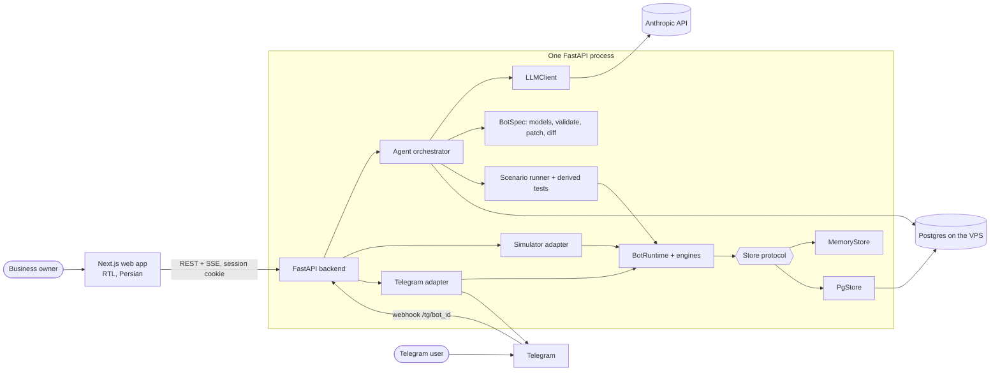
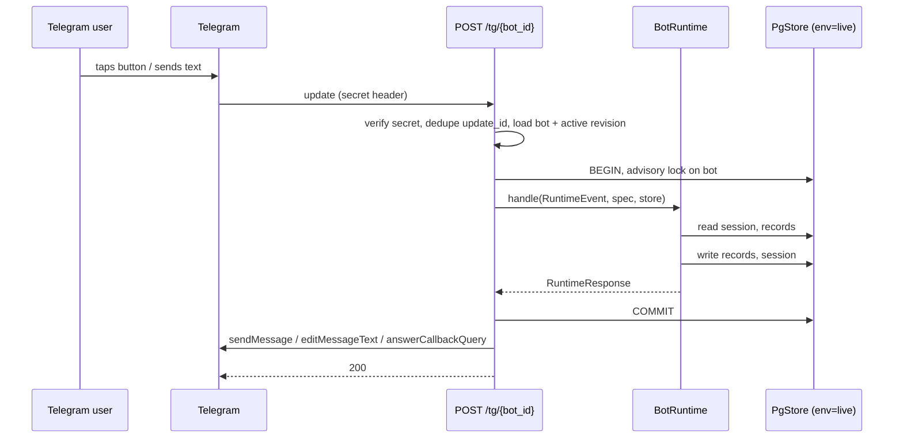
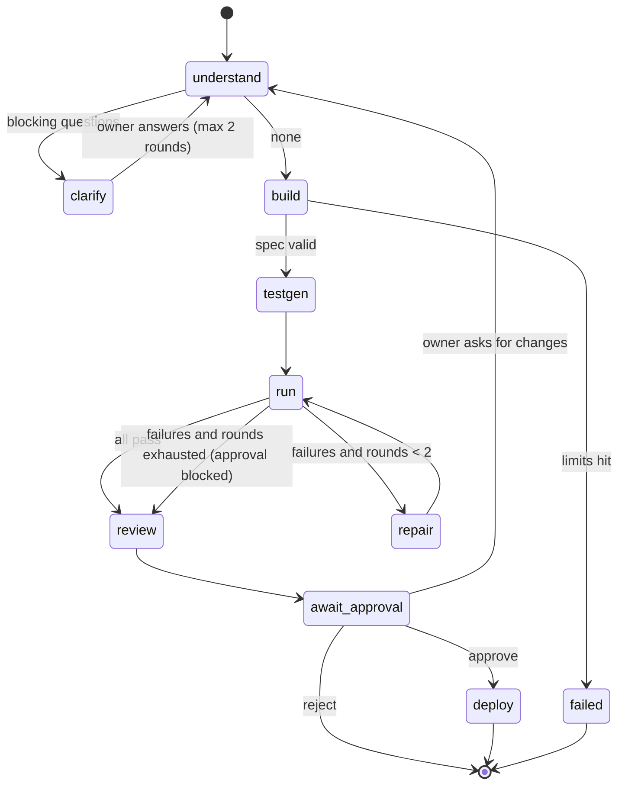
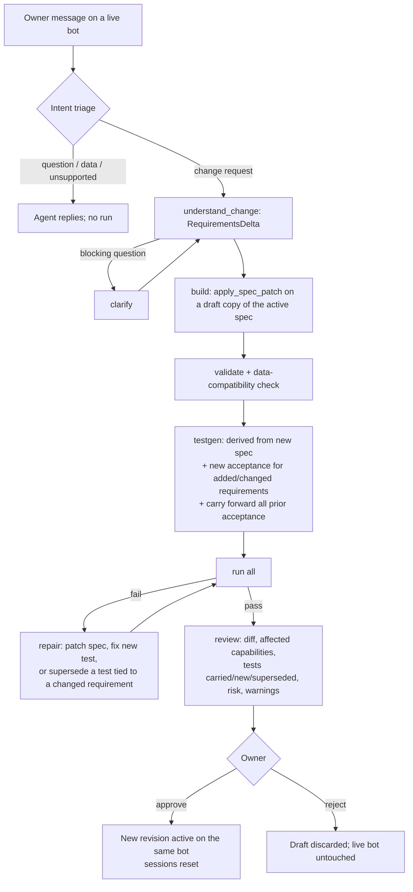
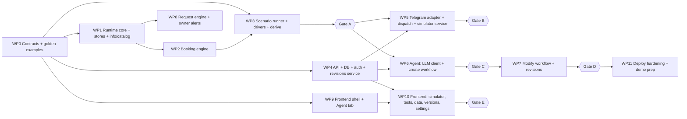

# BotForge — Implementation Roadmap

**One bot. Your entire business. Built and maintained by AI.**
یک ربات. تمام کسب‌وکار شما. ساخته و نگهداری‌شده با هوش مصنوعی.

> **This document is the project's implementation source of truth.**
>
> Before making a major architectural or scope change:
> 1. read this document,
> 2. compare the proposed change against the existing decisions,
> 3. update the relevant sections,
> 4. append a [Decision Log](#decision-log) entry,
> 5. update the [Change Log](#change-log),
> 6. then implement.
>
> Do not let implementation drift silently away from the roadmap. The roadmap is not immutable: if implementation proves an assumption wrong, update the roadmap. Reality wins over old documentation.
>
> Two kinds of statement appear below. **Fixed competition constraints** cannot be changed by us. Everything else is a **current design decision** and can be changed through the process above.

Last updated: 2026-10-08 (Day 6 of 7).

---

## Current Status

**UI redesign update:** The owner selected a complete HeroUI V3 redesign combining the eight-section Control Center with a state-derived launch checklist. The landing, authentication, directory, dashboard shell and all feature surfaces are implemented locally with Persian RTL, bundled Vazirmatn, persistent light/dark/system themes and responsive navigation. Clean dependency installation, lint, TypeScript, 78 route checks (74,272 combinations), parity for 40 schema models and production builds for mock, local-auth and Supabase modes pass. All 24 Edge browser regression tests pass against the production mock build, including both themes at 375/768/1024/1440, focus trapping/return, 200% CSS layout zoom, reduced motion, shared-token contrast and hydration-error monitoring. A fresh independent verifier confirmed the scoped source review. Screenshots are in `frontend/ui-review/`; deployment and live-service validation remain separate open work. This supersedes the earlier request to choose a UI direction below.

**Start here.** This section is the handoff between working sessions. It says what is done, what is unproven, and what to do next. Whoever ends a session updates it.

**Status as of 2026-10-08 (final state; `main` is the single integration branch).** The product is the **Business OS** built on 2026-10-06 (see [Rebrand / Business OS Expansion](#rebrand--business-os-expansion)): capability registry, orders, events, reporting, notifications, roles, spreadsheets, Copilot, groups and the Control Center. Deployment follows the other developer's setup (`staging`, 2026-10-07): **Render.com runs the API and the web app as two separate services** (free plan for testing, `starter` for the demo) and **Supabase provides Postgres (session pooler, port 5432, `?ssl=require`) and Supabase Auth**; see `render.yaml` and the README section "Deployment on Render + Supabase". The self-hosted Docker Compose stack in `deploy/` (Caddy, polling, local rehearsal, backup and restore) is kept as the **alternative deployment**, with the product's own email/password login. On 2026-10-08 `origin/staging` was merged into `main` in the merge commit **`325b181`** (parents `67ab61d`, the Business OS, and `46eeec9`, staging): **1887 backend tests pass**; frontend lint, `tsc` and the mock and real builds pass. All test runs use `FakeLLM` and `FakeTelegramClient`. A **sign-in switch** (`AUTH_PROVIDER=local|supabase`, frontend `NEXT_PUBLIC_AUTH_PROVIDER`; default `local`) is **built and merged (M2, 2026-10-08)**: Render signs in with Supabase Auth, the self-hosted Docker stack keeps the product's own login. With it, **2062 backend tests pass** (175 new); frontend lint, `tsc`, `test:next-path` and the mock, local and supabase builds pass. The hosted Supabase database is at migration 0002; the first deploy of `main` runs `alembic upgrade head` (0003 to 0005), and 0003 adopts every existing Supabase owner id as a placeholder user with the same UUID, so existing owners keep their bots. **Branches:** `main` is the single integration branch and the final state; `staging` will be fast-forwarded to `main` and pushed; the other developer's `fix/*` branches stay as history. `main` is no longer "the proven fallback": the pre-expansion state is commit `ef849c6` and the pre-merge Business OS state is `67ab61d`. **What is left, in order: (1) deployment on Render + Supabase, (2) a UI/UX update (first choose between the "guided launch" plan and the Control Center, or combine them), (3) a thorough test of the whole product on the Render deployment against real Telegram and the real LLM** — see "Open work, in order". Per-unit commits, verification and known gaps of the Business OS are on the [Expansion Execution Board](#expansion-execution-board), whose "Merge of staging" subsection tracks the merge. **Nothing has run against real Telegram, the real LLM, Supabase Auth with a real token, or the hosted database with migrations 0003 to 0005.**

*Superseded 2026-10-06:* the previous version of this paragraph said Wave 0 was in progress and waves 1 to 3 were todo. The lines below marked "as of 2026-10-05" describe the base product and are kept as history; where a count or status differs, this paragraph and the Business OS bullets win.

*Superseded 2026-10-08:* the version of this paragraph dated 2026-10-06 said that `main` stays the proven fallback demo, that it had 39 unpushed commits, and that the deploy work was a self-hosted VPS with no Supabase. All of that is replaced by the paragraph above (Render + Supabase is the primary deployment; the VPS stack is the alternative). The staging paragraph of 2026-10-07 (`staging` is the integration branch and `main` is unchanged) is superseded as to branches; its machine notes still hold for that developer (Windows with 8 GB RAM, so run one heavy job at a time; Windows reserves port 3000, so the dev web app runs with `npx next dev -p 4000`).

### Done

**Merge of staging into `main` (2026-10-08):**

- **M1 done:** `origin/staging` (34 commits of 2026-10-07) merged into `main` as `325b181`; conflicts were resolved as in the 2026-10-08 Decision Log rows (deployment from staging, product from the Business OS). **1887 backend tests pass**, ruff clean; frontend lint, `tsc`, mock build and real build pass.
- **`render.yaml` carries the Business OS variables:** `TELEGRAM_MODE=webhook`, `NOTIFICATIONS_TICKER=true`, `UPLOAD_DIR`, `UPLOAD_MAX_BYTES`, `SPREADSHEET_MAX_ROWS`, `SPREADSHEET_MAX_COLUMNS`, `COPILOT_DAILY_CAP`, with the free-plan caveats written in its header (see "Built but not yet proven").
- **M2 and M3 done, integrated as M4** (merge commits `31718db`, `b5b62a8`, docs `70e7085`): the auth switch (2062 backend tests) and these documents; see the Execution Board.

**Base product fixes of 2026-10-07 (from `staging`, one branch and one commit each, merged with `--no-ff` so any fix can be reverted alone; behaviour changes are in the Decision Log):**
- **Liara AI provider (2026-10-09):** `LLM_PROVIDER=liara` is implemented alongside the default
  `anthropic` provider and `claude_cli`. Configuration and deployment templates define the project-scoped
  key, project endpoint, model tiers, limits, retries and optional pricing. Offline verification:
  **111 Liara tests pass**, including create/modify, spreadsheet analysis and Copilot;
  **1726 backend tests pass**, 445 database tests skip (Windows `pgserver` fails to initialize), and
  two existing POSIX-permission assertions are deselected on Windows. Full Ruff, lockfile and YAML
  configuration checks pass; independent verification confirmed the integration and security review
  found no material blocker. No funded Liara account or live model has been tested.
- **Top Tools AI provider (2026-10-08):** `LLM_PROVIDER=top_tools` is implemented alongside Anthropic,
  Liara and headless Claude Code. It has independent server-only credentials, a documented `/api/v1`
  endpoint (with the supplied `/v1` endpoint also supported), and required strong and fast model IDs.
  Offline verification: 174 focused tests and 1789 available backend tests pass; 445 database tests skip
  and two existing POSIX permission checks are excluded on Windows. Ruff and independent verification
  pass; security review found no material blocker. Local ignored settings select Top Tools with the
  supplied key and inferred `claude-opus-5` / `gpt-5.6-sol` IDs. Both live adapter checks returned HTTP
  `403`; successful operation and model availability remain unverified.

- `fix/dispatch-non-numeric-actor`, `fix/load-spec-sample-data`, `fix/seed-demo-reset`, `fix/database-url-supabase`, `fix/startup-interrupt-zero-downtime`, `fix/cors-multi-origin`, `fix/cors-on-error-responses`, `fix/frontend-explicit-mock`, `fix/simulator-active-revision`, `fix/frontend-401-logout`, `chore/deploy-render-frontend`, `fix/agent-run-history`; earlier `fix/deploy-sse-booking-expiry` (`httpx` as a runtime dependency, the SSE stream closing when a run pauses, bookings on started items treated as history).
- **Supabase project created:** `botforge` (ref `nlwekbfpxnvxlwiforpr`, eu-central-1, free plan, ES256 JWT signing keys, so only `SUPABASE_JWKS_URL` is needed, not `SUPABASE_JWT_SECRET`).
- **Render free test deployment decided** (owner, 2026-10-07): `botforge-api` (Docker) and `botforge-web` (Node) in `render.yaml`, no custom domain. **Agent run history:** the Agent tab shows every run of the bot (earlier runs are replayed read-only).
- **Staging verification findings (2026-10-07), found and not yet fixed** (none blocks the test deployment):
  - `save_run` (`app/agent/repository.py`) writes without checking the status, so a run the sweep marked `interrupted` while its process was still alive (event loop stalled for more than 120 s; Render free has 0.1 CPU) can be overwritten back to `running` or `completed`; `approve()` runs the deploy phase without a heartbeat. Make the save conditional on the run not being `interrupted`.
  - Shutdown cancels only the sweeper; it does not drain orchestrator tasks (`wait_idle`), so runs of a stopping container are lost anyway.
  - `FRONTEND_ORIGIN_REGEX`'s foreign-origin guard accepts loose patterns (`https://.*-botforge\.onrender\.com`, unescaped dots). Unset by default; keep it unset or pin the pattern. (After the merge it grants CORS reads only, not writes: the CSRF origin check admits listed origins only.)
  - After a 401, `RequireAuth` may redirect to `/login` before the expiry handler adds `?next=` (UX only, not verified at runtime).
  - The SQLAlchemy pool (5 + 10 overflow per process) can exceed the Supabase free session-pooler client cap during a deploy overlap under load; consider a smaller pool.
  - `backend/Dockerfile` uses `ghcr.io/astral-sh/uv:0.8` while `uv.lock` was written by uv 0.12; check the first Render build log.
  - The test suite reads a developer's `backend/.env`; two tests fail when it points at a stopped database.

**Business OS expansion (2026-10-06), merged into `main` (final state; integration branch `business-os` fast-forwarded on 2026-10-06):**

- **Waves 0, 1 and 2 are built and merged** (every unit on the [Expansion Execution Board](#expansion-execution-board)): contracts and persistence (C0 to C3); the capability registry with toggle-as-revision (18 capabilities), reporting engine, orders engine, roles and staff link, notification outbox and ticker, events preset, spreadsheet upload and inspection, Capability Center, Overview, Reports and landing page (Wave 1); Telegram groups and staff documents, analysis profiles and deterministic runs, Manager Copilot, scheduled reports and the Telegram manager panel, registry-generated agent prompts, and the Data Analyst, Copilot and Team/Groups/Announcements/Schedules UI (Wave 2).
- **Backend suite: 1803 tests pass** on `main` *(superseded 2026-10-08: 1887 after the staging merge)* (1392 run without a database plus 397 database tests; a worktree without the `dbtest` group shows 1392 passed and 397 skipped). Ruff clean. Frontend: lint, `tsc` and the mock-mode build (`NEXT_PUBLIC_MOCK=1 npm run build`) and the real-mode build (`npm run build`) pass. All test runs use `FakeLLM` and `FakeTelegramClient`; none touched the real LLM or Telegram.
- **Deploy config updated:** `deploy/docker-compose.yml` has the `uploads` volume (`UPLOAD_DIR=/data/uploads`) with an `uploads-init` chown step for the non-root backend user, and `NOTIFICATIONS_TICKER=true` by default; `deploy/.env.example` documents every new variable; the README has the Business OS operator notes and a demo-path checklist.
- **Wave 3 done and verifier-confirmed (HEAD `16e8fc2`, 1803 tests):** I1 (`c6de8e4`) end-to-end demo-path test and orders Data API test, explicit "no matching profile" Telegram reply, `overview` reserved key, Dockerfile `/data/uploads`, backup/restore of the uploads volume (Docker steps not runnable in the sandbox, so untested); I2 (`417a5b2`) `onOpenTab` to `SettingsTab`, `lib/types.ts` parity with `schemas/business.py` (two real mismatches fixed: `SheetProfile.sample_rows` is a list of dicts; `CapabilityCategoryOut.id` is the category literal), `frontend/scripts/check-schema-parity.mjs`, real-mode `npm run build` passes; I3 (`c8ab091`) security pass, three High findings fixed with regression tests (per-account cap of 30 analysis LLM calls per 24 h, bounded stored run results, metric evaluation moved off the event loop); I4 (`43f5f93`) this documentation.

**Open security findings (from the I3 pass, 2026-10-06; none blocks the demo, fix before opening signup to the public):**

- Medium — `copilot/service.py`: the Copilot daily cap counts per bot while `config.py` documents it per owner account; bot creation is unlimited, so the cap multiplies. Count per account.
- Medium — no platform-wide LLM spend ceiling, and signup is open: per-account caps multiply by accounts. Add a global daily budget breaker in the LLM client; **set `AUTH_ALLOW_SIGNUP=false` for the demo deployment**.
- Medium — `api/uploads.py`: one user can hold all 4 process-wide in-flight upload slots with slow bodies (120 s each). One in-flight upload per account and a ~30 s read timeout.
- Medium — no per-account rate limit on analysis runs or Telegram documents; one tenant can keep the single parser thread busy. `RateLimiter` per owner on `POST run`, per actor on documents.
- Medium — `spreadsheets/submissions.py`: the Overview KPI source loads every run `result` JSON from the last 7 days per request. Count runs and anomalies in SQL.
- Low — `telegram/adapter.py`: a group button press on a message older than 48 h (keyboard unreadable) is dispatched without the keyboard check; accept only `book:` data in that case.
- Low — `api/webhook.py`: anyone can add the bot to a group and it appears in the owner's Groups list. Store `my_chat_member.from` and flag adders who are not team members.
- Low — `generators/reminders.py`: one bot's exception skips that tick's reminders for all bots. Per-bot savepoint like `scheduled_reports`.
- Low — `schemas/business.py`: `group_chat_ids` accepts any int; bound to int64 or validate against `bot_chats` at POST.
- Low (accepted) — customer/staff text (titles, display names, cell samples) reaches LLM prompts; tools are read-only and the prompt treats tool output as data. Add a ~32 KB byte budget to the profile draft prompt.
- Low — the analysis LLM-call budget lives in process memory and is a constant; add an `ANALYSIS_DAILY_LLM_CAP` setting and a durable per-account counter.
- Low — `tests/integration/test_analysis_api.py:234` asserts on `"900"/"558" not in str(body)` which contains a random UUID (flaked once); assert on actor ids only.
- Low — `frontend/components/charts/breakdown-list.tsx`: list key is the label, which is now truncated to 80 chars and can collide; use `${label}-${i}`.

**Base product (as of 2026-10-05, end of the first Linux session, local branch `main` of `github.com/123100123/BotForge`; everything below is merged into `main`; "has not been pushed" is superseded, see the status paragraph):**

- **Work packages:** WP0 through WP11 are built and merged. WP5 and WP4b had security reviews.
- **Batch-2 fixes re-verified** by a fresh `verifier`. 10 of the 12 checks held. The 2 that failed were fixed and merged:
  - **M2:** a requirement reworded during a clarify pause could keep its old-wording tests as coverage. Fixed with `AgentState.untested_touched`.
  - **F5:** after disconnect and reconnect, the fresh owner link was hidden. It was also usable, and silently replaced the linked owner. New rule: an owner code can establish an owner but never replace one (see the Decision Log).
- **Hanging test fixed.** It was a test bug, not a product bug: httpx's `ASGITransport` waits for a streaming response to finish, and the test opened the stream of a still-active run. The skip is removed, and a regression test proves a live stream closes when its run ends.
- **Small fixes:**
  - `FRONTEND_ORIGIN` accepts a comma-separated list; trailing slashes are stripped.
  - `scripts/load_spec.py --sample-data` stores sample data and loads it into the sandbox; `backend/scripts/workshop.sample_data.json` is provided.
  - Dispatch skips Telegram delivery to actor ids that are not ASCII integers.
  - Token redaction catches spaced bot tokens and runs in linear time.
  - The payload and response tables are up to date.
- **Headless Claude provider:** `ClaudeCodeLLM` (`LLM_PROVIDER=claude_cli`) runs the agent through the Claude Code login, with no API key (see LLM Strategy).
- **Gate A:** passed earlier.
- **Gate C passed on headless Claude:** `eval_golden.py --create --provider claude_cli --runs 3` passed 3/3. Each run produced 10 derived and 5 acceptance scenarios, all green, with 2 tool calls. Notional API cost was about $0.17 per run, and a run takes about 1 minute.
- **Gate D, automated part, passed on headless Claude:** `--modify --runs 3` passed 3/3, with both golden modifications in each run. It averaged 7 tool calls and a notional $0.19 per run. The manual Telegram half of Gate D is still open.
- **Self-hosting stack** (`deploy/`): Docker Compose with Caddy, frontend, backend and Postgres on one hostname; nightly `backup.sh` with a tested `restore.sh`; restricted-network support (outbound proxy, package mirrors, `ANTHROPIC_BASE_URL`); `reregister_webhooks.py` for hostname changes. The images build on this machine, and the stack ran end to end at `https://localhost`.
- **Own authentication** replaced Supabase on 2026-10-05 *(superseded in part 2026-10-08: Supabase Auth returns for the Render deployment through the `AUTH_PROVIDER=supabase` switch; own login stays for self-hosting)*. A security verifier confirmed it, with 0 refuted items. It has:
  - argon2id password hashing;
  - server-side `auth_sessions` and the `bf_session` cookie, with a 30-day absolute session limit;
  - the CSRF header and Origin check, and rate limits that use the real client IP behind Caddy;
  - API docs off by default.
- **Production bug fixed:** the backend image crashed on start because `httpx` was only a dev dependency.
- **Telegram polling mode** (`TELEGRAM_MODE=polling`): updates fetched with `getUpdates` (outbound only) through the webhook's own `process_update`, offset in `bots.tg_poll_offset` (migration 0004). The local Docker override uses it, so the local rehearsal needs no tunnel. See Telegram Integration.
- **Backend suite:** 1251 passed, 0 skipped, ruff clean (`uv sync --group dbtest --group headless && uv run pytest -q`). *(Superseded 2026-10-06: 1789 pass on `business-os`, see the Business OS bullets above.)*
- **Frontend:** `npm ci`, lint and build (mock mode) pass on Linux.

### Built but not yet proven

**Render + Supabase path (2026-10-08):**

- **Supabase Auth with the switch is tested only with locally signed tokens.** No real Supabase access token has met the backend; the placeholder-user adoption, the issuer pin through `SUPABASE_URL` and the `?next=` return in both modes need a real sign-in.
- **Migrations 0003 to 0005 have not run on the hosted database.** It is at 0002. They are tested on temporary Postgres databases only; 0003 (a placeholder user for every existing Supabase owner id, same UUID, no password) must be rehearsed on a copy of the hosted database before the first deploy, and a Supabase backup taken.
- **Free-plan caveats (Render):**
  - The disk is ephemeral, so uploaded spreadsheets (`UPLOAD_DIR`) are lost on every redeploy or restart. Postgres analysis results survive. Fix: move files to Supabase Storage behind the existing `FileStorage` boundary (not built).
  - A sleeping free instance delays the notification ticker (reminders, announcements and scheduled reports go out late, when the next request wakes it) and cold-starts the first Telegram update after idle.
  - In-flight agent runs are lost when the instance spins down (the heartbeat sweep marks them `interrupted` later). `starter` (paid, always-on) is for the demo.
- **The Blueprint itself:** `render.yaml` and `backend/Dockerfile` have never been deployed from this repository's development machine; the first Render deploy is the real test (CORS list, `PUBLIC_BASE_URL`, webhook mode, health check).
- **Auth switch (`AUTH_PROVIDER`):** built and merged (2062 backend tests; supabase-mode integration tests use locally signed HS256 tokens). Real JWKS keys and token claims, the Supabase email-confirmation redirect (Site URL) and a real Render deploy are untested.
- **Supabase-mode tokens live in the browser's localStorage** (supabase-js default), so an XSS could steal them; there is no Content-Security-Policy yet.

**Business OS (2026-10-06): all of it is proven only against fakes.**

- **Real Telegram groups and documents:** `my_chat_member`, the live RSVP card with edit-in-place, toasts, publish to a group, and staff spreadsheet uploads through `getFile` have only run against `FakeTelegramClient` and a stub transport. The forged-callback check relies on Telegram sending the pressed message's keyboard with the callback query; that is documented Telegram behaviour but unobserved here.
- **The notification ticker against real Telegram:** reminders, announcements and scheduled reports were tested with the ticker enabled only inside tests; rate limits, `retry_after` handling and the 403/400 fail-at-once path have not met the real Bot API.
- **Real-LLM profile creation and Copilot:** `AnalysisProfile` creation (one strong-tier structured call), the optional narrative and the Copilot tool loop (fast tier) were tested with `FakeLLM` only. The new agent catalog prompts and the toggle handoff prompts have not been run through `eval_golden.py` for orders and events.
- **The VPS deploy with the uploads volume (alternative deployment):** the `uploads` volume and `uploads-init` chown step are untested on a real Docker host; the volume must be backed up together with the database (analysis runs point at stored files).
- **Webhook re-registration for `my_chat_member`:** a bot connected before this version has a webhook that does not deliver `my_chat_member`, so groups stay empty until `scripts/reregister_webhooks.py` runs or the bot is reconnected. Polling mode needs nothing (every `getUpdates` call passes the list).
- **The frontend in a browser against the real backend:** lint, tsc, mock build and real build pass; the local Docker rehearsal stack at https://localhost serves the new UI and its health endpoint answers, but no screen has been clicked through in a browser yet. This is part of the thorough test below.
- **Everything below this list** (base product) is unchanged and still unproven.

- **Anthropic API path:** the agent has never run against the real API. Headless runs do not prove `output_config.format` acceptance of the BotSpec schema (O5), prompt caching, `fallbacks`, or real cost. This is the pre-deploy API check (see Milestone Gates).
- **The Iranian LLM mirror is unknown and untested;** it may not support structured output, adaptive thinking or effort, or the server-side fallback beta.
- **No real Telegram and no deployment (Render or VPS).** The webhook path and the poller are tested only with `FakeTelegramClient` (and the real client over a stub transport). Polling has not yet run against real Telegram through the proxy; the local rehearsal's Stage 3 is the first real test. The images build and run locally; the VPS path (Let's Encrypt from Iran, registry mirror) is untested.
- **The frontend has not yet been driven in a browser against the real backend.** Through Caddy, the real login page and the auth API were checked with curl only. The rehearsal's Stage 2 covers it.
- **Owner-link race safety** relies on Postgres READ COMMITTED re-checking a single `UPDATE ... WHERE` after a concurrent commit. Tests cover it; a human security review is still worthwhile.

### Open work, in order

Rewritten 2026-10-08 after the merge of staging. Three work items remain; the older numbering is retired.

1. **Deployment on Render + Supabase** (primary; needs the owner's Render and Supabase accounts; the steps are in the README section "Deployment on Render + Supabase").
   - **Deploy soon: the frontend currently deployed from `staging` has an open redirect after login.** Its `safeNextPath` accepts `/..//evil.example`, which the browser resolves to `//evil.example`. `main` fixes this, with `npm run test:next-path`: 78 cases plus an invariant check.
   - **Supabase dashboard:**
     - set the Site URL to the Render web app URL;
     - decide whether email confirmation is required;
     - disable public signups for the demo, since `AUTH_ALLOW_SIGNUP` does not apply in supabase mode and open signup multiplies every per-account LLM cap;
     - make sure the Data API does not expose schema `app`: the anon key is public and the tables have no row-level security.
   - Set the new environment variables on Render (`render.yaml` declares them):
     - auth switch: API `AUTH_PROVIDER=supabase` with `SUPABASE_URL` and `SUPABASE_JWKS_URL` (or legacy `SUPABASE_JWT_SECRET`); web app `NEXT_PUBLIC_AUTH_PROVIDER=supabase`, `NEXT_PUBLIC_SUPABASE_URL`, `NEXT_PUBLIC_SUPABASE_ANON_KEY` and `NEXT_PUBLIC_API_BASE_URL`;
     - Business OS: `NOTIFICATIONS_*` (`NOTIFICATIONS_TICKER=true`), `UPLOAD_*`, `SPREADSHEET_*`, `COPILOT_DAILY_CAP`;
     - `TELEGRAM_MODE=webhook` (Render is reachable inbound), plus `PUBLIC_BASE_URL` and `FRONTEND_ORIGIN`.
   - Deploy `main`. The container runs `alembic upgrade head`, which applies 0003 to 0005 to the hosted Supabase database. **Back up the Supabase database first**, and rehearse the migrations on a copy.
   - Re-register webhooks (`scripts/reregister_webhooks.py` from a Render shell, or reconnect each bot) so existing bots receive `my_chat_member`; add the demo bot to the demo group as an administrator.
   - Disable public signups in the Supabase dashboard for the demo (open signup multiplies every per-account LLM cap; `AUTH_ALLOW_SIGNUP` applies only to the `local` mode).
   - Pre-deploy real-API check (needs `ANTHROPIC_API_KEY`; costs real money; ask the owner first): run `scripts/spike_structured_output.py` (decides O5), then `scripts/eval_golden.py --create --runs 1 --provider anthropic`; also run one create and one modify eval whose prompt asks for orders and for events, since the new catalog prompts have never met the real model.
   - Use the `starter` plan for the demo (see the free-plan caveats). Push `main` and fast-forward `staging` to it.
   - **Alternative: self-hosted** (the Docker Compose stack in `deploy/`, `AUTH_PROVIDER=local`, own login; stays documented):
     - Local rehearsal first ([deploy/LOCAL-REHEARSAL.md](deploy/LOCAL-REHEARSAL.md)): the stack is up at `https://localhost` with polling and headless Claude. The owner runs Stage 2 (golden path in the browser) and Stage 3 (real Telegram on two phones); then Stage 4 (backup and restore including the `uploads` volume, restart during a run, down and up).
     - Deploy (needs the owner's VPS; self-hosted with Docker Compose and own auth, no Supabase):
       - Provision the VPS: install Docker, open only ports 22, 80 and 443 in the firewall, and use SSH keys.
       - Copy `deploy/.env.example` to `deploy/.env` and fill it in (on the Iranian VPS, `TELEGRAM_MODE=polling` unless Telegram can reach it inbound), then run `docker compose up -d --build`.
       - Create the first owner account with `docker compose exec backend python scripts/create_user.py --email ...`; then set `AUTH_ALLOW_SIGNUP=false` unless Gate E needs open signup.
       - Register two BotFather bots.
       - Load the golden spec inside the backend container with `scripts/load_spec.py --owner-email ... --spec /examples/workshop.botspec.json --sample-data scripts/workshop.sample_data.json`.

2. **UI/UX redesign completed locally.** The owner approved combining the eight-section Control Center and launch checklist in a complete HeroUI V3 redesign. Landing, auth, directory, nested operations, Copilot, simulator, versions/tests and settings are responsive in both themes. All 24 production-mock browser tests and static/build gates pass; the npm schema-parity check is wired. Remaining UI work belongs to live-service validation: real auth email-confirmation, backend failures and Telegram/LLM behavior on the configured deployment.
3. **A thorough test of the project, on the Render deployment.** Automated coverage is 2062 backend tests with fakes; nothing has met real Telegram, the real LLM, Supabase Auth or a deployment. Required: **the auth switch in both modes** (`supabase` on Render: sign in through Supabase, a matching `app.users` row appears, bot ownership works, `/auth/signup|login|logout` are disabled, the `?next=` return works; `local` on the Docker stack or locally) and **migration adoption on a copy of the hosted database** (existing Supabase owners keep their bots); Gates B, D (manual) and E on the deployed stack (golden spec serves real Telegram; both changes made on a live bot; a new account completes the golden path in the deployed UI); the Business OS demo path from the README checklist on the real stack (enable Events → create event → RSVP → Reports → upload workbook → profile → second run → schema change → Copilot question → orders flow → manager panel in Telegram) — `tests/integration/test_business_os_demo_path.py` is its automated twin; real Telegram groups (`my_chat_member`, RSVP toast and live card edit, publish) and staff documents through `getFile`; the notification ticker against the real Bot API (rate limits, `retry_after`); real-LLM profile creation, narrative and Copilot; the open Medium/Low security findings (listed under Done) fixed or consciously deferred; the small follow-ups below.
   - Add a Content-Security-Policy, which matters most in supabase mode with tokens in localStorage.
   - The `backend/app/api/uploads.py` docstring still describes the cookie/CSRF order; update it for bearer auth.
   - Real Supabase sign-in, sign-up, email confirmation and token refresh on the deployed web app.
   - Follow-ups carried over (small; none blocks the demo):
     - **Stream race:** `Orchestrator._save` commits a terminal status before it appends the `run_status` event, so a stream can close just before that event. The frontend also polls `GET /runs/{id}`, so the UI still settles.
     - **Telegram adapter:** `integrations/telegram/adapter.py` accepts Persian-digit ids through `isdigit()`/`int()`. Dispatch now filters them out first.
     - **JWT redaction** is quadratic on long inputs. Agent input is capped at 4000 characters, where it takes about 4 ms.
     - **npm:** `npm ci` reports 5 high-severity vulnerabilities. Triage them with a `security-executor`.
     - **Budget check:** on `claude_cli`, the tools of the response that crosses the run budget may already have run.
     - **`BotOut.owner_link_code`** (`GET /bots`, `api/bots.py`) returns the raw code instead of going through `armed_owner_code()`. Only the owner sees it, and the webhook rejects such codes, so it is not exploitable, but it should follow the same single rule.
     - **ClaudeCodeLLM:** no test covers a drain that hangs or raises after a successful interrupt. The code path is the same timeout block.
   - Demo (Days 6–7): feature freeze at the end of Day 6; then the Demo Preparation Checklist, the video early on Day 7, and a check of the live link.

### Needs the owner

- **Render + Supabase (primary):** access to the Render and Supabase dashboards to enter the secrets (`DATABASE_URL` with the database password, `TOKEN_ENC_KEY`, `ANTHROPIC_API_KEY`, the Supabase URLs and keys), to disable public signups in Supabase for the demo, and to switch `botforge-api` to `starter` for the demo.
- For the alternative self-hosted deployment only: SSH access to the VPS, its public IP, OS and RAM. Later, a domain name.
- Which Iranian LLM mirror the deployed app will use, and whether it offers an Anthropic-compatible API. If it is only OpenAI-compatible, a new provider is needed. Its key replaces a direct Anthropic API key.
- An Anthropic API key, or the working Iranian LLM mirror (above): needed for the pre-deploy API check, real profile creation and the Copilot. Without either, only the headless Claude login works locally.
- Two BotFather bot tokens (the owner has them); the Telegram bot token connects the demo bot in its Settings tab.
- **After the first deploy of `main` (and after every hostname change):** re-register webhooks so existing bots receive `my_chat_member`: on Render run `python scripts/reregister_webhooks.py` in a shell of `botforge-api`; on the Docker stack run `docker compose exec backend python scripts/reregister_webhooks.py` (webhook mode). Not needed in polling mode.
- **For the group demo:** a Telegram group (or channel) where the owner adds the bot, as an administrator (a channel needs it to post; in a group the bot works as a plain member too, but admin avoids permission surprises). Privacy mode can stay on: the bot only reads button presses and its own membership changes, never group messages.
- **For the staff-link demo:** one or two real phones (Telegram accounts other than the owner's) to open the staff invite link from the Team settings, and optionally to send a workbook as a document.
- Answers from the organizers on O1 (deadline, video rules) and O2 (whether the "agent builders" rule restricts only build tooling).

### Setting up a new machine

1. **Clone and test the backend:**
   - `git clone https://github.com/123100123/BotForge && cd BotForge/backend`.
   - Install uv with the official installer (`curl -LsSf https://astral.sh/uv/install.sh | sh`), so it lands in `~/.local/bin`. On Ubuntu, avoid the `astral-uv` snap: after a snap auto-refresh it exited with code 120 and no output.
   - Then `uv sync --group dbtest --group headless && uv run pytest -q`.
2. **Frontend:** Node 20.9 or newer, then `cd frontend && npm ci && npm run build`.
3. **Headless LLM:** log in to Claude Code once. The `claude-agent-sdk` package (group `headless`) bundles the CLI, so `claude` does not need to be on PATH. Set `LLM_PROVIDER=claude_cli` for local runs and evals.
4. **Agent orchestration:** in Claude Code, ask it to install conductor by following `conductor/install/AGENT-INSTALL.md`, then restart Claude Code. It installs globally under `~/.claude/`, and needs Python 3.9 or newer and Claude Code 2.1.284 or newer. On this machine the main model is `opus`; Fable 5.1 (`/model best`) is only for highly sensitive jobs.
5. **Local stack:** follow the README "Local setup" section for a native run. For the production-parity Docker stack, follow `deploy/LOCAL-REHEARSAL.md`. On a restricted network, Docker Hub images come through `docker.arvancloud.ir`, pulled and re-tagged or set as a daemon registry mirror. Containers reach the host proxy through `host.docker.internal:10808`.

---

## Rebrand / Business OS Expansion

Added 2026-10-06 (Day 4 of 7) on the integration branch `business-os` *(merged into `main` the same day; `main` is the single integration branch, 2026-10-08)*. This section group is the architecture of the approved new direction, **BotForge: AI Business OS for Telegram**. It extends the V1 architecture described in the rest of this document and does not replace it: BotSpec, engines, revisions and the "zero LLM at runtime" rule stay as they are. Where an older section says something this group changes, the old text is kept and marked "Superseded 2026-10-06 (Business OS expansion)". Execution state is tracked in the [Expansion Execution Board](#expansion-execution-board); decisions are in the [Decision Log](#decision-log) rows tagged `(Business OS)`.

### Product Definition

- **BotForge is an AI agent that builds and maintains a modular Business OS for the owner's Telegram bot.** The owner describes how the business works; the agent selects and configures capabilities (orders, bookings and events, forms and approvals, reports, spreadsheet analysis, team, notifications) and keeps them current as the business changes.
- **The website is the Business Control Center.** The owner sees the state of the business (Overview, Reports), turns capabilities on and off (Capability Center), edits data, tests in the simulator, reviews versions, manages the team and asks the Copilot questions or asks for changes.
- **Telegram is the operational interface.** Customers order, book, RSVP and submit requests; staff handle queues, approvals and daily spreadsheet reports; managers read reports and approve work from a Telegram manager panel. All of it is buttons and short forms.
- **Reuse over invention.** The goal is the maximum business features from the minimum number of reusable primitives, reusing the spec/runtime/revision architecture, with minimal new infrastructure and minimal new tests. Events are a booking preset, forms and approvals are the `request` type, reports are one aggregation vocabulary, and most "new" capabilities are registry entries over existing engines.
- **Unchanged guarantees:** the live bot makes zero LLM calls for routine operations; every change is a revision (patch, compatibility check, scenarios, draft, activate); the owner approves what goes live; all module failures are structured and Persian, never a generic 500.

### Hackathon Alignment

- **One official problem, unchanged.** An owner explains what they need and gets a usable Telegram bot, which the agent later modifies from a sentence. The Business OS is the same problem with a richer catalog of capabilities the agent can compose; it is not a second product.
- **One central agentic workflow:** the owner describes the business → the agent selects and configures capabilities → the owner asks for a revision ("add events", "require manager approval for leave") → the bot behaves differently, after tests and approval. Everything else (Capability Center toggles, Copilot, reports, spreadsheet analysis) either feeds this workflow or reads its results.
- **The agent stays the heart of the product.** Toggles that need judgment return a `handoff_prompt` and go through the same agent run; deterministic toggles reuse the revision pipeline. The agent catalog prompt is generated from the capability registry, so the agent and the UI cannot disagree about what exists.
- **Routine operations cost zero LLM calls.** Orders, RSVPs, reminders, reports, scheduled digests and spreadsheet reruns are deterministic. LLM use is limited to building and revising the bot, creating an `AnalysisProfile` once per spreadsheet signature, the optional fast-tier narrative, and the owner's Copilot questions.
- **Fallback.** `main` stays the proven fallback demo (workshop bot, create and modify flows). The expansion lives on `business-os` and is merged only when it passes the same gates. The open deploy work in Current Status stays first. *Superseded 2026-10-06 (evening): the expansion passed every wave's verifier and `business-os` was fast-forwarded into `main`; `main` is the final state and the only branch. The pre-expansion fallback remains reachable as commit `ef849c6`.* *Superseded 2026-10-08: `main` is no longer "the proven fallback"; it is the single integration branch and the final state, with the Business OS and the staging deployment merged (`325b181`). The pre-expansion state is `ef849c6`, the pre-merge Business OS state `67ab61d`.*

### Rebranding & pitch copy

Product name stays BotForge (O6). Tagline: **One bot. Your entire business. Built and maintained by AI.** Persian (used in the UI): **یک ربات. تمام کسب‌وکار شما. ساخته و نگهداری‌شده با هوش مصنوعی.**

| Slot | English | Persian (UI) |
|---|---|---|
| Hero | Run your business from Telegram. | کسب‌وکارتان را از تلگرام اداره کنید. |
| Sub | Tell BotForge how your business works. Its AI agent builds and maintains a custom Telegram Business OS for customers, staff, operations, commerce and reporting. | به BotForge بگویید کسب‌وکارتان چگونه کار می‌کند. ایجنت هوش مصنوعی آن یک سیستم‌عامل کسب‌وکار اختصاصی در تلگرام می‌سازد و نگهداری می‌کند: برای مشتریان، کارکنان، عملیات، فروش و گزارش‌گیری. |
| Supporting | Orders. Bookings. Events. Reports. Workflows. One bot, configured around your business. | سفارش‌ها. رزروها. رویدادها. گزارش‌ها. گردش‌کارها. یک ربات، پیکربندی‌شده بر اساس کسب‌وکار شما. |

- The English lines are the owner's brief, verbatim. The Persian lines are the proposed wording; W1-FE-LAND may polish them once in the landing copy (`frontend/app/page.tsx` and its components), and that version is then reused by the README and the demo script. Do not re-translate them elsewhere.
- **The UI stays Persian, right-to-left only** (K17 reaffirmed for the Control Center). Bot texts inside Telegram stay Persian too. No language switcher.
- A public landing page at `/` replaces today's `redirect("/bots")`; the auth guard stays in `app/bots/layout.tsx`.
- Naming in the UI: "Business Control Center" for the web app, "Capability" for a switchable module, "Copilot" for the owner assistant. The README opening pitch is updated to match.

### Capability Architecture & Registry

- **A capability is a switchable unit of business behavior.** A new package `backend/app/capabilities/` holds a declarative list of `CapabilityDef`:

| Field | Meaning |
|---|---|
| `id`, `name_fa`, `description_fa` | Stable key and the Persian copy shown in the Capability Center |
| `category` | One of `commerce`, `operations`, `team`, `intelligence`, `customer` |
| `requires`, `requires_any`, `conflicts` | Dependency edges (all of / at least one of / mutually exclusive) |
| `kind` | `spec` (a BotSpec capability type or preset) or `module` (a non-Telegram module stored in `bot_modules`) |
| `spec_type` / `preset` or module id | What the capability maps to |
| `config_schema` | Derived from the pydantic JSON schema of the capability model or module config |
| `metrics` | The reporting query specs the capability contributes (see Reporting Engine) |
| `roles` | Which roles may use it (customer, staff, manager) |
| `default_ops(spec)` | Returns the `PatchOp` list that enables it with sensible defaults, or `None` when judgment is needed |
| `handoff_prompt` | Prompt sent to the agent when `default_ops` is `None` |

- **The enabled set is derived, never stored twice:** a `spec` capability is enabled when the active spec contains it with `enabled: true`; a `module` capability is enabled when `bot_modules` has an enabled row for it.
- Initial registry: `info`, `catalog`, `booking`, `events` (booking preset), `orders`, `forms` and `approvals` (request templates), `reports`, `spreadsheets` (analyst), `team`, `notifications`, `announcements`, `scheduled_reports`, `copilot`. Payments is listed as `deferred`, not toggleable.
- The agent's catalog prompt section is generated from the registry (W2-AGENT) so the registry is the single description of what the agent may build.
- API: see [Business OS API changes](#api-changes). Code: `backend/app/capabilities/` (owner W1-REG).

### Capability dependencies & toggle flow

- **Resolution is deterministic.** Enabling X computes the transitive `requires`, checks `requires_any` and `conflicts`, and returns the ordered list of capabilities to enable. Disabling X lists the dependents that would stop working. No LLM is involved.
- **Dry-run preview.** `POST /bots/{id}/capabilities/{cap}/enable|disable?dry_run=true` returns the resolved plan (what turns on or off, the patch ops, expected menu changes, affected scenarios) without writing anything. The frontend shows it before the owner confirms.
- **Apply pipeline** (`backend/app/revisions/toggle.py`): `apply_patch` → `check_compat` (a copy of the ten-line `live_stats` helper in `agent/repository.py`) → **supersede the scenarios that touch the disabled or restricted capabilities and `derive_scenarios`** (otherwise stale scenarios would block every toggle) → `run_scenarios` → `create_draft` → `activate`. A toggle is therefore an ordinary revision with its own history, diff and rollback.
- **Judgment cases.** When `default_ops` returns `None` (for example "orders" needs a catalog resource with a price field the owner has not defined), the response carries the capability's `handoff_prompt`; the frontend calls the existing `createRun(botId, message)` so the agent asks the owner what it needs. The Capability Center button reads "configure with Copilot".
- **Module toggles** do not touch the spec: they write `bot_modules(bot_id, module, enabled, config)` and take effect immediately; `PATCH .../capabilities/{cap}/config` validates against `config_schema`.
- **Honouring `enabled` and `audience`:** every capability model gains `enabled` and `audience` (everyone, staff, managers). Menus hide disabled and forbidden capabilities; a stale or forbidden callback is answered with the normal stale reply; admin events bypass the filter; the validator skips `capability_unreachable` for disabled capabilities and counts only enabled ones toward `menu_too_long`; `derive` skips disabled capabilities and drives restricted ones as the owner.

### UI / navigation

The workspace becomes a sidebar shell with eight sections (Persian labels in the UI):

| Section | Content |
|---|---|
| Overview | KPIs from the reports API, attention items (pending approvals, low stock, schema changes), setup progress |
| Copilot | Two modes: "ask about my business" (new Copilot endpoint) and "change my bot" (the existing agent run) |
| Capabilities | Capability Center rendered from the registry API: categories, enabled dots, dependency preview on toggle, "configure with Copilot" handoff |
| Data | Existing data admin plus orders, enabled/disabled badge, stock editing, staff queue views |
| Reports | Per-capability reports and charts (small hand-written SVG; no new dependency), spreadsheet analyst (upload, profile, runs, schema-changed UX) |
| Simulator | Existing simulator; personas now include `staff` and `manager` |
| Versions | Revision list and diff, with the former Tests tab folded in |
| Settings | Telegram, Team (staff link, members), Groups, Announcements, Schedules |

- Routes: public landing at `/`; `/login`, `/signup`, `/bots`; `/bots/[id]` hosts the shell. `WorkspaceTab` moves to `components/app/workspace.ts`.
- **Mock mode:** every new `Api` method needs a mock in `lib/mock/api.ts` (typed against `Api`, so a missing mock fails `next build`). Read `node_modules/next/dist/docs` before frontend work (`frontend/AGENTS.md`).
- The existing Frontend section lists the V1 tabs; the Control Center supersedes that tab list.

### Reporting Engine

- **One aggregation vocabulary.** A query spec is `measure` (count, sum, avg, min, max of a field), `group_by` (a field, `status`, `day` or `week`), `filters` (`status_in`, `equals`, time range) and `top_n`.
- **One pure-Python evaluator** (`backend/app/runtime/aggregate.py`) depending only on `botspec`, so engines may import it. Rows come from `Store.list_records` (capped near 20k rows) or from spreadsheet rows. **SQL push-down is the documented scaling boundary**, not built now.
- `backend/app/reporting/` maps each capability type to its metric query specs; `api/reports.py` serves them.

| Type | Metrics (all as query specs) |
|---|---|
| orders | order count, revenue, average order value, orders by day, top products (from `<cap>.lines`), orders by status |
| booking and events | booking count, cancel rate, capacity use, RSVP breakdown, by category and by day |
| request | open count, resolved count, average resolution time, by status |
| spreadsheets | runs, anomalies, profile metrics |

- **One vocabulary serves everything:** Overview KPIs, the Reports page, the Telegram manager panel, scheduled reports, Copilot tools and `AnalysisProfile` metrics. No second metrics language exists.

### Spreadsheet Intelligence

- **Upload:** raw-body `PUT /uploads/bots/{bot_id}?filename=` (no multipart: `python-multipart` is not in the production image). `security/body_limit.py` exempts the `/uploads/` prefix and enforces its own caps: 5 MB, 50k rows, 100 columns, plus a zip total-size guard. `get_owned_bot` and the CSRF check run before streaming (the pattern in `api/webhook.py`).
- **Storage and parsing:** a `FileStorage` protocol with `LocalFileStorage(UPLOAD_DIR)` and a compose volume. `openpyxl` read-only for xlsx (`uv add openpyxl`; a stdlib zip and xml fallback if the network blocks it) and stdlib `csv`.
- **Inspection** is deterministic: sheets, columns, inferred types, sample rows, describe statistics.
- **`AnalysisProfile`:** one `LLMClient.structured` call (strong tier) turns the inspection plus the owner's description into a validated profile: expected columns, metrics as query specs, checks (for example z-score outliers) and outputs. Stored per `(bot_id, signature)`.
- **Reruns are deterministic:** a later file with a matching signature runs the profile with no LLM and stores `analysis_runs.result {metrics, anomalies, narrative?}`. A mismatch returns a structured `schema_changed` error listing missing and new columns; the UI shows it with a "revise profile" action. An optional fast-tier narrative may be added.
- **Staff daily report:** a profile flagged `daily_report`; "who has not submitted" is staff minus the runs of today. Staff can send the file as a Telegram document (W2-TG).

### Event Management

- **Events are a booking preset, not a new type** (`BookingCapability.preset = "events"`). The booking engine and its capacity, waitlist and cancellation rules are reused unchanged.
- **New booking fields:** `reminder_hours_before` (int or null) and `category_field` (a choice field on the resource).
- **RSVP "going" = `book`; cancel = the existing "mine" flow.** Category filter and subscriptions are encoded in existing action arguments, because `tests/unit/botspec/test_runtime_testing_contracts.py` pins the booking action set exactly. No new booking actions.
- **Subscriptions** (a customer follows a category) are records; the broadcast and reminder generators read them.
- **Reminders** are outbox rows from the notifications generator, deduped by `rem:<booking_id>:<start_iso>` so a rescheduled event re-triggers them.
- **Group card:** `render_group_card()` is a pure booking-engine function. Publishing an event enqueues an outbox row to the group; the card carries only `book:<item>`. Group callbacks follow the Telegram groups rules below.

### Commerce

- **New type `orders`** (`OrdersCapability`): `resource` (the catalog items), `price_field` (integer), optional `stock_field`, `checkout_fields`, `statuses` / `initial_status` / `owner_actions` (same shape as `request`) and notify flags. Actions `add`, `cart`, `dec`, `chk` are added for `orders` only.
- **Cart** is one `"<cap>.cart"` record per actor, because the session is cleared on navigation (`runtime/runtime.py`).
- **Checkout** writes the order record plus flat `"<cap>.lines"` records (for top-product reporting), snapshots the unit price, sets `payment_status="unpaid"`, decrements stock and (on cancel) restocks. `ReasonCode` gains `out_of_stock`.
- **Order status and payment status are separate fields.** Order status follows the owner's `statuses`; `payment_status` stays `unpaid` until a payment provider exists.
- **Stock edits** through the Data API run under the existing `advisory_lock`, so a PATCH cannot race a checkout.
- Data tab shows orders with line items; the owner moves status with `owner_actions`, which notifies the customer through the usual path.

### Payments

- **DEFERRED. No payment code ships in this expansion.** Orders carry `payment_status="unpaid"` and nothing else.
- **Provider boundary:** when payments are built, they sit behind a `PaymentProvider` interface (create payment, verify callback, refund) in its own package. Zarinpal would be the first adapter.
- **BotForge never handles card data.** The customer pays on the provider's page; only provider references and status are stored.
- The Capability Center lists Payments as deferred so the story is honest, and the agent records any request for it under `Requirements.unsupported`.

### Forms & Approvals

- **No new type.** Forms, workflows and approvals are the existing `request` type: statuses plus `OwnerAction` already model approve and reject.
- **Registry templates** (`default_ops`): leave request, expense claim, feedback, complaint, survey. Each is a `request` capability with fields, statuses and owner actions prefilled.
- **Audience gating:** `audience="staff"` or `"managers"` restricts who sees the form or the approval queue; an approval template is typically submitted by staff and decided by managers.
- Staff work from a queue view in the request engine; the manager sees pending approvals on the Overview, in the Telegram manager panel and through the Copilot tool `list_pending_approvals`.

### Roles

- **Three roles:** `customer` (default), `staff`, `manager`. `Actor.role` is a new contract field; **effective role = manager if `is_owner`**, so the owner is the manager without extra setup.
- **Storage:** `bot_users.role`, read under the bot's lock in `services/dispatch.py` beside the owner flag, so it is decided at the same moment.
- **Joining:** `bots.staff_link_code` is a multi-use code, rotatable and revocable from Settings (Team). `/start staff_<code>` is handled in `api/webhook.py` next to the owner link. The owner link rules stay as they are (single use, never replaces an owner).
- **Simulator:** a `staff` persona beside the existing personas, so staff-only capabilities are testable.
- Role-gated menus come from `audience`; notifications stay owner-only until the notification units land.
- Security-sensitive: the staff link, role assignment and role reads go to a `security-executor` (W1-ROLES, I3).

### Manager Copilot

- **Owner-facing assistant** (`backend/app/copilot/`, `api/copilot.py`): `LLMClient.tool_loop` on the fast tier with bounded tools `get_business_summary`, `get_report(capability, metric, period, group_by)`, `compare_periods`, `list_pending_approvals`, `get_spreadsheet_report` and `who_submitted`. Read-only: it never edits records or specs; changes go through the agent run.
- **Stateless:** `POST /bots/{id}/copilot/messages` with the client sending the last N turns; a daily cap in the existing `AGENT_*` style.
- **Telegram manager panel:** a deterministic panel reached by `menu:open:_mgr` and `_rep.<metric>` (menu keys cannot start with `_`, so these cannot collide and need no contract change). Managers see KPIs and pending approvals with no LLM.
- The Copilot screen's second mode, "change my bot", calls the existing agent run API.

### Notifications & scheduler

- **Outbox:** table `outbound_messages` (bot_id, env, chat_id, text, buttons, `dedupe_key` unique per bot, `not_before`, status, attempts, last_error).
- **Ticker:** one in-process task in the lifespan, behind `NOTIFICATIONS_TICKER=on|off` (default off; on in the compose file). It claims rows with `FOR UPDATE SKIP LOCKED`, applies a global and a per-chat throttle, backs off on 429, and logs its own errors, never to `bots.tg_last_error`.
- **Generators** (`generators/*.py`, auto-discovered) only insert outbox rows: event reminders, announcement broadcasts (targeted by role, subscription or all customers) and scheduled reports. Idempotent dedupe keys: `rem:<booking_id>:<start_iso>`, `rep:<key>:<date>`.
- **Generators never mutate records.** Time-based state is computed on read, as booking already does.
- This replaces the old "Scheduler / worker: none in V1" rule; see Background Jobs. Scaling beyond one process: see Scaling boundaries.

### Scheduled Reports

- `GET/PUT /bots/{id}/schedules` configures a report (which metrics, period, recipients by role, time of day, enabled).
- A `scheduled_reports` generator renders the metrics through the same evaluator and enqueues one outbox row per recipient with key `rep:<key>:<date>`, so a restart never double-sends.
- Delivery goes to managers (owner by default) in Telegram; the Settings > Schedules screen edits the configuration. Owned by W2-SCHED together with the manager panel.
- *As built (2026-10-06):* the dedupe key is `rep:<bot_id>:<schedule_id>:<YYYY-MM-DD>:<chat_id>` (the chat id is part of the key because the unique key is per bot); `weekday` is Python's Monday = 0 (Friday = 4); schedules live in `bot_modules.config["schedules"]`, and nothing is sent unless the `scheduled_reports` module is enabled and the ticker is on. See the Decision Log.

### Telegram groups & documents

- **Groups:** `ALLOWED_UPDATES` gains `my_chat_member`, handled in `webhook._process` before `parse_update`, and recorded in `bot_chats`. `RuntimeEvent.chat_type` is `private` or `group`.
- **Group callbacks are allowed with rules:** edits go to `origin.chat_id`; a non-edit reply becomes an `answerCallbackQuery` toast (the client gains a `text` parameter, and the answer is sent after the runtime runs); group menu and stale handling are no-ops; actions that need a form answer with the toast "message me privately".
- **Publishing an event to a group** renders the card with the pure booking function and enqueues an outbox row (`api/groups.py`: list groups, publish).
- **Documents:** `ParsedUpdate.document` is honoured for staff and managers only; `getFile` downloads it into the same spreadsheet service as the web upload.
- Owner: W2-TG (security-executor), because it touches `adapter.py`, `client.py`, `webhook.py` and `dispatch.py`.

### Data model additions

All in a **single migration 0005**, written up front by C2 (downgrade is clean):

| Change | Detail |
|---|---|
| `bot_users.role` | text, default `customer` |
| `bots.staff_link_code` | nullable; multi-use, rotatable |
| `outbound_messages` | the outbox (see Notifications) |
| `bot_chats` | Telegram groups the bot is in (chat id, title, type, status) |
| `bot_modules` | `(bot_id, module, enabled, config)` for non-Telegram modules |
| `announcements` | owner broadcasts: audience, text, schedule, status |
| `uploaded_files` | file metadata for uploads (name, size, storage key, uploader) |
| `analysis_profiles` | AnalysisProfile per bot, unique `(bot_id, signature)` |
| `analysis_runs` | run results per profile and file |
| index | `records(bot_id, env, collection, created_at)` for report scans |

New settings: `NOTIFICATIONS_TICKER`, `UPLOAD_DIR`, upload limits. See the Database Schema section for the existing tables.

### API changes

New routers (auto-discovered by `main.py`). All REST models live in one new `backend/app/schemas/business.py` (owned by C2) so frontend types are copied from one place.

| Group | Endpoints |
|---|---|
| Capabilities | `GET /bots/{id}/capabilities`, `POST /bots/{id}/capabilities/{cap}/enable\|disable?dry_run`, `PATCH /bots/{id}/capabilities/{cap}/config` |
| Reports | `GET /bots/{id}/reports/overview?period`, `GET /bots/{id}/reports/{cap_key}?period` |
| Uploads | `PUT /uploads/bots/{id}?filename=` (raw body) |
| Analysis | `GET/POST /bots/{id}/analysis/profiles`, `POST /bots/{id}/analysis/profiles/{pid}/run`, `GET /bots/{id}/analysis/runs` |
| Copilot | `POST /bots/{id}/copilot/messages` |
| Team | `GET/POST /bots/{id}/team` (staff link rotate and revoke, members) |
| Groups | `GET /bots/{id}/groups`, `POST /bots/{id}/groups/{chat}/publish` |
| Announcements | `POST /bots/{id}/announcements` |
| Schedules | `GET/PUT /bots/{id}/schedules` |

Existing change: Data API `CollectionOut.enabled`; orders collections appear in `GET /bots/{id}/data`. Every route keeps the cookie, CSRF and ownership rules; new public routes need a deliberate allowlist entry (none are planned).

### BotSpec changes

Additive; **`spec_version` stays 1**; existing specs and the golden examples stay valid.

- Every capability model gains `enabled: bool = True` and `audience: Literal["everyone","staff","managers"] = "everyone"`.
- `BookingCapability` gains `preset`, `reminder_hours_before`, `category_field` (see Event Management).
- New type `orders` (`OrdersCapability`) with actions `add`, `cart`, `dec`, `chk`; `request` may grow actions; booking, info, catalog and menu action sets stay pinned.
- Contracts: `Actor.role` (`customer` | `staff` | `manager`, default `customer`) and `RuntimeEvent.chat_type`; `ReasonCode.out_of_stock`.
- **Per-type sites a new type must extend** (exhaustive, so each is a checklist item for C1 and its dependents): `botspec/models.py`, `outline.py` (a Literal that currently crashes on an unknown type), `validate.py`, `compat.py`, `text_keys.py` (and the exact-set test), `runtime/callbacks.py`, `runtime/engines/__init__.py`, `runtime/texts/orders.py`, `api/data.py`, `api/data_actions.py`, `testing/drivers.py`, `testing/derive.py`, `agent/checks.py`, `agent/prompts/catalog.md`; frontend `lib/types.ts`, `components/agent/labels.ts` (an exhaustive Record, so the build fails if missing), `components/data/{data-tab,record-table}.tsx`, `lib/mock/{tabs,simulator}.ts`.
- **Frozen-file rationale:** these files are contract files (WP0). The change is additive, justified in the Decision Log, and every dependent package was checked. **Test pins:** `test_validate.py` pins the exact `TEXT_KEYS` set (updated to include `orders`) and `test_runtime_testing_contracts.py` pins the booking/info/catalog/menu action sets (left unchanged, which is why events use arguments). New tests: `tests/unit/botspec/test_capability_flags.py` and `tests/unit/runtime/test_gating.py`.

### Implementation order

Work runs in waves of parallel role agents, each wave one `execute-plan` workflow; every hot file has exactly one owner at a time (see the board and WP12 to WP20).

| Wave | Units | Purpose |
|---|---|---|
| 0, contracts | C0 roadmap, C1 spec + runtime contracts, C2 persistence + schemas + deps, C3 frontend contracts + shell | Lay down every shared contract so wave 1 never touches the same file |
| 1, features | W1-REG, W1-REP, W1-ORD, W1-ROLES, W1-NOTIF, W1-FE-CC, W1-EVT, W1-SHEET, W1-FE-LAND | Registry and toggles, reporting, orders, roles, outbox, events, uploads, Control Center and landing |
| 2, dependents | W2-TG, W2-PROF, W2-COP, W2-SCHED, W2-AGENT, W2-FE-AN, W2-FE-COP, W2-FE-TEAM | Groups, analyst profiles, Copilot, scheduled reports, agent prompts, remaining UI |
| 3, integrate | I1 backend suite, I2 frontend types vs `schemas/business.py`, I3 security pass, I4 README and roadmap; then a `verifier` on the end-to-end story | Integration and proof |

End-to-end story used for verification: enable Events from the Capability Center (dependency preview, new active revision) → owner creates an event → customer RSVPs in the simulator → Reports shows the RSVP breakdown → upload an xlsx → profile created → second upload runs deterministically → modified file gives `schema_changed` → Copilot answers through tools → ticker (enabled in a test) enqueues a deduped reminder → orders: browse, add, cart, checkout, owner status action, order report.

### Scope cuts

- **Cut now:** payments (deferred, see Payments); multi-admin organizations; a language switcher; any provider code.
- **Priority order, nothing pre-cut:** units proceed in the order above until time runs out. Anything not finished is recorded on the board with its gap, not hidden.
- **Cut first if time is short (by demo value):** Telegram groups and documents (W2-TG), scheduled reports and manager panel (W2-SCHED), Data Analyst UI (W2-FE-AN), staff and team screens (W2-FE-TEAM), then orders. The registry, toggle flow, events and reports are the core of the demo story and are cut last.
- The existing Fallback Plan and Feature Freeze Policy still apply; `main` is the fallback. *(Superseded 2026-10-08: `main` is the final state, not a fallback; the pre-expansion fallback is commit `ef849c6`.)*

### Risks

1. **Frozen pins** (exact `TEXT_KEYS` set, pinned action sets, the `outline.py` Literal): handled in C1 with Decision Log entries.
2. **Toggle blocked by stale scenarios:** the toggle supersedes and re-derives them.
3. **openpyxl missing from the lock or blocked network:** stdlib fallback; CSV works from day one. *Superseded 2026-10-06: `openpyxl>=3.1` is locked and the reader needs it for xlsx; the stdlib fallback was not built; CSV uses stdlib `csv`.*
4. **Hot-file conflicts across worktrees:** single-owner table; Wave 0 pre-creates stubs so later units only add files or edit files they alone own.
5. **Ticker in tests or Telegram flooding:** default off, throttled, logs its own errors.
6. **Base product still unproven live** (Gates B, D, E open; no real Telegram, no VPS): the expansion is now on `main` (merged 2026-10-06); the pre-expansion state is commit `ef849c6` if a rollback is ever needed; Gates B, D and E and the Business OS demo path are the first items of the thorough test.
7. **Overnight scope:** the board tracks per-unit status and gaps so the next session continues immediately.
8. **Truncated brief:** the owner's original message was cut at 50k characters (sections 60 and later missing); a missing requirement may surface later and must go through this roadmap.

### Scaling boundaries

Documented, **not built**; each is the next step when traffic outgrows one process.

- **Webhook-first:** webhook mode for production; polling stays the outbound-only alternative for restricted networks.
- **Stateless API:** the API process holds no session state (cookie sessions in Postgres, Copilot stateless), so it can scale horizontally once the ticker and pollers are moved out.
- **Job queue and worker:** the in-process ticker becomes a separate worker, using the same outbox claim (`SKIP LOCKED`), so no data change is needed.
- **Object storage:** `FileStorage` gets an S3-compatible adapter instead of `LocalFileStorage`.
- **SQL aggregation:** the query-spec evaluator gets a SQL push-down for large collections, replacing the ~20k row Python scan.

Confirmed 2026-10-06 against the built code: all five boundaries hold as written. Concretely, the single-process pieces are the notification ticker (`NOTIFICATIONS_TICKER`, one backend process only), the Telegram poller, the in-process rate limits and agent runs, the upload concurrency cap (4 in flight per process) and `LocalFileStorage` on the `uploads` volume (`FileStorage` is the adapter boundary); the evaluator loads at most `MAX_ROWS = 20000` rows per collection. Compose must keep one backend container.

---

## Expansion Execution Board

Live tracker for the Business OS expansion. **Update a unit's status and gaps in the same commit that changes it.** Status values: `todo`, `in progress`, `done`, `blocked`. Plan source: `/home/anon/.claude/plans/pasted-content-id-dd9a-you-are-idempotent-crescent.md` (a local planning note; this board is the durable copy). Hot files have one owner per wave; the ownership table is in Work Packages WP12 to WP20. Backend commands run from `backend/`, frontend from `frontend/`.

Board state as of 2026-10-06 (the merge units M1 to M3 of 2026-10-08 are in their own subsection at the end): every Wave 0, 1 and 2 unit is `done` (`[x]`, with the merge commit, what was verified and the known gaps); I1 to I4 are `in progress`. A unit's "verified" text says what ran; all backend tests use `FakeLLM` and `FakeTelegramClient`.

Common backend verification: `uv run pytest -q && uv run ruff check app tests scripts alembic`. Common frontend verification: `npm run lint && NEXT_PUBLIC_MOCK=1 npm run build`.

### Wave 0: contracts (parallel, disjoint files)

- [x] **C0** Roadmap rewrite · role: `executor` · status: done · depends on: none · files: `IMPLEMENTATION_ROADMAP.md`, `README.md` (pitch only) · verify (command): `grep -c 'Business OS' IMPLEMENTATION_ROADMAP.md` is at least 10 and the board lists every unit · built: `b76804b` roadmap rewritten for the Business OS direction (this section group, WP12 to WP20, Decision Log rows); I4 refreshed Current Status, board, Decision Log and README on 2026-10-06 (that part is in progress, see I4) · verified: `grep -c 'Business OS' IMPLEMENTATION_ROADMAP.md` at least 10; the board lists every unit · gaps: none; the plan note path is local to the planning machine.
- [x] **C1** Spec and runtime contracts · role: `senior-executor` · status: done · depends on: none · files: `botspec/{models,validate,outline,compat,diff,text_keys}.py`, `runtime/{contracts,callbacks,ctx,runtime}.py`, `runtime/engines/__init__.py`, `testing/derive.py`, `runtime/texts/orders.py` skeleton, `tests/unit/botspec/{test_validate,test_capability_flags}.py`, `tests/unit/runtime/test_gating.py` · verify (command): `uv run pytest -q tests/unit && uv run ruff check app tests scripts alembic` · built: `571692a` BotSpec and runtime contracts changed additively (`spec_version` stays 1): capability `enabled`/`audience`, booking preset fields, `orders` type, `Actor.role`, `RuntimeEvent.chat_type`, `out_of_stock` · verified: unit tests for botspec and runtime gating, ruff clean; the `TEXT_KEYS` exact-set test updated, the booking/info/catalog/menu action-set pins not weakened · gaps: `RESERVED_KEYS` is still only `{"menu"}`: `overview` is added by I1 (Decision Log). The orders engine, driver and derive templates landed with W1-ORD.
- [x] **C2** Persistence, schemas, dependencies · role: `senior-executor` · status: done · depends on: none · files: `db/models.py`, `alembic/versions/0005_*`, `config.py`, `pyproject.toml`/`uv.lock`, `deploy/*compose*`, `deploy/.env*.example`, `app/schemas/business.py` · verify (command): `uv run pytest -q tests/integration` (migration up and down) · built: `fb4445a` migration `0005_business_os.py` (tables `outbound_messages`, `bot_chats`, `bot_modules`, `announcements`, `uploaded_files`, `analysis_profiles`, `analysis_runs`), `config.py` settings, `schemas/business.py`, compose and `.env.example` additions, `openpyxl>=3.1` in `pyproject.toml` · verified: `tests/integration/test_migration_0005.py` (up and down) on the temporary Postgres, full suite green · gaps: `openpyxl` is a hard dependency: the stdlib reader fallback the plan allowed was not built (Decision Log). The compose `uploads` volume, `uploads-init` and the new variables are documented in `deploy/.env.example` and the README.
- [x] **C3** Frontend contracts and shell · role: `executor` · status: done · depends on: none · files: `lib/types.ts`, `lib/api.ts`, `lib/mock/api.ts` and stub mocks, `components/agent/labels.ts`, `agent-tab.tsx`, `app/bots/[id]/page.tsx`, `components/app/workspace.ts`, sidebar shell, landing route stub, section stubs `components/{overview,capabilities,reports,analyst,copilot}/*-tab.tsx` · verify (command): `npm run lint && NEXT_PUBLIC_MOCK=1 npm run build` · built: `4aae3a8` Business Control Center shell (sidebar, workspace tabs), Business OS types, API client and mocks, landing route stub · verified: `npm run lint && NEXT_PUBLIC_MOCK=1 npm run build` pass · gaps: `lib/types.ts` is copied by hand from `schemas/business.py`: I2 checks it field by field.

### Wave 1: features (parallel, priority order)

- [x] **W1-REG** Capability registry, toggle flow, `api/capabilities.py` · role: `senior-executor` · status: done · depends on: C1, C2 · files: `backend/app/capabilities/`, `backend/app/revisions/toggle.py`, `backend/app/api/capabilities.py`, tests · verify (command): `uv run pytest -q tests/unit tests/integration && uv run ruff check app tests scripts alembic` · built: `b004f80` registry of 18 capabilities (ids are a contract), pure enable/disable planning (`requires`, `requires_any`, `conflicts`), toggle-as-revision (patch, compat, supersede, derive, test, activate), `api/capabilities.py` (list, enable, disable with `dry_run`, config PATCH), agent catalog markdown · verified: `tests/unit/capabilities/{test_registry,test_resolve}.py` (every default op list applies cleanly to the workshop spec), `tests/integration/test_capabilities_api.py` · gaps: `default_ops` returns `None` (agent handoff) when the menu is full, a fixed key (`support`, `feedback`) is taken, or orders has no unambiguous catalog price; `payments` is listed but not enable-able (`available=False`, deferred). The events resource key is `event` and `forms` excludes support and feedback (Decision Log).
- [x] **W1-REP** Aggregate evaluator, reporting, `api/reports.py` · role: `executor` · status: done · depends on: C1, C2 · files: `backend/app/runtime/aggregate.py`, `backend/app/reporting/`, `backend/app/api/reports.py`, tests · verify (command): `uv run pytest -q tests/unit tests/integration && uv run ruff check app tests scripts alembic` · built: `9ed8918` pure-Python aggregate evaluator (`runtime/aggregate.py`), declarative metrics per capability type (`reporting/metrics.py`), periods (Saturday-first week, Jalali month), reports API and Telegram text rendering · verified: `tests/unit/reporting/{test_aggregate,test_reporting}.py`; reports endpoints are exercised through the analysis and capabilities API tests · gaps: Python evaluator only: collections are loaded newest-first up to `MAX_ROWS = 20000`, so a larger collection reports on its newest rows; SQL push-down deferred (Scaling boundaries). Counting rules are in the Decision Log.
- [x] **W1-ORD** Orders engine, texts, derive templates, Data API and actions visibility, stock PATCH under `advisory_lock` · role: `senior-executor` · status: done · depends on: C1, C2 · files: `runtime/engines/orders.py`, `runtime/texts/orders.py`, `api/data.py`, `api/data_actions.py`, `testing/__init__.py`, orders driver and derive templates through the hooks C1 leaves, tests · verify (command): `uv run pytest -q tests/unit tests/golden tests/integration` · built: `90da322` orders engine (paginated browse with prices and out-of-stock marks, cart per actor, checkout through the shared form collector, atomic order, lines and stock decrement, owner buttons, my orders, cancel with restock), orders driver and 4 derived templates, orders in the Data API with `CollectionOut.enabled`, `PATCH` under the bot's advisory lock · verified: `tests/unit/runtime/test_orders.py`, `tests/unit/testing/{test_orders_derive,test_drivers}.py`, gating tests now assert the real engine · gaps: payments deferred (`payment_status` stays `unpaid`); in a group chat orders give a single hint to continue in private chat.
- [x] **W1-ROLES** Roles, staff link, dispatch role read, request staff queue, simulator persona, `api/team.py` · role: `security-executor` · status: done · depends on: C1, C2 · files: `backend/app/roles/`, `services/dispatch.py`, `api/team.py`, `runtime/engines/request.py`, `simulator/service.py`, tests · verify (command): `uv run pytest -q tests/unit tests/integration` · built: `60933ca` pure role policy (`parse_role` fails closed), `can_run_owner_actions`, role stored in `bot_users` and read under the lock in dispatch (a role in the event is never trusted), staff deep link (`/start staff_<code>`, revocable, constant-time compare, rotate/revoke under the advisory lock), request staff queue, `api/team.py`, staff persona in the simulator · verified: `tests/unit/roles/*`, `tests/integration/test_team_api.py`; the I3 pass reviews the staff link and role policy · gaps: the staff link is multi-use and works until revoked (by design); the webhook wiring of `/start staff_<code>` landed in this unit, groups in W2-TG; role changes in the web take effect on the user's next event.
- [x] **W1-NOTIF** Outbox, ticker, generators (reminders, broadcast), `api/announcements.py`, lifespan wiring · role: `senior-executor` · status: done · depends on: C2 · files: `backend/app/notifications/` (including `generators/`), `api/announcements.py`, `main.py`, tests · verify (command): `uv run pytest -q tests/unit tests/integration` (ticker enabled only inside the test) · built: `c71c96d` outbox (`ON CONFLICT DO NOTHING` dedupe keys, `FOR UPDATE SKIP LOCKED` claim, exponential backoff, 429 `retry_after`, 400 and 403 fail at once), ticker behind `NOTIFICATIONS_TICKER`, generators (event reminders, announcement fan-out), `api/announcements.py`, lifespan wiring · verified: `tests/unit/notifications/test_notifications.py`, `tests/integration/test_outbox.py` (ticker enabled only inside tests) · gaps: single process by design (Scaling boundaries); never run against real Telegram; sandbox rows are marked sent without any Telegram call; the ticker never writes `bots.tg_last_error`.
- [x] **W1-FE-CC** Capability Center, Overview, Reports, charts · role: `executor` · status: done · depends on: C3 · files: `frontend/components/{capabilities,overview,reports}/`, small SVG chart components · verify (command): `npm run lint && NEXT_PUBLIC_MOCK=1 npm run build` · built: `fe1e3b8` Capability Center (registry-driven cards, dependency preview, config editing, agent handoff), Overview (period selector, KPI tiles with deltas, activity), Reports (stat tiles, SVG bar and line charts, breakdowns, tables); `2564ab8` fixed the wiring and per-spec-key report rows · verified: `npm run lint && NEXT_PUBLIC_MOCK=1 npm run build` pass; not driven in a browser against the real backend · gaps: `app/bots/[id]/page.tsx` does not yet pass `onOpenTab` to `SettingsTab` (I2 fixing); real-mode build and browser run are I2 and the demo rehearsal.
- [x] **W1-EVT** Events preset in the booking engine: categories, subscriptions, `render_group_card()`, group toast, `testing/events_derive.py` · role: `executor` · status: done · depends on: C1 · files: `runtime/engines/booking.py`, `runtime/texts/booking.py`, `testing/events_derive.py`, tests · verify (command): `uv run pytest -q tests/unit tests/golden` · built: `3c1d278` events preset in the booking engine (category filter and per-user category subscriptions, group card rendering, event wording, reminders hours before) with `testing/events_derive.py`; `9c7c786` registered the events derive templates · verified: `tests/unit/runtime/test_events_preset.py`, booking and golden tests unchanged and green (the booking action set is not widened) · gaps: RSVP "going" is `book` (no new action); group card edits depend on the callback keyboard (Decision Log); reminders need the ticker.
- [x] **W1-SHEET** Storage, reader, inspect, `api/uploads.py`, body-limit exemption, validation · role: `security-executor` · status: done · depends on: C2 · files: `backend/app/spreadsheets/`, `api/uploads.py`, `security/body_limit.py`, tests · verify (command): `uv run pytest -q tests/unit tests/integration` · built: `e7a5a2d` raw-body upload API (`PUT /uploads/bots/{id}?filename=`, list and get), `LocalFileStorage` (server-generated keys, root confinement incl. symlinks, 0700/0600 modes), reader (type from bytes, macro and xlsb refusal, zip guards, bounded csv sniffing), expat pre-scan of the xlsx structure, inspection (types, stats, samples, layout signature), body-limit exemption for `/uploads/` · verified: `tests/unit/spreadsheets/*` (reader, structure, storage, inspect), `tests/integration/test_uploads_api.py`; the I3 pass reviews uploads · gaps: limits and rationale in the Decision Log (5 MB, 50k rows, 100 columns, 4 concurrent, 120 s); uploads live on local disk (`FileStorage` boundary, Scaling boundaries); the volume must be backed up with the database.
- [x] **W1-FE-LAND** Landing, rebrand copy, Data tab orders and enabled badge, mock tabs · role: `executor` · status: done · depends on: C3 · files: `frontend/app/page.tsx` and landing components, `components/data/{data-tab,record-table}.tsx`, `lib/mock/{tabs,simulator}.ts` · verify (command): `npm run lint && NEXT_PUBLIC_MOCK=1 npm run build` · built: `a9fa4ac` public landing page and Business OS copy, orders in the Data tab with the enabled badge, mock tabs; `09fca1b` upload uses the session cookie and the CSRF header · verified: `npm run lint && NEXT_PUBLIC_MOCK=1 npm run build` pass · gaps: landing page and copy not driven in a browser; the Persian pitch wording is written once here and reused elsewhere.

### Wave 2: dependents (parallel)

- [x] **W2-TG** Groups, `my_chat_member`, toasts, document ingestion, staff deep link wiring · role: `security-executor` · status: done · depends on: W1-ROLES, W1-EVT, W1-NOTIF, W1-SHEET · files: `integrations/telegram/{adapter,client}.py`, `api/webhook.py`, `services/dispatch.py`, `api/groups.py`, tests · verify (command): `uv run pytest -q tests/unit tests/integration` · built: `fc9d1e3` `my_chat_member` upsert into `bot_chats`, group and channel button presses as `callback` events (keyboard-checked), toast and in-place card re-render after book or cancel, `api/groups.py` (list, publish through the outbox), private-chat documents (role and module gated, size refused before download, hardened `getFile` and download), `telegram_ingest.py` · verified: `tests/unit/integrations/test_groups.py`, `tests/integration/test_groups_api.py`, adapter, client and webhook tests; the I3 pass reviews groups and documents · gaps: fake-client tests only; webhook-mode bots need re-registration to receive `my_chat_member` (polling is automatic); a press whose message carries no readable keyboard gets a toast but no card edit; an unknown-profile document gets a generic reply (I1 improving).
- [x] **W2-PROF** AnalysisProfile creation (LLM), deterministic runs, schema diff, narrative, `api/analysis.py` · role: `executor` · status: done · depends on: W1-SHEET, W1-REP · files: `backend/app/spreadsheets/` (profiles, runs), `api/analysis.py`, tests with `FakeLLM` · verify (command): `uv run pytest -q tests/unit tests/integration` · built: `e98949a` profile creation (one strong-tier structured call, every entry validated against the real columns, invalid ones dropped, max 8 metrics and 6 checks, fallback metrics), deterministic runs (`run.py`: `schema_changed` on a missing column, new columns tolerated, population z-score outliers, thresholds, missing values), schema diff, optional fast-tier narrative, `api/analysis.py`, Spreadsheet KPIs · verified: `tests/unit/spreadsheets/test_profile_run.py`, `tests/integration/test_analysis_api.py` with `FakeLLM` · gaps: never run against the real LLM; buckets are UTC; the KPIs cover a fixed last seven days; a four-value sample cannot flag an outlier (needs six or more); one profile per bot and column signature.
- [x] **W2-COP** Copilot tools and `api/copilot.py` · role: `executor` · status: done · depends on: W1-REP; W2-PROF (soft) · files: `backend/app/copilot/`, `api/copilot.py`, tests with `FakeLLM` · verify (command): `uv run pytest -q tests/unit tests/integration` · built: `bece86d` Manager Copilot: bounded read-only tools over the reporting engine, analysis runs and the team list, a fast-tier tool loop, stateless `POST /bots/{id}/copilot/messages` with module gate (409), daily cap (429) and 503/502 handling · verified: `tests/unit/copilot/test_tools.py`, `tests/integration/test_copilot_api.py` with `FakeLLM` · gaps: requires the `copilot` module enabled; read-only by design (changes go through the agent run); never run against the real LLM; the I3 pass reviews the tool bounds.
- [x] **W2-SCHED** Scheduled reports generator and Telegram manager panel `runtime/manager.py` · role: `executor` · status: done · depends on: W1-NOTIF, W1-REP · files: `notifications/generators/scheduled_reports.py`, `runtime/manager.py`, `api/schedules.py`, tests · verify (command): `uv run pytest -q tests/unit tests/integration` · built: `13680ea` scheduled-reports generator (deterministic render, one outbox row per recipient, dedupe `rep:<bot>:<schedule>:<date>:<chat>`), schedules API, Telegram manager panel (`menu:open:_mgr`, `_rep.<metric>`) · verified: `tests/unit/runtime/test_manager_panel.py`, `tests/integration/test_schedules.py` · gaps: requires the `scheduled_reports` module enabled and the ticker on; weekday is Python Monday = 0 (I2 aligning the UI); a report missed while down is sent once, on the same local day only; recipients are the owner and managers.
- [x] **W2-AGENT** Prompts generated from the registry, orders/events/audience knowledge, checks · role: `executor` · status: done · depends on: W1-REG, W1-ORD · files: `agent/prompts/*`, `agent/checks.py`, tests · verify (command): `uv run pytest -q tests/unit/agent && uv run ruff check app tests scripts alembic` · built: `6588662` agent catalog prompt generated from the registry, orders, events, enabled and audience knowledge in the prompts, testgen guidance, checks · verified: `tests/unit/agent/test_prompt_catalog.py` and the existing agent suites · gaps: prompt quality unproven on the real LLM: `eval_golden.py` was not run for orders and events.
- [x] **W2-FE-AN** Data Analyst UI (upload, profile, runs, schema-changed UX) · role: `executor` · status: done · depends on: C3 · files: `frontend/components/analyst/` · verify (command): `npm run lint && NEXT_PUBLIC_MOCK=1 npm run build` · built: `e17e3b6` Data Analyst UI: upload, inspection, profile review, runs, schema-changed handling · verified: `npm run lint && NEXT_PUBLIC_MOCK=1 npm run build` pass · gaps: mock-only until the demo rehearsal; the two-run and schema-change story depends on the real profile creation.
- [x] **W2-FE-COP** Copilot two-mode screen · role: `executor` · status: done · depends on: C3 · files: `frontend/components/copilot/` · verify (command): `npm run lint && NEXT_PUBLIC_MOCK=1 npm run build` · built: `2564ab8` Copilot two-mode screen: ask mode is a manager chat over `copilot/messages` (12-turn history, tool chips, suggestions, error states, usage footer) · verified: `npm run lint && NEXT_PUBLIC_MOCK=1 npm run build` pass · gaps: mock-only until the rehearsal; the screen must handle the module-off (409) and cap (429) answers the backend gives.
- [x] **W2-FE-TEAM** Settings: Team, Groups, Announcements, Schedules; staff persona in the simulator · role: `executor` · status: done · depends on: C3 · files: `frontend/components/settings/`, simulator persona list · verify (command): `npm run lint && NEXT_PUBLIC_MOCK=1 npm run build` · built: `1d96399` Settings sections Team, Groups, Announcements and Schedules; staff persona in the simulator · verified: `npm run lint && NEXT_PUBLIC_MOCK=1 npm run build` pass · gaps: the Schedules weekday labels are aligned with the backend by I2; `onOpenTab` into `SettingsTab` is I2's fix.

### Wave 3: integrate and verify

- [x] **I1** Demo-path test, orders Data API test, backend follow-ups · role: `senior-executor` · status: done · depends on: all wave 1 and 2 backend units · files: `tests/integration/{test_business_os_demo_path,test_orders_data_api}.py`, `spreadsheets/telegram_ingest.py`, `botspec/validate.py` (`RESERVED_KEYS` += `overview`), `backend/Dockerfile`, `deploy/{backup,restore}.sh` · verify (command): `uv run pytest -q && uv run ruff check app tests scripts alembic` · built: `c6de8e4` two end-to-end stories through the real API with `FakeLLM`/`FakeTelegram` (events enable → event → RSVP → reports; staff link → owner action; orders via simulator and Telegram; copilot; reminder dedupe; overview) and (spreadsheets: upload → profile → run → schema_changed → Telegram documents → submissions); explicit NO_PROFILE Telegram reply; uploads volume in backup/restore · verified: full suite 1796 at the time, ruff clean · gaps: Docker changes untested (sandbox blocks `docker run`); the registry's default orders setup has no checkout fields, so the demo story has no checkout form (covered by `test_orders_data_api.py` instead).
- [x] **I2** Frontend wiring, weekday mapping, type parity, real-mode build · role: `executor` · status: done · depends on: C3, all frontend units · files: `app/bots/[id]/page.tsx`, `lib/types.ts`, `lib/mock/**`, `frontend/scripts/check-schema-parity.mjs` · verify (command): `npm run lint && npx tsc --noEmit && NEXT_PUBLIC_MOCK=1 npm run build && npm run build` · built: `417a5b2` `onOpenTab` to `SettingsTab`; `SheetProfile.sample_rows` → list of dicts, `CapabilityCategoryOut.id` → category literal; weekly mock sample Friday (4); parity script reports 0 mismatches across 40 models · verified: all four frontend commands pass; mock-mode smoke of `/`, `/login`, `/bots` · gaps: the parity script is not wired into npm scripts; no browser-driven check against the real backend yet.
- [x] **I3** Security pass over the new trust boundaries · role: `security-executor` · status: done · depends on: W1-SHEET, W1-ROLES, W2-TG, W2-COP · files: `spreadsheets/{profile,run,service}.py`, `tests/unit/security/test_business_os_hardening.py` · verify (command): `uv run pytest -q` · built: `c8ab091` checklist (a)–(j) all pass; three High findings fixed with regression tests: per-account cap of 30 analysis LLM calls per rolling 24 h (429 `analysis_daily_cap`), stored run results bounded (≤ 100 points per series, labels ≤ 80 chars), metric evaluation moved to the parser thread · verified: full suite green; 32 new owner routes enumerated and pinned to `get_owned_bot` · gaps: open Medium/Low items listed under "Open security findings" in Current Status; `pip-audit` not available in the sandbox.
- [x] **I4** README, roadmap Current Status, board and gaps · role: `executor` · status: done · depends on: I1, I2, I3 · files: `README.md`, `IMPLEMENTATION_ROADMAP.md` · verify: board statuses match reality · built: `43f5f93` Current Status, board, Decision Log and Change Log rows, README operator notes and demo path; final Wave 3 statuses, HEAD `16e8fc2`, the 1803 test count and the open security findings were added by the conductor after the Wave 3 merge · gaps: none.


### Merge of staging (2026-10-08)

Added after the Business OS merge into `main`; the three units below integrate the other developer's `staging` (Render + Supabase deployment and the 2026-10-07 fixes). Statuses as of 2026-10-08.

- [x] **M1** Merge `origin/staging` into `main` · status: done · files: whole tree (conflicts in the roadmap, README, `render.yaml`, backend config, frontend) · built: merge commit `325b181` (parents `67ab61d` and `46eeec9`), conflicts resolved per the 2026-10-08 Decision Log rows · verified: 1887 backend tests pass, ruff clean; frontend lint, `tsc`, mock build and real build pass · gaps: the merge does not switch sign-in by itself (M2).
- [x] **M2** Authentication switch `AUTH_PROVIDER=local|supabase` (frontend `NEXT_PUBLIC_AUTH_PROVIDER`) · role: `security-executor` · status: done · depends on: M1 · files: backend auth and config, `.env.example`, `deploy/` and `render.yaml` variables, frontend auth and session handling · built: commits 9a5349d, 318111d, 825dd91, 16e5968, 6f33bd4 · verified: 2062 backend tests; frontend lint, `tsc`, mock, local and supabase builds · gaps: no real Supabase session has been tested.
- [x] **M3** Documentation: the roadmap and the README describe one final state · status: done · built: commit 2a5f9e2 · depends on: M1 · files: `IMPLEMENTATION_ROADMAP.md`, `README.md` (Markdown only) · verify: Current Status, Decision Log, board and README agree with `render.yaml`, `deploy/` and `backend/app/config.py` · gaps: the auth setting names are as given by the owner on 2026-10-08 and are re-checked against M2 when it lands.
- [x] **M4** Integrate: done · merge commits `31718db` (auth switch) and `b5b62a8` (docs) onto `325b181` · verified: 2062 backend tests pass (`uv run pytest -q`, database tests ran, none skipped), ruff clean; frontend `npm ci`, lint, `tsc`, `test:next-path` (78 checks, 74272 combinations) and the mock, local and supabase builds pass
---

## Project Overview

**Problem (official competition problem).** A business owner explains what they need in ordinary language and receives a usable Telegram bot. The agent must understand the request, detect ambiguity, ask follow-up questions only when needed, build the bot's behavior, test it in a sandbox, produce a deployed version, and later accept a natural-language change request, modify the same bot, test it again, and make the new behavior live.

**Product.** BotForge (placeholder name) is a web platform where a Persian-speaking small-business owner talks to an agent. The agent interviews the owner, models the workflow as requirements, composes a declarative bot specification from a fixed catalog of tested capabilities, verifies it with simulated multi-user scenarios, deploys it to the owner's Telegram bot, and safely evolves it when the owner asks for changes.

**Target user.** A non-technical owner of a small business (classes and workshops, events, appointments, repair or service requests) who speaks Persian.

**Core value.** A working, tested, stateful Telegram bot from a conversation, and safe changes to the live bot from a sentence, with no developer involved.

**Fixed competition constraints.**
- One official problem; stay inside it.
- A usable online MVP within one week: registration/login and the complete central workflow must work online.
- The agent must be the heart of the product, not a secondary feature.
- Website builders, agent builders, and automation platforms (n8n and similar) are prohibited. We read this as a restriction on what we build *with*; see [Open Decisions](#open-decisions).
- Frameworks and libraries are allowed.
- No locally run LLMs; LLM access goes through an external provider.
- The first version may support a predefined set of capabilities. We exploit this deliberately.

**Situation.** Solo developer working through Claude Code agents. Judging is by recorded video plus a live link. One day of the week has passed; Days 2–7 are assumed to be 2026-10-04 through 2026-10-09.

---

## Current Product Definition

V1 is:

1. A Persian, right-to-left web app with sign-up and login.
2. An agent that turns a Persian business description into a `Requirements` model, asks at most a few blocking questions, and shows the rest as editable assumptions.
3. A bounded tool-using build loop that writes a declarative `BotSpec` composed of four capability types: `info`, `catalog`, `booking`, `request`.
4. A deterministic runtime with one tested Python engine per capability type. The same runtime serves real Telegram traffic, the web simulator, and automated tests. It makes no LLM calls.
5. Automated verification: static validation, deterministic scenarios derived from the spec, and acceptance scenarios the LLM writes from the owner's requirements. A bounded repair loop fixes failures.
6. Deployment to the owner's own Telegram bot (token from BotFather) through one shared webhook backend.
7. Natural-language modification of the live bot: requirement delta → spec patch → validation → new and carried-forward tests → owner-readable diff → approval → new active revision on the same bot.
8. A generic data admin, version history with rollback, and owner alerts in Telegram.

---

## MVP Success Criterion

A new business owner can sign up and log in on the public site, describe a supported workflow in Persian, answer the agent's necessary clarification questions, watch the agent build and test the bot, try the draft in the web simulator, approve it, connect a BotFather token, and use the bot in real Telegram. The owner can then request a behavior change in Persian, see what will change and which tests ran, approve it, and observe the changed behavior on the same live Telegram bot. No developer edits application source code at any point, and no Telegram interaction calls an LLM.

---

## Demo Golden Path

The video shows one scenario done well, then one short second scenario.

**Golden prompt (create):**

> من یک آموزشگاه دارم و کارگاه‌های آموزشی برگزار می‌کنم. می‌خواهم مشتری‌ها در ربات تلگرام لیست کارگاه‌ها را ببینند و ثبت‌نام کنند. ظرفیت هر کارگاه ۱۰ نفر است. اگر ظرفیت پر شد وارد لیست انتظار شوند و اگر کسی انصراف داد، نفر اول لیست انتظار خودکار جایگزین شود. امکان لغو ثبت‌نام هم باشد.

**Sequence.**
1. Sign up, create a bot, paste the golden prompt.
2. Agent shows discovered requirements and assumptions; asks at most one or two blocking questions; owner answers.
3. Activity timeline: understanding → building → validating → generating tests → running tests → all green. The Tests tab shows scenarios as Persian narratives (for example: capacity 2; Ali and Sara confirmed; Reza waitlisted; Ali cancels; Reza promoted).
4. Owner tries the draft in the Simulator tab with two personas.
5. Owner approves (the revision becomes active), adds two real workshops in the Data tab, and pastes the BotFather token in Settings; the bot goes live.
6. Real Telegram on a phone: browse workshops, reserve, see "my reservations", cancel.
7. Owner adds another workshop in the Data tab while the bot is live; it appears in Telegram at once.
8. **Modification 1:** «ظرفیت هر کارگاه را ۱۲ نفر کن.» Diff shows capacity 10 → 12, affected capability, tests carried forward and new, risk low. Approve. Live bot reflects it.
9. **Modification 2:** «لغو ثبت‌نام فقط تا ۲ ساعت قبل از شروع کارگاه ممکن باشد.» Agent adds the deadline, writes a new acceptance scenario using simulated time, regression suite passes. Approve. In Telegram, cancelling a workshop that starts in one hour is refused.
10. Versions tab shows three revisions.
11. About 20 seconds: a second bot from a different prompt (appliance repair requests with owner approval), owner taps "approve" on a Telegram alert.

**Must work flawlessly:** steps 1–10. Step 11 is cut if the request engine is not solid by the end of Day 5.

**Capacity note.** "Capacity 10 → 12" is only a spec change if capacity lives in the spec. The golden prompt says every workshop has 10 seats, so the agent must choose `capacity.mode = "fixed"`. The agent never edits live business records.

---

## Scope

**MUST HAVE**
- Sign-up/login; bots list; bot workspace.
- CREATE agent workflow end to end, with visible activity.
- `info`, `catalog`, `booking` engines; `MemoryStore` and `PgStore`.
- Static validation, derived scenarios, LLM acceptance scenarios, bounded repair.
- Web simulator on the draft or active revision, with personas and reset.
- Telegram onboarding by token, webhook, multi-bot routing.
- Generic data admin for resources; bookings list.
- MODIFY agent workflow with patch, diff, carried-forward tests, approval, activation.
- Revision history.
- Honest handling of unsupported requests.
- Deployed, public, with a seeded demo account.

**SHOULD HAVE**
- `request` engine with owner actions, and owner alerts in Telegram with inline approve/reject.
- Rollback to an earlier revision from the Versions tab.
- Sample data generated by the agent into the sandbox.
- Fast-model routing for trivial LLM calls.
- Per-account daily run cap.

**NICE TO HAVE**
- Simulator time controls (advance the sandbox clock).
- Scheduled reminders before a booked item starts.
- Simple ordering through `request.item_resource`.
- Token usage and cost shown per run.

**OUT OF SCOPE (V1)**
- Generated or arbitrary code; custom predicate rules; arbitrary integrations or external API calls.
- Payments; multi-item carts; CRM integrations; Telegram Mini Apps; custom frontends.
- LLM calls at bot runtime; free-text understanding from bot users.
- Organizations, teams, roles; languages other than Persian; platforms other than Telegram.
- The agent editing live business records.

*Superseded 2026-10-06 (Business OS expansion) for roles (customer, staff, manager), multi-item carts and scheduled reminders: the expansion adds them. Payments stay out of scope (deferred). See [Rebrand / Business OS Expansion](#rebrand--business-os-expansion) and [Scope cuts](#scope-cuts).*

---

## Key Product Decisions

| # | Decision | Why |
|---|---|---|
| K1 | Capability-level BotSpec interpreted by per-capability Python engines; no generic flow graph, no compiler | A flow interpreter needs a query/binding/template mini-language designed correctly on day one. Engines give the same visible behavior with far less risk, and patches stay small and owner-readable. |
| K2 | Rules are typed parameters on capabilities, not a predicate DSL | Every rule on the golden path is a parameter. A DSL adds validation, testing, and LLM error surface with no demo value. |
| K3 | Zero LLM calls at runtime | Reliability, latency, and near-zero operating cost. |
| K4 | Hand-rolled phase state machine; no LangGraph | The graph is small (linear, two loops, two human pauses). A persisted state machine is easier to debug than framework resume semantics. |
| K5 | Bounded tool loop inside fixed phases | Visible, real autonomy (the agent edits, validates, tests, reads failures, repairs) with capped cost. |
| K6 | Requirements model between conversation and spec | Gives the owner something readable to approve, and requirement ids tie together tests, diffs, and the supersede guard. |
| K7 | Hybrid tests: derived from spec + acceptance from requirements | Derived tests verify the runtime against the spec. Acceptance tests verify the spec against the owner's intent, which is what gives the repair loop real work. |
| K8 | Tests are semantic actions executed through real RuntimeEvents by per-engine drivers | The LLM cannot be expected to know button labels and step order. Semantic steps are robust and readable, and still exercise the production runtime. |
| K9 | One runtime, two adapters (Telegram, simulator), two stores (`PgStore`, `MemoryStore`) with a shared contract suite | Passing simulation means passing production behavior; agent test runs stay in milliseconds. |
| K10 | Patches are `set/add/remove` on key-addressed paths; every revision stores a full spec snapshot | Key addressing survives reordering; snapshots make rollback and diff trivial. |
| K11 | The agent may supersede an old test only if it covers a requirement the current change touches | The agent cannot delete tests to get a green run. |
| K12 | Capacity is `fixed` (in spec) or `per_item` (resource field) | Makes "change capacity" a real behavior change when the owner states a uniform capacity. |
| K13 | Web data admin plus owner alerts in Telegram | The owner must be able to add items; alerts with inline actions make approval flows feel alive for little cost. |
| K14 | Own authentication in the backend (Supabase removed, Decision Log 2026-10-05); Postgres, backend and frontend self-hosted on one VPS with Docker Compose (see Decision Log 2026-10-05); one backend process *Superseded in part 2026-10-08: the primary deployment is Render + Supabase (Postgres and Auth) with `AUTH_PROVIDER=supabase`; own login and the VPS stack are the alternative (`AUTH_PROVIDER=local`).* | Least infrastructure that satisfies "usable online with login"; one always-on server the owner controls. |
| K15 | Direct Telegram Bot API through httpx; no bot framework | We need six API methods and multi-bot webhook routing; a framework adds surface without benefit. |
| K16 | Anthropic API behind a thin `LLMClient` | Strong structured output and tool use; the interface keeps the provider swappable. |
| K17 | Persian only, RTL only | One language done properly beats two done halfway. |

---

## Open Decisions

| # | Question | Default until answered |
|---|---|---|
| O1 | Exact submission deadline and video requirements | End of 2026-10-09; video under five minutes |
| O2 | Does "agent builders are prohibited" restrict the product category or only build tooling? | Only build tooling, since the official problem is itself a bot-building product. Ask the organizers. |
| O3 | Paid always-on Render instance acceptable? | Superseded: self-hosted VPS (see Decision Log); superseded again 2026-10-08: Render free for testing, `starter` (paid, always-on) for the demo, with Supabase |
| O4 | Anthropic API key with billing available? | Needed only for deployment and one pre-deploy API check; development and live evals use headless Claude Code (`LLM_PROVIDER=claude_cli`) |
| O5 | Strict structured output for the full BotSpec schema, or non-strict tool input with validation feedback? | Decided by the API spike (`scripts/spike_structured_output.py`, API-only), which runs as part of the pre-deploy API check; Pydantic validation is authoritative either way |
| O6 | Product name | BotForge |

---

## Assumptions

- One owner per account; a bot belongs to exactly one owner.
- The owner creates the Telegram bot in BotFather and pastes the token.
- All times are stored in UTC and displayed in `Asia/Tehran` with the Jalali calendar and Persian digits.
- Bot users interact through buttons and short form answers. Unrecognized text re-shows the main menu.
- Bot users never enter dates. Datetime fields exist only on owner-managed resources and are entered in the web admin.
- Traffic is hackathon scale: one backend process, events for a bot processed one at a time.
- An interrupted agent run (process restart) is marked `interrupted` and restarted by the owner; we do not resume mid-phase.
- Changing a spec resets in-flight bot-user sessions for that bot.

---

## Supported Business Capabilities

| Capability | What the bot user can do | Typical uses |
|---|---|---|
| `info` | Read static pages | About, address, hours, FAQ |
| `catalog` | Browse a resource: list → detail | Services, menu, price list |
| `booking` | Browse bookable items, reserve, see own reservations, cancel; capacity, duplicates, per-user limit, booking cutoff, waitlist with auto-promotion, cancellation deadline | Workshops, classes, events, appointment slots (capacity 1), consultations |
| `request` | Submit a form, track status; owner approves/rejects or moves status; user is notified | Repair/service requests, applications, simple single-item orders |

Cross-cutting: main menu, Persian text overrides, owner and user notifications on capability events.

**Business OS expansion (2026-10-06):** the catalog grows with the `orders` type (cart and checkout), the booking `events` preset, forms and approvals as `request` templates, reports, spreadsheet analysis, roles and notifications, all described by a capability registry. See Business OS Expansion → [Capability Architecture & Registry](#capability-architecture--registry), [Commerce](#commerce), [Event Management](#event-management) and [Forms & Approvals](#forms--approvals).

## Unsupported Capabilities

Payments; carts with multiple items; arbitrary rules beyond the typed parameters; integrations and external APIs; file or photo uploads; broadcast messaging; free-text or AI chat inside the bot; recurring schedule generation (the owner adds each item); multi-admin roles; languages other than Persian.

**Superseded 2026-10-06 (Business OS expansion), in part:** carts with multiple items, file uploads (spreadsheets), broadcast messaging, recurring reminders and roles (customer, staff, manager) are now supported by the expansion; this was reversed because the new product direction is a modular Business OS. **Still unsupported: payments** (deferred behind a provider boundary), arbitrary rules, external integrations, free-text or AI chat inside the bot, languages other than Persian. See Business OS Expansion → [Payments](#payments) and [Scope cuts](#scope-cuts).

When the owner asks for one of these, the agent records it under `Requirements.unsupported` with a reason and the closest supported alternative, and tells the owner plainly.

---

## System Architecture



| Component | Responsibility |
|---|---|
| Web app | Auth, bot workspace, agent chat and activity, simulator, tests, data admin, versions, settings |
| API | Auth check, ownership scoping, REST endpoints, SSE stream, Telegram webhook |
| Agent orchestrator | Phase state machine for CREATE and MODIFY; emits events; calls the LLM and deterministic services |
| LLMClient | `structured()` and `tool_loop()` over the Anthropic SDK; usage accounting; limits |
| BotSpec package | Pydantic models, semantic validation, patch application, diff, data-compatibility check |
| Runtime | `BotRuntime.handle(event, spec, store)` and one engine per capability type |
| Stores | `MemoryStore` for test runs; `PgStore` for live and sandbox |
| Testing package | Scenario models, drivers, runner, derived-scenario templates, report |
| Reverse proxy | Caddy on the VPS: automatic HTTPS; `/` to the frontend, `/api/*` to the backend with the prefix stripped, `/tg/*` to the backend |
| Telegram adapter | Token onboarding, webhook, update ↔ RuntimeEvent conversion, sending |
| Simulator adapter | Persona events ↔ RuntimeEvent against `PgStore(env="sandbox")` |

**Deployment.** *Superseded in part 2026-10-08: the primary deployment is Render.com (the API and the web app as two separate services, free plan for testing, `starter` for the demo) with Supabase Postgres (session pooler, port 5432, `?ssl=require`) and Supabase Auth (`AUTH_PROVIDER=supabase`); see `render.yaml` and the README. The description below is the alternative self-hosted deployment (`deploy/`, `AUTH_PROVIDER=local`).* One VPS runs Docker Compose with four services: `caddy` (reverse proxy, automatic HTTPS through Let's Encrypt, with ZeroSSL as Caddy's automatic fallback), `frontend` (Next.js standalone build), `backend` (the existing `backend/Dockerfile`, single instance, one worker, runs `alembic upgrade head` on start) and `db` (Postgres 16, data in a named volume, never published to the internet). All traffic uses one hostname: `/` goes to the frontend, `/api/*` goes to the backend with the `/api` prefix stripped, and `/tg/*` (Telegram webhooks) goes to the backend. The origin is the same, so CORS is not needed for the main site. The frontend is built with `NEXT_PUBLIC_API_BASE_URL=/api`, so a hostname change needs no frontend rebuild.

The hostname is a free sslip.io name derived from the server IP (for example `203-0-113-7.sslip.io`) until a real domain exists. A hostname change means: update `SITE_HOST` and `PUBLIC_BASE_URL`, restart, then run `backend/scripts/reregister_webhooks.py` once. That script re-points every connected bot's Telegram webhook at the new base URL and keeps each bot's secret and owner link.

Authentication in this stack is the backend's own (see Security); no external auth service is involved. The deployed LLM uses the Anthropic API (`LLM_PROVIDER=anthropic`, `ANTHROPIC_API_KEY`). Headless Claude stays a development and eval tool; serving other users from a personal subscription login is not its purpose.

Backups: a nightly `pg_dump` of the database to the server disk with retention; restore steps are documented in `deploy/`. Render (`render.yaml`) and Vercel were a documented fallback here *(superseded 2026-10-08: Render + Supabase is the primary path and this stack is the alternative)*.

---

## Build-Time Architecture

Build time is everything the owner triggers from the Agent tab. An agent run is a row in `agent_runs` with a `phase` and JSON `state`, executed as an asyncio task in the backend process. Each step appends rows to `agent_events`, which the frontend reads over SSE. The run pauses in two places: waiting for clarification answers and waiting for approval. See [Agent Architecture](#agent-architecture), [Creation Workflow](#creation-workflow), and [Modification Workflow](#modification-workflow).

LLM calls happen only here.

---

## Runtime Architecture



- `BotRuntime` is deterministic. Its only inputs are the event (including `now`), the spec, and the store.
- Routing inside the runtime: `/start` or unknown text → welcome and main menu; a callback → the engine named in the callback data; text while a session is active → the engine that owns the session.
- Each event is one database transaction under `pg_advisory_xact_lock` keyed by bot id. Outbound Telegram calls happen after commit.
- The webhook always returns 200. Failures are logged with the bot id and update id.

---

## BotSpec

**Purpose.** The complete, declarative description of one bot's behavior. It is data only: no code, no expressions, no templates beyond whitelisted placeholder substitution. The LLM writes and patches it; the runtime interprets it; the owner sees it as requirement statements and diffs.

**Structural rule.** Every collection is a list of objects with a unique `key`. Paths address elements by key, never by index. There are no free-form maps in LLM-facing models, so the schema stays compatible with strict structured output.

Location: `backend/app/botspec/models.py`.

```python
SPEC_VERSION = 1
Key = Annotated[str, StringConstraints(pattern=r"^[a-z][a-z0-9_]{0,23}$")]

class FieldType(StrEnum):
    text = "text"; long_text = "long_text"; integer = "integer"; decimal = "decimal"
    datetime = "datetime"; boolean = "boolean"; choice = "choice"; phone = "phone"

class FieldDef(BaseModel):
    key: Key
    label: str                       # Persian, shown to users and in the admin
    type: FieldType
    required: bool = True
    choices: list[str] | None = None # required iff type == choice
    default: str | None = None       # string form; coerced by type

class Resource(BaseModel):           # owner-managed entity
    key: Key
    label: str
    label_plural: str
    fields: list[FieldDef]
    title_field: Key

class BotMeta(BaseModel):
    name: str
    welcome_text: str
    timezone: str = "Asia/Tehran"
    language: Literal["fa"] = "fa"

class TextOverride(BaseModel):
    key: str                         # must be a text key the engine declares
    value: str                       # may use only that key's whitelisted placeholders

class InfoPage(BaseModel):
    key: Key; title: str; body: str

class InfoCapability(BaseModel):
    type: Literal["info"]
    key: Key; title: str
    pages: list[InfoPage]

class CatalogCapability(BaseModel):
    type: Literal["catalog"]
    key: Key; title: str
    resource: Key
    detail_fields: list[Key]
    upcoming_only_field: Key | None = None   # datetime field; hide past items
    sort_field: Key | None = None
    sort_desc: bool = False
    texts: list[TextOverride] = []

class Capacity(BaseModel):
    mode: Literal["fixed", "per_item"]
    value: int | None = None         # required iff fixed; >= 1
    field: Key | None = None         # required iff per_item; integer field on the resource

class Waitlist(BaseModel):
    enabled: bool = False
    auto_promote: bool = True

class Cancellation(BaseModel):
    enabled: bool = True
    deadline_hours: int | None = None  # cancel refused when now > start - deadline_hours

class BookingCapability(BaseModel):
    type: Literal["booking"]
    key: Key; title: str
    resource: Key                    # the bookable items
    capacity: Capacity
    start_field: Key | None = None   # datetime field on the resource
    detail_fields: list[Key]
    form_fields: list[FieldDef] = [] # asked at booking; no datetime type
    one_active_per_user_per_item: bool = True
    max_active_per_user: int | None = None
    closes_hours_before_start: int | None = None
    waitlist: Waitlist = Waitlist()
    cancellation: Cancellation = Cancellation()
    notify_owner_on: list[Literal["booked", "waitlisted", "cancelled"]] = []
    notify_user_on: list[Literal["promoted"]] = ["promoted"]
    texts: list[TextOverride] = []

class StatusDef(BaseModel):
    key: Key; label: str

class OwnerAction(BaseModel):
    key: Key; label: str
    from_statuses: list[Key]
    to_status: Key

class RequestCapability(BaseModel):
    type: Literal["request"]
    key: Key; title: str
    form_fields: list[FieldDef]
    item_resource: Key | None = None # optional: pick one item from a resource
    statuses: list[StatusDef]
    initial_status: Key
    owner_actions: list[OwnerAction]
    notify_owner_on: list[Literal["submitted"]] = ["submitted"]
    notify_user_on: list[Literal["status_changed"]] = ["status_changed"]
    texts: list[TextOverride] = []

Capability = Annotated[
    InfoCapability | CatalogCapability | BookingCapability | RequestCapability,
    Field(discriminator="type"),
]

class MenuItem(BaseModel):
    key: Key
    label: str
    capability: Key
    view: Literal["main", "mine"] = "main"  # "mine" = my reservations / my requests

class BotSpec(BaseModel):
    spec_version: Literal[1] = 1
    bot: BotMeta
    resources: list[Resource]
    capabilities: list[Capability]
    menu: list[MenuItem]
```

**Semantic validation** (`backend/app/botspec/validate.py`, `validate_spec(spec) -> list[SpecIssue]`; an issue has `path`, `code`, `message`, `severity: error|warning`). Errors block the build.

- Keys are unique within each collection.
- Every `resource`, `item_resource`, and `menu.capability` reference exists.
- `title_field`, `detail_fields`, `start_field`, `upcoming_only_field`, `sort_field`, `capacity.field` exist on the referenced resource and have a compatible type (`start_field`/`upcoming_only_field` datetime, `capacity.field` integer).
- `capacity` matches its mode; `value >= 1`.
- `choice` fields have at least two choices; non-choice fields have none.
- `form_fields` contain no `datetime` type.
- `deadline_hours` and `closes_hours_before_start` require `start_field`.
- `mine` menu items point at `booking` or `request` capabilities.
- `request`: `initial_status` and every status in `owner_actions` exist in `statuses`.
- `texts` keys exist in the registry `botspec/text_keys.py` for that capability type, and values use only that key's whitelisted placeholders. The registry is owned by WP0 and lists the keys for all four types; each engine must supply a default Persian string for exactly those keys.
- Resource keys and capability keys share the `records.collection` namespace: a resource key must not equal a capability key, and `menu` is reserved for both.
- Every `request` owner action must fit in callback data: `make_callback(cap.key, "own", "<12-digit id>." + action.key)` is at most 64 bytes.
- Menu has at least one item and at most eight; at least one capability exists.
- Warning: a `booking` with `cancellation.enabled` and no `mine` menu item.

**Outline** (`backend/app/botspec/outline.py`, `spec_outline(spec) -> SpecOutline`): keys, titles, types, resource field keys and types. It deliberately omits rule values. It is the only view of the spec the acceptance-test author sees.

---

## Requirements Model

Location: `backend/app/agent/requirements.py`. Retained.

```python
class Requirement(BaseModel):
    id: str                          # "R1", "R2", ... stable across revisions
    kind: Literal["capability", "rule", "data", "text", "notification"]
    statement: str                   # Persian, owner-readable, one sentence
    status: Literal["confirmed", "assumed"]

class Unsupported(BaseModel):
    statement: str; reason: str; alternative: str | None

class Question(BaseModel):
    id: str
    text: str                        # Persian
    why: str
    severity: Literal["blocking", "important"]
    options: list[str] | None = None

class Requirements(BaseModel):
    business_summary: str
    items: list[Requirement]
    unsupported: list[Unsupported]
    open_questions: list[Question]

class RequirementsDelta(BaseModel):  # MODIFY only
    added: list[Requirement]
    changed: list[Requirement]       # same id, new statement
    removed: list[str]               # ids
    unsupported: list[Unsupported]
    open_questions: list[Question]
```

**Clarification policy.**
- `blocking`: the answer changes which capability or which rule mode is built, and no sensible default exists. Asked. At most three per round and two rounds per run.
- `important`: a sensible default exists. Not asked; recorded as a requirement with `status = "assumed"` and shown in the assumptions card, where the owner can object in chat.
- Everything else: defaulted silently.

Requirement ids are the join key between requirements, scenarios (`requirement_ids`), and the modify-time supersede guard.

---

## Capability Catalog

A capability type is the unit of reuse. Each one consists of:

| Part | Location | Content |
|---|---|---|
| Spec model | `botspec/models.py` | The Pydantic model above |
| Engine | `runtime/engines/<type>.py` | Handles callbacks and session text for that type |
| Text keys | `botspec/text_keys.py` | Per type: text key → allowed placeholders (owned by WP0) |
| Default texts | `runtime/texts/<type>.py` | A default Persian string for every registered key of that type |
| Driver | `testing/drivers.py` | Performs semantic test actions through real events |
| Derived-scenario templates | `testing/derive.py` | Scenarios generated from the capability's config |
| Catalog entry | `agent/prompts/catalog.md` | What it does, its parameters, when to use it; part of the cached system prompt |

Adding a capability type after V1 means adding these six parts. The LLM composes bots only from catalog entries.

**Engine interface** (`runtime/engines/base.py`):

```python
class Engine(Protocol):
    type: ClassVar[str]
    async def open(self, ctx: Ctx, cap, view: str) -> None            # from the menu
    async def on_callback(self, ctx: Ctx, cap, action: str, arg: str) -> None
    async def on_text(self, ctx: Ctx, cap, text: str) -> None         # session-owned input
    async def owner_action(self, ctx: Ctx, cap, record_id: int, action: str) -> None
```

`Ctx` carries the event, spec, store, and a response builder (`ctx.reply(...)`, `ctx.notify(actor_id, notice, ...)`, `ctx.outcome(...)`, `ctx.effect(...)`).

Engine rules that tests and drivers rely on:
- **Registry.** `runtime/engines/__init__.py` maps each capability type to its module path and imports it on first use. Adding an engine means adding its module; no shared file is edited.
- **Rejected actions keep their button.** An engine shows the action button (book, cancel, owner action) even when the action will be refused, and answers with a Persian explanation plus an `Outcome(result="rejected", reason=...)`. A full item with no waitlist still shows "book"; a booking past the cancellation deadline still shows "cancel". This is what lets a scenario observe `capacity_full` or `cancel_deadline_passed`.
- **Owner actions have one path.** Telegram inline owner buttons (callback action `own`) and web-admin actions (event kind `admin`) both end in `engine.owner_action`. Booking has one fixed owner action, `cancel`.

**Booking semantics** (the part that must be exactly right):
- Record statuses: `confirmed`, `waitlisted`, `cancelled`.
- Book: reject with `booking_closed` if the cutoff has passed or the item has started; `duplicate` if the user has an active (confirmed or waitlisted) booking on the item and `one_active_per_user_per_item`; `user_limit` if `max_active_per_user` is reached. Then: confirmed count < capacity → `confirmed`; else waitlist enabled → `waitlisted`; else reject with `capacity_full`.
- Cancel: reject with `cancellation_disabled` or `cancel_deadline_passed` as applicable. Otherwise set `cancelled`. If the cancelled booking was `confirmed`, waitlist is enabled, and `auto_promote` is on, the oldest `waitlisted` booking on that item becomes `confirmed` and that user is notified.
- Capacity lowered below the current confirmed count: existing bookings stay; no new confirmations until the count drops below capacity.
- Owner cancelling a booking in the admin follows the same promotion rule and ignores the deadline.

---

## Runtime Contracts

Location: `backend/app/runtime/contracts.py`. Frozen at the end of Day 2; changes after that go through the Decision Log.

```python
class Actor(BaseModel):
    id: str                       # Telegram user id as string, or persona id ("ali")
    display_name: str
    is_owner: bool = False

class RuntimeEvent(BaseModel):
    bot_id: str
    env: Literal["live", "sandbox"]
    actor: Actor
    kind: Literal["start", "text", "callback", "admin"]  # admin: owner action from the web admin
    text: str | None = None
    data: str | None = None       # callback data (also used by kind="admin")
    now: datetime                 # timezone-aware UTC; always injected

class Button(BaseModel):
    label: str
    data: str                     # <= 64 bytes UTF-8

NoticeKind = Literal["booked", "waitlisted", "cancelled", "promoted", "submitted", "status_changed"]

class OutMessage(BaseModel):
    to_actor_id: str
    text: str                     # plain text; the adapter escapes it
    buttons: list[list[Button]] = []
    edit: bool = False            # replace the message that carried the callback
    notice: NoticeKind | None = None  # set on notifications to someone other than the acting actor

ReasonCode = Literal["capacity_full", "duplicate", "user_limit", "booking_closed",
                     "cancel_deadline_passed", "cancellation_disabled",
                     "not_found", "invalid_input", "not_allowed"]

class Outcome(BaseModel):         # machine-readable result of a business action
    capability: str
    action: Literal["book", "cancel", "submit", "owner_action"]
    result: Literal["confirmed", "waitlisted", "cancelled", "submitted", "ok", "rejected"]
    reason: ReasonCode | None = None
    record_id: int | None = None

class Effect(BaseModel):
    kind: Literal["record_created", "record_updated", "record_deleted", "notification"]
    collection: str | None = None
    record_id: int | None = None
    status: str | None = None
    to_actor_id: str | None = None

class RuntimeResponse(BaseModel):
    messages: list[OutMessage]
    outcomes: list[Outcome] = []
    effects: list[Effect] = []

class BotRuntime:
    async def handle(self, event: RuntimeEvent, spec: BotSpec, store: Store) -> RuntimeResponse: ...
```

**Callback data format:** `"<capability_key>:<action>:<arg>"`, split on the first two colons, at most 64 bytes. Engines and drivers build and parse callback data only through `make_callback` / `parse_callback` in `runtime/callbacks.py`, and use only this action vocabulary (constants in the same file):

| Scope | Action | Arg |
|---|---|---|
| pseudo-capability `menu` | `home` | — |
| | `open` | menu item key |
| `info` | `show` | page key |
| `catalog` | `list` | page number |
| | `item` | record id |
| `booking` | `list` | page number |
| | `item` | item record id |
| | `book` | item record id |
| | `mine` | — |
| | `cancel` | booking record id |
| `request` | `new` | — |
| | `pick` | item record id |
| | `mine` | — |
| | `own` | `<record_id>.<owner_action_key>` |
| form input (any engine) | `ans` | choice index |
| | `skip`, `stop` | — |

An `admin` event carries the same callback string in `data` (for example `book_workshop:cancel:42` or `repair:own:17.approve`) with the owner as actor.

**Owner identity.** A store's `owner_actor_id()` returns a value bound when the store is constructed: `"owner"` for `MemoryStore` and for the sandbox; the linked owner's Telegram user id for live, or `None` if the owner has not linked. V1 handles private chats only, so an actor's Telegram chat id equals `actor.id`.

**Store protocol** (`backend/app/runtime/store.py`). A store instance is bound to one `(bot_id, env)`.

```python
class Record(BaseModel):
    id: int
    collection: str               # resource key or capability key
    data: dict[str, Any]
    status: str | None = None
    actor_id: str | None = None
    item_id: int | None = None
    created_at: datetime
    updated_at: datetime

class Store(Protocol):
    async def list_records(self, collection: str, *, status_in: list[str] | None = None,
                           actor_id: str | None = None, item_id: int | None = None,
                           order_by: str = "id", limit: int | None = None) -> list[Record]: ...
    async def count_records(self, collection: str, *, status_in=None, actor_id=None, item_id=None) -> int: ...
    async def get_record(self, collection: str, record_id: int) -> Record | None: ...
    async def create_record(self, collection: str, data: dict, *, status=None, actor_id=None,
                            item_id=None, now: datetime) -> Record: ...
    async def update_record(self, collection: str, record_id: int, *, data: dict | None = None,
                            status: str | None = None, now: datetime) -> Record: ...
    async def delete_record(self, collection: str, record_id: int) -> None: ...
    async def get_session(self, actor_id: str) -> dict | None: ...
    async def set_session(self, actor_id: str, state: dict | None) -> None: ...
    async def upsert_user(self, actor: Actor) -> None: ...
    async def owner_actor_id(self) -> str | None: ...
```

**Session behavior.** One session per `(bot_id, env, actor_id)`: `{capability, step, vars}`. It exists only while a multi-step interaction (a form) is in progress. `/start` clears it. A session whose capability key no longer exists in the active spec is discarded.

**Persistence boundaries.** The runtime reads and writes only through `Store`. It never touches the database session, HTTP, Telegram, the clock, or the LLM. Adapters own transactions and I/O.

**Formatting.** `runtime/formatting.py` renders datetimes as Jalali in the bot timezone, renders numbers with Persian digits, and normalizes Persian and Arabic digits in user input to ASCII before parsing.

---

## Agent Architecture

Location: `backend/app/agent/`.

**Run state** (persisted in `agent_runs.state`):

```python
class RunState(BaseModel):
    kind: Literal["create", "modify"]
    phase: Phase
    conversation: list[ChatTurn]          # owner and agent messages
    requirements: Requirements | None
    delta: RequirementsDelta | None       # modify
    clarify_rounds: int = 0
    draft_spec: BotSpec | None
    patch_ops: list[PatchOp] = []         # modify: accumulated ops against the base spec
    scenarios: list[Scenario] = []
    superseded: list[SupersededScenario] = []
    test_report: TestReport | None
    repair_rounds: int = 0
    usage: Usage                          # tokens in/out/cached, tool calls
    error: str | None = None
```

**Phases.**



| Phase | Kind | What it does |
|---|---|---|
| `understand` | LLM, structured | CREATE: conversation → `Requirements`. MODIFY: change request + current requirements + spec outline → `RequirementsDelta`. |
| `clarify` | pause | Emits blocking questions; run status `waiting_user`. |
| `build` | LLM, tool loop | CREATE: writes the spec. MODIFY: patches a draft copy. Ends when `validate_spec` returns no errors and the model calls `finish`. |
| `testgen` | deterministic + one LLM structured call | Derived scenarios from the spec; acceptance scenarios from requirements + spec outline. MODIFY: acceptance scenarios for added and changed requirements; all prior acceptance scenarios carried forward. |
| `run` | deterministic | Runs every scenario on `MemoryStore`. |
| `repair` | LLM, tool loop | Reads failures, patches the spec, or corrects a wrong acceptance scenario with a stated reason. |
| `review` | deterministic + fast LLM calls | Builds the summary: requirements, diff, tests, risk, warnings. On CREATE (and when a MODIFY adds a resource) generates `sample_data: list[SeedRecord]` with relative datetimes. Writes the draft revision row and loads the sample data into the sandbox, so the simulator is usable at once. |
| `await_approval` | pause | Run status `waiting_approval`. The draft is usable in the simulator. Approval is refused while any scenario fails. |
| `deploy` | deterministic | Activates the draft revision through the revisions service. |

**Limits.** 15 tool calls per loop; 2 repair rounds; 3 questions per clarify round, 2 rounds; a per-run token budget (initially 400k input, 40k output); a per-account daily run cap (initially 30). When a limit is hit the run moves to `review` with approval blocked and the failures shown, or to `failed` with a Persian explanation. Nothing retries without the owner.

**Human approval points.** Clarification answers; approval before activation. The agent never activates a revision on its own, and a revision with a failing scenario cannot be activated by anyone: the owner can ask the agent to try again or reject the draft.

**Events** (`agent_events.type`): `owner_message`, `agent_message`, `phase_started`, `phase_finished`, `run_status`, `requirements`, `questions`, `tool_call`, `tool_result`, `spec_updated`, `tests_generated`, `test_report`, `diff`, `approval_requested`, `deployed`, `usage`, `error`. Payloads are JSON and are what the activity timeline renders.

Event envelope: `{id, run_id, ts, type, payload}`. Payload shapes (a contract between WP6/WP7 and the frontend):

| Type | Payload |
|---|---|
| `owner_message`, `agent_message` | `{text}` |
| `phase_started` | `{phase}` |
| `phase_finished` | `{phase, ok, summary?}` |
| `requirements` | `{requirements: Requirements}` |
| `questions` | `{questions: Question[]}` |
| `tool_call` | `{loop: "build" \| "repair", name, summary}` (a short Persian summary, never full arguments) |
| `tool_result` | `{name, ok, summary}` |
| `spec_updated` | `{outline: SpecOutline}` |
| `run_status` | `{status, phase}`; emitted on every run status transition (`running`, `waiting_user`, `waiting_approval`, `done`, `failed`, `rejected`, `interrupted`) |
| `tests_generated` | `{derived, acceptance}` (counts) |
| `test_report` | `{total, passed, failed, failures: [{id, title, message}]}` |
| `diff` | `{changes: [{label_fa, kind}], affected_capabilities: [key], tests: {carried, new, superseded: [{title, reason}]}, risk, warnings: [text], requirements: {added: [{id, statement}], changed: [{id, before, after}], removed: [{id, statement}]}}` (`requirements` is the cumulative requirements delta; empty lists when there is none) |
| `approval_requested` | `{revision_id, can_approve, blocked_reason?}` |
| `deployed` | `{revision_id, number}` |
| `usage` | `{input_tokens, output_tokens, cached_tokens, tool_calls}` |
| `error` | `{message}` |

Acceptance scenarios must carry at least one `requirement_ids` entry that exists in the run's requirements; `testgen` rejects any that do not. Without ids the supersede guard could never release a scenario whose requirement changed.

**Intent triage.** Each new owner message on a bot with an active revision is first classified: change request, question about the bot, data request (redirected to the Data tab), or unsupported. Only change requests start a MODIFY run.

---

## Agent Tools

Tools exposed to the LLM inside `build` and `repair`. All are deterministic Python; none calls an LLM. Each returns a compact JSON result.

| Tool | Loop | Input | Output | Responsibility |
|---|---|---|---|---|
| `set_spec` | build (create only) | full `BotSpec` | `{ok, issues[]}` | Replace the draft spec; runs schema and semantic validation |
| `apply_spec_patch` | build, repair | `ops: PatchOp[]` | `{ok, issues[], changed_paths[]}` | Apply key-addressed ops atomically to the draft; validates the result |
| `validate_spec` | build, repair | none | `{issues[]}` | Re-run validation on the draft |
| `get_spec` | build, repair | optional `path` | spec or sub-tree | Read the current draft |
| `run_tests` | repair | none | `{total, passed, failed[{id, title, failed_step, message}]}` | Run all scenarios on `MemoryStore` |
| `get_failure` | repair | `scenario_id` | scenario, failing step, transcript tail | Explain one failure in detail |
| `fix_scenario` | repair | `scenario_id`, corrected `Scenario`, `reason` | `{ok}` or refusal | Correct an acceptance scenario **written in this run** that misstates the requirement; the reason is shown to the owner. Refused for carried-forward and derived scenarios. |
| `supersede_scenario` | repair (modify only) | `scenario_id`, `reason` | `{ok}` or refusal | Retire a carried-forward scenario; allowed only if its `requirement_ids` intersect the delta's changed or removed ids |
| `finish` | build, repair | `summary` | ends the loop | Declare the phase complete |

Not LLM tools (plain services called by the orchestrator): loading the active spec, deriving scenarios, creating revisions, activating or rolling back revisions, Telegram calls, sample-data loading. The LLM has no tool that reads or writes live records, tokens, or other bots.

---

## Creation Workflow

1. Owner creates a bot (name only) and sends the first message. `POST /bots/{id}/runs` creates a `create` run.
2. `understand`: one structured call with the conversation and the capability catalog → `Requirements`. Events: `requirements`, and `questions` if any.
3. If blocking questions exist → `clarify`. The owner answers in chat; `understand` runs again with the answers. After two rounds remaining questions become assumptions.
4. `build`: tool loop. The model calls `set_spec`, reads validation issues, patches until clean, and calls `finish`. Events per tool call.
5. `testgen`: `derive_scenarios(spec)` plus one structured call producing acceptance scenarios (two to six, each tagged with requirement ids). Event: `tests_generated`.
6. `run`: all scenarios on `MemoryStore`. Event: `test_report`.
7. Failures → `repair` (max two rounds) → `run` again.
8. `review`: summary of requirements met, capabilities built, test results, unsupported items, assumptions. Sample data is generated. A draft revision row is written and the sample data is loaded into the sandbox.
9. `await_approval`: the owner can open the Simulator tab against the draft revision, which already has sample items.
10. Approve (only possible when every scenario passes) → `deploy`: the draft revision becomes active. The UI then points the owner to the Data tab to add real items and to Settings to connect the Telegram token. Live data starts empty; sample data is never copied to live.

---

## Modification Workflow

Modification is the most important workflow. It must be safe, explainable, and demonstrably tested.



Details:

1. **Base.** The run records `base_revision_id`. The draft is a copy of that revision's spec. The live bot is untouched until approval.
2. **Delta.** `understand_change` outputs `RequirementsDelta`. The new requirements set is the old set with the delta applied.
3. **Patch only.** `set_spec` is not available. All edits are `apply_spec_patch` ops, accumulated in `patch_ops`.
4. **Impact (deterministic).** `diff_specs(base, draft)` yields changed paths with Persian labels. Affected capabilities are the capability keys on those paths. Affected scenarios are those whose `capability_keys` intersect.
5. **Data compatibility** (`botspec/compat.py`, `check_compat(old, new, record_counts)`):
   - a field's type changed → error;
   - a required field added to a resource that has records and no default → error (make it optional or give a default);
   - a resource, capability, or field with existing records removed → warning (data is kept, hidden);
   - capacity lowered below existing confirmed counts → warning.
6. **Tests.** Derived scenarios are regenerated from the draft. Prior acceptance scenarios are carried forward unchanged. New acceptance scenarios are written for added and changed requirements. A carried scenario that fails is a regression unless the agent supersedes it, which the guard allows only when the scenario covers a changed or removed requirement. The agent cannot edit a carried scenario (`fix_scenario` refuses), and the run cannot be approved while any scenario fails. Mechanism scenarios (waitlist, promotion) use `capacity_override`, so changing the configured capacity does not break them; only scenarios tied to the capacity requirement itself are affected, and those are supersedable because that requirement is in the delta.
7. **Risk (deterministic).** `low`: only scalar parameter or text changes. `medium`: capability, field, or menu added or removed. `high`: any compatibility warning. Compatibility errors block the run.
8. **Review card.** Diff lines ("ظرفیت هر کارگاه: ۱۰ ← ۱۲"), affected capabilities, counts of tests carried, new, and superseded (with reasons), risk, warnings.
9. **Activation** (`revisions/service.py`, `activate(revision_id, *, rollback=False)`). One transaction under the bot's advisory lock: check that the draft's `parent_id` equals the bot's current `active_revision_id` (if not, the base is stale: refuse and tell the owner to restart the change); check the stored test report has no failures; set the draft row's status to `active`, mark the previous one `superseded`, set `bots.active_revision_id`, delete live sessions for the bot. The token and webhook do not change, so the same Telegram bot changes behavior on the next update.

---

## Patch / Revision Strategy

Location: `backend/app/botspec/patch.py`, `diff.py`, `compat.py`.

```python
class PatchOp(BaseModel):
    op: Literal["set", "add", "remove"]
    path: list[str]          # segments; an element of a keyed list is addressed by its key
    value: Any | None = None # set: new value; add: the new object (must carry its own key)
    before: str | None = None  # add: insert before this key; default append

def apply_patch(spec: BotSpec, ops: list[PatchOp]) -> BotSpec   # atomic; raises PatchError(op_index, message)
def diff_specs(old: BotSpec, new: BotSpec) -> list[SpecChange]  # path, kind, old, new, label_fa
```

Examples:

```json
{"op": "set", "path": ["capabilities", "book_workshop", "capacity", "value"], "value": 12}
{"op": "set", "path": ["capabilities", "book_workshop", "cancellation", "deadline_hours"], "value": 2}
{"op": "add", "path": ["capabilities", "book_workshop", "form_fields"],
 "value": {"key": "phone", "label": "شماره تماس", "type": "phone", "required": true}}
{"op": "remove", "path": ["menu", "about"]}
```

Rules:
- `set` targets a scalar, a scalar list (replaced whole), or a whole sub-object. `add` targets a keyed list. `remove` targets an element of a keyed list or an optional scalar (set to null).
- Changing an object's `key` or a capability's `type` is not allowed; remove and add instead.
- After applying, the result is re-validated as a full `BotSpec` and by `validate_spec`. Any error rejects the whole op list.

We chose this over RFC 6902 JSON Patch because index-based paths break when lists reorder, and over fully custom domain operations because those multiply with every new parameter.

**Revision contents** (table `revisions`): full spec snapshot, requirements snapshot, patch ops, the change request text, scenarios, superseded scenarios with reasons, test report, status, timestamps, parent revision. **Rollback** calls `activate(old_revision_id, rollback=True)`: the same transaction without the parent check, setting the old row back to `active` and the current one to `superseded`. It does not create a new revision. A draft that was based on the revision active before a rollback becomes stale and is refused at approval.

**Sample data** is `revisions.sample_data: list[SeedRecord]` (resource records only, datetimes relative to load time). It is loaded into the sandbox when the draft is written and on simulator reset.

---

## Testing Architecture

| Layer | LLM? | What it checks | Where |
|---|---|---|---|
| Schema validation | no | Pydantic types and constraints | `botspec/models.py` |
| Semantic validation | no | References, compatibility, limits | `botspec/validate.py` |
| Derived scenarios | no | Runtime honors each capability's configured rules | `testing/derive.py` |
| Acceptance scenarios | written by LLM, run deterministically | The spec matches the owner's stated requirements | `agent/phases/testgen.py` |
| Regression | no | Carried-forward acceptance scenarios still pass after a change | `agent/phases/` (modify) |
| Repair loop | LLM tool loop | Fixes spec or a wrong new test; bounded | `agent/phases/repair.py` |

**Scenario model** (`backend/app/testing/scenario.py`):

```python
class KV(BaseModel):
    key: str; value: str               # value in string form; coerced by field type

class SeedRecord(BaseModel):
    ref: str                           # name used by steps, e.g. "w1"
    collection: Key                    # resource key
    values: list[KV]                   # datetime values may be relative: "+48h", "-1h"

class Step(BaseModel):                 # one flat model; a validator enforces the fields each "do" needs
    do: Literal["book", "cancel", "expect_booking", "expect_counts", "submit_request",
                "owner_action", "expect_request", "expect_notified", "open", "advance_time"]
    actor: str | None = None           # any id matching ^[a-z][a-z0-9_]{0,23}$; "owner" is the bot owner
    capability: Key | None = None
    view: Literal["main", "mine"] | None = None   # open: which view (default main)
    event: NoticeKind | None = None    # expect_notified: which notification
    item: str | None = None            # seed ref
    form: list[KV] = []
    action: Key | None = None          # owner_action key
    target_actor: str | None = None    # owner_action: whose request
    expect: str | None = None          # book: confirmed|waitlisted|rejected; cancel: cancelled|rejected;
                                       # submit_request: submitted|rejected; owner_action: ok|rejected;
                                       # expect_booking: confirmed|waitlisted|cancelled|none;
                                       # expect_request: a status key
    reason: ReasonCode | None = None   # with expect == rejected
    confirmed: int | None = None       # expect_counts
    waitlisted: int | None = None      # expect_counts
    contains: str | None = None        # expect_notified / open: substring
    hours: float | None = None         # advance_time

class Scenario(BaseModel):
    id: str
    title: str                         # Persian
    source: Literal["derived", "acceptance"]
    requirement_ids: list[str] = []
    capability_keys: list[Key] = []
    capacity_override: int | None = None   # see below
    seed: list[SeedRecord] = []
    steps: list[Step]

class StepResult(BaseModel):
    index: int; passed: bool; message: str | None; narrative: str   # Persian sentence

class ScenarioResult(BaseModel):
    scenario_id: str; passed: bool
    failed_step: int | None; steps: list[StepResult]
    transcript: list[TranscriptEntry]  # actor, direction, text, button labels

class TestReport(BaseModel):
    total: int; passed: int; failed: int
    results: list[ScenarioResult]; duration_ms: int
```

**Scenario semantics.**
- `capacity_override`: before running, the runner sets `capacity.value` to this number on every `booking` capability in `fixed` mode, in a copy of the spec; it is ignored in `per_item` mode, where the seed sets the capacity field. Mechanism scenarios (waitlist, promotion, cancellation) use a small override such as 2 so they stay short and survive a change to the configured capacity. A scenario about the configured number itself uses no override and enough actors to reach it.
- Actors are created on first use. `"owner"` has `is_owner=True`; every other id is a customer. Display names: a fixed Persian name for `ali`, `sara`, `reza`; otherwise the id.
- `expect_notified`: the runner keeps, per actor, an inbox of messages that actor received while not being the acting actor. The step passes if the inbox holds a message matching `event` (if given) and `contains` (if given), or any message when neither is given. It then clears that actor's inbox. Acceptance scenarios use `event`, never `contains`, because their author does not see the bot's texts.
- `open` with `view="mine"` opens "my reservations" / "my requests"; `contains` then checks the rendered text.

**Runner** (`testing/runner.py`): `async run_scenarios(spec, scenarios) -> TestReport`. For each scenario it creates a fresh `MemoryStore(owner_actor_id="owner")`, a fixed start clock, applies `capacity_override`, loads the seed (resolving relative datetimes), and executes steps through drivers. Expectations on actions compare the `Outcome` returned by the runtime; state expectations read the store.

**Drivers** (`testing/drivers.py`): one per engine. A driver performs a semantic action by sending the same `RuntimeEvent` sequence a user would: `start`, the menu callback, the item callback, the action callback, and form texts. At each step it finds the next button in the previous response by parsed callback action and arg (never by label) and fails the step with a clear message if the button is missing. Owner actions in scenarios are sent as `admin` events.

**Derived templates** (`testing/derive.py`, `derive_scenarios(spec) -> list[Scenario]`). For each `booking`: basic book and "my reservations"; capacity reached (waitlisted or rejected depending on config); duplicate rejected (if enabled); per-user limit (if set); cancellation frees a seat; waitlist promotion order (if enabled); cancellation deadline before and after (if set); booking cutoff (if set). For each `request`: submit and track; each owner action from an allowed status; an owner action from a disallowed status is rejected; the user is notified on status change. For `catalog` and `info`: opening shows the expected content. Booking mechanism templates run at capacity 2 (`capacity_override: 2` in `fixed` mode, a seeded capacity field of 2 in `per_item` mode). In `fixed` mode one extra template checks the configured number with generated actors `u1..u(N+1)`; it is skipped when N is greater than 30. Derived scenarios carry no requirement ids and are regenerated on every build, so they never need superseding.

**Failure reporting.** The Tests tab lists each scenario with its Persian step narratives, the failing step highlighted, and the transcript. The repair loop receives the same data through `get_failure`.

**Feasibility.** The runner, drivers, and booking templates are Day 3 work alongside the engines; they are the mechanism behind Gate A, not an extra.

---

## Simulator

The simulator is an adapter, not a second runtime. `POST /bots/{id}/simulator/events` takes a persona, an event kind, and text or callback data; builds a `RuntimeEvent` with `env="sandbox"`; calls the same `BotRuntime.handle` with `PgStore(bot_id, "sandbox")` and the chosen revision's spec (draft or active); and returns the `RuntimeResponse`. Messages addressed to other personas are returned too, so the UI can show a badge on that persona.

- Personas: three customers (`ali`, `sara`, `reza`, shown as علی، سارا، رضا) and `owner`. The sandbox store is constructed with `owner_actor_id="owner"`.
- The endpoint is stateless about transcripts: the frontend keeps each persona's chat in memory for the session.
- Sample data from the revision is loaded into the sandbox when the draft revision is written.
- Reset: deletes sandbox records and sessions for the bot, then reloads the selected revision's sample data.
- Sandbox and live share tables and are separated by the `env` column. Sandbox data never reaches Telegram, and live data never appears in the simulator.
- NICE TO HAVE: a clock offset stored per bot so the owner can test deadlines.

Automated scenarios use `MemoryStore` for speed. `tests/integration/test_store_contract.py` runs the golden scenarios against both stores to prove they behave the same.

---

## Telegram Integration

Location: `backend/app/integrations/telegram/`.

**Client** (`client.py`): httpx calls to `getMe`, `setWebhook`, `deleteWebhook`, `sendMessage`, `editMessageText`, `answerCallbackQuery`. Timeouts of a few seconds; one retry on network errors and 429 (honoring `retry_after`). Polling mode adds `getUpdates`: a long poll with a read timeout above its `timeout` and no retry of its own (the poller backs off).

**Token onboarding** (`POST /bots/{id}/telegram/connect`):
1. `getMe` with the token; reject if invalid.
2. Reject if another bot in our database already uses that Telegram bot id.
3. Encrypt the token with Fernet (`TOKEN_ENC_KEY` env) and store it; store the bot username.
4. Generate a random webhook secret; call `setWebhook(url=f"{PUBLIC_BASE_URL}/tg/{bot_id}", secret_token=..., allowed_updates=["message","callback_query"], drop_pending_updates=True)`.
5. Return the bot username and deep link.

**Owner link.** Every successful connect unlinks the owner (`owner_actor_id` cleared) and arms a fresh single-use `owner_link_code`; disconnect (`DELETE .../telegram`) unlinks the owner and revokes the code. A code links an owner only while none is linked, so it never replaces one, and the status returns `owner_link` exactly when opening it would link an owner. Linking another Telegram account is therefore: disconnect, reconnect, open the new link.

**Webhook** (`POST /tg/{bot_id}`):
1. Look up the bot; compare `X-Telegram-Bot-Api-Secret-Token` in constant time; 403 on mismatch.
2. Insert `(bot_id, update_id)` into `tg_updates`; on conflict return 200 (duplicate delivery).
3. If the bot has no active revision, reply with a fixed "not ready" text.
4. Convert: `/start` → `start` (a payload `owner_<code>` matching the armed `bots.owner_link_code` while no owner is linked records `bots.owner_actor_id` and consumes the code, under the bot's lock and by compare-and-set); other text → `text`; `callback_query` → `callback`. `actor.id` is the Telegram user id as a string; `is_owner` is true when it equals `bots.owner_actor_id`. Only private chats are handled; updates from groups are ignored.
5. Call the dispatch service (below), which runs the runtime in a transaction under the advisory lock and commits.
6. Send messages. `OutMessage.edit` on the event's own chat → `editMessageText`; otherwise `sendMessage` with an inline keyboard. Text is sent with `parse_mode=HTML` after escaping. Always `answerCallbackQuery`.
7. Return 200 in every case; log failures.

**Multi-bot.** One process, one route, many bots. The path's `bot_id` selects the token, secret, and active revision. No per-bot process or container.

**Polling mode** (`TELEGRAM_MODE=polling`; default `webhook`). For servers Telegram cannot reach inbound (the owner's dev machine and VPS are in Iran; outbound calls work through `HTTPS_PROXY`/`ALL_PROXY`). The poller (`poller.py`, started by the app lifespan only in this mode) is a supervisor that every ~10 s reads the bots with a stored token and keeps one task per bot and token: a disconnect or a token change (every connect re-encrypts) stops the old task, a new token gets a new one. Each task calls `deleteWebhook(drop_pending_updates=False)` once, then long-polls `getUpdates(offset, timeout=25, allowed_updates=["message","callback_query"])` and hands every update, strictly in order, to `process_update` in `app/api/webhook.py`, the same function the webhook route calls after its secret and body-size checks (dedupe, conversion, owner link, "not ready", dispatch, delivery). After each update it saves `bots.tg_poll_offset = update_id + 1` (migration 0004), compare-and-set on the token it polls with. Replays are safe: an update handled but not yet confirmed (crash before the offset save or the next `getUpdates`) comes back and is dropped by `tg_updates`; as with the webhook, an update whose processing dies half way is not retried. Errors: network errors and 5xx back off exponentially with jitter (1 s to 60 s), as does a batch that confirms nothing; 429 waits `retry_after` clamped to 1 s to 5 min (a non-finite or invalid value backs off instead); 409 deletes the webhook again and backs off; 401/404 are recorded in `tg_last_error` and stop that bot until its token changes. Connect in polling mode validates with `getMe`, rotates the secret and the owner link as before, calls `deleteWebhook(drop_pending_updates=True)` instead of `setWebhook`, and needs no public https `PUBLIC_BASE_URL`; connect and disconnect clear `tg_poll_offset`. `scripts/reregister_webhooks.py` does nothing in polling mode. Polling requires exactly one backend process (Telegram answers 409 to a second consumer).

**Dispatch service** (`backend/app/services/dispatch.py`, owned by WP5): `async dispatch(bot, spec, event) -> RuntimeResponse`. It opens a transaction, takes the bot's advisory lock, builds `PgStore(bot.id, event.env, owner_actor_id=...)`, calls `BotRuntime.handle`, commits, and then, for `env="live"`, delivers every `OutMessage` through the Telegram client (the chat id is the recipient's actor id). For `env="sandbox"` nothing is sent; the caller returns the messages. The webhook, the simulator endpoint, and the data-admin action endpoint all go through this one function, so an admin cancel that promotes a waitlisted user notifies that user in Telegram.

**Owner alerts.** Notifications to the owner are `OutMessage`s addressed to the owner's actor id; they are dropped when no owner is linked. In `request` capabilities they carry inline buttons (callback action `own`) for the allowed owner actions; the engine checks `actor.is_owner` before acting.

---

## Frontend

Location: `frontend/`. Next.js App Router, TypeScript, Tailwind, shadcn/ui. `<html lang="fa" dir="rtl">`, Vazirmatn font, Persian digits in displayed numbers. All data access goes through a typed client in `frontend/lib/api.ts` against the FastAPI backend; the frontend talks only to the backend, including for login, signup and logout; the Supabase JS client is removed. Mock mode is driven only by `NEXT_PUBLIC_MOCK=1`. *Superseded in part 2026-10-08: with `NEXT_PUBLIC_AUTH_PROVIDER=supabase` (the Render deployment) the browser signs in with Supabase and sends its access token as `Authorization: Bearer` to the API; the default `local` is as described.*

| Route | Content |
|---|---|
| `/login`, `/signup` | Email and password through the backend's `/auth/login` and `/auth/signup` |
| `/bots` | List of the owner's bots with status; "new bot" dialog (name) |
| `/bots/[id]` | Workspace: header (name, status chip, Telegram username, active revision number) and tabs |

Workspace tabs:

| Tab | Components | Critical flow |
|---|---|---|
| ایجنت (Agent) | `ChatThread`, `ActivityTimeline` (phases and tool calls as a checklist), `RequirementsCard` (confirmed vs assumed, unsupported), `QuestionsCard`, `ReviewCard` (summary or diff, tests, risk, approve/reject) | Send a message → watch live activity over SSE → answer questions → approve |
| شبیه‌ساز (Simulator) | `PhoneFrame` chat with inline buttons, `PersonaSwitcher`, revision selector (draft/active), reset | Tap through the bot as different users |
| تست‌ها (Tests) | `ScenarioList` with pass/fail, `ScenarioDetail` (Persian step narratives, transcript), revision selector, summary counter | See "N of N passed" and read any scenario |
| داده‌ها (Data) | `CollectionNav` (resources, bookings, requests), `RecordTable`, `RecordForm` generated from `FieldDef`s, row actions | Add a workshop; cancel a booking; approve a request |
| نسخه‌ها (Versions) | `RevisionList` (number, change request, time, tests), `SpecDiff`, rollback button | See history; roll back |
| تنظیمات (Settings) | `TelegramConnect` (token input, status, deep link), `OwnerLink` (deep link to receive alerts) | Connect the token |

SSE is read with `fetch` and a stream reader so the `Authorization` header can be sent. On reconnect the client passes the last event id and the server replays from `agent_events`.

~~Frontend effort is capped: no landing page, no theming, no animations beyond the timeline, no mobile-specific layout work beyond not breaking.~~ **Superseded 2026-10-06 (Business OS expansion):** the web app becomes the Business Control Center, with a sidebar shell, a public landing page at `/`, a Capability Center, Overview, Reports and Copilot screens. Theming and animations stay minimal; the UI stays Persian RTL. The route and tab lists above describe V1; see Business OS Expansion → [UI / navigation](#ui--navigation) for the new navigation.

---

## Dynamic Resource Admin

Kept, and MUST HAVE: without it the owner cannot add items for the bot to show.

- `GET /bots/{id}/data` returns the collections for the active spec: each resource (with its `FieldDef`s), and each `booking`/`request` capability (with system columns: user, item, status, time, plus `form_fields`).
- `RecordTable` renders columns from fields; `RecordForm` renders one input per field type: text → input, long_text → textarea, integer/decimal → numeric input accepting Persian digits, boolean → switch, choice → select, phone → tel input, datetime → Jalali date-time picker (one library component).
- The backend validates record data against the resource's fields (`botspec/records.py`, `validate_record(resource, data)`), the same function the runtime uses for form input.
- Bookings and requests are read-only except for actions: cancel a booking; run an owner action on a request. The action endpoint builds a `RuntimeEvent(kind="admin", env="live", actor=owner, data=make_callback(...))` and calls the dispatch service, so admin actions and Telegram actions follow one code path and resulting notifications reach Telegram.
- Resource records are created, edited, and deleted directly through `PgStore` after `validate_record`; deleting an item that has active bookings is refused.
- The admin operates on `env="live"`. Sandbox data is visible only through the simulator.

---

## Backend API

All routes except the webhook, the health check, `POST /auth/signup` and `POST /auth/login` require the `bf_session` cookie. Every state-changing request that uses cookie auth must carry the header `X-BotForge-CSRF: 1`, and a cross-origin `Origin` header is rejected. Every `/bots/{id}` route checks `bots.owner_id == user.id`.

| Group | Endpoints |
|---|---|
| Health | `GET /healthz` |
| Auth | `POST /auth/signup`, `POST /auth/login`, `POST /auth/logout` |
| Me | `GET /me` |
| Bots | `GET /bots`, `POST /bots`, `GET /bots/{id}`, `PATCH /bots/{id}`, `DELETE /bots/{id}` |
| Agent runs | `POST /bots/{id}/runs` `{message}` (triage decides create/modify/reply), `GET /bots/{id}/runs`, `GET /runs/{run_id}`, `POST /runs/{run_id}/messages` `{message}`, `POST /runs/{run_id}/approve`, `POST /runs/{run_id}/reject`, `GET /runs/{run_id}/events` (SSE, `Last-Event-ID` supported) |
| Revisions | `GET /bots/{id}/revisions`, `GET /revisions/{rev_id}` (spec, requirements, diff vs parent, scenarios, report), `POST /revisions/{rev_id}/activate` (rollback) |
| Tests | `POST /revisions/{rev_id}/tests/run` (re-run on demand) |
| Simulator | `POST /bots/{id}/simulator/events` `{revision_id, persona, kind, text?, data?}` → `RuntimeResponse`, `POST /bots/{id}/simulator/reset` `{revision_id}` |
| Data | `GET /bots/{id}/data`, `GET /bots/{id}/data/{collection}`, `POST /bots/{id}/data/{collection}`, `PATCH /bots/{id}/data/{collection}/{record_id}`, `DELETE /bots/{id}/data/{collection}/{record_id}`, `POST /bots/{id}/data/{collection}/{record_id}/actions/{action}` |
| Telegram | `POST /bots/{id}/telegram/connect` `{token}`, `DELETE /bots/{id}/telegram`, `GET /bots/{id}/telegram` (status, username, links) |
| Webhook | `POST /tg/{bot_id}` (public; secret header) |

**Business OS expansion (2026-10-06):** new routers for capabilities, reports, uploads, analysis, Copilot, team, groups, announcements and schedules; all REST models in `app/schemas/business.py`. See Business OS Expansion → [API changes](#api-changes).

Errors use `{"error": {"code", "message"}}` with Persian `message` for anything the owner can see. Path parameters are named `bot_id`, `run_id`, `revision_id`, `record_id`.

**Response shapes** (a contract between the backend and `frontend/lib/types.ts`; where code already exists, the code is authoritative):

| Endpoint | Request | Response |
|---|---|---|
| `POST /bots/{bot_id}/simulator/events` | `{revision_id: uuid \| null, persona: "ali" \| "sara" \| "reza" \| "owner", kind: "start" \| "text" \| "callback", text?, data?}` (`null` = active revision) | `RuntimeResponse` as JSON |
| `POST /bots/{bot_id}/simulator/reset` | `{revision_id: uuid \| null}` | `{ok, loaded}` (number of sample records loaded) |
| `GET /bots/{bot_id}/telegram`, `POST .../telegram/connect` `{token}`, `DELETE .../telegram` | | `{connected, username, bot_link, owner_linked, owner_link, last_error}` |
| `GET /bots/{bot_id}/revisions` | | `[{id, number, status, change_request, created_at, activated_at, tests: {total, passed, failed} \| null}]`, newest first |
| `GET /revisions/{revision_id}` | | `{id, bot_id, number, status, parent_id, change_request, created_at, activated_at, spec, requirements, scenarios, superseded, test_report, diff}` where `diff` is `diff_specs(parent, this)` as `[{path, kind, old, new, label_fa}]` (empty for a first revision) |
| `POST /revisions/{revision_id}/activate` | | the revision summary row (rollback) |
| `POST /revisions/{revision_id}/tests/run` | | `TestReport` (also stored on the revision) |
| `GET /bots/{bot_id}/data` | | `{collections: [{key, kind, label, label_plural, writable, fields, system_columns, title_field?, resource?, timezone, statuses: [{key, label}], actions: [{key, label, from_statuses}]}]}`; `timezone` is the bot's timezone; `statuses` and `actions` (owner actions) are filled for booking and request collections only |
| `GET /bots/{bot_id}/data/{collection}` | | page of records `{id, collection, data, status, actor_id, item_id, created_at, updated_at, actor_name, item_title}`; for booking and request rows `actor_name` is the customer's display name and `item_title` is the item's title-field value (null otherwise) |
| `POST` / `PATCH /bots/{bot_id}/data/{collection}[/{record_id}]` with invalid data | | `400 {error: {code: "invalid_record", message, details: [message], field_errors: [{field, message}]}}`; `field` is null for a record-level problem |
| `POST /bots/{bot_id}/data/{collection}/{record_id}/actions/{action}` | | `{ok, outcome: Outcome \| null, message}` |
| `POST /bots/{bot_id}/runs`, `POST /runs/{run_id}/messages`, `.../approve`, `.../reject`, `GET /runs/{run_id}` | `{message}` where applicable | `{id, bot_id, kind, phase, status, base_revision_id, result_revision_id, created_at, updated_at}` |
| `GET /bots/{bot_id}/runs` | | list of the same, newest first |
| `GET /runs/{run_id}/events` | `Last-Event-ID` header optional | SSE; each frame has `id: <event id>` and `data: <full event envelope as JSON>` |

---

## Database Schema

Postgres schema `app` (Postgres on the VPS is not published to the internet). UUID primary keys unless noted. Migrations with Alembic.

| Table | Columns | Notes |
|---|---|---|
| `users` | `id`, `email` unique (lower-cased), `password_hash` (argon2id), `created_at` | Index on `email` |
| `auth_sessions` | `id`, `user_id`, `token_hash` unique (only a hash of the token is stored), `created_at`, `expires_at` | Index `(user_id)`. Login sessions, not to be confused with the bot conversation `sessions` table below |
| `bots` | `id`, `owner_id` (`users.id`), `name`, `status` (`draft`/`live`/`paused`), `active_revision_id` null, `tg_bot_id` null unique, `tg_username`, `tg_token_enc`, `tg_webhook_secret`, `owner_link_code`, `owner_actor_id` null (the owner's Telegram user id), `tg_last_error` null, `tg_poll_offset` bigint null (polling mode only), `created_at` | Index `(owner_id)` |
| `revisions` | `id`, `bot_id`, `number` (per bot), `parent_id` null, `status` (`draft`/`active`/`superseded`/`rejected`), `spec` jsonb, `requirements` jsonb, `patch` jsonb, `change_request` text, `scenarios` jsonb, `superseded` jsonb, `test_report` jsonb, `sample_data` jsonb, `created_at`, `activated_at` | Unique `(bot_id, number)` |
| `records` | `id` bigserial, `bot_id`, `env` (`live`/`sandbox`), `collection`, `data` jsonb, `status`, `actor_id`, `item_id` bigint, `created_at`, `updated_at` | Indexes `(bot_id, env, collection)`, `(bot_id, env, collection, item_id, status)`, `(bot_id, env, collection, actor_id)` |
| `sessions` | `bot_id`, `env`, `actor_id`, `state` jsonb, `updated_at` | PK `(bot_id, env, actor_id)` |
| `bot_users` | `bot_id`, `env`, `actor_id`, `display_name`, `first_seen` | PK `(bot_id, env, actor_id)` |
| `agent_runs` | `id`, `bot_id`, `kind`, `phase`, `status` (`running`/`waiting_user`/`waiting_approval`/`done`/`failed`/`rejected`/`interrupted`), `state` jsonb, `base_revision_id`, `result_revision_id`, `usage` jsonb, `created_at`, `updated_at` | Index `(bot_id, created_at)` |
| `agent_events` | `id` bigserial, `run_id`, `ts`, `type`, `payload` jsonb | Index `(run_id, id)` |
| `tg_updates` | `bot_id`, `update_id` | PK `(bot_id, update_id)` |

Isolation: every runtime query is filtered by `bot_id` and `env` inside `PgStore`; nothing outside `PgStore` queries `records` or `sessions` except the data admin, which goes through the same class. Deleting a bot cascades.

Users and login sessions live in `users` and `auth_sessions`; there is no external auth service.

**Business OS expansion (2026-10-06):** migration 0005 adds `bot_users.role`, `bots.staff_link_code`, `outbound_messages`, `bot_chats`, `bot_modules`, `announcements`, `uploaded_files`, `analysis_profiles`, `analysis_runs` and a records index. See Business OS Expansion → [Data model additions](#data-model-additions).

---

## Background Jobs

- **Agent execution:** an asyncio task in the API process, started by `POST /bots/{id}/runs` and by resume endpoints. State and events are persisted after every step. On startup, runs left in `running` are marked `interrupted`.
- **Scheduler / worker:** none in V1.
- **Reminders (NICE TO HAVE):** an in-process loop every 60 seconds that finds bookings whose item starts within the reminder window and have no reminder effect recorded. Not started unless everything else is done.

**Business OS expansion (2026-10-06):** an in-process notifications ticker and generators (reminders, broadcasts, scheduled reports) are added behind `NOTIFICATIONS_TICKER`, which supersedes "Scheduler / worker: none" and the reminders note above. See Business OS Expansion → [Notifications & scheduler](#notifications--scheduler) and [Scaling boundaries](#scaling-boundaries).

The backend runs as one process with one worker. Do not scale it horizontally in V1.

---

## Security

Appropriate for a public hackathon demo; not enterprise IAM. Security-sensitive pieces are implemented by the `security-executor` role.

- **Auth:** the backend's own. Email and password accounts in `users`, passwords hashed with argon2id. Server-side sessions in `auth_sessions` store only a hash of each token; the browser carries the session in the cookie `bf_session` (HttpOnly, Secure, SameSite=Lax, Path=/), and logout deletes the session. Endpoints: `POST /auth/signup`, `POST /auth/login`, `POST /auth/logout`, `GET /me`. Settings: `AUTH_COOKIE_SECURE` (default true), `AUTH_ALLOW_SIGNUP` (default true), `AUTH_SESSION_TTL_HOURS` (default 168). Login is rate-limited and failures return a generic `invalid_credentials`. There is no email verification and no password reset by email; `backend/scripts/create_user.py` creates users and resets passwords from the command line.
- **Docs and session lifetime:** FastAPI's `/docs`, `/redoc` and `/openapi.json` are off in production (`API_DOCS_ENABLED`, default false, is for local development only); every session ends at most `AUTH_SESSION_MAX_AGE_DAYS` (default 30) days after login however active it is, since sliding renewal never moves its expiry or the cookie's `Max-Age` past that absolute bound.
- **CSRF:** every state-changing request with cookie auth must carry the header `X-BotForge-CSRF: 1`, and a cross-origin `Origin` header is rejected. This works because the frontend and backend share one origin behind Caddy.
- **Ownership:** a single dependency loads a bot and checks `owner_id`; run and revision routes resolve their bot and apply the same check.
- **Bot isolation:** `PgStore` is constructed with a bot id and env and adds them to every query.
- **Telegram tokens:** Fernet-encrypted at rest; decrypted only inside the Telegram client; never returned by the API (only the username), never logged, never placed in LLM input.
- **Webhook:** per-bot secret header compared in constant time; update dedupe.
- **Spec safety:** the spec is data. Text overrides use literal placeholder replacement from a whitelist; no `format`, `eval`, or template engine. All bot text is HTML-escaped before sending.
- **LLM boundary:** prompts contain owner chat, requirements, the spec, and synthetic test output. They never contain tokens, live records, or bot-user messages. LLM tools cannot reach the database, other bots, or the network.
- **Abuse limits:** per-account daily run cap; per-run token budget; request body size limits; basic rate limit on run creation.
- **Database exposure:** app tables live in schema `app`; Postgres is reachable only from the backend container. Supabase and its service role key are removed. *(Superseded in part 2026-10-08: on Render the database is Supabase Postgres, reached by the backend through the session pooler; the service-role key is still not used anywhere.)*
- **Secrets:** environment variables only; `.env` git-ignored; `.env.example` lists names without values. Logs redact anything matching a Telegram token pattern.
- **CORS:** not needed for the main site, which is served from one origin; the backend still allows only the configured frontend origin.
- **Server:** only ports 22, 80 and 443 are open; Postgres is not published to the internet; SSH uses key login only.

---

## LLM Strategy

**Provider:** Anthropic API through the official `anthropic` Python SDK, wrapped by `backend/app/agent/llm.py`. Before writing any LLM code, load the `claude-api` skill and follow its Python tool-use and structured-output references; do not write SDK calls from memory.

**Providers.** `LLM_PROVIDER` selects the implementation through `make_llm()` in `backend/app/agent/llm.py`.

- `anthropic` (default; production): `AnthropicLLM`.
- `claude_cli` (development and live evals): `ClaudeCodeLLM` in `backend/app/agent/llm_claude_code.py` drives the Claude Code CLI through the `claude-agent-sdk` Python package. It uses the developer's Claude Code login, so no API key is needed (`ANTHROPIC_API_KEY` is blanked for the CLI child process; the SDK bundles the CLI, so no `claude` on PATH is required, and effort is passed as a first-class option). Agent tools are exposed to it as an in-process MCP server; built-in Claude Code tools and user settings are disabled. It uses `claude-opus-5-5` at effort `medium` for both tiers and every task (`CLAUDE_CLI_MODEL`, `CLAUDE_CLI_EFFORT`; `CLAUDE_CLI_PATH` optionally points at the CLI). Install with `uv sync --group headless`.

Headless runs do not prove API structured-output acceptance (`output_config.format`), prompt caching, the `fallbacks` parameter, or real cost. Evals on `claude_cli` report a notional API cost computed from token counts.

```python
- `liara`: `LiaraLLM`, selected with a Liara project-scoped key and endpoint; see the 2026-10-09 Decision Log entry for its completed offline verification.
- `top_tools`: Top Tools' OpenAI-compatible provider, configured with an independent key, endpoint and required strong/fast model IDs. Offline integration is verified; the requested model labels were locally mapped to editable, unverified IDs.
class LLMClient(Protocol):
    async def structured(self, *, task: str, system: str, messages: list, schema: type[BaseModel],
                         tier: Literal["strong", "fast"] = "strong") -> tuple[BaseModel, Usage]: ...
    async def tool_loop(self, *, task: str, system: str, messages: list, tools: list[ToolDef],
                        handler: ToolHandler, max_tool_calls: int,
                        tier: Literal["strong", "fast"] = "strong") -> LoopResult: ...
```

A `FakeLLM` implementing this protocol with scripted responses is used in all automated tests.

| Task | Uses LLM | Tier |
|---|---|---|
| Intent triage of an owner message | yes | fast |
| `understand` / `understand_change` | yes | strong |
| `build` loop | yes | strong |
| Acceptance scenario authoring | yes | strong |
| `repair` loop | yes | strong |
| Sample data generation | yes | fast |
| Review summary wording | optional | fast |
| Validation, patch, diff, compat, derived tests, test execution, risk, activation | **no** | — |
| Any Telegram or simulator interaction | **no** | — |

**Models.** `LLM_MODEL_STRONG=claude-opus-5-5`, `LLM_MODEL_FAST=claude-haiku-4-5`, both from environment. Start with every call on the strong tier; move a call to fast only after it passes on Persian input. Effort `medium` for build and understand, `high` for repair.

**API rules that apply to these models.**
- Structured output through `output_config.format` (the SDK's parse helper), not prefill.
- Forced `tool_choice` is rejected; use `auto`, name the tool in the instructions, and mark tool schemas `strict` where the schema allows.
- Check `stop_reason` before reading content; handle `refusal` and `max_tokens`; enable the server-side fallback option as the skill describes.
- Keep loop history append-only and pass thinking blocks back unchanged.

**Context strategy.** The system prompt holds the role, the capability catalog, and the output rules, and is identical across calls so it caches. Per-call content (conversation, requirements, spec, failures) goes after the cache breakpoint. MODIFY sends the current spec and requirements, not the conversation history of earlier runs. Tool results are compact: issue lists and failing steps, not full transcripts.

**Cost controls.** Limits from [Agent Architecture](#agent-architecture); usage recorded per run in `agent_runs.usage` and emitted as a `usage` event; prompt caching verified through the cache-read token count in responses.

**Validation is authoritative.** Whatever the model returns is parsed by Pydantic and checked by `validate_spec`; errors go back into the loop as tool results.

---

## Cost Strategy

- Runtime: zero LLM calls. A Telegram interaction costs a few database queries.
- Infrastructure: one rented VPS running Docker Compose (reverse proxy, frontend, one backend instance, Postgres). No external services except the LLM provider and Telegram. No queue, cache, vector store, or per-bot compute.
- Build time: one strong model, cached system prompt, bounded loops, compact tool results. Expected cost is tens of cents per create run and less per modify run; this is an estimate to be replaced by the Day 2 spike measurement.
- Tests run in memory in milliseconds, so the repair loop's cost is tokens only.

---

## Observability

- **Structured logs** (JSON to stdout): request id, user id, bot id, run id, route, status, duration. Token-pattern redaction.
- **Agent traces:** `agent_events` is the trace. Every phase, tool call, tool result summary, and usage record is there and visible in the UI.
- **Failed tests:** stored in `revisions.test_report` and the run's events.
- **Telegram failures:** logged with bot id, update id, API method, and error description; the last error is shown in Settings.
- **LLM calls:** task name, model, token counts, duration, stop reason. Prompt bodies are logged only when `LOG_LLM_BODIES=1` (development).

No external monitoring service.

---

## Repository Structure

```
IMPLEMENTATION_ROADMAP.md
CLAUDE.md                      # short: points here, lists commands
.gitignore
.env.example
backend/
  pyproject.toml
  alembic.ini
  alembic/versions/
  app/
    main.py                    # FastAPI app factory, lifespan; auto-includes every api/*.py that exposes `router`
    config.py                  # settings from env
    botspec/                   # models.py validate.py patch.py diff.py compat.py outline.py records.py text_keys.py
    runtime/                   # contracts.py runtime.py store.py memory_store.py pg_store.py
                               # callbacks.py formatting.py
      engines/                 # __init__.py (lazy registry) base.py info.py catalog.py booking.py request.py
      texts/                   # info.py catalog.py booking.py request.py (default Persian strings)
    services/                  # dispatch.py (run event, commit, deliver)
    testing/                   # scenario.py runner.py drivers.py derive.py
    agent/                     # orchestrator.py state.py events.py llm.py requirements.py tools.py
      phases/                  # understand.py build.py testgen.py repair.py review.py deploy.py
      prompts/                 # system.md catalog.md + per-task instruction files
    integrations/telegram/     # client.py adapter.py onboarding.py
    simulator/                 # service.py
    revisions/                 # service.py (create draft, activate, rollback)
    api/                       # deps.py bots.py runs.py revisions.py simulator.py data.py telegram.py webhook.py
    db/                        # models.py session.py
    security/                  # auth.py crypto.py redact.py
  tests/
    unit/                      # botspec/ runtime/ testing/ agent/
    integration/               # store contract, api, telegram adapter with a fake client
    golden/                    # golden spec + scenarios end to end; scripted agent runs
  scripts/                     # spike_structured_output.py eval_golden.py seed_demo.py reregister_webhooks.py
frontend/
  app/                         # (auth)/login (auth)/signup bots/ bots/[id]/
  components/                  # agent/ simulator/ tests/ data/ versions/ settings/ ui/
  lib/                         # api.ts sse.ts format.ts types.ts
  Dockerfile                   # Next.js standalone build
deploy/                        # docker-compose.yml Caddyfile .env.example backup script
examples/
  workshop.botspec.json
  workshop.scenarios.json
  repair.botspec.json
  prompts.fa.md                # golden create prompt and modification prompts
conductor/                     # orchestration tooling; not part of the product; do not modify
```

**Business OS expansion (2026-10-06)** adds backend packages `capabilities/`, `reporting/`, `roles/`, `notifications/` (with `generators/`), `spreadsheets/`, `copilot/` and `schemas/business.py`; `runtime/aggregate.py` and `runtime/manager.py`; `revisions/toggle.py`; routers `capabilities`, `reports`, `uploads`, `analysis`, `copilot`, `team`, `groups`, `announcements`, `schedules`; frontend `components/{app,overview,capabilities,reports,analyst,copilot}/` and a landing page at `app/page.tsx`. See Business OS Expansion → [Implementation order](#implementation-order) and the WP12 to WP20 rows in Work Packages.

---

## Interface Contracts

These boundaries let work packages proceed in parallel. Changing any of them after the Day 2 freeze requires a Decision Log entry and a check of every dependent package.

| Contract | Defined in | Producers | Consumers |
|---|---|---|---|
| `BotSpec` and sub-models | `botspec/models.py` | agent build loop, examples | validator, runtime, derive, admin, frontend types |
| `validate_spec`, `SpecIssue` | `botspec/validate.py` | botspec | agent tools, API |
| `PatchOp`, `apply_patch`, `diff_specs`, `check_compat` | `botspec/patch.py`, `diff.py`, `compat.py` | botspec | agent tools, review, revisions API, frontend diff |
| `RuntimeEvent`, `RuntimeResponse`, `Outcome`, `Actor` | `runtime/contracts.py` | adapters, drivers | runtime, engines |
| `Store`, `Record` | `runtime/store.py` | `MemoryStore`, `PgStore` | engines, drivers, data admin |
| Callback data format | `runtime/callbacks.py` | engines | drivers, Telegram adapter (opaque) |
| `Scenario`, `TestReport` | `testing/scenario.py` | derive, LLM testgen | runner, agent tools, API, frontend |
| `Requirements`, `RequirementsDelta` | `agent/requirements.py` | understand | build, testgen, review, frontend |
| `LLMClient` | `agent/llm.py` | Anthropic implementation, `FakeLLM` | phases |
| Agent event types and payloads | `agent/events.py` | orchestrator | SSE endpoint, frontend timeline |
| REST shapes | Pydantic response models in `api/` | backend | `frontend/lib/types.ts` (hand-mirrored; keep in sync in the same change) |

**Notes from the WP0 implementation** (the code is authoritative for exact signatures):
- `contracts.py` defines the runtime entry point as a Protocol, `RuntimeHandler`; the concrete `BotRuntime` lives in `runtime/runtime.py`.
- `validate_record(fields: list[FieldDef], data) -> (cleaned, errors)`. Datetimes are stored as UTC ISO strings and must carry a timezone on input; decimals are stored as floats; unknown keys are dropped; `records.normalize_digits` handles Persian and Arabic digits.
- `parse_spec` / `check_spec` turn Pydantic errors into `SpecIssue`s with key-addressed paths, so tools return one issue format. All LLM-facing models reject unknown properties.
- `PatchError` carries `op_index`, `code`, `issues`, and `to_dict()` for tool results. A keyed list cannot be `set` as a whole. A field's type change passes `apply_patch` and is caught by `check_compat`.
- Extra validation codes beyond the list above: `capacity_field_not_required`, `invalid_default`, `value_out_of_range`, `duplicate_choice`, and the warning `capability_unreachable`. Extra compatibility results: `capability_type_changed` (error when records exist), and warnings `capacity_mode_changed`, `booking_resource_changed`, `status_removed_with_records`.
- Store rules: `order_by` is `"id"` or `"-id"`; `update_record` merges `data` shallowly and raises `KeyError` for a missing record; timestamps come from the `now` argument.
- Text substitution uses `fill_text` (literal, single pass). Formatting for `Asia/Tehran` needs the `tzdata` package on Windows.
- Commands: `cd backend && uv sync && uv run pytest -q && uv run ruff check app tests`.

Rules for coding agents:
- Do not edit a contract file outside its owning work package.
- Engines import contracts and `Store` only; never `db`, `api`, `agent`, or `integrations`.
- `agent` may import `botspec`, `testing`, and `runtime` contracts; `runtime` never imports `agent`.
- Python: 3.12, type hints throughout, async I/O, `ruff` clean. Tests with `pytest` and `pytest-asyncio`.

---

## Dependency Graph



---

## Parallelization Strategy

After WP0 lands, three streams can run at once without touching the same files:

- **Stream R (runtime):** WP1 → WP2 → WP3 → WP8. Directories `runtime/`, `testing/`.
- **Stream P (platform):** WP4 → WP5. Directories `api/`, `db/`, `security/`, `revisions/`, `integrations/`, `services/`, `simulator/`, `alembic/`. WP5 starts after Gate A because it runs the golden scenarios on `PgStore`.
- **Stream F (frontend):** WP9 → WP10. Directory `frontend/`.

The agent stream (WP6 → WP7, directories `agent/`, `revisions/`) starts once Gate A passes, because the agent's tools call the validator and runner.

Each writing agent in a parallel batch works in its own git worktree and stays inside its allowed directories. Merges go through the `integrator`, then the full test suite, then a `verifier` pass. The human reviews at gates, not at every merge.

---

## Agent Ownership / Work Packages

Roles are the conductor roles installed in `~/.claude/agents/`. Verification commands run from `backend/` unless noted. Use `uv` if present, otherwise a venv with pip.

| WP | Responsibility | Role | Allowed paths | Depends on | Expected output | Verification |
|---|---|---|---|---|---|---|
| **WP0** | Contracts: BotSpec models, validator, patch, diff, compat, outline, records; runtime contracts, Store protocol, callbacks; scenario models; requirements models; golden workshop spec and scenarios; project manifest | `senior-executor` | `backend/pyproject.toml`, `backend/app/botspec/`, `backend/app/runtime/{contracts,store,callbacks}.py`, `backend/app/testing/scenario.py`, `backend/app/agent/requirements.py`, `examples/`, `backend/tests/unit/botspec/`, `CLAUDE.md`, `.gitignore`, `.env.example` | — | Importable contracts; golden spec validates; broken specs are rejected with the right codes; patch and diff round-trip | `pytest tests/unit/botspec -q` |
| **WP1** | `BotRuntime` (routing for start, text, callback, admin), `Ctx`, `MemoryStore`, formatting, lazy engine registry, `info` and `catalog` engines with their default texts, menu routing, a reusable Store-protocol test suite (`tests/unit/runtime/store_contract.py`) | `senior-executor` | `backend/app/runtime/` (except frozen contract files and `pg_store.py`), `backend/tests/unit/runtime/` | WP0 | `/start` → menu; info and catalog navigable through events; `MemoryStore` passes the Store-protocol suite | `pytest tests/unit/runtime -q` |
| **WP2** | `booking` engine with all semantics in [Capability Catalog](#capability-catalog), including the admin `cancel` action | `senior-executor` | `backend/app/runtime/engines/booking.py`, `backend/app/runtime/texts/booking.py`, `backend/tests/unit/runtime/test_booking*.py` | WP1 | Every booking rule covered by unit tests at the event level | `pytest tests/unit/runtime -q` |
| **WP3** | Scenario runner, drivers, derived templates, report narratives | `executor` | `backend/app/testing/`, `backend/tests/unit/testing/`, `backend/tests/golden/` | WP0, WP1, WP2 | Golden scenarios pass on the golden spec; a deliberately wrong spec fails the right scenario | `pytest tests/unit/testing tests/golden -q` |
| **WP4** | FastAPI app (auto-including routers), config, SQLAlchemy models, first migration, `PgStore`, own authentication (`users` and `auth_sessions` tables, argon2id, `bf_session` cookie, CSRF header, `api/auth.py`, `scripts/create_user.py`), session auth dependency, ownership dependency, bots endpoints, resource-record CRUD endpoints, revisions service (`create_draft`, `activate` with stale-base and failing-test checks), `scripts/load_spec.py` (load a spec file as an active revision) | `executor`; `security-executor` for `security/` and `api/deps.py` | `backend/app/{main,config}.py`, `backend/app/db/`, `backend/app/api/{deps,auth,bots,data}.py`, `backend/app/security/`, `backend/scripts/create_user.py`, `backend/app/runtime/pg_store.py`, `backend/app/revisions/`, `backend/alembic*`, `backend/scripts/load_spec.py`, `backend/tests/integration/` | WP0 | App boots; CRUD on bots and resource records with ownership enforced; `PgStore` implements the Store protocol and passes the Store-protocol suite once WP1's suite is merged and `TEST_DATABASE_URL` is set; activation rules covered by tests | `pytest tests/integration -q` |
| **WP5** | Telegram client, onboarding, webhook route, update conversion; dispatch service; simulator service and endpoints; data-admin action endpoint; golden two-store test | `executor`; `security-executor` for token crypto and webhook verification | `backend/app/integrations/telegram/`, `backend/app/services/`, `backend/app/simulator/`, `backend/app/api/{telegram,webhook,simulator,data_actions}.py`, tests | WP1, WP2, WP3, WP4 | Fake-client tests for the webhook flow; simulator endpoint drives the runtime; admin cancel promotes and notifies; golden scenarios pass on `PgStore` | `pytest tests/integration -q` |
| **WP6** | `LLMClient` (Anthropic + Fake), orchestrator, events, phases for CREATE, tools, prompts and catalog, unsupported-request handling, sample-data generation, runs API and SSE with the daily run cap and rate limit, spike and eval scripts | `senior-executor` | `backend/app/agent/`, `backend/app/api/runs.py`, `backend/scripts/{spike_structured_output,eval_golden}.py`, `backend/tests/unit/agent/` | Gate A, WP4 | Scripted `FakeLLM` run goes from message to an activated revision; live eval script passes the golden prompt | `pytest tests/unit/agent -q`; `python scripts/eval_golden.py --create`; `python scripts/eval_golden.py --create --provider claude_cli` |
| **WP7** | Intent triage, MODIFY phases, modify tool set (no `set_spec`, `supersede_scenario` with guard, `fix_scenario` restriction), review card data, rollback, revisions API, `eval_golden.py --modify` | `senior-executor` | `backend/app/agent/`, `backend/app/revisions/`, `backend/app/api/revisions.py`, `backend/scripts/eval_golden.py`, tests | Gate C | Scripted modify runs for both golden changes; guard refuses an unrelated supersede; carried scenarios cannot be edited; stale base refused; rollback works | `pytest tests/unit/agent -q`; `python scripts/eval_golden.py --modify` |
| **WP8** | `request` engine with inline owner actions, its default texts, its driver and derived templates, repair example verified | `executor` | `backend/app/runtime/engines/request.py`, `backend/app/runtime/texts/request.py`, request parts of `backend/app/testing/{drivers,derive}.py` (after WP3 is merged), tests | WP1, WP3 | Repair example passes derived scenarios; owner action from Telegram and admin share one path | `pytest tests/unit -q` |
| **WP9** | Next.js scaffold, RTL layout, login and signup pages against the backend's auth endpoints, API client, SSE reader, bots list, workspace shell, Agent tab | `executor` | `frontend/` | WP0 (types); mock data until WP6 | Login works; Agent tab renders a recorded event stream | `npm run build` and `npm run lint` in `frontend/` |
| **WP10** | Simulator, Tests, Data, Versions, Settings tabs | `executor` | `frontend/` | WP9, backend endpoints | Each tab works against the deployed backend | `npm run build`; manual checklist in [Definition of Done](#definition-of-done) |
| **WP11** | Dockerfiles, VPS deployment (Docker Compose, Caddy, env wiring, nightly backup), webhook re-registration script, demo seed script, end-to-end golden test, demo checklist; Render and Vercel config kept as the fallback *(superseded 2026-10-08: Render + Supabase is primary, this is the alternative)* | `executor`; `mech-executor` for docs | `backend/Dockerfile`, `deploy/`, `frontend/Dockerfile`, `backend/scripts/reregister_webhooks.py`, `render.yaml`, `frontend/vercel.json`, `backend/scripts/seed_demo.py`, `README.md` | Gate D | Public deployment on the VPS with HTTPS; seeded demo account; `docker compose up -d --build` brings up all four services; nightly backup and documented restore; hostname change handled by `reregister_webhooks.py` | Gate E checklist; `docker compose config` valid; `reregister_webhooks.py` tested with a fake Telegram client |
| **WP12** | Capabilities and toggle (Business OS): `CapabilityDef` registry, derived enabled set, deterministic dependency resolution with dry-run, toggle pipeline (patch, compat, supersede and re-derive scenarios, scenarios, draft, activate), `bot_modules` toggles and config, capabilities API; later, agent prompts generated from the registry and orders/events/audience checks (W1-REG, W2-AGENT) | `senior-executor` (W1-REG); `executor` (W2-AGENT) | `backend/app/capabilities/`, `backend/app/revisions/toggle.py`, `backend/app/api/capabilities.py`, `backend/app/agent/prompts/`, `backend/app/agent/checks.py`, matching tests | C1, C2 (W1-REG); W1-REG, W1-ORD (W2-AGENT) | Toggle yields a tested, activated revision; handoff prompt for judgment cases; the agent catalog comes from the registry | `uv run pytest -q tests/unit tests/integration` |
| **WP13** | Reporting (Business OS): pure-Python aggregation evaluator, per-type metric query specs, overview and per-capability report endpoints (W1-REP) | `executor` | `backend/app/runtime/aggregate.py`, `backend/app/reporting/`, `backend/app/api/reports.py`, matching tests | C1, C2 | One evaluator serves every report; results bounded to the row cap | `uv run pytest -q tests/unit tests/integration` |
| **WP14** | Orders engine and events preset (Business OS): `orders` engine, texts, driver and derive templates, stock under `advisory_lock`, Data API orders visibility and actions; booking `events` preset with categories, subscriptions, `render_group_card()` and `testing/events_derive.py` (W1-ORD, W1-EVT) | `senior-executor` (orders); `executor` (events) | `backend/app/runtime/engines/orders.py`, `backend/app/runtime/texts/orders.py`, `backend/app/api/{data,data_actions}.py`, `backend/app/testing/__init__.py`, `backend/app/runtime/engines/booking.py`, `backend/app/runtime/texts/booking.py`, `backend/app/testing/events_derive.py`, matching tests | C1, C2 | Browse, add, cart, checkout, owner status action; events RSVP, cancel, category filter, subscriptions; derived scenarios pass | `uv run pytest -q tests/unit tests/golden tests/integration` |
| **WP15** | Roles and team (Business OS): role storage and read under the bot lock, staff link code, request staff queue, simulator persona, team API; the staff deep link wiring in the webhook follows in WP19 (W1-ROLES) | `security-executor` | `backend/app/roles/`, `backend/app/services/dispatch.py` (shared with WP19 across waves), `backend/app/api/team.py`, `backend/app/runtime/engines/request.py`, `backend/app/simulator/service.py`, matching tests | C1, C2 | Role decided under the lock; staff link rotates and revokes; staff persona works | `uv run pytest -q tests/unit tests/integration` |
| **WP16** | Notifications (Business OS): outbox, ticker behind `NOTIFICATIONS_TICKER`, auto-discovered generators (reminders, broadcast), announcements API, lifespan wiring; later, the scheduled-reports generator and the Telegram manager panel (W1-NOTIF, W2-SCHED) | `senior-executor` (W1-NOTIF); `executor` (W2-SCHED) | `backend/app/notifications/`, `backend/app/api/{announcements,schedules}.py`, `backend/app/main.py`, `backend/app/runtime/manager.py`, matching tests | C2 (W1-NOTIF); W1-NOTIF, W1-REP (W2-SCHED) | Deduped, throttled delivery; generators never mutate records; manager panel works with no LLM | `uv run pytest -q tests/unit tests/integration` |
| **WP17** | Spreadsheets and analysis (Business OS): file storage, reader, inspection, raw-body upload with its own limits and body-limit exemption (W1-SHEET); `AnalysisProfile` creation, deterministic runs, schema-changed errors, narrative, analysis API (W2-PROF) | `security-executor` (W1-SHEET); `executor` (W2-PROF) | `backend/app/spreadsheets/`, `backend/app/api/{uploads,analysis}.py`, `backend/app/security/body_limit.py`, matching tests | C2 (W1-SHEET); W1-SHEET, W1-REP (W2-PROF) | Upload, inspect, profile, rerun; limits enforced; `schema_changed` lists columns | `uv run pytest -q tests/unit tests/integration` |
| **WP18** | Manager Copilot (Business OS): bounded read-only tools, fast-tier tool loop, stateless messages endpoint with daily cap (W2-COP) | `executor` | `backend/app/copilot/`, `backend/app/api/copilot.py`, matching tests | W1-REP; W2-PROF (soft) | Copilot answers through tools with `FakeLLM`; tool bounds enforced | `uv run pytest -q tests/unit tests/integration` |
| **WP19** | Telegram groups and documents (Business OS): `my_chat_member`, `bot_chats`, group callback rules and toasts, publish to group, document ingestion, staff deep link (W2-TG) | `security-executor` | `backend/app/integrations/telegram/{adapter,client}.py`, `backend/app/api/{webhook,groups}.py`, `backend/app/services/dispatch.py`, matching tests | WP15, WP14 (events), WP16, WP17 | Group callbacks edit or toast correctly; documents reach the spreadsheet service for staff and managers only | `uv run pytest -q tests/unit tests/integration` |
| **WP20** | Frontend Business Control Center (Business OS): contracts, API client and mocks, sidebar shell, landing page, Capability Center, Overview, Reports, Data Analyst, Copilot, Settings (Team, Groups, Announcements, Schedules) (C3, W1-FE-CC, W1-FE-LAND, W2-FE-AN, W2-FE-COP, W2-FE-TEAM) | `executor` | `frontend/` (hot files `lib/{types,api}.ts`, `lib/mock/api.ts`, `components/agent/labels.ts` owned by C3 and edited by one unit at a time) | WP9, WP10; backend routers for live data | Every screen works in mock mode and builds in real mode | `npm run lint && NEXT_PUBLIC_MOCK=1 npm run build` in `frontend/` |

**Business OS expansion (2026-10-06):** WP12 to WP20 map the new areas to allowed paths. Wave 0 units (C0 roadmap and README pitch, C1 spec and runtime contracts, C2 persistence, schemas and dependencies, C3 frontend contracts and shell) own the shared hot files first, under the Decision Log entry for the frozen-file changes; later units only add files or edit files they alone own. Hot-file owners: `botspec/{models,validate,outline,compat,diff,text_keys}.py`, `runtime/{contracts,callbacks,ctx,runtime}.py`, `engines/__init__.py`, `testing/derive.py`: C1. `db/models.py`, migration 0005, `config.py`, `pyproject.toml`, `deploy/` compose and env, `schemas/business.py`: C2. `services/dispatch.py`: W1-ROLES then W2-TG. `api/data.py`, `api/data_actions.py`, `testing/__init__.py`: W1-ORD. `engines/booking.py`, `texts/booking.py`: W1-EVT. `main.py`: W1-NOTIF. `security/body_limit.py`: W1-SHEET. `adapter.py`, `client.py`, `webhook.py`: W2-TG. `agent/prompts/*`, `agent/checks.py`: W2-AGENT. Frontend `lib/{types,api}.ts`, `lib/mock/api.ts`, `labels.ts`, shell: C3. Board: [Expansion Execution Board](#expansion-execution-board).

Two packages never edit the same file in the same batch. Shared wiring is avoided by design: `main.py` auto-includes routers, the engine registry imports by type name, and each engine has its own texts module. If an engine needs a text key that is missing from `botspec/text_keys.py`, adding it is an additive contract change made by that engine's package and noted in the Change Log.

MUST items and their owners, for the ones that are easy to lose: unsupported-request handling (WP6), intent triage (WP7), sample data (WP6), run caps and rate limit (WP6), revision activation (WP4), honest failure reports when limits are hit (WP6).

---

## One-Week Execution Plan

| Day | Date | Work | Completion gate |
|---|---|---|---|
| 1 | Oct 3 | Passed (problem selection, planning brief) | — |
| 2 | Oct 4 | This roadmap. WP0. Accounts and servers: Anthropic key, VPS, two BotFather bots. Spike: Persian prompt → `BotSpec` through structured output, measuring validity and cost. Begin WP1, WP4, WP9. | WP0 tests green. Spike produces a valid spec for the golden prompt (or O5 is decided the other way). |
| 3 | Oct 5 | WP1 → WP2 → WP3 (stream R). WP4 (stream P). WP9 shell (stream F). | **Gate A** |
| 4 | Oct 6 | WP5 and first deployment. WP6 starts as soon as Gate A is green. | **Gate B**. WP6 scripted `FakeLLM` run green. |
| 5 | Oct 7 | WP6 live runs. WP7 starts. WP10 starts (Data and Settings first). WP8 if a stream is free. | **Gate C** |
| 6 | Oct 8 | WP7 completes. WP10 completes. WP11. Error states and limits. | **Gate D**, then **Gate E**. Feature freeze at end of day. |
| 7 | Oct 9 | Bug fixes only. Seed the demo account. Rehearse. Record the video by early afternoon. Submit. | **Gate F** |

The agent stream (WP6, WP7) is the critical path and gets Days 4–6. It depends on Gate A only, never on Telegram or deployment. Work may run ahead of this table; it must not run behind a gate. If Gate D is not green by midday of Day 6, apply the Fallback Plan immediately rather than extending.

---

## Milestone Gates

A broken gate blocks the work that depends on it. Fix it or cut scope; do not build on top of it.

| Gate | Condition |
|---|---|
| **A** | The hand-written `examples/workshop.botspec.json` passes every scenario in `examples/workshop.scenarios.json` and every derived scenario, through `BotRuntime` on `MemoryStore`, in `pytest tests/golden`. |
| **B** | The same spec, loaded with `scripts/load_spec.py` as an active revision on the deployed backend, serves a real Telegram bot: browse, book, waitlist, cancel, promotion, verified by hand with two Telegram accounts. The golden scenarios pass on `PgStore`. |
| **C** | `scripts/eval_golden.py --create` turns the golden Persian prompt into a valid spec whose derived and acceptance scenarios all pass, three runs in a row, each within the run limits. May be passed with the `claude_cli` provider (`--provider claude_cli`). |
| **D** | `scripts/eval_golden.py --modify` applies both golden modifications against the real LLM: each produces the expected patch, a new active revision, and a green suite including carried-forward scenarios, three runs in a row. Then one manual check: both changes are made on a live bot and the new behavior is observed in real Telegram. May be passed with the `claude_cli` provider (`--provider claude_cli`). |
| **Pre-deploy API check** | With a real API key, run `scripts/spike_structured_output.py` and `scripts/eval_golden.py --create --runs 1 --provider anthropic`. Required before Gate E. |
| **E** | A new account, using only the deployed web UI, completes the golden path steps 1–10. |
| **F** | Video recorded; live link verified from a clean browser; demo account seeded. |

---

## Test Strategy

| Level | Scope | Location |
|---|---|---|
| Unit | Spec validation codes; patch, diff, compat; formatting; each engine rule at the event level; derive templates; runner; orchestrator phases with `FakeLLM`; supersede guard | `backend/tests/unit/` |
| Integration | Store contract on both stores; API auth and ownership; webhook with a fake Telegram client; simulator endpoint; revision activation | `backend/tests/integration/` (Postgres tests skip without `TEST_DATABASE_URL`) |
| End to end (scripted) | A full create run and both modify runs with `FakeLLM` scripted from recorded real outputs | `backend/tests/golden/` |
| Golden demo (live LLM) | `scripts/eval_golden.py`: golden prompt and two modifications against the real provider; reports validity, pass counts, tokens, cost | runs against headless Claude by default (`--provider claude_cli`); the Anthropic API is used only for the pre-deploy check; run by hand before each gate; not in the default test run |
| Frontend | Type check, lint, build; manual checklist per tab | `frontend/` |

Automated tests never call the real LLM or the real Telegram API.

---

## Definition of Done

- **Contracts (WP0):** models import cleanly; golden spec validates with zero issues; at least ten negative specs each produce the expected issue code; patch examples in this document apply and diff back; `ruff` clean.
- **Runtime (Gate A):** every booking rule has an event-level test; golden and derived scenarios pass; no engine imports outside its allowed set.
- **Telegram (Gate B):** token connect and disconnect work; duplicate updates are ignored; a wrong secret gets 403; two real accounts complete the booking flows.
- **Create (Gate C):** the three-run condition; activity events render in the timeline; an unsupported request (payments) produces an `unsupported` entry and a plain explanation; limits stop a deliberately impossible request.
- **Modify (Gate D):** the three-run condition; the review card shows diff, tests, and risk; rejecting leaves the live bot unchanged; the guard refuses an unrelated supersede in a unit test.
- **Product (Gate E):** every tab works for a new account; no English strings or left-to-right layout breaks on the golden path; errors show Persian messages; a second bot (repair requests) can be created if WP8 shipped.
- **Submission (Gate F):** the Demo Preparation Checklist is complete.

---

## Risk Register

| Risk | Probability | Impact | Mitigation | Fallback |
|---|---|---|---|---|
| BotSpec grows during the week | Medium | High | Frozen after Day 2; changes need a Decision Log entry; new wishes go to Future Extensions | Remove `request` and `catalog`; keep `info` + `booking` |
| LLM produces invalid or incomplete specs in Persian | Medium | High | Day 2 spike; validation feedback loop; catalog with one worked example per capability; `eval_golden.py` run before each gate | Simplify the schema; add a deterministic "fill defaults" pass; narrow the golden prompt |
| Strict structured output rejects the schema | Medium | Medium | Schema avoids free-form maps; spike decides (O5) | Non-strict tool input plus Pydantic validation and feedback |
| Acceptance scenarios are wrong and mislead the repair loop | Medium | Medium | Semantic steps with inline expectations; few scenarios; `fix_scenario` requires a reason; repair capped at two rounds | Derived scenarios only, with acceptance scenarios shown as "skipped" |
| Booking edge cases (promotion, deadlines, time zones) | Medium | High | `senior-executor`; event-level tests first; injected clock; per-bot lock | Disable the failing option in the catalog so the agent cannot select it |
| Telegram webhook problems (TLS, secret, sleeping host) | Medium | High | Deploy on Day 3, not Day 6; always-on VPS; `drop_pending_updates`; log every failure | Long-polling loop in the backend process for the demo bot |
| Frontend consumes the schedule | High | Medium | Fixed component list; shadcn defaults; no extras; Agent tab first, others in order of demo need | Cut Versions diff polish, then rollback UI, then simulator time controls |
| RTL and Jalali defects | Medium | Medium | RTL from the first commit; one date-picker library; formatting helpers in one module | Gregorian input in the admin with Jalali display |
| Provider rate limits or outage during recording | Low | High | Record early on Day 7; retries with backoff; keep a pre-built bot | Record from a successful earlier run; fallback bot already live |
| Deployment failure late | Medium | High | First deploy on Day 3; deploy after every gate | Render and Vercel (documented fallback), or the backend on a laptop behind a tunnel for the recording *(2026-10-08: Render + Supabase is now the primary deployment and the Docker VPS stack the alternative; each is the other's fallback)* |
| Solo review bottleneck | High | Medium | Large work packages with executable verification; verifier role; review at gates | Drop SHOULD items early rather than late |
| Agent run interrupted by a restart | Low | Low | Mark `interrupted`; one-click restart | — |
| Own authentication has a flaw (sessions, CSRF, password handling) | Low | High | Built and reviewed by `security-executor`; argon2id; token hashes only; CSRF header and Origin check; login rate limit; generic `invalid_credentials` | `AUTH_ALLOW_SIGNUP=false` and users created with `create_user.py` |
| Rule interpretation (O2) goes against us | Low | High | Ask organizers on Day 2 | Reframe the pitch around "an agent that operates a business's Telegram presence"; the architecture does not change |

---

## Fallback Plan

Cut in this order when a gate is at risk:

1. Scheduled reminders (never start them).
2. Simulator time controls.
3. Rollback button (keep the read-only Versions list).
4. `request` engine, owner inline actions, and the second demo bot.
5. Fast-model routing (run everything on the strong tier).
6. Spec diff styling (show plain Persian diff lines).
7. Sample data generation (seed by hand).
8. LLM acceptance scenarios on MODIFY (derived and carried-forward only).

Hosting fallback: if the VPS fails, deploy the backend on Render (`render.yaml`) and the frontend on Vercel (`frontend/vercel.json`), then re-register webhooks with `backend/scripts/reregister_webhooks.py`. This is a documented fallback, not the primary path. *Superseded 2026-10-08: Render + Supabase is the primary deployment; if it fails, the self-hosted Docker stack in `deploy/` is the alternative (or the backend on a laptop for the recording).*

Never cut: create → tested bot → live Telegram → natural-language change → tested revision → same bot changes behavior.

---

## Feature Freeze Policy

- **End of Day 2:** contracts frozen.
- **End of Day 5:** no new capability types, spec fields, or agent phases.
- **End of Day 6:** feature freeze. After this, only fixes for defects on the golden path, deployment issues, and copy corrections. A fix that needs a schema migration is a feature; cut the feature instead.
- **Day 7 after recording starts:** no deploys unless the live link is broken.

---

## Demo Preparation Checklist

- [ ] Demo owner account created; password stored safely.
- [ ] Primary Telegram bot (golden path) registered in BotFather with name, description, and picture.
- [ ] Fallback Telegram bot already live with the golden spec at revision 3, in case a live run fails during recording.
- [ ] Second bot (repair requests) built and live, if WP8 shipped.
- [ ] Seeded live data: at least four upcoming workshops, one starting within the hour for the deadline demo, one full workshop with a waitlist.
- [ ] Two Telegram accounts on two devices for the capacity and waitlist shots.
- [ ] Owner Telegram account linked for alerts.
- [ ] Golden prompt and both modification prompts in `examples/prompts.fa.md`, copied exactly.
- [ ] `eval_golden.py` passed three times in a row on the day of recording.
- [ ] Deployment verified from a clean browser profile and a different network.
- [ ] VPS reachable over HTTPS and the latest nightly backup present.
- [ ] Provider contingency: recording done early; a successful run's screen capture kept as backup.
- [ ] Video script with timings; unscripted judge path tested (sign up, odd prompt, unsupported request).
- [ ] Usage limits set so a judge cannot exhaust the API budget.

---

## Future Extensions

Not part of the hackathon build.

- Constrained predicate rules on operations.
- Scheduled triggers and reminders with a real worker.
- Multi-item ordering and payments.
- More capability types (surveys, loyalty, broadcast).
- Free-text understanding for bot users through an optional, cheap intent model.
- Other channels (WhatsApp, web chat) through new adapters on the same runtime.
- Team accounts and roles.
- Agent-proposed improvements from usage data.
- The agent performing supervised data operations.

---

## Decision Log

| Date | Decision | Reason | Status |
|---|---|---|---|
| 2026-10-04 | Judging assumed to be video + live link; optimize one golden path | Owner's answer | Active |
| 2026-10-04 | Persian only, RTL only | Owner's answer; one language done well | Active |
| 2026-10-08 | Complete HeroUI V3 redesign: free `@heroui/react` and `@heroui/styles` 3.2.6; React Aria Persian locale; persistent system-default themes. Keep eight section IDs; Analyst under Reports, Tests under Versions, Ask/Build under Copilot. Desktop sidebar from 1024px, accessible drawer below. Checklist uses active revision, Telegram and manager connection state. | Owner approved full UI plan, responsive at 375/768/1024/1440; preserve workflows and API contracts. | Implemented and verified locally (24 browser tests; static gates and three production configurations pass). Supersedes the undecided guided-launch UI item. |
| 2026-10-04 | Solo + Claude Code agents; large work packages, review at gates | Owner's answer | Active |
| 2026-10-04 | International managed hosting (Supabase, Render, Vercel) | No regional constraints stated | Superseded 2026-10-05 (self-hosted VPS; Supabase later removed, see own-authentication entry); Render + Supabase is the primary deployment again from 2026-10-07 (confirmed 2026-10-08) |
| 2026-10-04 | Bounded tool loop inside a fixed phase graph | Autonomy with capped cost | Active |
| 2026-10-04 | Capability-level BotSpec with engines; no flow graph or compiler (K1) | Largest schedule risk removed | Active |
| 2026-10-04 | Typed rule parameters; no predicate DSL (K2) | Golden path needs none | Active |
| 2026-10-04 | Web admin + owner Telegram alerts (K13) | Owner's answer | Active |
| 2026-10-04 | Booking must be flawless; request engine is SHOULD and first major cut | Owner's answer | Active |
| 2026-10-04 | Hybrid tests: derived + LLM acceptance from requirements (K7) | Owner's answer | Active |
| 2026-10-04 | Hand-rolled orchestrator; no LangGraph (K4) | Owner's answer | Active |
| 2026-10-04 | Semantic test steps executed by drivers (K8) | Robustness of LLM-authored tests | Active |
| 2026-10-04 | Capacity modes `fixed` / `per_item` (K12) | Makes the capacity change a spec change | Active |
| 2026-10-04 | Anthropic API, `claude-opus-5-5` strong / `claude-haiku-4-5` fast, behind `LLMClient` (K16) | Provider was undecided; recommendation accepted with the plan | Active |
| 2026-10-04 | Keyed lists everywhere; no free-form maps in LLM-facing models | Stable patch paths; strict-schema compatibility | Active |
| 2026-10-04 | No `organizations` table | One owner per account is enough | Active |
| 2026-10-04 | `Scenario.capacity_override`; any actor id; `owner` reserved | Fixed-capacity mechanism tests were not expressible and broke on a capacity change (review finding) | Active |
| 2026-10-04 | `fix_scenario` limited to scenarios written in the current run; approval and activation refused while any scenario fails; stale-base activation refused | Closed ways to reach green illegitimately (review finding) | Active |
| 2026-10-04 | Sample data is `list[SeedRecord]`, generated at review, loaded into the sandbox with the draft; never copied to live | Simulator had no data when the demo needed it (review finding) | Active |
| 2026-10-04 | Fixed callback action vocabulary; rejected actions keep their button and return an `Outcome` | Engines and drivers would otherwise guess differently (review finding) | Active |
| 2026-10-04 | `admin` event kind and one dispatch service for webhook, simulator, and admin actions | Admin actions needed a contract and a delivery path (review finding) | Active |
| 2026-10-04 | Revisions service (draft, activate) moved to WP4; WP5 and Gate B moved to Day 4; agent stream gets Days 4–6 | Activation was needed before its owner existed; Day 3 was overloaded (review finding) | Active |
| 2026-10-04 | Text-key registry owned by WP0; per-engine texts modules; lazy engine registry; auto-included routers | Removes shared files from parallel batches (review finding) | Active |
| 2026-10-04 | Booking time boundaries are inclusive: booking exactly at the cutoff or start, and cancelling exactly at the deadline, are allowed | Consistent rule across cutoff, deadline, and list visibility (WP2) | Active |
| 2026-10-04 | Promotion fills every free seat, oldest first, while confirmed < capacity; raising capacity alone promotes nobody until the next cancellation | The engine has no hook on spec changes (WP2) | Active |
| 2026-10-04 | With `auto_promote` off, a freed seat goes to the next person who books, not to the waitlist | Literal rule order; revisit only if an owner asks (WP2) | Active |
| 2026-10-04 | Test drivers reach started items through the item's direct callback and cancel through "my reservations" | Scenarios must be able to observe `booking_closed` and `cancel_deadline_passed` (Gate A verification) | Active |
| 2026-10-04 | Auth: JWKS keys take precedence when both JWT settings are present; anonymous Supabase sessions are rejected; unconfigured auth returns 503 and accepts nothing; 404 is identical for missing and foreign bots | Fail closed; do not leak existence (WP4b) | Superseded 2026-10-05 (own auth); these Supabase token rules return in `AUTH_PROVIDER=supabase` mode (2026-10-08) |
| 2026-10-04 | Bot status after activation is `live` only when a Telegram token is connected, otherwise `draft`; the active revision is shown separately | Status describes reachability, not build state (WP4a) | Active |
| 2026-10-04 | Every API route except `/healthz` and `/tg/{bot_id}` must return 401 without a token; a test enforces the allowlist | New public routes need a deliberate allowlist entry (WP4b) | Active |
| 2026-10-04 | Request bodies are capped at 1 MiB on every route before authentication (Starlette's `RequestBodyLimitMiddleware`); the webhook keeps its own 1 MiB limit, applied after its secret check | FastAPI parses a body before resolving dependencies, so an anonymous client could make the one process buffer any amount (WP5 security review) | Active |
| 2026-10-04 | The owner link is single use and is not re-armed after linking; every successful Telegram connect issues a fresh code (reconnect = new owner link, and it revokes an unused one); a live Telegram event's `is_owner` is decided under the bot's lock | A rotated code stayed valid on the Settings page, so anyone who saw it could silently replace the owner (WP5 security review) | Active |
| 2026-10-04 | Dispatch commits before delivering to Telegram; delivery failures are logged and stored in `bots.tg_last_error` (migration 0002), never raised; replies to the acting owner of an `admin` event are returned in the HTTP response, not pushed to Telegram | The database is the source of truth; a Telegram outage must not undo a booking (WP5) | Active |
| 2026-10-04 | Database tests start a temporary Postgres automatically when the `dbtest` dependency group is installed (`uv sync --group dbtest`) | No Docker or system Postgres on the development machine (WP5) | Active |
| 2026-10-04 | Per-run token budget defaults raised to 600k input / 150k output; budget input counts uncached input plus cache writes, not cache reads | Thinking tokens are billed as output; 40k was too tight (WP6, WP7) | Active |
| 2026-10-04 | Every message on a bot with an active revision is triaged as the first phase of a modify run: change, question, data request, or unsupported; only a change creates a revision | One uniform run object for the frontend (WP7) | Active |
| 2026-10-04 | A modification with no valid new acceptance scenario cannot be approved; compatibility errors are fed back into the build loop for at most three rounds sharing one tool-call budget | An untested change is unproven (WP7) | Active |
| 2026-10-04 | Risk rule as implemented: high = any compatibility warning; medium = an element added to or removed from a keyed list (text overrides excepted) or a whole element replaced; low = everything else | Deterministic and explainable (WP7) | Active |
| 2026-10-04 | `tests_generated` events carry an extra `notes` list (dropped or corrected scenarios) | Makes test-authoring problems visible to the owner (WP6) | Active |
| 2026-10-05 | Live LLM evaluation and local development use headless Claude Code (`claude-opus-5-5`, effort `medium`) through `ClaudeCodeLLM`, selected by `LLM_PROVIDER=claude_cli`; the deployed app stays on `AnthropicLLM`; automated tests stay on `FakeLLM` | No paid API spend during development (owner's request) | Active |
| 2026-10-05 | Owner relink: every successful Telegram connect and every disconnect unlink the owner; connect arms a fresh single-use code and disconnect revokes it; a code links an owner only while none is linked and never replaces one; the status shows `owner_link` exactly when it would link; the webhook consumes the code by compare-and-set under the bot's lock, so a code revoked by a concurrent connect or disconnect links no one. The 2026-10-04 single-use owner-link decision still holds | The Settings advice "disconnect and reconnect to link another account" was a dead end: disconnect kept the owner, so the page kept saying "linked" and hid the fresh link, while that hidden code could still silently replace the owner (F5 verification finding) | Active |
| 2026-10-05 | Self-host on one VPS with Docker Compose (Caddy, frontend, backend, Postgres); one hostname with `/api` and `/tg` routed to the backend; sslip.io hostname until a domain exists; Render and Vercel become the fallback *(superseded 2026-10-08: Render + Supabase is primary, this stack is the alternative)* | Owner's choice: one always-on server they control, no sleeping free tiers, database on the same machine | Active as the alternative self-hosted deployment (2026-10-08) |
| 2026-10-05 | Own authentication in the backend (email and password, argon2id, server-side sessions in an HttpOnly cookie, CSRF header); Supabase removed | Owner's decision: no external auth service; everything runs on the one server | Superseded in part 2026-10-08: Supabase Auth on Render via AUTH_PROVIDER=supabase; own login kept for self-hosting |
| 2026-10-05 | Restricted-network deployment (the VPS is in Iran): Docker registry mirror on the host, optional outbound proxy (OUTBOUND_HTTP(S)_PROXY) for the backend and Caddy, optional PyPI and npm mirrors as build args, `uv` installed from PyPI (ghcr.io blocked), and the LLM reached through an Anthropic-compatible mirror via ANTHROPIC_BASE_URL. The mirror must pass the spike and one golden eval before it is relied on | The owner's VPS is in Iran; Docker Hub, ghcr.io and api.anthropic.com are unreachable directly | Active as the alternative self-hosted deployment (2026-10-08) |
| 2026-10-05 | Telegram polling mode (`TELEGRAM_MODE=polling`) as an outbound-only alternative to webhooks; same dispatch path; offset persisted per bot | Inbound connections from Telegram are blocked in Iran (dev machine and VPS); outbound works through a proxy | Active as the alternative self-hosted deployment (2026-10-08) |
| 2026-10-06 | New product direction: **BotForge, AI Business OS for Telegram**. The agent builds and maintains a modular Business OS; the web app becomes the Business Control Center; Telegram is the operational interface for customers, staff and managers. Same official problem and central workflow; zero LLM for routine operations | Owner's approved direction; maximum business features from the minimum number of reusable primitives, reusing the spec, runtime and revision architecture (Business OS) | Active. Control Center UI: open, decided at the start of the UI/UX item (2026-10-08) |
| 2026-10-06 | Frozen contract files are changed **additively** (`spec_version` stays 1): `botspec/{models,validate,outline,compat,diff,text_keys}.py` (capability flags `enabled`/`audience`, booking preset fields, `orders` type, per-type sites), `runtime/{contracts,callbacks}.py` (`Actor.role`, `RuntimeEvent.chat_type`, `ReasonCode.out_of_stock`, orders actions). `runtime/store.py`, `testing/scenario.py`, `agent/requirements.py` and `examples/` stay unchanged unless a unit proves otherwise (its own entry then). Existing specs and examples stay valid; every dependent package is checked | The Business OS cannot be expressed without the new fields and type; additive changes keep the golden specs and the pinned action sets valid (Business OS) | Active |
| 2026-10-06 | **Events are a booking preset** (`BookingCapability.preset="events"`, plus `reminder_hours_before` and `category_field`), not a new capability type. RSVP "going" = `book`; category filter and subscriptions travel in existing action arguments | Reuses the capacity, waitlist and cancellation engine; `test_runtime_testing_contracts.py` pins the booking action set exactly (Business OS) | Active |
| 2026-10-06 | Non-Telegram modules (reports, spreadsheets, team, notifications, Copilot) live in the `bot_modules` table, not in BotSpec; spec capabilities and modules together define the enabled set, derived by the registry | BotSpec is the contract for what the bot does in Telegram; web-side modules must not grow the frozen contract or be versioned as bot behavior (Business OS) | Active |
| 2026-10-06 | **One pure-Python aggregation evaluator** (`runtime/aggregate.py`, query spec of measure, group_by, filters, top_n) over `Store` rows, capped near 20k rows, serves reports, manager panel, scheduled reports, Copilot and `AnalysisProfile`. SQL push-down is deferred and documented as the scaling boundary | One vocabulary, no second metrics language, no new infrastructure; hackathon-scale data (Business OS) | Active |
| 2026-10-06 | **Notifications outbox plus an in-process ticker** behind `NOTIFICATIONS_TICKER=on\|off` (default off, on in compose); `FOR UPDATE SKIP LOCKED`, throttles, own error log; generators only insert deduped rows (`rem:<booking_id>:<start_iso>`, `rep:<key>:<date>`) and never mutate records. Supersedes "Scheduler / worker: none in V1" | Reminders, broadcasts and scheduled reports need delivery that survives restarts without a worker process; default off keeps tests and local runs safe from Telegram flooding (Business OS) | Active |
| 2026-10-06 | **Raw-body spreadsheet upload** (`PUT /uploads/bots/{id}?filename=`, no multipart) with its own caps (5 MB, 50k rows, 100 columns, zip size guard) and an `/uploads/` prefix exemption in `security/body_limit.py`; auth and CSRF run before streaming; `openpyxl` read-only with a stdlib zip and xml fallback, stdlib `csv` | `python-multipart` is not in the production image; a restricted network may block `uv add openpyxl`; CSV must work on day one (Business OS) | Active; the stdlib reader fallback part is superseded 2026-10-06: it was not built, `openpyxl>=3.1` is a locked dependency (final limits: see the "Upload limits, final form" row below) |
| 2026-10-06 | **Payments are deferred.** Orders carry `payment_status="unpaid"` and no provider code exists. When built: a `PaymentProvider` interface boundary, Zarinpal as the first adapter, and BotForge never handles card data | Owner's decision for this session; keeps scope and risk down while the order flow is proven (Business OS) | Active |
| 2026-10-06 | **Persian only, RTL only** reaffirmed for the Business Control Center and the landing page; Telegram bot texts stay Persian | Owner's answer on 2026-10-06; K17 stands (Business OS) | Active |
| 2026-10-06 | The old statement "Frontend effort is capped: no landing page, no theming" is superseded: a public landing page at `/`, a sidebar shell and the Control Center screens are built | The product is now the Control Center, so the pitch and navigation are part of the deliverable (Business OS) | Superseded 2026-10-06 (Business OS expansion): replaces the V1 frontend cap |
| 2026-10-06 | Integration branch **`business-os`** off `main`; all worktrees branch from it; `main` stays the proven fallback demo (39 commits unpushed, never reset or rebased) *(no longer true: see the 2026-10-08 branch row)*; the deploy work in Current Status stays first; no push unless asked | The base product is unproven live (Gates B, D, E open); the expansion must not endanger the fallback (Business OS) | Superseded 2026-10-06 (merged into main); superseded again 2026-10-08 (main is the single integration branch) |
| 2026-10-06 | The exact-set `TEXT_KEYS` test (`tests/unit/botspec/test_validate.py`) is updated to include `orders`; the booking, info, catalog and menu action-set pins in `test_runtime_testing_contracts.py` are **not** weakened (request and orders may grow) | The pin exists to force a conscious decision; the new type is that decision (Business OS) | Active |
| 2026-10-06 | Execution runs as **waves of parallel role agents** (`execute-plan`: wave 0 contracts, wave 1 features, wave 2 dependents, wave 3 integrate and verify), each hot file with exactly one owner at a time; every unit commits on its own worktree branch and the `integrator` merges | Parallelism without merge conflicts; the Wave 0 units pre-create the contracts and stubs (Business OS) | Active |
| 2026-10-06 | Defaults taken without further questions: staff join through a revocable multi-use deep link (`bots.staff_link_code`); the owner is the manager (effective role = manager if `is_owner`); the first payment provider would be Zarinpal; every new module fails soft with structured errors, never a generic 500 | Keeps the build moving; each is cheap to revisit (Business OS) | Active |
| 2026-10-06 | The Copilot and the Telegram manager panel are read-only on business records; changes go through the agent run and the revision pipeline; the manager panel uses `menu:open:_mgr` and `_rep.<metric>` (menu keys cannot start with `_`, so no contract change) | Keeps "the agent changes the bot through revisions" as the single change path (Business OS) | Active |
| 2026-10-06 | **Events resource key and categories:** the events default ops create a resource keyed `event` (not `events`: a resource key may not equal a capability key and the capability is keyed `events`; both get a numeric suffix when taken) with the fields `title`, `description`, `category`, `starts_at`, `location` and `capacity` (integer, required, for `per_item` capacity), and the Persian category choices `آموزشی`, `سازمانی`, `اجتماعی` (training, company, social). Reports and the agent catalog read the resource through `category_field` | The registry is the single source for what "enable Events" creates; the frozen validator forbids the key collision; the owner can edit the categories in the spec (Business OS) | Active |
| 2026-10-06 | **The `forms` registry entry excludes the keys `support` and `feedback`:** `forms` matches any `request` capability except those two, which are their own registry entries; if the fixed key is taken by another capability type their `default_ops` return `None` (the agent is needed) | Turning off "forms" must never silently turn off support or feedback, and a suffixed key (`support_2`) would never match its registry entry (Business OS) | Active |
| 2026-10-06 | **Owner-action rule by audience:** on a capability with audience `everyone`, staff and managers may run owner actions (order and request status changes, owner cancels); on `staff` or `managers` audiences only managers may (`roles.can_run_owner_actions`). The owner is always a manager, customers never run owner actions, and an unknown stored role counts as `customer`. **Accepted** after review | Internal workflows (leave requests, expense claims) are submitted by staff, so no staff member decides on their own or a colleague's submission; the customers' queue is staff work (Business OS) | Active |
| 2026-10-06 | **Weekday convention:** `ScheduleOut.weekday` is Python's `datetime.weekday()` (Monday = 0 ... Sunday = 6; Friday = 4) in the API, the stored `bot_modules` config and the generator; the Settings UI lists the days Saturday first (the Iranian week) and sends the same numbers (Saturday = 5). Period maths such as `this_week` use the Saturday-first week; the schedule weekday does not. I2 aligns the UI with this | One numeric convention across layers; only the labels follow the Persian week (Business OS) | Active |
| 2026-10-06 | **Spreadsheet buckets in UTC, bounded profiles:** day and week buckets of spreadsheet datetimes use UTC (spreadsheet datetimes carry no time zone), so the same file and profile always give the same metrics. Outlier checks use the population z-score (needs four or more values, flags above 2 and 3; with fewer than six values a z-score cannot exceed 2, so tiny samples stay quiet). An `AnalysisProfile` has at most 8 metrics and 6 checks; a profile with no valid metric gets fallback metrics (a row count, plus per-day and per-entity counts when a usable column exists). The Overview's spreadsheet KPIs (`reports_uploaded`, `anomaly_count`) cover a fixed last seven days | Determinism and no hidden time zone guess; bounded LLM output and run cost (Business OS) | Active |
| 2026-10-06 | **`overview` is a reserved capability key:** it is added to `RESERVED_KEYS` in `botspec/validate.py` (today `{"menu"}`), so a capability or resource keyed `overview` fails validation with `reserved_key`. Additive change to a frozen contract file, recorded here as CLAUDE.md requires; the registry's default ops never use that key (checked), and I1 checks the remaining dependents | The Control Center navigation and the manager panel use `overview`; a spec key with that name would collide with them (Business OS) | Active (landing in I1) |
| 2026-10-06 | **Group callbacks are checked against the pressed message's keyboard; channels count as groups:** a button press in a `group`, `supergroup` or `channel` chat becomes a `callback` event with `chat_type="group"` only if its data is one of the buttons of the pressed message's own inline keyboard (Telegram sends the message with the callback query); data that keyboard does not offer is ignored as forged, and a message without a readable keyboard is no edit target (`origin.message_id` is None, so the event card is not re-rendered). Group messages stay ignored (privacy mode). `my_chat_member` is in `ALLOWED_UPDATES`; a webhook registered before it was added must be re-registered (`scripts/reregister_webhooks.py`) or the bot reconnected | A group card is shared by everyone in the chat and a modified client can send arbitrary callback data; the keyboard is the proof of what was pressed (Business OS) | Active |
| 2026-10-06 | **Copilot and scheduled reports are gated by their modules:** `POST /bots/{id}/copilot/messages` answers 409 unless the `copilot` module is enabled, and a daily cap (`COPILOT_DAILY_CAP`) answers 429; the scheduled-report generator only looks at bots whose `scheduled_reports` module is enabled, and nothing is sent unless the ticker (`NOTIFICATIONS_TICKER`) is on. The default daily summary is enabled once the module is; the weekly summary stays off. Telegram document uploads need the `spreadsheet_intelligence` module and a staff or manager sender | Cost control and "off means off" for every module (Business OS) | Active |
| 2026-10-06 | **Reporting counting rules (`reporting/metrics.py`):** order count, revenue and average exclude cancelled statuses (a status is cancelled when its key contains `cancel` or its label contains `لغو`), and `top_products` skips the lines of cancelled orders; `booking_count` counts `confirmed` plus `waitlisted`, `cancellation_count` counts `cancelled`; event `rsvp_count` counts `confirmed` only; a request is open unless its status is terminal (no owner action leaves it and it is not the initial status). Metrics that describe current state (open requests, upcoming events, capacity use) are not windowed and have no `previous` | One definition per metric, shared by reports, the manager panel, scheduled reports and the Copilot (Business OS) | Active |
| 2026-10-06 | **Upload limits, final form:** the raw-body `PUT` is capped at 5 MB (`UPLOAD_MAX_BYTES`; a declared Content-Length over it is refused unread and the stream is cut at the cap plus one byte), 50,000 rows (`SPREADSHEET_MAX_ROWS`) and 100 columns (`SPREADSHEET_MAX_COLUMNS`); at most 4 uploads are received or processed at once per process (503 beyond), with a 120 s receive timeout (408). Before openpyxl runs, a constant-memory expat pre-scan of the xlsx structure (`check_xlsx_structure`: XML depth, element counts, DOCTYPEs refused) and the zip guards (200 entries, 60 MB declared inflate) bound memory; macro workbooks and xlsb are refused and formulas are never evaluated. The W1-SHEET worker measured a 150 KB file with one 2M-cell row at 1.4 GB inside openpyxl under the inflate cap; it is now refused in 0.06 s | The concurrency cap and the pre-scan close memory-exhaustion paths that a size cap alone does not (Business OS) | Active |
| 2026-10-06 | **`business-os` fast-forwarded into `main`; `main` is the final state.** All four waves were integrator-merged and verifier-confirmed (1803 backend tests, ruff clean, frontend lint/tsc/mock/real builds). The pre-expansion fallback is commit `ef849c6` (`main` is not "the proven fallback" any more: see 2026-10-08). Remaining work is deployment, a UI/UX pass and a thorough test against real Telegram and the real LLM | The owner asked for `main` to be the final state; the expansion met every gate the project could run without real services (Business OS) | Active |
| 2026-10-07 | Bookings on an item that has started are history: they no longer count towards `max_active_per_user`; a customer cannot cancel them even without `deadline_hours` (refused as `cancel_deadline_passed`, so no waitlisted user is promoted into a past event); "my reservations" labels them «برگزار شده». The owner's admin cancel still ignores this, like the deadline | A customer who attended N past items could never book again, and a cancel after the event promoted and notified a waitlisted user | Active |
| 2026-10-07 | Dispatch skips actors that have no Telegram chat id (seeded `demo-` customers) before counting an attempt; nothing is recorded in `tg_last_error` for them | A delivery to a demo customer overwrote the bot's real last Telegram error | Active |
| 2026-10-07 | `scripts/load_spec.py` stores the spec's sample data like the activation path does | The simulator sandbox of a script-loaded spec was empty | Active |
| 2026-10-07 | The `seed_demo.py` marker lives in its own `sessions` env, `demo_seed`, instead of the live sessions; a marker left in `live` by the older script is still read and removed | Activating a revision deletes every live session, so `--reset` lost track of the seeded data | Active |
| 2026-10-07 | `DATABASE_URL` is normalised in one function used by the app and alembic: any Postgres scheme becomes `postgresql+asyncpg://` and libpq `sslmode=` becomes asyncpg `ssl=`. Deployment uses Supabase's session pooler (5432) with `?ssl=require`, not the transaction pooler (6543) | asyncpg rejects `sslmode`, and its prepared statements break in transaction mode | Active |
| 2026-10-07 | Agent runs are no longer all interrupted at startup. An executing run refreshes `updated_at` every 20 s; a sweep at startup and every 60 s interrupts only running runs silent for more than 120 s. Cost: after a crash a run stays `running` (and blocks a new run on that bot) for up to about 3 minutes | A zero-downtime deploy on Render starts the new container while the old one still executes runs. This protects runs only during the overlap: shutdown does not drain the orchestrator, so the old container's runs still end `interrupted` when it stops | Active |
| 2026-10-07 | `FRONTEND_ORIGIN` is a comma-separated list normalised to the browser's Origin form; invalid entries, `*` included, are ignored with a warning. Optional `FRONTEND_ORIGIN_REGEX` (unset by default; anchored, https-only, ignored if it matches other sites) admits preview origins. Unhandled 500 responses now pass through CORS; body and logging unchanged | Several web origins (Render, previews); the web app saw opaque CORS errors instead of the JSON error | Active |
| 2026-10-07 | Frontend mock mode only when `NEXT_PUBLIC_MOCK=1`; in real mode a missing Supabase variable shows a configuration-error page | A misconfigured deployment silently showed fake data | Active |
| 2026-10-07 | The simulator follows the bot's current revision and resets its session with a notice when that revision changes (also after a 409 `revision_not_simulatable`) | After an activation the simulator kept the old revision id and got 409 | Active |
| 2026-10-07 | A 401 from the backend signs the user out and redirects to `/login?next=<same-origin path>` | An expired session left the app failing every request | Active |
| 2026-10-07 | Test deployment: backend and web app both on Render's free plan, Supabase for database and Auth, no custom domain (supersedes Vercel and the paid always-on plan for now). Primary deployment (confirmed 2026-10-08) | Owner's decision; zero cost while testing | Active |
| 2026-10-07 | UI/UX update direction "guided launch": a persistent launch checklist (describe, test, approve, data, connect Telegram), fewer top-level tabs with Tests and Versions under technical details, mobile fixes, contrast and Telegram-blue brand tokens | Owner's choice after a UI audit: the main barrier is not knowing how to go live | Planned. Open, decided at the start of the UI/UX item (guided launch, Control Center, or both) |
| 2026-10-07 | The Agent tab shows every run of the bot. Only the latest run is streamed and acted on; each earlier run is loaded once by replaying `GET /runs/{id}/events` (the stream closes because the run is not running) and shown read-only, with its cards folded | The owner lost the conversation history whenever a new change request started a run | Active |
| 2026-10-08 | **`origin/staging` merged onto the Business OS (`main`).** Deployment follows staging (Render Blueprint, Supabase Postgres via the session pooler, `to_async_url`, `security/cors.py`, heartbeat-based run interruption); product code and sign-in follow main (own login, cookie session + CSRF) until the `AUTH_PROVIDER=local|supabase` switch. `deploy/` (Compose + Caddy) stays as the self-hosted alternative. Merge rules: the CSRF origin check admits only *listed* origins, so `FRONTEND_ORIGIN_REGEX` grants CORS (read) but no writes; `load_spec.py` stores sample data only with `--sample-data [file]` (no file: `<name>.scenarios.json` beside the spec); the started-item wording (`started_status`, `cancel_after_start`) is preset-aware (`Words`); a 401 on the agent event stream drops the session like any API call (`UNAUTHORIZED_EVENT`); staging's `lib/session-expiry.ts` (Supabase sign-out, `?next=` return) is left for the auth switch | Owner's decision: deployment = staging's Render + Supabase, product = the Business OS | Active |
| 2026-10-08 | **(merge) `staging` merged into `main`: devops follows staging, product follows the Business OS.** Deployment (Render Blueprint, Supabase Postgres, `DATABASE_URL` normalisation, CORS list, heartbeat-based run interruption) comes from staging; every product feature (capability registry, orders, events, reporting, notifications, roles, spreadsheets, Copilot, groups, Control Center) comes from `main`. Merge commit `325b181`; 1887 backend tests pass. The row above lists the merge rules | Owner's decision of 2026-10-08: one final state, no parallel product lines | Active |
| 2026-10-08 | **(merge) Authentication switch `AUTH_PROVIDER=local\|supabase`** (backend, default `local`) with the frontend build-time `NEXT_PUBLIC_AUTH_PROVIDER=local\|supabase` (default `local`). Render: API `AUTH_PROVIDER=supabase` with `SUPABASE_URL` and `SUPABASE_JWKS_URL` (or legacy `SUPABASE_JWT_SECRET`); web app `NEXT_PUBLIC_AUTH_PROVIDER=supabase`, `NEXT_PUBLIC_SUPABASE_URL`, `NEXT_PUBLIC_SUPABASE_ANON_KEY` and `NEXT_PUBLIC_API_BASE_URL`. Docker stack: `AUTH_PROVIDER=local`. In `supabase` mode the browser sends a Supabase access token as `Authorization: Bearer`, the backend verifies it and keeps a matching `app.users` row so bot ownership works, and `/auth/signup\|login\|logout` are disabled; public signup is controlled in the Supabase dashboard (`AUTH_ALLOW_SIGNUP` applies only to `local`). The `?next=` return after login works in both modes. Built and merged 2026-10-08 (M2, `31718db`) | Two separate `*.onrender.com` services are different sites, so the `SameSite=Lax` cookie of the own login cannot be sent from the web app to the API: the same-origin cookie is impossible there. The Docker stack serves everything on one origin through Caddy and has no Supabase, so it still needs the own login | Active |
| 2026-10-08 | **(merge) Branches:** `staging` is fast-forwarded to `main` and pushed; `main` is the single integration branch and the final state; the other developer's `fix/*` branches stay as history. Superseded by this row: staging's statement (Current Status, 2026-10-07) that `staging` is the integration branch and `main` is unchanged, and the 2026-10-06 statements that `main` is the proven fallback and that the expansion lives on `business-os`. The pre-expansion state is commit `ef849c6`; the pre-merge Business OS state is `67ab61d` | Owner's decision of 2026-10-08; one line of history for both developers | Active |
| 2026-10-08 | **(merge) `render.yaml` carries the Business OS variables** (`TELEGRAM_MODE=webhook`, `NOTIFICATIONS_TICKER=true`, `UPLOAD_DIR`, `UPLOAD_MAX_BYTES`, `SPREADSHEET_MAX_ROWS`, `SPREADSHEET_MAX_COLUMNS`, `COPILOT_DAILY_CAP`) and documents the free-plan caveats: ephemeral disk (uploaded spreadsheets are lost on redeploy or restart; analysis results in Postgres survive; move files to Supabase Storage behind `FileStorage` later), a sleeping instance delays the ticker and cold-starts the first Telegram update, and in-flight agent runs are lost on spin-down. `starter` for the demo. The API stays single-instance | The Business OS needs a ticker, an uploads directory and Copilot caps on Render; the owner chose the free plan for testing, so its limits are written down, not discovered | Active |
| 2026-10-08 | **Supabase-mode identity rules:** the account is the token `sub` only (a canonical UUID; anything else is 401) and is never linked by email. The shadow `app.users` row gets the never-verifying legacy hash. Its email is the token email if valid and unused, otherwise `legacy-<id>@botforge.invalid`; a placeholder takes the real email once it is free, and real emails are never overwritten. Bearer only: cookies are ignored, there is no CSRF, and `/auth/*` answers 404 `local_auth_disabled`. Fail closed: no keys configured gives 503 with a token, 401 without. CORS `allow_headers` is an explicit list (Authorization, Content-Type, X-BotForge-CSRF, Last-Event-ID) | Email linking would let anyone who registers a victim's email in Supabase take over a local account; random Supabase subs cannot collide with local ids (merge) | Active |

---

## Change Log

| 2026-10-09 | **Liara AI is an opt-in `LLMClient` provider** selected by `LLM_PROVIDER=liara`; `anthropic` remains the default and `claude_cli` remains available for local development. Liara uses an HTTPS project endpoint on `ai.liara.ir`, a project-scoped AI key, `google/gemini-3.8-flash` for strong work and `deepseek/deepseek-v4-flash` for fast work. The documented 32k output ceiling, 180-second request timeout, two retries and optional per-model USD pricing remain configurable. | Liara provides a hosted alternative where a local headless Claude Code session is not useful. Project scope limits credential exposure; retaining the established providers avoids changing existing deployments. | Implemented and independently verified offline (111 Liara tests); live Liara behavior remains unverified. |
| 2026-10-08 | **Top Tools AI is an opt-in `LLMClient` provider** selected by `LLM_PROVIDER=top_tools`; Anthropic stays the deployment default and each provider keeps independent server-only credentials. Its documented endpoint is `https://top-tools-ai.com/api/v1`, with the supplied `https://top-tools-ai.com/v1` endpoint also supported. Strong and fast models have no inferred defaults: exact account-enabled IDs are required. | A hosted OpenAI-compatible option makes the same bot-building, spreadsheet-analysis and Copilot capabilities available where a local headless Claude login is unsuitable, without changing current deployments. | Offline integration verified (174 focused tests); configured live adapter checks returned HTTP 403 for both tiers, so live operation and model IDs remain unverified. |
| Date | Change |
|---|---|
| 2026-10-04 | Initial roadmap written after repository inspection and three rounds of clarification with the owner. |
| 2026-10-04 | Revised after a fresh-context review: test-integrity guards, capacity override, sample data timing, callback vocabulary, admin events and dispatch service, owner identity, validation additions, work-package ownership and paths, schedule and gates B and D. |
| 2026-10-08 | Integrated the HeroUI V3 foundation, new landing/auth layouts, directory and workspace arrangements, reusable states and dialogs, all operations/insights/build/settings screens and theme-aware Jalali calendar/charts. Removed legacy Radix, CVA and animation dependencies. Added mock-only Playwright regression coverage and npm schema/type/UI check commands. Final validation passed: clean install, lint, TypeScript, route/schema checks, all three production build configurations and 24 browser tests. Capability save feedback retains focus on success/error and blocks pending dismissal. No deployment or live-service validation. |
| 2026-10-04 | WP0–WP4 and WP9 integrated on `feat/botforge-v1`. **Gate A passed** and was independently verified (golden spec: 9 hand-written + 11 derived scenarios). Added agent event payloads, REST response shapes, and decisions from WP2, WP4a, WP4b. Read-only revisions endpoints and the tests-run endpoint moved from WP7 to WP5 so the frontend tabs can be built earlier. |
| 2026-10-04 | Security review of WP5 (Telegram integration): request bodies capped before authentication, SQL bound parameters hidden from error text, single-use owner link re-issued by connect, owner flag decided under the bot's lock, simulator text/data bounded by Telegram's limits, ASCII-only token format. |
| 2026-10-04 | WP5, WP6, WP7, WP8, WP10 integrated on `feat/botforge-v1` (3dd61f7): 1023 backend tests pass with the database tests running; golden workshop spec 20 scenarios, repair spec 9. **Not yet proven:** nothing has run against the real LLM (Gates C and D need an API key) or real Telegram (Gate B needs a deployment). Remaining work: verification findings, frontend/backend contract gaps, WP11 deployment, live evaluation. |
| 2026-10-05 | Batch-2 verification fixes (build agent, platform, frontend) and WP11 (Dockerfile, Render blueprint, dev database, demo seed, local smoke test, README) merged. Repository published to GitHub as `main`, made Linux-ready (`.gitattributes`, Linux setup notes), and given a "Current Status" handoff section at the top of this document. |
| 2026-10-05 | Headless Claude provider (`claude_cli`) for evals and local development. Roadmap sections updated: LLM Strategy, Open Decisions O4/O5, Milestone Gates, Test Strategy, WP6 verification. Event payload and response-shape tables brought up to date (`run_status`, `diff.requirements`, data API `timezone`, `statuses`, `actions`, `actor_name`, `item_title`, `field_errors`). |
| 2026-10-05 | Owner-link relink fix (F5): connect and disconnect unlink the owner, a code never replaces a linked owner, and the Settings page and mock match the backend. Token redaction also catches a bot token written with spaces or bidi marks around the colon (C3), in linear time. |
| 2026-10-05 | First Linux session. The hanging runs-API test was a test bug; it is fixed and unskipped. Modify-flow fix M2 (`untested_touched`). Small fixes: origin list, `load_spec --sample-data`, ASCII-only Telegram chat ids. **Gate C passed** on headless Claude (3/3), and the automated part of **Gate D** passed (3/3); the manual Telegram half of Gate D is still open. 1158 backend tests pass, 0 skipped. |
| 2026-10-05 | Deployment changed to a self-hosted VPS with Docker Compose (Caddy, frontend, backend, Postgres) with one hostname and nightly `pg_dump` backups; new `deploy/` directory, `frontend/Dockerfile` and `backend/scripts/reregister_webhooks.py`; Render and Vercel kept as a documented fallback; Supabase kept for Auth. Updated K14, O3, System Architecture, Security, Cost Strategy, Repository Structure, WP11, Risk Register, Fallback Plan, Demo Preparation Checklist and Current Status. |
| 2026-10-05 | Own authentication replaces Supabase Auth: `users` and `auth_sessions` tables, `/auth/*` endpoints, `bf_session` cookie with CSRF header, `backend/scripts/create_user.py`; `scripts/dev_token.py` is replaced by sessions created through the API or `create_user.py`; the frontend's Supabase client is removed. Updated K14, System Architecture, Security, Database Schema, Backend API, Frontend, Cost Strategy, Repository Structure, WP4, WP9, Demo Preparation Checklist and Current Status. |
| 2026-10-05 | Self-hosting work merged: the Docker Compose stack (`deploy/`, with a local override), own authentication, the webhook re-registration script (`backend/scripts/reregister_webhooks.py`), the `httpx` runtime dependency fix, and `FORWARDED_ALLOW_IPS` pinned to Caddy. Follow-ups: `httpx[socks]` and `httpx2[socks]` so the backend and scripts work behind a SOCKS `ALL_PROXY`; re-registration keeps queued Telegram updates (`set_webhook(drop_pending_updates=False)`; connect still drops); restricted-network Decision Log entry; `deploy/LOCAL-REHEARSAL.md`. |
| 2026-10-05 | Telegram polling mode (`TELEGRAM_MODE=polling`, default `webhook`): `app/integrations/telegram/poller.py` (supervisor plus one `getUpdates` long-poll task per connected bot), the webhook's post-authentication handling extracted as `process_update` and shared by both modes, `bots.tg_poll_offset` (migration 0004), connect without `setWebhook` or a public URL in polling mode, `reregister_webhooks.py` a no-op in polling mode; the local Docker override runs in polling mode and `deploy/LOCAL-REHEARSAL.md` no longer needs a tunnel. Updated Telegram Integration, Database Schema and Current Status. |
| 2026-10-06 | **Business OS expansion.** Roadmap rewritten for the new direction (BotForge, AI Business OS for Telegram): new section group [Rebrand / Business OS Expansion](#rebrand--business-os-expansion) (product, hackathon alignment, pitch copy, capability registry and toggle flow, navigation, reporting, spreadsheets, events, commerce, payments deferred, forms, roles, Copilot, notifications, scheduled reports, groups and documents, data model, API, BotSpec changes, order, scope cuts, risks, scaling boundaries); [Expansion Execution Board](#expansion-execution-board) with all units; WP12 to WP20; fifteen Decision Log rows; pointers added to Scope, Supported and Unsupported Capabilities, Frontend, Backend API, Database Schema, Background Jobs and Repository Structure; the old frontend cap is marked superseded; README pitch updated. Wave 0 (C0 to C3) lays down the shared contracts on branch `business-os`: frozen contract files change additively (see the Decision Log), migration 0005, `schemas/business.py`, frontend types, mocks and shell. No product code beyond Wave 0 exists yet; nothing is proven live. |
| 2026-10-06 | **Business OS Wave 1 (features) merged on `business-os`:** capability registry with dependency resolution and toggle-as-revision (W1-REG), aggregation evaluator, reporting engine and reports API (W1-REP), orders engine with driver and derived scenarios (W1-ORD), roles, staff link and Team API (W1-ROLES), notification outbox, ticker and reminder and announcement generators (W1-NOTIF), events preset in the booking engine (W1-EVT), spreadsheet upload, safe storage, reader and inspection (W1-SHEET), Capability Center, Overview and Reports screens (W1-FE-CC), landing page and rebrand copy (W1-FE-LAND). Decisions added: events resource key and categories, `forms` excludes support and feedback, owner-action rule, reporting counting rules, upload limits. |
| 2026-10-06 | **Business OS Wave 2 (dependents) merged on `business-os`:** Telegram groups (`my_chat_member`, RSVP toasts, live event card, publish to a group) and staff documents (W2-TG), analysis profiles, deterministic runs, schema diff and narrative (W2-PROF), Manager Copilot (W2-COP), scheduled reports, schedules API and Telegram manager panel (W2-SCHED), registry-generated agent prompts (W2-AGENT), and the Data Analyst, Copilot and Team, Groups, Announcements and Schedules screens (W2-FE-AN, W2-FE-COP, W2-FE-TEAM). Backend suite 1789 passed; frontend lint, `tsc` and the mock build pass. Decisions added: weekday convention, spreadsheet UTC buckets and analysis limits, forged-callback keyboard check and channel support, module gating of Copilot and scheduled reports. |
| 2026-10-06 | **Business OS Wave 3 (integrate and verify) started:** I1 (backend integration fixes, the end-to-end demo-path test, the `overview` reserved key), I2 (frontend wiring, types against `schemas/business.py`, real-mode build), I3 (security pass over uploads, staff link, group callbacks, documents and Copilot tool bounds) and I4 (this update: Current Status, Execution Board with commits and gaps, Decision Log rows, README operator notes with the new environment variables, the uploads volume, group setup and a demo-path checklist) run in parallel and are `in progress` on the board. Nothing on `business-os` is proven against real Telegram, the real LLM or a VPS; the deploy and gate work stays first. |
| 2026-10-06 | **Business OS Wave 3 merged and verifier-confirmed** (`business-os` HEAD `16e8fc2`, 1803 backend tests, ruff clean, frontend lint/tsc/mock/real builds pass): I1 `c6de8e4` (demo-path and orders Data API tests, NO_PROFILE Telegram reply, `overview` reserved key, Dockerfile `/data/uploads`, uploads volume in backup/restore), I2 `417a5b2` (`onOpenTab` to Settings, type parity with `schemas/business.py`, parity script), I3 `c8ab091` (security pass: three High findings fixed, open Medium/Low items recorded in Current Status), I4 `43f5f93` (docs). Current Status, board and this log updated by the conductor after the merge. |
| 2026-10-06 | **Merged `business-os` into `main` (fast-forward).** Roadmap Current Status rewritten around the three remaining work items (deployment, UI/UX update, thorough test); README branch reference removed. |
| 2026-10-07 | Fixes on `fix/deploy-sse-booking-expiry`: `httpx` runtime dependency (deploy blocker), SSE stream closes when a run pauses (the hanging test), bookings on started items treated as history. |
| 2026-10-07 | Fix batch merged on `staging` (one branch per fix): dispatch skip, load_spec sample data, seed_demo reset, DATABASE_URL normalisation, heartbeat-based run interruption, CORS origin list and CORS on 500s, explicit frontend mock mode, simulator revision follow, 401 sign-out, Render web service in the Blueprint. Supabase project `botforge` created. Owner chose a free Render test deployment without a custom domain and the "guided launch" UI direction. |
| 2026-10-08 | Merged `origin/staging` (34 commits of 2026-10-07) into `main` with `--no-ff`; conflicts resolved as in the 2026-10-08 Decision Log row and the merge commit message. Current Status was updated by the docs unit (next row). |
| 2026-10-08 | **Staging merged into `main`; docs unit (M3).** Merge commit `325b181` (1887 backend tests pass; frontend lint, `tsc`, mock and real builds pass). Final state recorded: product = the Business OS on `main`; primary deployment = Render (two services) + Supabase (Postgres and Auth); the Docker Compose stack in `deploy/` is the alternative; the `AUTH_PROVIDER=local\|supabase` switch is landing in the auth unit; `main` is the single integration branch and `staging` will be fast-forwarded to it. Current Status rewritten (Done, Built but not yet proven, Open work with three items); Decision Log reconciled (self-hosting rows active as the alternative, own-auth row superseded in part, branch rows superseded, guided-launch and Control Center marked open) and four rows added; Execution Board subsection "Merge of staging"; superseded notes on the fallback and hosting statements; README leads with "Deployment on Render + Supabase" and keeps self-hosting as an alternative. |
| 2026-10-08 | Integrated the auth switch (M2) and the merged docs (M3) onto the staging merge (M1); added the auth unit's operational notes (Supabase dashboard steps, the open redirect live on the staging frontend, localStorage/CSP, identity rules). |
| 2026-10-09 | Added Liara provider configuration to local, Compose and Render templates, plus operator documentation for selecting `anthropic`, `claude_cli` or `liara`. Implemented the adapter, validated tool calls, token accounting and safe errors; 111 focused tests and 1726 available backend tests pass. The default deployment remains Anthropic; credentials stay server-only. Live Liara verification remains pending. |
| 2026-10-08 | Added Top Tools configuration to local, Compose and Render templates and documented `LLM_PROVIDER=top_tools`. Anthropic remains the deployment default; Top Tools API keys and model IDs remain server-only. Shared adapter, settings, provider isolation and both-provider feature tests pass; live adapter requests remain blocked by HTTP 403. |
