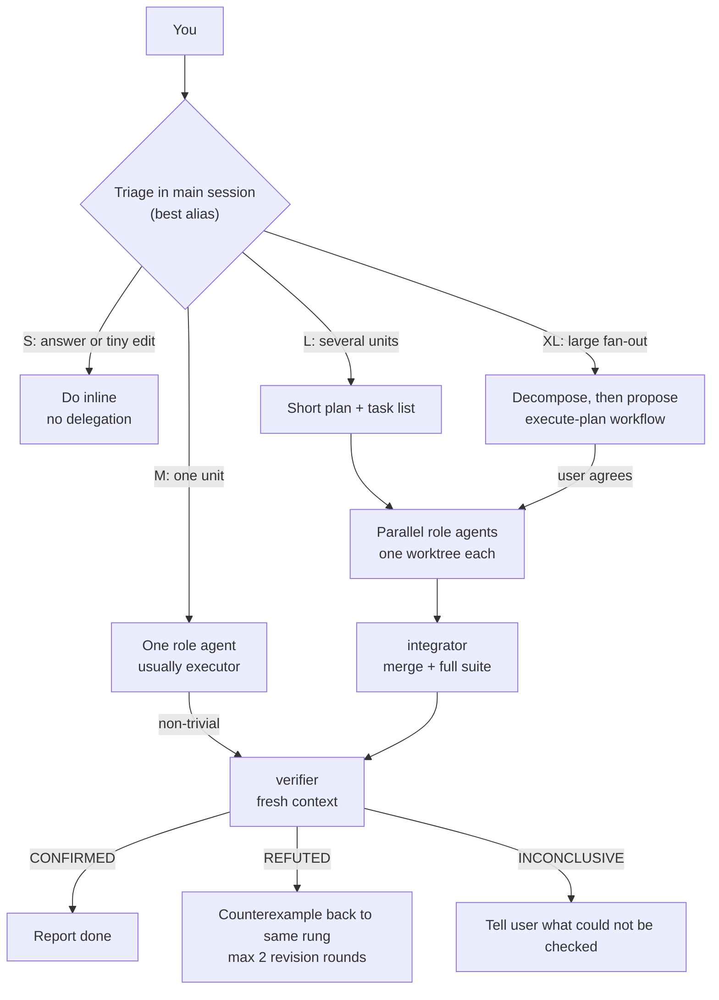

# conductor

> The most expensive model conducts. The cheaper ones play.

**conductor** is a multi-model orchestration config for [Claude Code](https://code.claude.com). Claude Fable 5.1 (the `best` alias) acts only as planner and orchestrator: it triages, decomposes, writes specs, and judges. Claude Opus 5.5 and Sonnet 5.5 do the execution, at effort levels between `medium` and `max`, through eight global subagent roles. Quality is protected by complete specs, bounded escalation, and fresh-context verification.

It is a modernized fork of [pilotfish](https://github.com/Nanako0129/pilotfish) v1.1.5 (MIT, Nanako0129). Everything installs globally under `~/.claude/`. There is no runtime service: it is agent files, a policy block, a settings merge, three small Python hooks, a status line, and one workflow script.

Status: v2.0.0. Covered by 22 unit tests (policy contract and hook behavior). It has not yet been installed or run live, so every runtime behavior described below is *expected*, not observed.

## Contents

- [Why](#why) · [How it works](#how-it-works) · [Roles](#roles) · [Install](#install) · [What gets installed](#what-gets-installed)
- [Hooks](#hooks) · [The execute-plan workflow](#the-execute-plan-workflow) · [The fallback story](#the-fallback-story)
- [Tuning & FAQ](#tuning--faq) · [Uninstall](#uninstall) · [Docs](#docs) · [Credits](#credits-and-prior-art) · [License](#license)

## Why

Two goals: **token frugality** and **execution first**.

- Fable 5.1 lists at $10/$50 per MTok, Opus 5.5 at $4/$20, Sonnet 5.5 at $2/$10. Fable is about 2.5x Opus and 5x Sonnet. Most tokens in a coding session are search, edits, and test runs, not judgment.
- Anthropic's own guidance supports the split: a Fable 5.1 coordinator with 25 Sonnet 5 workers cost 47-55% less than solo Fable, scored 10-12 points lower, and finished in about 2.3 h instead of 15-20 h.
- But orchestration has overhead. A 60-run community test measured a median cost per run of $0.16 for Opus 5.5 at medium versus $0.48 for Fable 5.1, and concluded that on small tasks solo Opus beats a Fable-led split. So conductor **triages first** and does nothing special for small work.
- Honest expectation: community measurements of Fable token reduction (38-44%) showed total API cost roughly unchanged (n=2). Treat savings as a hypothesis and audit them with the ledger (see [Hooks](#hooks)).

Details and sources: [docs/research.md](./docs/research.md). Rationale: [docs/design.md](./docs/design.md).

## How it works

| Layer | File(s) | Job |
|---|---|---|
| Machine | `settings.json` | `model: "best"`, `fallbackModel: ["opus","sonnet"]`, per-model default effort, hooks, status line |
| Roles | `agents/*.md` | Eight role agents; each owns its model and effort in frontmatter |
| Policy | `CLAUDE.md` block | Triage, routing by risk, escalation, spec format. Written in role names, never model names |
| Guardrails | `conductor/hooks/*.py` | Light hooks: routing guard, inline-edit nudge, ledger. They fail open |
| Workflow | `workflows/execute-plan.js` | Optional saved workflow for XL fan-out |



Triage classes:

| Class | Signal | Action |
|---|---|---|
| **S** | Answer/decision, or at most 2 small edits | Inline. No spawn. |
| **M** | One coherent unit | One role agent, then `verifier` if non-trivial |
| **L** | Several separable units or areas | Plan, task list, parallel agents in worktrees, `integrator`, `verifier` |
| **XL** | Large fan-out, broad migration, audit, multi-hour | Decompose inline, propose `execute-plan` to the user, run only if they agree |

Routing is by **risk, not size**: file count never picks the role. A one-line billing change goes to `senior-executor`; a 40-file rename goes to `mech-executor`. Escalation ladder: `mech-executor` -> `executor` -> `senior-executor` (security work starts on `security-executor`). Two failures on one rung means move up or re-spec. Never a third retry on the same rung.

## Roles

| Role | Model | Effort | Job |
|---|---|---|---|
| `scout` | sonnet | medium | Read-only lookups ("where/how is X"). Tools: Read, Glob, Grep |
| `Explore` | sonnet | medium | Shadows the built-in Explore so it stays on the cheap tier. Tools: Read, Glob, Grep |
| `mech-executor` | sonnet | medium | Fully specified mechanical work: renames, pattern refactors, convention tests, docs, bulk edits |
| `executor` | sonnet | high | Default implementer: features, bug fixes, local refactors |
| `integrator` | sonnet | high | Merges parallel worktrees/branches in a given order, resolves mechanical conflicts only, runs the full suite |
| `senior-executor` | opus | high | Architecture, migrations, concurrency, money logic, performance paths, ambiguous work, anything `executor` failed twice |
| `security-executor` | opus | max | Anything security-sensitive. Never handled in the main session |
| `verifier` | opus | medium | Tries to refute completed work. Returns CONFIRMED, REFUTED, or INCONCLUSIVE. Cannot write or edit |

No role binds to Fable. All roles except `scout` and `Explore` (which have a Read/Glob/Grep allowlist) set `disallowedTools` including `Agent` and `Workflow`, so they are leaves and cannot spawn helpers. Each caps its final report at about 20-40 lines.

## Install

Clone or copy this folder, open `claude` in it, then paste:

```text
Read the local file install/AGENT-INSTALL.md in the current checkout and follow it to install conductor into my global Claude Code configuration. Show me the full plan of changes and get my approval before writing anything.
```

Claude inspects your existing config, shows a merge plan (nothing is overwritten blindly), and applies it only after you approve. Re-running it is the upgrade path. Restart Claude Code afterwards: agents, settings, and hooks load at session start.

Requirements:

- Python 3.9 or newer on PATH (hooks and status line). Without it the runbook offers a policy-only install.
- Claude Code 2.1.284 or newer is expected, so that `opus` -> Opus 5.5, `sonnet` -> Sonnet 5.5, and `best` -> Fable 5.1 resolve. Older builds may reject the aliases. On Bedrock/Vertex/Foundry, `sonnet` resolves to older Sonnets and Fable may be unavailable; pin models with `ANTHROPIC_DEFAULT_*_MODEL`.
- Hooks run through Git Bash on Windows, or PowerShell if Git Bash is absent.

**Trust.** The install merges text into your global config that loads into every future session. Read the files in [templates/](./templates/) before approving: they are everything that gets written.

If a pilotfish block (`<!-- pilotfish:begin -->`) exists, conductor supersedes it; role names overlap, so the runbook offers to remove pilotfish.

## What gets installed

Config dir is `$CLAUDE_CONFIG_DIR` or `~/.claude` (`CFG` below).

| Target | Change |
|---|---|
| `CFG/agents/` | 8 role files |
| `CFG/CLAUDE.md` | One block between `<!-- conductor:begin -->` and `<!-- conductor:end -->` |
| `CFG/settings.json` | Merged key by key: `model` (`best`), `fallbackModel`, `modelSettings` effort defaults, `env.CLAUDE_CODE_ENABLE_TODO_TOOLS`, three hook entries, `statusLine` (only if you have none, or you opt in) |
| `CFG/conductor/` | `hooks/*.py`, `statusline.py`; later `state/` and `ledger.jsonl` |
| `CFG/workflows/execute-plan.js` | The saved workflow |
| `CFG/conductor/backup/` | `settings.pre-conductor.json` (first install only, never overwritten) plus timestamped copies of `CLAUDE.md` and `settings.json` |

Default effort for the main session (`modelSettings`): Fable 5.1 `high`, Opus 5.5 `high`, Sonnet 5.5 `medium`. Role agents carry their own effort and override these. Nothing is written into any project.

## Hooks

Three light hooks, no hard gates. All are standard-library Python and **fail open**: any error or bad input means the tool call proceeds. Hooks ignore events coming from subagents.

| Hook | Event | What it does |
|---|---|---|
| `agent_guard.py` | PreToolUse on `Agent` | Denies a named role invoked with an explicit `model` (it would override the role's tier). Denies an ad-hoc agent with no `model` (it would inherit the frontier model). Allows everything else and resets the inline-edit counter, counting one delegation. `claude-code-guide` and `statusline-setup` are allowed to run without a model. |
| `inline_edit_nudge.py` | PostToolUse on `Edit\|Write\|MultiEdit\|NotebookEdit` | Counts consecutive main-session edits since the last delegation. Every 4th one it injects a non-blocking reminder to hand execution to a role agent. |
| `subagent_ledger.py` | SubagentStop | Appends one JSON line per finished subagent to `CFG/conductor/ledger.jsonl`: role, models used, and token usage summed from the subagent transcript. Use it to check that the frontier share is small. |

The status line (`statusline.py`) shows `model · $cost · ctx N% · delegated N`. Missing fields are skipped.

| Env var | Effect |
|---|---|
| `CONDUCTOR_GUARD=off` | Disables the guard completely |
| `CONDUCTOR_ALLOW_INHERIT` | Comma-separated extra agent types allowed to run without a `model` (e.g. `Plan,Other`) |
| `CONDUCTOR_NUDGE_AFTER` | Nudge threshold, default `4`. A very large value effectively silences the nudge |

Per-session state lives in `CFG/conductor/state/<session>.json`.

## The execute-plan workflow

For XL work the conductor decomposes inline (judgment), then proposes the saved workflow. It runs only if you agree:

```js
Workflow({
  name: "execute-plan",
  args: {
    goal: "overall outcome, with the why",
    testCommand: "full-suite command",
    units: [
      { id: "u1", title: "short title", role: "mech-executor", spec: "complete one-shot spec", done: "done-criteria" }
    ]
  }
})
```

`role` is one of `mech-executor`, `executor` (default), `senior-executor`, `security-executor`. The script then:

1. **Execute**: one role agent per unit, each in an isolated worktree, committing on its branch. A unit that does not come back `done` escalates once up the ladder (`mech-executor` -> `executor` -> `senior-executor`); `senior-executor` and `security-executor` do not escalate. Units still not done are excluded from integration and listed in the result.
2. **Integrate**: the `integrator` merges the finished slices and runs `testCommand`.
3. **Verify**: a `verifier` tries to refute the combined result and returns a verdict.

The script never sets a `model`, so role definitions own routing. With no `units` it returns an error asking for decomposition first. Expected platform limits (from the docs): 16 concurrent / 1000 agents per run; runs pause and resume at usage limits.

## The fallback story

No policy text names a model, so the stack keeps working when models change.

| Failure | What catches it |
|---|---|
| No Fable access (plan change, outage) | `best` resolves to Opus. Roles are unaffected because none bind to Fable |
| Model overloaded or erroring | `fallbackModel: ["opus","sonnet"]` (deliberately no Fable) |
| A tier is re-versioned | Roles use aliases (`opus`, `sonnet`) that track the recommended version |
| Python missing or a hook crashes | Hooks fail open; routing still works through role definitions and policy |
| Frontier model refuses a security task | `security-executor` and `verifier` run on Opus directly |

If the main session is Opus (no Fable), conductor still works: Opus plans, Sonnet and Opus execute.

## Tuning & FAQ

| Question | Answer |
|---|---|
| Pro vs Max? | Max and Team/Enterprise Premium can use up to 50% of the weekly limit on Fable. Pro, Standard seats, and API users pay for Fable through usage credits. On Pro/API set `"model": "opus"` (main session Opus 5.5 at high) and use `/model best` only for hard planning sessions. The installer asks about your plan. |
| Changing effort? | `/effort <level>` for the session; levels are `low`, `medium`, `high`, `xhigh`, `max`. Precedence: `CLAUDE_CODE_EFFORT_LEVEL` env > `--effort` > `/effort` > `modelSettings.<id>.effortLevel` > model default. A subagent's frontmatter `effort` overrides the session level; `maxEffortLevel` caps it. |
| Is `ultracode` an effort level? | No. It is a Claude Code toggle that makes Claude plan a workflow for every substantive task. There is no "ultra" effort. Leaving it on adds planning overhead that triage is meant to avoid. |
| What effort for the main session? | `high` by default here. Anthropic suggests starting Fable 5.1 at high. |
| Turn it off for a session? | Tell Claude "don't delegate this session, work inline". The policy is text, so it obeys immediately. Or set `CONDUCTOR_GUARD=off` to stop the guard. |
| Turn it off for a repo? | Add a note to that repo's `CLAUDE.md` (for example "work inline here, no delegation"). Project and user memory stack; the more specific instruction should win. |
| Turn it off globally? | Comment out the `conductor:begin/end` block in `CFG/CLAUDE.md`. Agent files then sit unused. See [Uninstall](#uninstall) for full removal. |
| `CLAUDE_CODE_SUBAGENT_MODEL` is set | It defeats routing. Resolution order is per-call `model` > frontmatter > `CLAUDE_CODE_SUBAGENT_MODEL` > main model, and `CLAUDE_CODE_SUBAGENT_MODEL_FORCE=1` overrides everything. Do not set either; the installer warns if they exist. `CLAUDE_CODE_EFFORT_LEVEL` similarly overrides role effort. |
| I use `availableModels` | It must include `opus` and `sonnet` (and `best`/`fable` if used for the main session), or roles fall back to inheriting the main model. |
| Is orchestration always worth it? | No. Anthropic recommends an effort sweep before multi-model setups. Try Opus 5.5 solo at medium/high first on your workload. conductor's S class is that fast path. |
| Does spawning cost extra? | Yes. Each spawn is a fresh context and the spec costs main-session tokens. That is why S-class work is never delegated. |
| Task tools missing? | On 5.x models they need `CLAUDE_CODE_ENABLE_TODO_TOOLS=1`; the settings merge adds it. |
| Managed/enterprise machine? | Managed settings outrank user settings. A managed `model`, `availableModels`, or `maxEffortLevel` can override this install. Note `maxEffortLevel` below `max` caps `security-executor`. |

## Uninstall

Tell Claude Code:

```text
Uninstall conductor: follow the Uninstall section of install/AGENT-INSTALL.md in the conductor checkout. Show me what you will remove first.
```

It removes the 8 role files, `workflows/execute-plan.js`, the policy block, conductor's hook entries, its status line, and `env.CLAUDE_CODE_ENABLE_TODO_TOOLS`, then offers to delete `CFG/conductor/` (keeping `ledger.jsonl` and `backup/` if you want) and to restore `model`, `fallbackModel`, and `modelSettings` from `settings.pre-conductor.json`.

## Docs

| Document | Contents |
|---|---|
| [docs/design.md](./docs/design.md) | Rationale, effort tiers, what was left out, changes from pilotfish v1.1.5 |
| [docs/research.md](./docs/research.md) | Sourced findings (Oct 2026) with unverified items marked |
| [CHANGELOG.md](./CHANGELOG.md) | Release notes |

Run the tests with `python -m unittest discover -s tests` from this folder.

## Credits and prior art

- [Nanako0129/pilotfish](https://github.com/Nanako0129/pilotfish) (MIT): the base of this fork, the role-based, model-free policy, and the installer pattern.
- [Rylaa/fable5-orchestrator](https://github.com/Rylaa/fable5-orchestrator): guard hooks, short report cap, solo-edit gate.
- [latinovation/fable-orchestrator-claude-code](https://github.com/latinovation/fable-orchestrator-claude-code): routing by risk ("file count never selects the model").
- [y0f/fable-orchestration-5.1](https://github.com/y0f/fable-orchestration-5.1) and [realgarit/fable-baton](https://github.com/realgarit/fable-baton): the model-inheritance traps behind `agent_guard`, and measurements showing Fable token savings without total-cost savings.

## License

[MIT](./LICENSE). Original copyright 2026 Nanako0129 (pilotfish).
