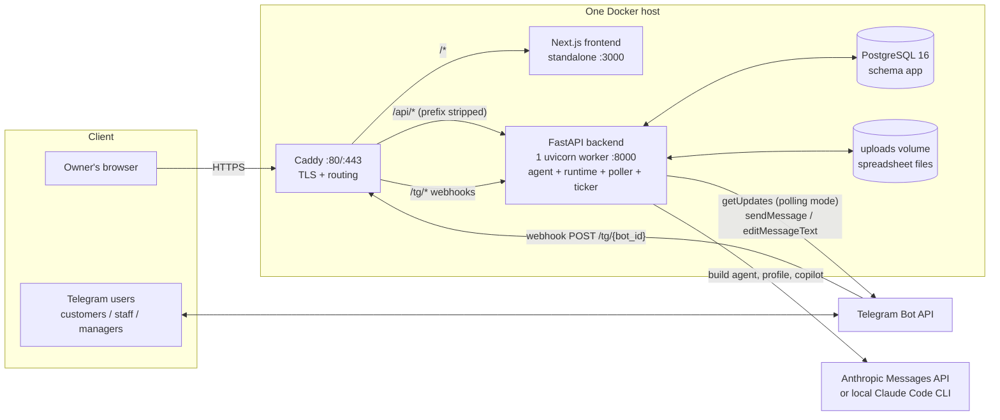
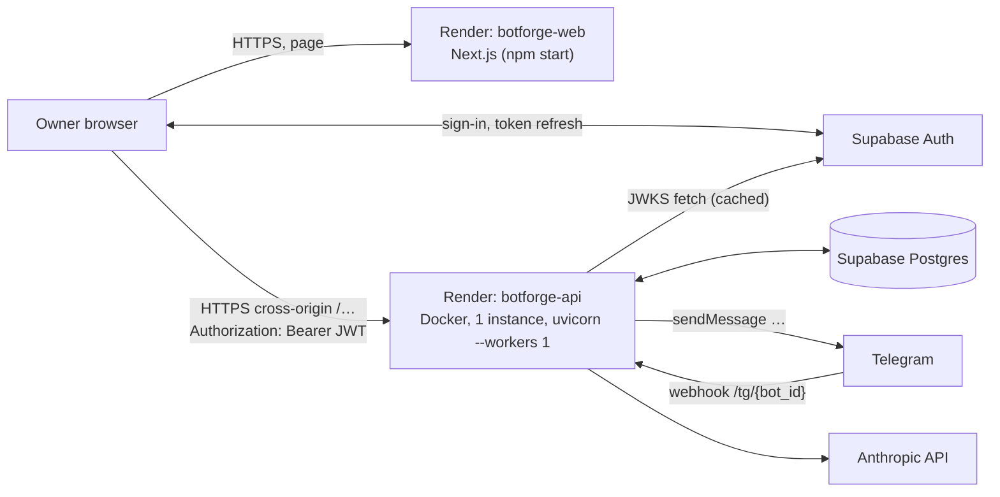
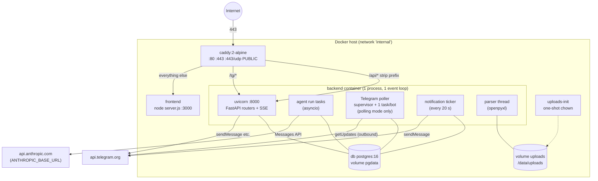
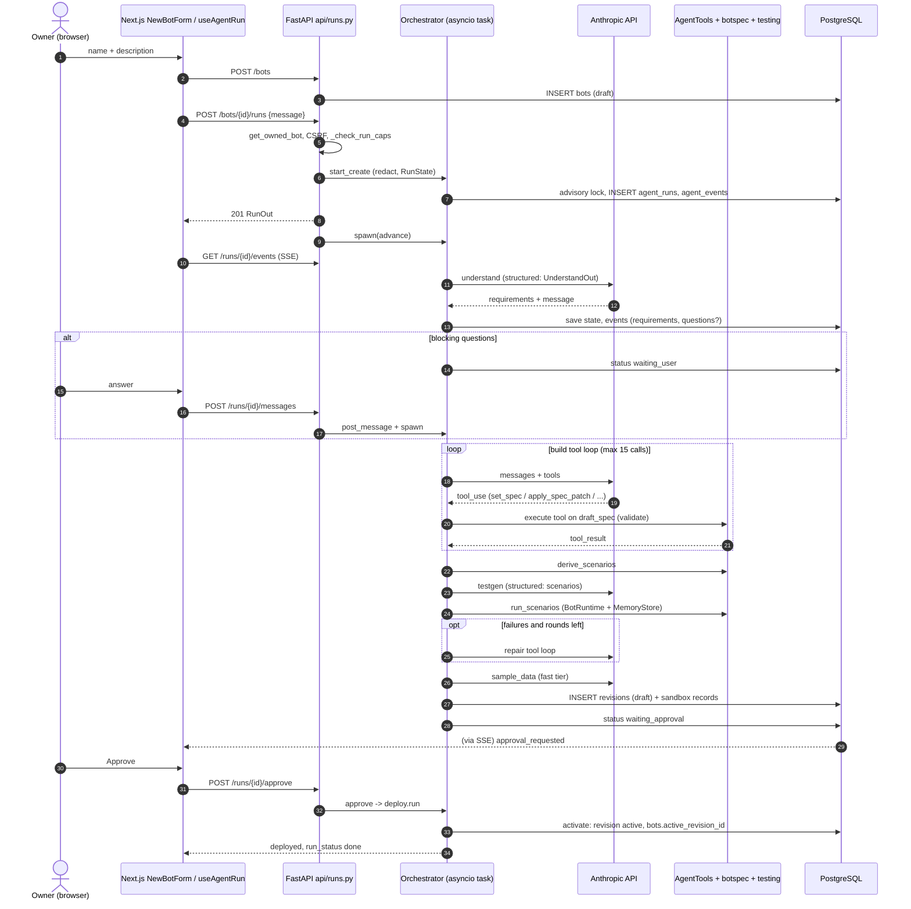
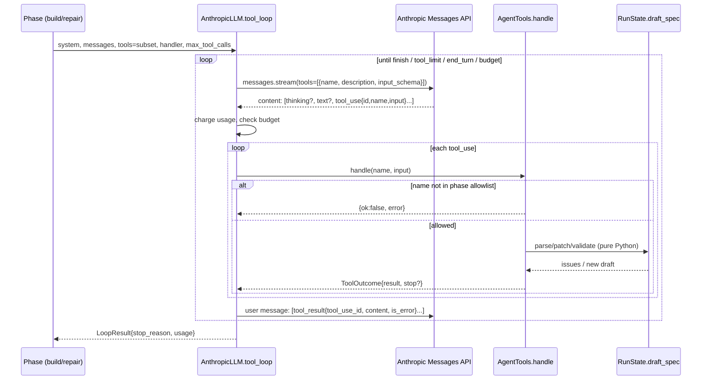
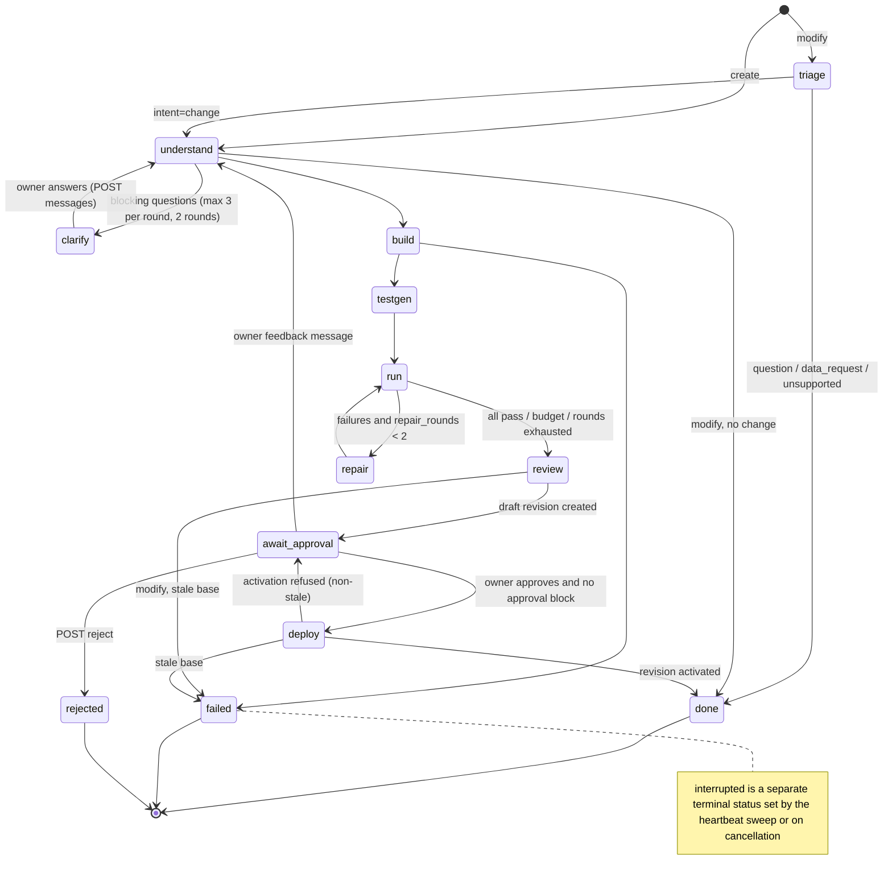
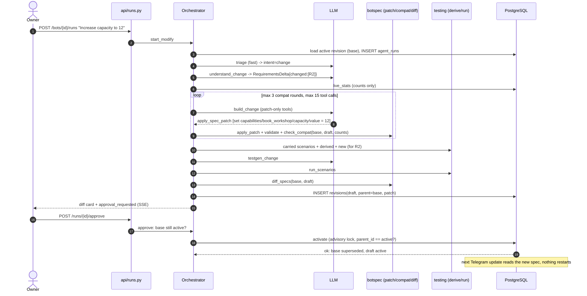
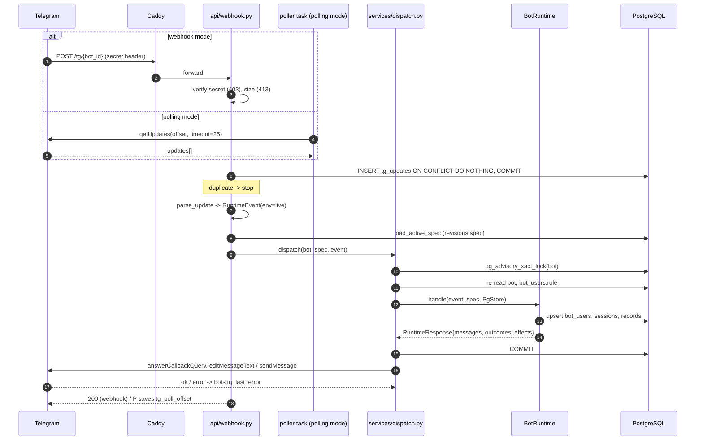
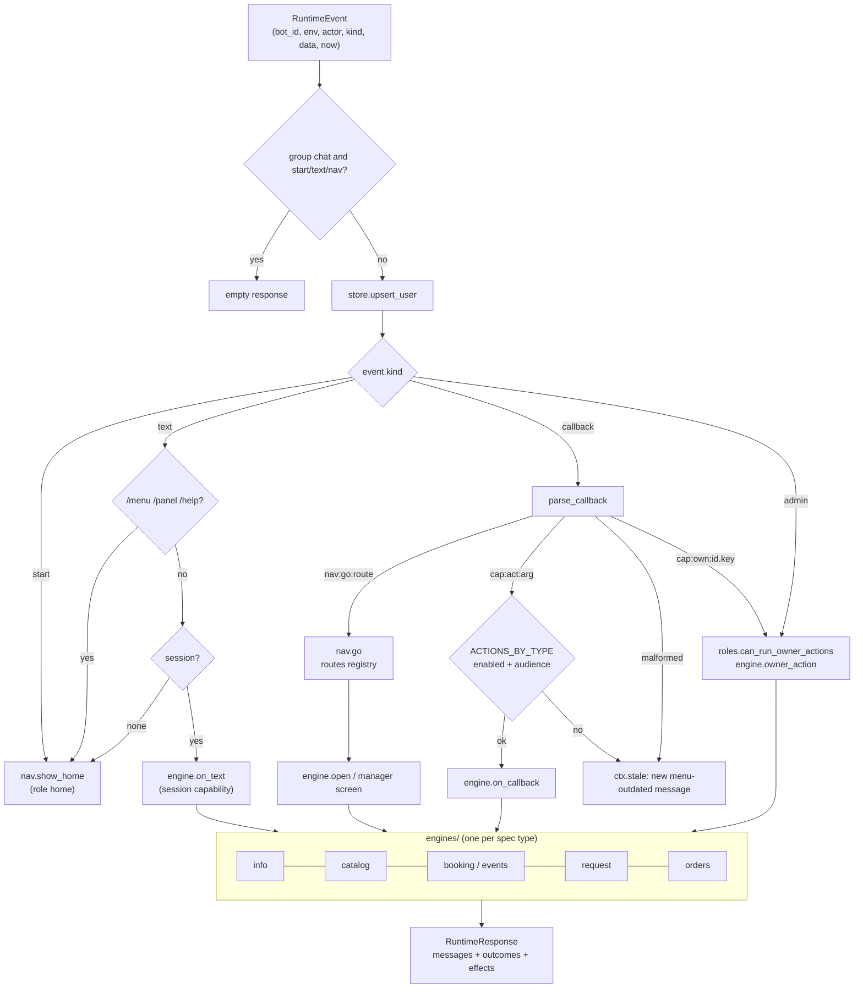
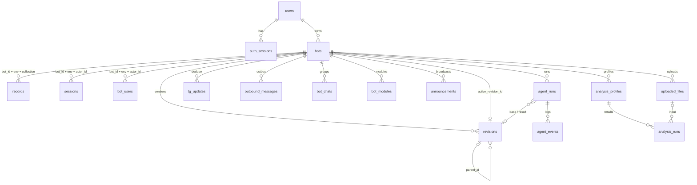

# BotForge — Software Architecture (as implemented)

> **What this document is.** A reverse-engineered description of how BotForge works **today**, derived from the source code on branch `main` (HEAD `73091be`, 2026-10-08). That commit is the merge of `bot-ux` (Telegram navigation, UI redesign, agent visibility) into the Render + Supabase line. Where planning documents (`IMPLEMENTATION_ROADMAP.md`, `README.md`) disagree with the code, the code wins and the discrepancy is listed in [§51](#51-known-documentation--code-discrepancies).
>
> **What it is not.** A design proposal. Nothing here says how BotForge *should* work. Weaknesses are documented, not fixed.
>
> **Source references** use `path::symbol` (for example `backend/app/agent/orchestrator.py::Orchestrator.advance`). Unless stated otherwise, backend paths are relative to `backend/` and frontend paths to `frontend/`.
>
> **Status labels** used throughout:
>
> | Label | Meaning |
> |---|---|
> | **IMPLEMENTED** | Production code path exists and is exercised by tests |
> | **PARTIALLY IMPLEMENTED** | Works, but a documented part of the feature is missing |
> | **SCAFFOLDED** | Data fields / registry entries exist, behaviour does not |
> | **PLANNED ONLY** | Appears only in the roadmap |
> | **DEPRECATED / LEGACY** | Still in code for compatibility, no longer the primary path |
>
> **Verification caveat.** "IMPLEMENTED" means *implemented and tested against fakes*. Per the roadmap's own status (`IMPLEMENTATION_ROADMAP.md` §Current Status → "Built but not yet proven"), the system has not yet run against the real Anthropic API, real Telegram, real Supabase Auth tokens, or the hosted database with migrations 0003–0006. This document describes code, not observed production behaviour.

---

## Table of contents

1. [Executive Overview](#1-executive-overview)
2. [Technology Stack](#2-technology-stack)
3. [Repository Map](#3-repository-map)
4. [Runtime Processes](#4-runtime-processes)
5. [How Generated Bots Exist](#5-the-most-important-architectural-fact-how-generated-bots-exist)
6. [End-to-End: Create a Bot From a Prompt](#6-end-to-end-flow-user-creates-a-bot-from-a-prompt)
7. [How Requirements Are Identified](#7-how-requirements-are-identified)
8. [How the LLM Knows What It Can Do](#8-how-the-llm-knows-what-it-can-do)
9. [LLM Provider Architecture](#9-llm-provider-architecture)
10. [Agent Architecture](#10-agent-architecture)
11. [Agent Run Progress in the Web UI](#11-agent-run-progress-in-the-web-ui)
12. [Capability Architecture](#12-capability-architecture)
13. [BotSpec Architecture](#13-botspec-architecture)
14. [Deterministic vs LLM-Controlled Behaviour](#14-deterministic-vs-llm-controlled-behaviour)
15. [Modification / Revision Flow](#15-modification--revision-flow)
16. [How a Telegram Message Is Processed](#16-how-a-telegram-message-is-processed)
17. [Telegram Menu and Navigation](#17-telegram-menu-and-navigation-architecture)
18. [Role Architecture](#18-role-architecture)
19. [Runtime Engine](#19-runtime-engine)
20. [Simulator](#20-simulator-architecture)
21. [Data Model / PostgreSQL](#21-data-model--postgresql)
22. [Generic Business Records](#22-generic-business-records)
23. [Commerce](#23-commerce-architecture)
24. [Event Management](#24-event-management-architecture)
25. [Reporting](#25-reporting-architecture)
26. [Spreadsheet Intelligence](#26-spreadsheet-intelligence-architecture)
27. [Manager Copilot](#27-manager-copilot-architecture)
28. [Payments](#28-payments-architecture)
29. [Forms and Approval Workflows](#29-forms-and-approval-workflows)
30. [Notification / Scheduling](#30-notification--scheduling-architecture)
31. [Authentication and Security](#31-authentication-and-security)
32. [Frontend Architecture](#32-frontend-architecture)
33. [Frontend → Backend API Map](#33-frontend--backend-api-map)
34. [Backend API Map](#34-backend-api-map)
35. [Configuration and Environment Variables](#35-configuration-and-environment-variables)
36. [Docker / Deployment](#36-docker--deployment-architecture)
37. [Startup and Shutdown](#37-startup-and-shutdown-behaviour)
38. [State Inventory](#38-state-inventory)
39. [External Services](#39-external-services)
40. [Error Handling](#40-error-handling)
41. [Logging and Observability](#41-logging-and-observability)
42. [Concurrency and Transactions](#42-concurrency-and-transaction-boundaries)
43. [Multi-Tenancy](#43-multi-tenancy)
44. [Scalability Characteristics](#44-scalability-characteristics)
45. [Testing Architecture](#45-testing-architecture)
46. [Concrete Walkthroughs](#46-concrete-walkthroughs)
47. [Where Does This Live?](#47-where-does-this-live-quick-reference)
48. [Who Decides What?](#48-who-decides-what-matrix)
49. [Architectural Strengths](#49-architectural-strengths)
50. [Weaknesses / Technical Debt](#50-architectural-weaknesses--technical-debt)
51. [Documentation / Code Discrepancies](#51-known-documentation--code-discrepancies)
52. [Glossary](#52-glossary)

---

## 1. Executive Overview

**What the product is.** BotForge (rebranded in the roadmap as "AI Business OS for Telegram") is a web platform where an Iranian small-business owner describes a business in Persian, and an AI agent turns that description into a working **Telegram bot**. Examples: a workshop school taking bookings, a shop taking orders, an event organiser collecting RSVPs, or a service business collecting support requests. The same web app is then the owner's "control center". It covers live data (orders, bookings, requests), reports, a capability on/off switchboard, spreadsheet analysis, a Q&A copilot, team management and group publishing. All user-facing text in the web app and in bots is Persian (RTL, Jalali dates).

**Who uses it.**
- **Owner**: has a web account (email + password). It is held either in BotForge's own `users` table (`AUTH_PROVIDER=local`) or in **Supabase Auth** (`AUTH_PROVIDER=supabase`, the primary hosted deployment). Owns one or more *bots*. Uses the web app.
- **Telegram users of a bot**:
  - **Customers**: anyone who messages the bot.
  - **Staff**: joined via an invite link.
  - **Managers**: the owner's own Telegram account (linked via a one-time deep link) or promoted staff.

**What the web application does.**
- Account management.
- Creating a "business" (a bot row).
- Chatting with the build agent and watching its progress live (SSE).
- Approving the agent's proposed version.
- Viewing and rolling back versions.
- A **simulator** that runs the bot without Telegram.
- Connecting the Telegram bot token.
- CRUD over business records.
- Reports, capability toggles, spreadsheet uploads and analysis, the copilot, team, groups, announcements and report schedules.

**What Telegram does.** Telegram carries the end-user conversation. BotForge does **not** run a process per bot. One backend process receives updates for *all* connected bots, either by webhook (`POST /tg/{bot_id}`) or by long-polling `getUpdates` per bot. It answers by calling the Bot API (`sendMessage`, `editMessageText`, `answerCallbackQuery`).

**What the AI does.** The LLM (Anthropic Claude via the official SDK, or the local Claude Code CLI in development) is used **only at build/change time and for a few owner-facing analysis features**:
1. **Build agent**: turns owner text into a structured `Requirements` model, then into a declarative JSON **BotSpec**. It does this by calling a fixed set of 9 spec-editing tools. It also writes acceptance-test scenarios and sample data.
2. **Spreadsheet profile drafting**: proposes which metrics and checks to compute for an uploaded workbook. An optional narrative summarises the computed numbers.
3. **Manager Copilot**: answers owner questions using 6 read-only reporting tools.

**What does NOT require AI.**
- Everything a Telegram user experiences: menus, navigation, bookings, capacity, waitlists, carts, order totals, stock, request forms, status changes, notifications, reminders and RSVP cards.
- Every number in a report.
- Spreadsheet metric computation.
- Revision activation.
- Validation.
- Capability toggling.
- Deterministic test derivation.

All of these are deterministic Python. The shared **runtime** (`app/runtime/`) never calls an LLM.



The diagram shows the **self-hosted Docker Compose** topology (`deploy/`). The README calls **Render + Supabase** the *primary* deployment (`render.yaml`). It has the same logical components arranged differently (§4):
- a Render Node service runs the frontend;
- a Render Docker service runs the backend;
- Supabase supplies Postgres and Auth;
- there is no Caddy;
- the browser calls the API cross-origin with a Supabase `Authorization: Bearer` token.

---

## 2. Technology Stack

| Area | Technology | Purpose in BotForge | Important libraries | Where used |
|---|---|---|---|---|
| Frontend framework | Next.js 16 (App Router), React 19, TypeScript 5.9 | Owner control center; almost all pages are client components that call the JSON API | `next`, `react`, `react-dom` | `frontend/app/**`, `frontend/components/**` |
| Styling | Tailwind CSS v4 (`@tailwindcss/postcss`), CSS tokens with `[data-theme=dark]` | Light/dark theme, RTL-safe classes (checked by a script) | `tw-animate-css`, `tailwind-merge`, `clsx`, `class-variance-authority` | `frontend/app/globals.css`, `frontend/scripts/check-rtl-classes.mjs` |
| Component library | Radix UI primitives in shadcn-style wrappers; lucide icons | Dialogs, sheets, selects, tabs, toasts, with RTL `Direction` provider | `radix-ui`, `lucide-react` | `frontend/components/ui/*` |
| Charts | Hand-written SVG components (no chart library) | Reports and overview | — | `frontend/components/charts/*` |
| Jalali date input | react-multi-date-picker | Persian calendar inputs in record forms | `react-multi-date-picker` | `frontend/components/data/jalali-datetime-input.tsx` |
| Backend framework | FastAPI on uvicorn (`--workers 1`) | JSON API, SSE stream, Telegram webhook, and in-process background tasks | `fastapi`, `uvicorn[standard]` | `app/main.py`, `app/api/*` |
| Schema validation / serialization | Pydantic v2 (`StrictModel` with `extra="forbid"`) | BotSpec contract, requirements, scenarios, runtime events, API models; JSON schemas for the LLM | `pydantic`, `pydantic-settings` | `app/botspec/models.py`, `app/runtime/contracts.py`, `app/schemas/business.py` |
| Database | PostgreSQL 16 (schema `app`) | All durable state, including generic JSONB business records | — | `deploy/docker-compose.yml` service `db` |
| ORM / driver | SQLAlchemy 2 async + asyncpg | Typed models; raw `pg_insert ... ON CONFLICT`; advisory locks | `sqlalchemy[asyncio]`, `asyncpg` | `app/db/models.py`, `app/db/session.py`, `app/runtime/pg_store.py` |
| Migrations | Alembic (6 revisions, async env) | Run by the backend container CMD before uvicorn starts | `alembic` | `alembic/versions/0001…0006` |
| Authentication | **Two providers**, selected by `AUTH_PROVIDER`. **local**: own argon2id passwords, server-side sessions, HttpOnly cookie, custom CSRF header. **supabase**: Supabase Auth in the browser, with the backend verifying the `Authorization: Bearer` JWT (JWKS ES256/RS256 or HS256 secret) | Owner web login | `argon2-cffi`, `pyjwt[crypto]` (JWT verification), `@supabase/supabase-js` (frontend) | `app/security/{sessions,csrf,passwords,accounts,supabase_auth}.py`, `app/api/deps.py`, `frontend/lib/{auth.tsx,supabase.ts}` |
| CORS | Explicit origin list + optional anchored https regex; allows `Authorization`, `Content-Type`, `X-BotForge-CSRF`, `Last-Event-ID` | Cross-origin web app on Render | Starlette `CORSMiddleware` | `app/security/cors.py`, `main.py` |
| Encryption | Fernet (AES-128-CBC + HMAC) | Encrypts Telegram bot tokens at rest | `cryptography` | `app/security/crypto.py` |
| Agent orchestration | Hand-written persisted phase machine (no LangGraph or LangChain) | Create/modify workflows | — | `app/agent/orchestrator.py`, `app/agent/phases/*` |
| LLM provider (prod) | Anthropic Messages API via official SDK, streaming; native tools; JSON-schema structured output; prompt caching | Build agent, spreadsheet profile, narrative, copilot | `anthropic` (uses `httpx2[socks]`) | `app/agent/llm.py::AnthropicLLM` |
| LLM provider (dev) | Headless Claude Code through `claude-agent-sdk` | Runs the agent on a developer's Claude login | `claude-agent-sdk` (optional `headless` group) | `app/agent/llm_claude_code.py::ClaudeCodeLLM` |
| Telegram | Raw Bot API over HTTPS with httpx (no bot framework) | Webhook / long-poll intake, message delivery, file download | `httpx[socks]` | `app/integrations/telegram/*` |
| Spreadsheet processing | openpyxl (read-only, `data_only`) and stdlib `csv` | Parse .xlsx/.csv uploads on a dedicated thread | `openpyxl` | `app/spreadsheets/reader.py` |
| Reporting | Pure-Python query evaluator over records loaded via the Store | Metrics, periods (Jalali month, Saturday week) | — | `app/runtime/aggregate.py`, `app/reporting/*` |
| Payments | **None** (registry entry `payments` has `available=False`) | — | — | `app/capabilities/registry.py` |
| Background work | `asyncio.create_task` inside the API process: agent runs, Telegram poller, notification ticker | No queue, no worker, no Redis | — | `orchestrator.py::spawn`, `poller.py`, `notifications/ticker.py` |
| File storage | Local filesystem behind a `FileStorage` protocol; Docker volume `uploads` | Uploaded spreadsheets | — | `app/spreadsheets/storage.py::LocalFileStorage` |
| Reverse proxy / TLS | Caddy 2 (automatic HTTPS) | Single hostname; `/api/*` → backend (prefix stripped), `/tg/*` → backend, rest → frontend | — | `deploy/Caddyfile` |
| Containers / deployment | **Primary (README):** Render blueprint `render.yaml` with `botforge-api` (Docker) + `botforge-web` (Node), and Supabase Postgres + Auth. **Alternative:** Docker Compose with `db`, `backend`, `frontend`, `caddy`, plus one-shot `uploads-init` | Hosted test deployment / self-hosted VPS | — | `deploy/*`, `backend/Dockerfile`, `frontend/Dockerfile`, `render.yaml` |
| Tests (backend) | pytest + pytest-asyncio; `FakeLLM`, `FakeTelegramClient`; temporary Postgres via `pgserver` | 119 test files (76 unit, 42 integration, 1 golden); no real LLM or Telegram calls | `pytest`, `pytest-asyncio`, `pgserver` (`dbtest` group) | `backend/tests/**` |
| Tests (frontend) | No test framework. Checks are eslint, `tsc`, an RTL class checker, a schema-parity checker, the build, and one plain-Node test script (`npm run test:next-path`, open-redirect cases) | — | `eslint`, `typescript` | `frontend/scripts/*.mjs` |
| Package management | uv (backend, `uv.lock`), npm (frontend) | Reproducible images | — | `backend/pyproject.toml`, `frontend/package.json` |

---

## 3. Repository Map

```
BotForge/
├── backend/                     Python 3.12 FastAPI service (everything server-side)
│   ├── app/
│   │   ├── main.py              App factory, middleware, lifespan (poller, ticker, interrupted runs)
│   │   ├── config.py            Settings (pydantic-settings); env var names
│   │   ├── api/                 HTTP routers (auto-discovered); thin: auth + ownership + call a service
│   │   ├── agent/               Build-time AI agent: orchestrator, phases, prompts, tools, LLM clients
│   │   ├── botspec/             [FROZEN CONTRACT] BotSpec models, validator, patch, diff, compat, records
│   │   ├── capabilities/        Capability registry (18 entries), dependency resolver, toggle service
│   │   ├── revisions/           Draft/activate/rollback, capability-toggle-as-revision pipeline
│   │   ├── runtime/             Shared deterministic bot runtime: router, nav, engines, stores, texts
│   │   ├── services/            dispatch (the one way to run the runtime on Postgres), specs, group cards
│   │   ├── integrations/telegram/  Bot API client, update parser, webhook onboarding, poller, commands
│   │   ├── roles/               customer/staff/manager policy and storage, staff invite links
│   │   ├── simulator/           Sandbox dispatch (same runtime, env="sandbox", no Telegram)
│   │   ├── testing/             [scenario.py FROZEN] scenario model, derivation, drivers, runner, CLI
│   │   ├── reporting/           Metric registry, periods, report service, Telegram renderers
│   │   ├── spreadsheets/        Upload, parse, inspect, LLM profile draft, deterministic run, narrative
│   │   ├── copilot/             Owner Q&A tool loop over reporting
│   │   ├── notifications/       Outbox, ticker, recipient targets, generators (announcements/reminders/reports)
│   │   ├── security/            Passwords, sessions, CSRF, Supabase JWT verification, CORS, Fernet, rate limits, redaction, body limit
│   │   ├── schemas/business.py  REST models for Business OS endpoints (mirrored in frontend/lib/types.ts)
│   │   └── db/                  SQLAlchemy models and async engine/session
│   ├── alembic/versions/        0001_initial … 0006_tg_updates_received_at
│   ├── scripts/                 Operator / dev tools (create_user, load_spec, seed_demo, eval_golden, …)
│   ├── tests/{unit,integration,golden}/
│   ├── Dockerfile               python:3.12-slim; CMD = alembic upgrade head && uvicorn --workers 1
│   └── pyproject.toml / uv.lock
├── frontend/                    Next.js 16 owner web app
│   ├── app/                     Routes (App Router); /bots/[id]/… one URL per section
│   ├── components/              UI by feature (agent, changes, simulator, capabilities, reports, …)
│   ├── lib/                     api.ts (the API client), sse.ts, auth.tsx, types.ts, mock/, fixtures/
│   ├── scripts/                 check-rtl-classes.mjs, check-schema-parity.mjs
│   └── Dockerfile               node:22-alpine 3-stage, output: standalone
├── deploy/                      docker-compose.yml, docker-compose.local.yml, Caddyfile, backup/restore
├── examples/                    [FROZEN] golden workshop BotSpec, requirements, scenarios; repair spec
├── conductor/                   Claude Code orchestration config for developers. NOT product code
├── IMPLEMENTATION_ROADMAP.md    Planning doc / decision log (secondary source; partly stale)
├── README.md                    Operator documentation
└── render.yaml                  Primary hosted deployment: Render API (Docker) + web (Node) services; Supabase DB/Auth
```

### Directory responsibilities

**`backend/app/api/`**
- **Responsibility:** HTTP surface. Every module exposing `router` is mounted automatically by `main.py::include_api_routers` (pkgutil scan; `deps.py` is skipped). Routers declare their own paths; there is no global prefix. The browser sees `/api/...` only because Caddy strips `/api`.
- **Pattern:** depend on `api/deps.py::get_owned_bot` / `get_owned_run` / `get_owned_revision`, then call a service, then commit.
- **Calls:** `agent`, `revisions`, `capabilities`, `services.dispatch`, `simulator`, `reporting`, `spreadsheets`, `copilot`, `roles`, `integrations.telegram.onboarding`.

**`backend/app/agent/`**
- **Responsibility:** the build/change agent.
- **Entry points:**
  - `orchestrator.py::Orchestrator` with `start_create`, `start_modify`, `advance`, `post_message`, `approve`, `reject`, `retry`, `spawn`.
  - Phase functions in `phases/*.py`.
  - `tools.py::AgentTools`, which implements the 9 LLM tools.
  - `llm.py`, which defines the `LLMClient` protocol with `AnthropicLLM` and `FakeLLM`.
  - `llm_claude_code.py`.
  - `prompts/*.md`.
  - `repository.py::SqlAgentRepository`, which persists to `agent_runs` and `agent_events`.
  - `events.py`, the event types and the in-process `EventBus`.
- **Calls:** `botspec` (validate, patch, compat, diff), `testing` (derive and run scenarios in memory), `revisions.service` (create draft, activate).

**`backend/app/botspec/`** (frozen contract)
- **Responsibility:** the declarative bot language.
  - `models.py`: the Pydantic models.
  - `validate.py`: `parse_spec`, `validate_spec`, `check_spec`.
  - `patch.py`: key-addressed `PatchOp`.
  - `diff.py`: owner-readable diff.
  - `compat.py`: live-data compatibility rules.
  - `records.py`: record field coercion.
  - `text_keys.py`: overridable text keys.
  - `outline.py`: a reduced spec view for the test author.
- **Called by:** agent, runtime, revisions, API.

**`backend/app/runtime/`**
- **Responsibility:** the one interpreter that runs *every* bot.
  - `runtime.py::BotRuntime.handle(event, spec, store)` is the router.
  - `nav.py` compiles role homes and routes.
  - `engines/` holds one engine per capability type: info, catalog, booking, request, orders.
  - `manager*.py` holds manager screens.
  - `forms.py` is the step-by-step form collector.
  - `store.py` defines the store protocol (frozen). `pg_store.py` is the Postgres implementation and `memory_store.py` is used for tests and the scenario runner.
  - `callbacks.py` holds the callback_data codec (frozen).
  - `contracts.py` holds the event/response models (frozen).
  - `texts/` holds the Persian copy.
  - `aggregate.py` is the report query evaluator.
- **Called by:** `services/dispatch.py`, `testing/runner.py`.
- **Never calls:** an LLM, the network, or the clock (`event.now` is passed in).

**`backend/app/services/`**
- `dispatch.py::dispatch` is the single transaction wrapper around the runtime: advisory lock → role refresh → `BotRuntime.handle` on `PgStore` → COMMIT → deliver to Telegram.
- `specs.py::load_active_spec` loads and validates the active revision's spec on every call (no cache).
- `group_cards.py` renders event cards.

**`backend/app/integrations/telegram/`**
- `client.py::TelegramClient` is the Bot API client (httpx, retry on 429/network). The same file has `FakeTelegramClient`.
- `adapter.py::parse_update` maps a Telegram update to a `RuntimeEvent`. `send_out_message` handles edit or send.
- `onboarding.py::connect` / `disconnect` handle the token, webhook and owner link code.
- `poller.py::TelegramPoller` handles polling mode.
- `commands.py` registers the `/menu /help /panel` command menus.

**`backend/app/capabilities/`, `revisions/`**
- The registry of 18 business capabilities and the toggle service.
- Revisions:
  - `revisions/service.py::create_draft` and `activate` (with rollback).
  - `revisions/toggle.py::apply_capability_ops`: patch → compat → re-run tests → new **active** revision without human approval.

**`backend/app/reporting/`, `spreadsheets/`, `copilot/`, `notifications/`, `roles/`, `simulator/`, `security/`** are covered in their own sections below.

**`frontend/`**
- **API client:** `lib/api.ts` (`realApi`, or `mockApi` when built with `NEXT_PUBLIC_MOCK=1`).
- **SSE:** `lib/sse.ts` reads the run event stream with fetch and a `ReadableStream`.
- **Auth:** `lib/auth.tsx::AuthProvider` calls `GET /me`.
- **Pages:** `app/bots/[id]/*`.
- **Shell:** the business shell is `components/app/shell/business-root.tsx`.

**`deploy/`** holds the Compose stacks (production and a local overlay), the Caddyfile, and the backup and restore scripts.

**`examples/`** holds the golden "workshop" BotSpec, requirements and scenarios. These are used by golden tests, `scripts/load_spec.py` and the demo.

---

## 4. Runtime Processes

There are **two supported deployment topologies**. Both run the same backend image and code. In both, the backend is one process.

**A. Render + Supabase**
- **Status:** README "Deployment on Render + Supabase": "This is the primary deployment (the hosted test deployment, `render.yaml`)".

| Component | What runs | Notes |
|---|---|---|
| `botforge-api` | Render Docker web service (`backend/Dockerfile`), `numInstances: 1`, health `/healthz` | `TELEGRAM_MODE=webhook`, `NOTIFICATIONS_TICKER=true`, `AUTH_PROVIDER=supabase` |
| `botforge-web` | Render Node web service (`npm ci && npm run build`, `npm start`) | `NEXT_PUBLIC_API_BASE_URL` points cross-origin at the API; `NEXT_PUBLIC_AUTH_PROVIDER=supabase` |
| Supabase | Managed Postgres (`DATABASE_URL`, the session pooler) and Supabase Auth (users, JWT issuance) | External service |

- **No Caddy.** Render terminates TLS.
- **CORS.** The browser calls the API **cross-origin**, so CORS matters: `FRONTEND_ORIGIN` and `FRONTEND_ORIGIN_REGEX`.
- **Free-plan caveats** stated in `render.yaml` and the README:
  - Services sleep, so there are cold starts, in-flight runs are lost and the ticker is idle.
  - The disk is ephemeral, so uploaded spreadsheets are lost on redeploy.



**B. Self-hosted Docker Compose**
- **Status:** README "Alternative: self-hosting on a VPS (Docker Compose)", which "uses the same code with the product's own login".

**Containers (`deploy/docker-compose.yml`, project `botforge`):**

| Service | Image | What runs | Ports | Restart |
|---|---|---|---|---|
| `db` | `postgres:16-alpine` | PostgreSQL; volume `pgdata`; healthcheck `pg_isready` | none published | unless-stopped |
| `uploads-init` | `postgres:16-alpine` (reused as a tiny image) | One-shot `chown 10001:10001 /data/uploads`; `network_mode: none` | — | "no" |
| `backend` | built from `backend/Dockerfile` | `alembic upgrade head && exec uvicorn app.main:app --port ${PORT} --workers 1` (`ENV PORT=8000`); mounts `uploads:/data/uploads`, `../examples:/examples:ro` | none published (internal only) | unless-stopped |
| `frontend` | built from `frontend/Dockerfile` | `node server.js` (Next standalone, port 3000) | none published | unless-stopped |
| `caddy` | `caddy:2-alpine` | Reverse proxy and automatic HTTPS; volumes `caddy_data` (certs), `caddy_config` | **80, 443, 443/udp** (the only public ports) | unless-stopped |

In Compose there are **4 long-running containers plus 1 one-shot init container**. There is **no Redis, no task queue, no worker container and no scheduler container**.

**The backend is one OS process with one asyncio event loop.** Inside it run:

| In-process component | Started by | Notes |
|---|---|---|
| HTTP API + SSE | uvicorn | `--workers 1` (hard-coded in the Dockerfile CMD) |
| Interrupted-run sweeper | `main.py::lifespan` → `_sweep_forever` | Every 60 s marks `running` runs whose heartbeat is older than 120 s as `interrupted` |
| Agent run heartbeats | `Orchestrator._heartbeat` | One task per executing run; touches `agent_runs.updated_at` every 20 s |
| Agent runs | `Orchestrator.spawn` → `asyncio.create_task(advance(run_id))` | One task per active run; task references are held in `Orchestrator._tasks` |
| Telegram poller (polling mode only) | `main.py::lifespan` → `start_telegram_poller` | One supervisor task plus **one asyncio task per connected bot** (`telegram-poll-<bot_id>`) |
| Notification ticker (if `NOTIFICATIONS_TICKER=true`; compose default true) | `lifespan` → `start_notification_ticker` | One task; ticks every `NOTIFICATIONS_TICK_SECONDS` (20s); acts as the scheduler for reminders, announcements and scheduled reports |
| Spreadsheet parser thread | `spreadsheets/service.py::_PARSER` | A single-thread executor (`PARSE_WORKERS=1`) for CPU-bound parsing |

**Telegram polling vs webhooks.**
- `config.py::Settings.TELEGRAM_MODE` is `"webhook"` by default, or `"polling"`.
- The mode is **per process, not per bot**:
  - In webhook mode, onboarding calls `setWebhook` to `{PUBLIC_BASE_URL}/tg/{bot_id}` with a per-bot secret.
  - In polling mode, onboarding calls `deleteWebhook`, and the poller long-polls every connected bot.
- The webhook route is always mounted, but in polling mode no webhook is registered with Telegram, so in practice only one path is active.
- The local rehearsal overlay (`docker-compose.local.yml`) uses `TELEGRAM_MODE: polling`.
- The production compose default is `webhook`. The roadmap recommends polling for an Iranian VPS that Telegram cannot reach inbound.

**Network and internet reachability.**
- All services share one bridge network named `internal`.
- Caddy has a fixed IP on it, so uvicorn's `FORWARDED_ALLOW_IPS` can trust its `X-Forwarded-For` header.
- **Outbound internet**:
  - `backend` connects to Telegram (`api.telegram.org`) and to Anthropic (`ANTHROPIC_BASE_URL`, default `api.anthropic.com`), optionally through `HTTP_PROXY`/`HTTPS_PROXY` (set from `OUTBOUND_HTTP(S)_PROXY`).
  - `caddy` connects out for ACME certificates.
  - `db` and `frontend` need no egress at runtime.
- **Inbound from the internet:** Caddy on 80/443 only. Telegram webhooks arrive through Caddy at `/tg/*`.



---

## 5. The Most Important Architectural Fact: How Generated Bots Exist

**A generated bot is data, not code.** When the agent "builds a Telegram bot":

| Question | Answer from code |
|---|---|
| Is source code generated? | **No.** The agent produces a JSON document (a **BotSpec**) via tools that edit an in-memory Pydantic model (`agent/tools.py`). No Python or JS is written. |
| Is a Docker container created? | **No.** Nothing in the codebase calls Docker. |
| Is a new server process started? | **No.** |
| Is a new FastAPI app created? | **No.** One app serves every bot; the webhook path carries the bot id (`api/webhook.py`, route `POST /tg/{bot_id}`). |
| Is a new Telegram runtime deployed? | **No.** One shared interpreter, `runtime/runtime.py::BotRuntime`, is instantiated per incoming event and given that bot's spec and a store scoped to that bot. |
| So what is a bot? | A row in `bots`, plus a chain of rows in `revisions` whose `spec` JSONB column holds the BotSpec. The `bots.active_revision_id` pointer says which revision is live. |

**What identifies a bot.** `bots.id` (UUID).
- Each bot belongs to one owner (`bots.owner_id → users.id`).
- Once connected, each bot is linked to exactly one Telegram bot account: `bots.tg_bot_id` is unique and `bots.tg_username` holds its username.

**Where things live:**

| Thing | Location |
|---|---|
| Behaviour (what menus, which capabilities, rules like capacity) | `revisions.spec` (JSONB) of the revision referenced by `bots.active_revision_id` |
| History of behaviour | All `revisions` rows for the bot (numbered, `parent_id` chain, status `draft/active/superseded/rejected`) |
| Extra module switches/config (reporting, copilot, schedules, …) | `bot_modules` (`bot_id`, `module`, `enabled`, `config` JSONB) |
| Business data (workshops, bookings, products, orders, requests) | `records` rows with `bot_id`, `env` (`live`/`sandbox`), `collection`, and `data` JSONB |
| Conversation state per Telegram user | `sessions` (`bot_id`, `env`, `actor_id`) → `state` JSONB |
| Telegram users and roles | `bot_users` (`bot_id`, `env`, `actor_id`, `role`) |
| Telegram token | `bots.tg_token_enc`, Fernet-encrypted with `TOKEN_ENC_KEY` (`security/crypto.py::encrypt_token`) |
| Webhook secret | `bots.tg_webhook_secret` (random, per bot) |

**How the shared runtime knows which behaviour to execute.** For every Telegram update:
1. The webhook path `/tg/{bot_id}` or the poller task's bot id identifies the bot.
2. `services/specs.py::load_active_spec` reads `bots.active_revision_id`, loads that `revisions` row and validates `spec` into a `BotSpec`.
3. `services/dispatch.py::dispatch` builds `PgStore(session, bot_id, env="live", owner_actor_id)`.
4. `BotRuntime().handle(event, spec, store)` runs.

There is **no cache**: the spec is re-read and re-validated per update. That is why activation takes effect on the next message.

### "Deploy" has two separate meanings

| Term used here | What it means in code |
|---|---|
| **SOFTWARE DEPLOYMENT** | Deploying BotForge itself: `docker compose up -d --build` builds images, runs migrations and restarts the backend process. This affects *all* bots at once. |
| **BOT ACTIVATION** (the agent's phase is literally named `deploy`) | `agent/phases/deploy.py::run`, then `AgentRepository.activate`, then `revisions/service.py::activate`. In one transaction under the bot's advisory lock, the old active revision becomes `superseded`, the draft becomes `active`, `bots.active_revision_id` is updated, `bots.status` becomes `live`/`draft`/`paused`, and orphaned live sessions are deleted. **No process, container, webhook or Telegram call is touched.** |

### Example lifecycle

1. The owner signs up, then clicks "new business". `POST /bots` inserts `bots{status: draft, active_revision_id: NULL, owner_link_code: random}`.
2. The owner describes the business. `POST /bots/{id}/runs` creates an `agent_runs` row (kind `create`), and the agent produces a draft spec in memory.
3. The review phase inserts `revisions{number: 1, status: draft, spec, requirements, scenarios, test_report, sample_data}` and loads the sample data into the bot's `sandbox` records.
4. The owner tries it in the simulator (`env=sandbox`, no Telegram) and approves. Revision 1 becomes `active`, and `bots.active_revision_id = rev1`.
5. The owner pastes the BotFather token in Settings. `onboarding.connect` validates the token (`getMe`), encrypts it, generates the webhook secret and calls `setWebhook(/tg/{bot_id})`, or `deleteWebhook` in polling mode. `bots.status` becomes `live`. The owner opens the deep link `t.me/<bot>?start=owner_<code>` to become the bot's manager on Telegram.
6. Customers message the bot. Each update goes through the shared runtime, which reads revision 1.
7. The owner asks for a change. A modify run produces revision 2 (`parent_id = rev1`). After approval, revision 2 is active, and the very next update uses it. Nothing restarts.
8. The owner rolls back with `POST /revisions/{rev1}/activate`. Revision 1 is active again and revision 2 is `superseded`.

---

## 6. End-to-End Flow: User Creates a Bot From a Prompt

**Status: IMPLEMENTED.** Tested with `FakeLLM`; evaluated live on headless Claude only (roadmap Gate C).

### Numbered trace

1. **Frontend form.** `frontend/components/app/new-bot-form.tsx::NewBotForm` collects a name and a description (min 10 characters; example chips). On submit it calls:
   - `lib/api.ts::realApi.createBot(name)`, which sends `POST /api/bots` → `app/api/bots.py` and inserts a `bots` row (`status="draft"`, random `owner_link_code`).
   - `lib/api.ts::realApi.createRun(botId, description)`, which sends `POST /api/bots/{id}/runs` with body `{message}`.
   - `router.push("/bots/{id}/changes")`.

   The form remembers `createdBotId`, so a retry only repeats `createRun`.
2. **Proxy.** Caddy strips `/api` and forwards to `backend:8000`. In development, `next.config.ts` rewrites `/api/:path*` to `localhost:8000`.
3. **Middleware.** The request passes CORS, `BodyLimitMiddleware` (1 MiB) and `SessionCookieRefresh`.
4. **Endpoint.** `app/api/runs.py::create_run` (status 201, response `RunOut`).
   - **Request model:** `MessageIn{message: str}`, 1–4000 chars, stripped.
   - **Dependencies:** `get_owned_bot` → `get_current_user` (`api/deps.py`). With `AUTH_PROVIDER=local` this checks the cookie `bf_session`, the CSRF header `X-BotForge-CSRF: 1` and the Origin. With `supabase` it verifies the `Authorization: Bearer` JWT and maps it to a `users` row (`ensure_external_user`). Either way it then confirms the bot belongs to the user.
5. **Caps.** `runs.py::_check_run_caps` enforces two limits:
   - At most `AGENT_DAILY_RUN_CAP` (default 30) runs per owner account in the last 24 h, counted in SQL.
   - At most `AGENT_RUNS_PER_MINUTE` (5) per account, counted by an in-process `security/rate_limit.py::RateLimiter`.
   Either one returns `429`.
6. **Create vs modify.** Because `bot.active_revision_id is None`, it calls `Orchestrator.start_create(bot_id, message)` (`agent/orchestrator.py`):
   - `_intake` runs `security/redact.py::redact` on the owner text, so token-shaped strings are removed **before** the text is stored, emitted or sent to the model. If anything was removed, a `TOKEN_NOTICE` agent message is added.
   - It builds `RunState(kind="create", phase="understand")`.
   - `SqlAgentRepository.create_run` takes the bot's advisory lock and refuses if another run on this bot is `running`/`waiting_user`/`waiting_approval` (`ActiveRunExists`, which becomes 409 `run_in_progress`). It then inserts `agent_runs{kind, phase, status="running", state JSONB}`.
   - It emits the `owner_message` and `run_status(running, understand)` events. Each is a row in `agent_events` plus a publish on the in-process `EventBus`.
7. **Background task.** `Orchestrator.spawn(run_id)` calls `asyncio.create_task(self.advance(run_id))`, and the HTTP response returns `RunOut`. While `advance` executes, a heartbeat task updates `agent_runs.updated_at` every 20 s (`HEARTBEAT_SECONDS`). The run now proceeds in the same process, detached from the request.
8. **Frontend subscribes.** `components/agent/use-agent-run.ts` calls `lib/sse.ts::streamRunEvents` → `GET /api/runs/{id}/events` (SSE).
9. **Phase loop.** `Orchestrator.advance` loops over the `CREATE_PHASES` dict. For each phase it:
   - emits `phase_started`;
   - calls the phase function with a `RunContext`;
   - emits `phase_finished` and, for LLM phases, `usage`;
   - saves `agent_runs.state` after every phase.
10. **understand** (`agent/phases/understand.py`) makes one LLM structured-output call (strong tier) that returns `UnderstandOut{requirements: Requirements, message}`. Then deterministic code:
    - normalises the requirement ids (`normalize_ids`);
    - applies the question policy (`apply_policy`);
    - emits `requirements`, `agent_message` and possibly `questions` events.

    If blocking questions remain, the run saves `phase="clarify"` and `status="waiting_user"`, and the task ends. The owner answers via `POST /runs/{id}/messages`, which calls `Orchestrator.post_message` (atomic `claim_run` waiting_user → running, phase back to `understand`) and a new `spawn`.
11. **build** (`phases/build.py`) runs an LLM **tool loop** (strong tier, ≤15 tool calls) with the tools `set_spec`, `apply_spec_patch`, `validate_spec`, `get_spec` and `finish`. Each tool runs deterministic Python against `RunState.draft_spec` and emits `tool_call`, `tool_result` and `spec_updated` events.
    - The loop ends on `finish`. `finish` is accepted only if `check_spec` reports no errors.
    - If the model hits the tool limit but the draft is valid, the run continues, but `step_limit_hit` blocks approval.
12. **testgen** (`phases/testgen.py`):
    - Deterministic: `testing/derive.py::derive_scenarios(spec)` builds scenarios from the spec.
    - LLM: one structured call returns acceptance scenarios (`AcceptanceOut`, i.e. a list of `testing/scenario.py::Scenario`). The model sees only the requirements and `botspec/outline.py::spec_outline`.
    - `check_acceptance` validates each scenario. Invalid ones get one corrective retry, then are dropped. At most 6 are kept.
13. **run** (`phases/run.py`) is fully deterministic. `testing/runner.py::run_scenarios(draft_spec, scenarios)` executes every scenario against a fresh in-memory store, using the **same `BotRuntime`** that serves Telegram. It stores `test_report` and emits a `test_report` event.
14. **repair** runs only if tests fail, at most `AGENT_MAX_REPAIR_ROUNDS=2` times. It is a tool loop with `apply_spec_patch`, `validate_spec`, `get_spec`, `run_tests`, `get_failure`, `fix_scenario` and `finish`, then it returns to **run**.
15. **review** (`phases/review.py`):
    - Records approval blockers.
    - Optionally makes one fast-tier LLM call for **sample data** (`SampleDataOut`; each record is validated by `check_sample_record`; cap 12).
    - Rejects any older draft of this run.
    - Calls `repo.create_draft_revision(...)` → `revisions/service.py::create_draft`. This **inserts the `revisions` row** with `status="draft"`, the next `number`, and `spec`, `requirements`, `scenarios`, `test_report` and `sample_data`.
    - Calls `repo.load_sample_data`, which writes the **sandbox** records and sessions for the simulator.
    - Emits `approval_requested{revision_id, can_approve, blocked_reason}`.
    - Saves `phase="await_approval"` and `status="waiting_approval"`.
16. **Owner approves.** `components/changes/decision-bar.tsx` → `POST /runs/{id}/approve` → `runs.py::approve_run` → `Orchestrator.approve`:
    - `approval_block(state)` must return `None`. That requires that all scenarios pass, at least one acceptance scenario exists, there was no step-limit hit and there is no recorded blocker.
    - `claim_run` moves waiting_approval → running.
    - `phases/deploy.py::run` → `repo.activate` → `revisions/service.py::activate`. Under the advisory lock it checks `status=="draft"`, `parent_id == bots.active_revision_id` (NULL for a create) and that the test report has no failures, then flips the statuses and the pointer.
    - It emits `deployed` and `run_status(done)`.
17. **Usable bot configuration exists.** `bots.active_revision_id` points at revision 1. The simulator can run it now. It reaches Telegram users once a token is connected (§16).



---

## 7. How Requirements Are Identified

**Status: IMPLEMENTED.**

| Question | Answer |
|---|---|
| Dedicated extraction phase? | Yes. `understand` (create) and `understand_change` (modify), preceded in modify by `triage`. |
| Prompt | System prompt `agent/prompts/system.md` + `catalog.md` + text-key table + capability registry table (built by `prompts/__init__.py::system_prompt`). Task prompt `prompts/understand.md` (create) or `prompts/understand_change.md` (modify), plus tagged `<section>` blocks (`prompts/__init__.py::task_message`). |
| Model | Strong tier: `LLM_MODEL_STRONG`, default `claude-opus-5-5` (`agent/llm.py::DEFAULT_STRONG_MODEL`). Effort is `medium` (`TASK_EFFORT["understand"]`). |
| Structured output? | Yes. `LLMClient.structured(task="understand", schema=UnderstandOut, ...)`. In `AnthropicLLM` this is `output_config.format = {"type": "json_schema", "schema": anthropic.transform_schema(UnderstandOut.model_json_schema())}`. If the API rejects the schema, it retries once with plain JSON instructions. |
| Receiving model | `phases/understand.py::UnderstandOut{requirements: Requirements, message: str}`. `Requirements` is defined in `agent/requirements.py` (a frozen contract). |
| Input sections | Conversation turns, previous requirements (if any), the current draft spec (if any), and the remaining clarification budget. |

**The schema (exact fields, `agent/requirements.py`):**
- `Requirements{business_summary: str, items: list[Requirement], unsupported: list[Unsupported], open_questions: list[Question]}`
- `Requirement{id: "R<n>", kind: capability|rule|data|text|notification, statement: str (Persian), status: confirmed|assumed}`
- `Unsupported{statement, reason, alternative: str|None}`
- `Question{id, text (Persian), why, severity: blocking|important, options: list[str]|None}`
- `RequirementsDelta{added, changed, removed: list[str], unsupported, open_questions}` (modify only)

**What counts as an assumption.** A requirement the model chose as a sensible default rather than something the owner said (`status="assumed"`). The prompt (`understand.md`) tells the model to:
- record "important" questions as assumed items rather than asking;
- name the registry capabilities it recommends as assumed `capability` items.

Deterministic code also *converts* questions into assumptions: `understand.py::apply_policy` keeps only `blocking` questions, and only while `clarify_rounds < AGENT_MAX_CLARIFY_ROUNDS` (2). All other questions become assumed requirements via `question_as_assumption`.

**Missing requirements and clarification.**
- The model decides what is missing by emitting `open_questions`.
- Code caps the questions at `AGENT_MAX_QUESTIONS` (3) per round and at 2 rounds.
- If the result contains no `capability` item, the run also pauses for clarification. It fails once the rounds are exhausted.
- Questions are sent to the UI as a `questions` event and stored in `RunState.pending_questions`.
- `components/changes/question-card.tsx` renders them, with one-tap `options` plus free text.

**Where intermediate state lives.**
- `RunState.requirements` and `RunState.pending_questions`, persisted as JSONB in `agent_runs.state`.
- Copies in `agent_events` (types `requirements` and `questions`).
- The final requirements are stored on the revision (`revisions.requirements`).

**Creation vs modification.**
- **Create:** the full `Requirements` model.
- **Modify:**
  - `triage` (fast tier, `TriageOut{intent: change|question|data_request|unsupported, reply}`) first decides whether this is a change at all. Non-changes end the run with a reply and no revision.
  - `understand_change` returns a `RequirementsDelta`.
  - `agent/modify.py::merge_delta` merges it cumulatively with any delta from earlier rounds. Ids continue the numbering, and duplicate statements are ignored.
  - `apply_delta` produces the new full requirements.

**Realistic example** (from `examples/workshop.requirements.json`, translated and abbreviated). The owner says, in Persian, "I run workshops; customers should see them, register, and cancel; capacity 10; waitlist when full…". The result:

```json
{
  "business_summary": "A school that runs workshops and wants customers to see workshops in Telegram, register, and cancel if needed.",
  "items": [
    {"id": "R1", "kind": "capability", "statement": "Customers see the workshop list and register for one.", "status": "confirmed"},
    {"id": "R2", "kind": "rule", "statement": "Each workshop's capacity is 10 people.", "status": "confirmed"},
    {"id": "R3", "kind": "rule", "statement": "When a workshop is full, new registrants join a waitlist.", "status": "confirmed"},
    {"id": "R4", "kind": "rule", "statement": "If a confirmed registration is cancelled, the first waitlisted person is promoted and notified.", "status": "confirmed"},
    {"id": "R5", "kind": "capability", "statement": "A customer can cancel their registration.", "status": "confirmed"},
    {"id": "R6", "kind": "rule", "statement": "Each customer has only one active registration per workshop.", "status": "assumed"},
    {"id": "R7", "kind": "notification", "statement": "The manager is told about each registration and cancellation in Telegram.", "status": "assumed"}
  ],
  "unsupported": [],
  "open_questions": []
}
```

(The real file's statements are in Persian.)

---

## 8. How the LLM Knows What It Can Do

**Short answer.** Two mechanisms work together:
- **Native provider tool definitions.** The Anthropic `tools=` parameter carries each tool's name, description and JSON Schema; the two large schemas are generated from Pydantic.
- **A static system prompt.** It describes the capability catalog (`catalog.md`), the overridable text keys, and a markdown rendering of the capability registry (`capabilities/service.py::catalog_markdown`).

The model can call only the tools in the per-phase allowlist, and every tool is pure Python over the in-memory draft. **The model never touches the database, the network or the live bot.**

### How it is wired

1. **Tool registry.** `agent/tools.py::TOOL_DEFS` is the only list of tool definitions (`ToolDef{name, description, input_schema, strict}`).
   - `set_spec`'s schema wraps `BotSpec.model_json_schema()` (`_spec_schema`).
   - `fix_scenario`'s schema wraps `Scenario.model_json_schema()` (`_scenario_schema`).
   - The others are hand-written small schemas.
2. **Per-phase subsets** (tuples in `agent/tools.py`):

   | Subset | Tools |
   |---|---|
   | `BUILD_TOOLS` (create build) | set_spec, apply_spec_patch, validate_spec, get_spec, finish |
   | `BUILD_PATCH_TOOLS` (modify build) | apply_spec_patch, validate_spec, get_spec, finish. No `set_spec`, so a modify run cannot regenerate the whole spec |
   | `REPAIR_TOOLS` | apply_spec_patch, validate_spec, get_spec, run_tests, get_failure, fix_scenario, finish |
   | `MODIFY_REPAIR_TOOLS` | `REPAIR_TOOLS` + supersede_scenario |

3. **Sending.** `agent/llm.py::AnthropicLLM.tool_loop` sets `params["tools"] = [t.to_api() for t in tools]`, which gives `{name, description, input_schema[, strict: true]}`. `tool_choice` is left at auto.
4. **Dispatch.** `AgentTools.handle(name, input)` runs `getattr(self, f"_t_{name}")` **only if `name in self.names`** (the phase allowlist). Unknown or disallowed names return `{ok: false}` and are not executed. There is no reflection over arbitrary backend functions.
5. **Structured-output phases** (understand, triage, testgen, sample_data) expose **no tools at all**. They get a JSON schema instead.

### Tool table

| Tool (LLM-visible name) | Purpose | Parameters | Implementation | Side effects | Available during |
|---|---|---|---|---|---|
| `set_spec` | Replace the whole draft | `{spec: BotSpec}` | `AgentTools._t_set_spec` → `botspec.validate.parse_spec` + `validate_spec` | Sets `RunState.draft_spec` if the spec is schema-valid (it is stored even with semantic errors, and those are returned); emits `spec_updated` | create **build** only |
| `apply_spec_patch` | Key-addressed edits | `{ops: [{op: set\|add\|remove, path: [str], value?, before?}]}` | `_t_apply_spec_patch` → `botspec/patch.py::apply_patch` (atomic: all ops or none) | Updates `draft_spec`; in modify appends to `patch_ops`; returns compat errors when a compat check is attached; emits `spec_updated` | build, build_change, repair |
| `validate_spec` | Re-validate the draft | `{}` | `_t_validate_spec` → `check_spec` | none | all tool loops |
| `get_spec` | Read a subtree | `{path: [str]}` | `_t_get_spec` | none | all tool loops |
| `run_tests` | Re-derive and run all scenarios | `{}` | `_t_run_tests` → `testing.derive` + `testing.runner.run_scenarios` (MemoryStore) | Overwrites `derived` and `test_report` | repair |
| `get_failure` | Inspect one failing scenario | `{scenario_id}` | `_t_get_failure` | none (returns the failing step and the last 8 transcript lines, 300 chars each) | repair |
| `fix_scenario` | Correct an acceptance scenario this run authored | `{scenario_id, scenario: Scenario, reason}` | `_t_fix_scenario`; guarded (only `new_scenario_ids`, `check_acceptance`; modify: must cite an added/changed requirement) | Replaces the scenario, records `scenario_fixes`, emits `agent_message` | repair |
| `supersede_scenario` | Retire a carried-forward test | `{scenario_id, reason}` | `_t_supersede_scenario`; guard `agent/modify.py::supersede_refusal` | Moves the scenario to `superseded`, emits `agent_message` | modify repair only |
| `finish` | End the loop | `{summary}` | `_t_finish` | Accepted only if the draft has no validation errors and no compat errors → `stop=True` | all tool loops |

### Loop mechanics

1. `on_turn` fires. `ActivityLLM` emits an `activity` event, for example "building…".
2. The call is made: `client.beta.messages.stream(...).get_final_message()`.
3. Usage is charged. If `on_usage` returns False (budget exceeded), the loop stops with `"budget"`.
4. `stop_reason` of `refusal` or `max_tokens` ends the loop with that reason.
5. The assistant content is appended unchanged (including thinking blocks).
6. The `tool_use` blocks are collected:
   - If there are none, a one-time nudge message is sent; a second empty turn ends the loop with `"end_turn"`.
   - Otherwise `_run_tool_turn` executes them in order. Each runs `AgentTools.handle` and emits `tool_call` and `tool_result` events. An exception becomes `is_error: true` without killing the loop. The results go back as **one** user message of `tool_result` blocks (compact JSON).
7. Once `max_tool_calls` (15) have run, any further call is not executed, gets `LIMIT_TEXT`, and the loop ends with `"tool_limit"`.



**What prevents arbitrary calls.**
- The allowlist check in `AgentTools.handle`.
- Tool implementations that read and write only `RunState`: no DB session, no HTTP client, no clock.
- Strict Pydantic schemas (`extra="forbid"`).
- Under `ClaudeCodeLLM`, built-in Claude Code tools are disabled (`tools=[]`) and only `mcp__botforge__<name>` is allowlisted.

---

## 9. LLM Provider Architecture

**Abstraction.** `agent/llm.py::LLMClient` is a `Protocol` with two methods:
- `structured(task, tier, system, messages, schema, ...) -> BaseModel`
- `tool_loop(task, tier, system, messages, tools, handler, max_tool_calls, on_usage, on_turn, ...) -> LoopResult`

Callers outside the agent (`spreadsheets/profile.py`, `spreadsheets/narrative.py`, `copilot/service.py`) use the same protocol.

| Implementation | Selected by | Notes |
|---|---|---|
| `AnthropicLLM` | `LLM_PROVIDER=anthropic` (default) via `llm.py::make_llm()` | `anthropic.AsyncAnthropic(max_retries=3)` (SDK backoff); client created lazily; key `ANTHROPIC_API_KEY`; endpoint `ANTHROPIC_BASE_URL` (read by the SDK) |
| `ClaudeCodeLLM` | `LLM_PROVIDER=claude_cli` | `claude_agent_sdk.ClaudeSDKClient`; model `CLAUDE_CLI_MODEL` (default `claude-opus-5-5`) for both tiers; effort `CLAUDE_CLI_EFFORT`; our tools exposed as an in-process MCP server `botforge`; `ANTHROPIC_API_KEY` blanked in the child env; needs `uv sync --group headless` |
| `FakeLLM` | tests only (constructed explicitly) | Scripted `structured[task]` results and `loops[task]` turns; uses the real `_run_tool_turn`; raises if a task has no script left, so no test can silently reach a real model |

**Model selection.** Two tiers:
- **strong:** `LLM_MODEL_STRONG`, default `claude-opus-5-5`.
- **fast:** `LLM_MODEL_FAST`, default `claude-haiku-4-5`.

| Task | Tier | Effort (`TASK_EFFORT`) |
|---|---|---|
| understand | strong | medium |
| build | strong | medium |
| testgen | strong | medium |
| repair | strong | high |
| triage | fast | low |
| sample_data | fast | low |
| analysis_profile | strong | — |
| analysis_narrative | fast | — |
| copilot | fast | — |

For `claude-haiku*` models both adaptive thinking and effort are skipped (`llm.py`: `if not model.startswith("claude-haiku")`), so the fast tier runs without them. Models in `FALLBACK_MODELS` get the beta `server-side-fallback-2026-07-01` with `fallbacks="default"`.

**Request parameters (AnthropicLLM).**
- `thinking={"type": "adaptive"}`, except on `claude-haiku*` models.
- `max_tokens=32000` per call.
- Streaming.
- Structured output via `output_config.format` (a JSON schema).

**Prompt caching.** The system prompt block carries `cache_control: {"type": "ephemeral"}`. The tool loop also sets top-level caching for the growing history. `Usage` tracks `cached_tokens` and `cache_write_tokens`, and `PRICES`/`cost_of` compute the cost.

**Token budgets.** Per run: `AGENT_INPUT_TOKEN_BUDGET=600000` (billable input = input + cache writes) and `AGENT_OUTPUT_TOKEN_BUDGET=150000` (`agent/context.py::Limits`). Phases check `over_budget()` before starting, and the tool loop's `on_usage` stops mid-loop.

**Retries.**
- SDK `max_retries=3`.
- One plain-JSON fallback in `structured` when the API rejects the schema (emits a `retrying` event).
- One corrective retry in testgen.
- ≤2 repair rounds.
- ≤3 compat rounds in modify build.

**Failure.** `LLMError.code` is one of `refusal | max_tokens | invalid_output | api_error`. `Orchestrator._mark_failed` turns it into an `error` event with code `LLM_UNAVAILABLE` and the run becomes `failed` (retryable by the owner).

**What is sent to the provider (agent).**
- The system prompt: role, rules, capability catalog, text keys and the registry table. It is identical for every call and cached.
- The task prompt for the phase.
- Sections:
  - the owner's conversation turns (already redacted);
  - requirements and deltas;
  - the draft spec as compact JSON (understand, build, repair);
  - `spec_outline` (triage, testgen);
  - test failures;
  - **live record counts only** (`LiveStats`: counts per collection and the max confirmed bookings per item, modify build only).

**What is deliberately NOT sent.**
- Telegram tokens: encrypted at rest and never in prompts. Owner messages are passed through `redact()` first.
- Passwords and cookies.
- Live business records.
- Bot-user messages.
- `system.md` tells the model it never sees live records or bot-user messages.

**Exceptions to watch (documented in the roadmap as accepted "Low" findings):**
- The spreadsheet profile prompt includes up to 10 raw sample rows per sheet.
- Copilot tool results include request titles and staff display names.

**Logging of bodies.** `LOG_LLM_BODIES=false` by default. When enabled, request and response bodies are logged, but the global log redaction (`security/redact.py::install_log_redaction`) still masks token patterns.

---

## 10. Agent Architecture

**Not LangGraph.** There is no `langgraph`/`langchain` dependency. The agent is a hand-written, **persisted phase machine**: `agent/orchestrator.py::Orchestrator` with the dicts `CREATE_PHASES`, `MODIFY_PHASES` and `PHASES_BY_KIND`.

**State object.** `agent/state.py::RunState` is a Pydantic model, persisted whole as `agent_runs.state` JSONB after every phase.

| Group | Fields |
|---|---|
| Common | `kind`, `phase`, `conversation[ChatTurn]`, `requirements`, `delta`, `clarify_rounds`, `pending_questions`, `draft_spec`, `patch_ops`, `scenarios`, `derived`, `new_scenario_ids`, `scenario_fixes`, `superseded`, `test_report`, `repair_rounds`, `sample_data`, `revision_id`, `approval_blocked_reason`, `step_limit_hit`, `triage`, `diff`, `usage`, `error` |
| Modify only | `base_revision_id`, `base_spec`, `base_requirements`, `base_sample_data`, `carried_ids`, `record_counts`, `max_confirmed_per_item`, `delta_touched`, `untested_touched` |

- **Phases** (`Phase` literal): triage, understand, clarify, build, testgen, run, repair, review, await_approval, deploy, failed. `clarify` and `await_approval` are **pause markers** with no function.
- **Statuses:** running, waiting_user, waiting_approval, done, failed, rejected, interrupted.

**Phase contract.** `async def run(ctx: RunContext) -> Next(phase, status)`. `RunContext` carries the state, an `ActivityLLM` wrapper (emits `activity`/`retrying`), limits, `emit`, the repo and `active_revision_id`.

| Phase (create / modify) | Input | LLM? | Tools | Deterministic work | DB changes | Next |
|---|---|---|---|---|---|---|
| — / **triage** | owner message, requirement statements, `spec_outline(base)` | structured `TriageOut`, fast | none | intent routing | events | `understand`, or `done` (question/data_request/unsupported, no revision) |
| **understand** / understand_change | conversation, previous reqs, draft | structured `UnderstandOut` / `UnderstandChangeOut`, strong | none | id normalisation, question policy, delta merge (modify) | state, events | `clarify`+waiting_user, `build`, or `done` (modify, no change) |
| **build** / build_change | requirements, owner messages, draft; modify adds `live_record_counts` | tool loop, strong | BUILD_TOOLS / BUILD_PATCH_TOOLS | validation; modify: `check_compat` after each loop, ≤3 compat rounds sharing the 15-call budget | state, events | `testgen` or `failed` |
| **testgen** / testgen_change | requirements, outline; modify: carried tests from base revision | structured scenarios, strong (+1 corrective retry) | none | `derive_scenarios`, `check_acceptance`, caps (6 create / 4 modify) | state, events | `run` |
| **run** | draft, all scenarios | **no** | — | `run_scenarios` on MemoryStore | state, `test_report` event | `review`, or `repair` if failing and rounds < 2 |
| **repair** | failures, draft | tool loop, strong, effort high | REPAIR_TOOLS (+supersede in modify) | patch/compat | state, events | `run` |
| **review** / review_change | state | sample data only (fast); none if no resources | — | approval blockers; modify: stale-base check, `diff_specs`, risk level, coverage | **INSERT `revisions` (draft)**, load sandbox sample data, events | `await_approval`+waiting_approval |
| **deploy** (called by `approve`, not by `advance`) | revision id | no | — | `revisions.activate` | revision statuses, `bots.active_revision_id`, sessions cleanup | `done` |

**Stopping conditions.**
- Any phase returning `failed`.
- An `LLMError` or unexpected exception: `_mark_failed` sets status `failed` and emits an `error` event. A run is never left `running` by the code.
- Pause states: `waiting_user`, `waiting_approval`.
- Terminal states: `done`, `rejected`, `failed`, `interrupted`.

**Persistence and recovery.**
- **Persistence:** state is saved after each phase. Terminal and pause statuses are saved with their `run_status` event in the same transaction (`SqlAgentRepository.save_run(event=...)`).
- **Liveness (server side):** `Orchestrator._heartbeat` calls `repo.touch_run`, which runs `UPDATE agent_runs SET updated_at=now() WHERE status='running'`, every `HEARTBEAT_SECONDS=20` while `advance` executes.
- **Interruption:**
  - **Sweep:** `main.py::mark_interrupted_runs` uses `SqlAgentRepository.interrupt_stale_runs(STALE_RUN_AFTER=120 s)`, judged by database time. Only runs whose heartbeat is stale become `interrupted`, each with `run_interrupted("server_restart")` and `run_status` events in the same transaction, published to the bus.
  - **When it runs:** at startup and then every `SWEEP_SECONDS=60` (`_sweep_forever`).
  - **Why not every running run at startup:** during a zero-downtime deploy, the old container's runs must not be cut off.
  - **Cost of the delay:** after a crash, a run can stay `running`, and block new runs on its bot, for up to about 3 minutes.
  - **Cancellation:** an in-flight `advance` that receives `CancelledError` on shutdown marks itself `interrupted`.
- **Recovery:** interrupted or failed runs are **not resumed**. `POST /runs/{id}/retry` (`Orchestrator.retry`) starts a **new** run of the same kind from the first `owner_message` of the old run. `waiting_user`/`waiting_approval` runs survive restarts unchanged, because they are just DB rows.

**Clarification and approval.**
- **Clarification:** `post_message` on a `waiting_user` run.
- **Approval:** `approve` on `waiting_approval`, guarded by `approval_block`.
  - A message sent while in `waiting_approval` is treated as feedback. It resets repair rounds and the test report, then re-enters `understand`.
  - `reject` marks the draft revision `rejected`.

**Concurrency.** There is at most one active run per bot (advisory lock + count in `create_run`). Status transitions use `claim_run`, an atomic `UPDATE … WHERE status IN (...)`.



---

## 11. Agent Run Progress in the Web UI

**Backend side.**
- **Events.** Every state change is an `agent_events` row (`id` BIGINT, `run_id`, `ts`, `type`, `payload` JSONB). Types are in `agent/events.py::EVENT_TYPES`: owner_message, agent_message, phase_started, phase_finished, requirements, questions, tool_call, tool_result, spec_updated, tests_generated, test_report, diff, approval_requested, deployed, usage, error, run_status, activity, retrying, run_interrupted.
- **Writing.** `Orchestrator._emit` appends the row, then `EventBus.publish`. The bus is an in-process per-run `asyncio.Queue(1000)`; a full queue drops the event, and readers catch up from the table.
- **SSE endpoint.** `GET /runs/{run_id}/events` (`api/runs.py::stream_events`):
  1. Subscribe to the bus first, so no event is missed.
  2. Replay `agent_events` after `Last-Event-ID` from the DB.
  3. Stream live frames `id: <event id>\ndata: <json>\n\n`.
  4. Send a `: heartbeat` comment every 15 s (`SSE_HEARTBEAT_SECONDS`).
  5. Close once the run's stored status is **no longer `running`**, after flushing the remaining events. That covers a pause (`waiting_user`/`waiting_approval`) as well as a terminal state; the client re-opens the stream when the owner acts.

  `Orchestrator.ensure_status_event` backfills a missing `run_status` event, for example for runs marked interrupted by the heartbeat sweep. Caddy is configured with `flush_interval -1` and no compression on `/api/*` so the stream is not buffered. The dev Next server disables gzip for the same reason (`next.config.ts::compress`).

**Frontend side.**
- **Transport.** `lib/sse.ts::streamReal` uses `fetch` with a `ReadableStream` (not `EventSource`), the `Accept: text/event-stream` and `Last-Event-ID` headers, a manual frame parser, and dedup by event id.
- **Reconnect.** Backoff starts at 1 s and doubles to a 5 s maximum.
  - A 4xx other than 429 is fatal.
  - After any stream end, the client fetches `GET /runs/{id}`. It reconnects only if the run is still `running`, or the stream broke during a waiting state (a one-time replay). After an owner message, `streamTick` re-opens the stream.
  - Earlier runs are replayed once, with no reconnect, via `lib/sse.ts::loadRunEvents`. `components/changes/conversation-history.tsx` shows them read-only.
  - The stream authenticates via `lib/api.ts::authInit`: the cookie (local) or a fresh Bearer token per connection (Supabase).
- **Watchdog.** `lib/watchdog.ts::createWatchdog` uses `STALL_MS=35000`. Any received bytes, heartbeats included, reset it. A stall aborts the connection, which then resumes from `Last-Event-ID`.
- **State.** `components/agent/use-agent-run.ts::useAgentRun` uses `useReducer` with `lib/agent-state.ts` (`reduceEvent`, `applyServerStatus`, `deriveSteps`). The server's `GET /runs/{id}` status is treated as the truth after every action or stream end. While the status is only inferred, it also polls every 4 s.
- **Context.** `components/agent/agent-run-provider.tsx` holds the run per business across page navigation and drives the "awaiting you" badge on Changes.
- **Display.** `components/agent/run-status.tsx` provides:
  - `headlineFor`, one Persian headline per status;
  - an ordered step list (pending/running/done/failed/waiting/skipped);
  - a connection line: "connection slow" after 20 s without bytes, and "model still working" when only heartbeats arrive for 20 s;
  - a failure block with a Retry button that is shown only when `error.retryable`.

  Questions are shown by `components/changes/question-card.tsx`, approval by `decision-bar.tsx`, and the technical timeline by `activity-timeline.tsx`.

| UI state | Source |
|---|---|
| queued | **not a real state**: a run is created directly as `running` (no queue) |
| running / phase changed | `run_status{status: running, phase}`, `phase_started`, `phase_finished`, `activity` |
| waiting for user | `run_status{waiting_user}` + `questions` |
| awaiting approval | `run_status{waiting_approval}` + `approval_requested` (+ `diff` for modify) |
| failed | `error{code, message, retryable, applied}` + `run_status{failed}` |
| interrupted | `run_interrupted` + `run_status{interrupted}` |
| finished | `deployed` + `run_status{done}`; `rejected` for a rejected draft |

---

## 12. Capability Architecture

The code uses the word "capability" in **two different senses**. Keeping them apart is essential.

1. **Spec capability (runtime sense).** An entry in `BotSpec.capabilities`, a Pydantic union discriminated by `type`: `info | catalog | booking | request | orders`. Exactly five types exist. Each type has one runtime engine (`runtime/engines/__init__.py::ENGINE_MODULES`). Behaviour is **fixed per type** and parameterised by the entry's fields (capacity, statuses, texts…).
2. **Registry capability (product sense).** One of the 18 `CapabilityDef` entries in `capabilities/registry.py::REGISTRY`, shown in the web Capability Center. Each entry is one of:
   - `kind="spec"`: realised by a spec capability of some type/preset/key. For example, `events` = a `booking` capability with `preset="events"`, and `support` = a `request` capability with key `support`.
   - `kind="module"`: a switch and config row in `bot_modules`, read by a backend feature (reporting, copilot, spreadsheets, …).

**The registry (`CapabilityDef`) has:**
- `id`, `name`, `description`, `category`, `kind`, `features`;
- `metrics` (ids for the reporting engine);
- `requires`, `requires_any`, `conflicts`;
- `audience`, `configurable`, `available`, `default_enabled`;
- `handoff_prompt`, `realised_by`, `module_default_config`;
- `matcher` (how to recognise it in a spec);
- `ops_builder` (default patch ops to add it).

It has **no runtime handler, no menu definition and no manager-UX field**. Handlers are chosen by spec type, menus are compiled by `runtime/nav.py`, and manager screens live in `runtime/manager*.py`. There is no per-capability Pydantic config schema. Spec capabilities expose only `audience`, `enabled` and `reminder_hours_before` as owner config (`capabilities/service.py::SPEC_CONFIG_FIELDS`), and modules are checked against `module_default_config` keys and types.

**Enabled state is derived, not stored twice:**
- A spec capability is enabled if a matching spec entry has `enabled: true`.
- A module is enabled by its `bot_modules` row, or else by `default_enabled`.

| Registry id | Kind | Requires | Status | Realised by / runtime | Customer UX (Telegram) | Manager UX | Data |
|---|---|---|---|---|---|---|---|
| `catalog` | spec | — | IMPLEMENTED | `catalog` type → `CatalogEngine` | browse items, detail | — | resource records |
| `orders` | spec | catalog | IMPLEMENTED | `orders` type → `OrdersEngine` | shop, quantity, cart, checkout form, my orders, cancel | `mgr.ord` list/filter/detail/actions; attention | `<K>`, `<K>.cart`, `<K>.lines` records |
| `inventory` | module | orders | IMPLEMENTED (as stock field + metric) | `OrdersCapability.stock_field`; config `low_stock_threshold` | out-of-stock rejection | low-stock metric | stock in item records |
| `payments` | module | orders | **SCAFFOLDED** (`available=False`) | none | none | none | `payment_status: "unpaid"` written once |
| `booking` | spec | — | IMPLEMENTED | `booking` type, preset `booking` → `BookingEngine` | list, book (form), waitlist, cancel, my bookings | attention, reports | `<cap key>` booking records |
| `events` | spec | — | IMPLEMENTED | `booking` with `preset="events"` | category filter, RSVP, subscriptions, group RSVP card | `mgr.evt`: create, attendees, announce, publish | events resource + bookings + `<K>.subs` |
| `forms` | spec | — | IMPLEMENTED | any `request` except keys support/feedback → `RequestEngine` | form wizard, my requests | queue with owner actions | `<cap key>` records |
| `approvals` | module | forms | IMPLEMENTED (via request owner_actions) | request statuses + owner actions | — | approve/reject buttons | request records |
| `support` / `feedback` | spec | — | IMPLEMENTED | `request` with key `support` / `feedback` | form | queue | records |
| `info` | spec | — | IMPLEMENTED | `info` type → `InfoEngine` | static pages | — | none |
| `announcements` | module | — | IMPLEMENTED | `announcements` table → outbox | receives broadcast | web + Telegram (events) | `announcements`, `outbound_messages` |
| `staff` | module | — | IMPLEMENTED | `bots.staff_link_code`, `bot_users.role` | staff home | team screen | `bot_users` |
| `staff_reporting` | module | staff, spreadsheet_intelligence | **PARTIALLY IMPLEMENTED** | staff can upload workbooks; `daily_report` flag stored but nothing reads it | — | who-submitted (web/copilot) | `analysis_runs` |
| `reporting` | module | — | IMPLEMENTED (`default_enabled=True`) | `reporting/*` | — | `mgr.rep` in Telegram, web Reports | computed |
| `spreadsheet_intelligence` | module | — | IMPLEMENTED | `spreadsheets/*` | — | web Analyst; Telegram document upload | `uploaded_files`, `analysis_*` |
| `scheduled_reports` | module | reporting | IMPLEMENTED | `notifications/generators/scheduled_reports.py` | — | receives daily/weekly text | `bot_modules.config["schedules"]` |
| `copilot` | module | reporting | IMPLEMENTED | `copilot/*` | — | web Ask panel | none (stateless) |

`requires_any` and `conflicts` are empty for every entry.

**Dependency resolution.** `capabilities/resolve.py` is pure code:
- `plan_enable` returns the dependencies in order and is blocked on conflicts.
- `plan_disable` cascades to dependents first.

**Enabling or disabling a capability** (`capabilities/service.py::toggle`, via `POST /bots/{id}/capabilities/{cap}/enable|disable`):
1. Lock the bot and load the active spec and the module rows.
2. Plan the change.
3. For each spec capability, build patch ops:
   - an existing entry gets `set capabilities/<key>/enabled`;
   - a missing entry gets the registry's `ops_builder` defaults;
   - if there is no builder (catalog, booking, forms), the response is `needs_agent=True` with a `handoff_prompt`, and the frontend starts an agent run with that prompt.
4. Preview with `apply_patch` + `check_compat` (supports `dry_run`).
5. Upsert the `bot_modules` rows.
6. If any spec ops exist, `revisions/toggle.py::apply_capability_ops`:
   - patches, checks compat and re-plans the scenarios (carrying acceptance tests, superseding those that touch removed or disabled capabilities);
   - **re-runs all tests**;
   - `create_draft(parent=active)`, then **`activate` immediately**.

   There is **no human approval step** for toggles. Failing tests abort the toggle.

**Effect on behaviour.** A disabled or audience-restricted spec capability is treated by the runtime "exactly like a missing one" on Telegram paths (`runtime.py` docstring; `Ctx.capability_available`): it disappears from homes, and its stale buttons get the stale notice. Module toggles change backend feature gates, for example copilot returns `409 capability_disabled`, and a Telegram document is refused without `spreadsheet_intelligence`.

---

## 13. BotSpec Architecture

**What it is.** The declarative, versioned description of one bot's behaviour. It is a Pydantic model tree (`botspec/models.py`, a frozen contract), stored as JSONB in `revisions.spec`, edited by the agent through tools, and interpreted per event by `BotRuntime`. **It contains no code and no rule DSL.** Each capability *type* has hard-coded semantics, and the spec supplies parameters.

**Conventions.**
- Every model is `StrictModel` (`extra="forbid"`).
- Every list of objects is keyed by a unique `key` matching `^[a-z][a-z0-9_]{0,23}$`, so patches and diffs address elements by key, never by index.
- `spec_version: Literal[1]`.

**Top-level and main models:**

```
BotSpec
├── spec_version: 1
├── bot: BotMeta{name, welcome_text, timezone="Asia/Tehran", language: Literal["fa"]}
├── resources: [Resource{key, label, label_plural, title_field, fields: [FieldDef]}]
│      FieldDef{key, label, type: text|long_text|integer|decimal|datetime|boolean|choice|phone,
│               required=True, choices, default}
├── capabilities: [Capability]   # discriminated by "type"; common: key, title, enabled=True,
│      │                         # audience: everyone|staff|managers, texts: [TextOverride{key,value}]
│      ├── InfoCapability{pages: [InfoPage{key,title,body}]}            (no texts)
│      ├── CatalogCapability{resource, detail_fields, upcoming_only_field, sort_field, sort_desc}
│      ├── BookingCapability{resource, capacity{mode: fixed|per_item, value, field}, start_field,
│      │      detail_fields, form_fields, one_active_per_user_per_item, max_active_per_user,
│      │      closes_hours_before_start, waitlist{enabled, auto_promote},
│      │      cancellation{enabled, deadline_hours}, notify_owner_on, notify_user_on,
│      │      preset: booking|events, reminder_hours_before, category_field}
│      ├── RequestCapability{form_fields, item_resource, statuses: [StatusDef{key,label}],
│      │      initial_status, owner_actions: [OwnerAction{key,label,from_statuses,to_status}],
│      │      notify_owner_on, notify_user_on}
│      └── OrdersCapability{resource, price_field, stock_field, checkout_fields (≤5), statuses,
│             initial_status, owner_actions, cancellable_statuses, notify_owner_on, notify_user_on}
└── menu: [MenuItem{key, label, capability, view: main|mine}]     # LEGACY (see below)
```

**Aspects that do not exist as such:**
- **Configuration:** there is no generic config map. Configuration *is* the typed fields above.
- **Menus and navigation:** `BotSpec.menu` still exists and the agent may fill it, but it is **LEGACY**. Telegram menus are compiled at runtime from the enabled capabilities and the actor's role (`runtime/nav.py::compile_home`). `spec.menu` is consulted only to resolve old `menu:open:<key>` buttons, and an empty menu is valid.
- **Rules and actions:** there are no generic rules. "Rules" are typed fields (capacity, waitlist, deadlines, limits). "Actions" are `OwnerAction` status transitions on request and orders capabilities.
- **Messages:** `bot.welcome_text`, info page bodies and per-capability `TextOverride`s. The allowed keys and placeholders per type are in `botspec/text_keys.py::TEXT_KEYS`. The defaults are Persian strings in `runtime/texts/*`.
- **IDs:** keys are chosen by the LLM but validated. Record ids are DB bigints. Callback data is derived from keys at runtime (§17).
- **Localization:** none. `language` can only be `"fa"`, and all labels are Persian literals.

**Simplified real example** (abbreviated from `examples/workshop.botspec.json`):

```json
{
  "spec_version": 1,
  "bot": {"name": "…", "welcome_text": "…", "timezone": "Asia/Tehran", "language": "fa"},
  "resources": [{
    "key": "workshop", "label": "کارگاه", "label_plural": "کارگاه‌ها", "title_field": "title",
    "fields": [
      {"key": "title", "label": "عنوان", "type": "text", "required": true, "choices": null, "default": null},
      {"key": "starts_at", "label": "…", "type": "datetime", "required": true, "choices": null, "default": null},
      {"key": "price", "label": "…", "type": "integer", "required": false, "choices": null, "default": null}
    ]
  }],
  "capabilities": [
    {"type": "info", "key": "info", "title": "دربارهٔ ما", "pages": [{"key": "about", "title": "…", "body": "…"}]},
    {"type": "booking", "key": "book_workshop", "title": "…", "resource": "workshop",
     "capacity": {"mode": "fixed", "value": 10, "field": null}, "start_field": "starts_at",
     "waitlist": {"enabled": true, "auto_promote": true},
     "cancellation": {"enabled": true, "deadline_hours": null},
     "notify_owner_on": ["booked", "cancelled"], "notify_user_on": ["promoted"], "texts": []}
  ],
  "menu": [{"key": "workshops", "label": "…", "capability": "book_workshop", "view": "main"}]
}
```

**Validation** (`botspec/validate.py`):
- `parse_spec(data)` returns `(spec | None, schema issues)`.
- `validate_spec(spec)` returns semantic issues.
- `check_spec` runs both.
- Each issue is `SpecIssue{path: [key...], code, message, severity}`.

Semantic rules:
- **Uniqueness:** `duplicate_key` for every keyed list.
- **Reserved names:** `reserved_key` for `menu`, `nav` and `overview`.
- **Collisions:** `key_collision` when a resource key equals a capability key (they share record collection names).
- **References:** `unknown_resource`, `unknown_field` and `field_type_mismatch`. Datetime is required for start fields, integer for capacity/price/stock fields, and choice for the category field.
- **Fields:** `capacity_field_not_required`, `datetime_form_field`, `invalid_default`, and the choice codes (`choice_without_choices`, `duplicate_choice`, `choices_on_non_choice`).
- **Times and limits:**
  - `start_field_required` when deadlines or reminders are set without a start field.
  - `value_out_of_range`: negative hours, `max_active_per_user < 1`, reminders outside 1..720.
  - `too_many_checkout_fields`.
- **Statuses:** `unknown_status` for initial/from/to/cancellable statuses.
- **Telegram limits:** `callback_too_long`, when an owner action's callback data could exceed Telegram's 64-byte limit.
- **Texts:** `unknown_text_key`, `invalid_placeholder`.
- **Capabilities present:** `no_capabilities`, `no_enabled_capabilities`.
- **Legacy menu:** `unknown_capability`, `mine_view_unsupported`.

Model-level validators: `FieldDef._check_choices`, `Capacity._check_mode`.

**Pipeline:**

```
owner text → understand (LLM) → Requirements
          → build tool loop (LLM chooses set_spec / apply_spec_patch)
          → parse_spec + validate_spec (+ check_compat in modify)        [deterministic]
          → derive + acceptance scenarios → run_scenarios on BotRuntime [deterministic]
          → revisions row (draft, spec JSONB) → approve → activate      [deterministic]
          → per Telegram update: load_active_spec → BotSpec.model_validate → BotRuntime.handle
```

---

## 14. Deterministic vs LLM-Controlled Behaviour

| Decision | LLM | Deterministic code | Hybrid / notes |
|---|---|---|---|
| Requirement extraction | ✔ understand (structured) | id normalisation, question caps, assumption conversion | **Hybrid** |
| Whether to ask questions | ✔ proposes questions | caps the count (3) and rounds (2); converts the rest to assumptions | Hybrid |
| Capability selection (which spec types/keys) | ✔ via set_spec / patch | validator rejects unknown types/refs; registry toggles use `ops_builder` without the LLM | Hybrid; hallucination is contained by the schema (`extra="forbid"`, only 5 types) |
| Business labels, titles, texts | ✔ | placeholder/text-key validation | LLM-authored, validated |
| Capacity, deadlines, statuses | ✔ writes values | range and reference validation; compat warns on capacity lowered | LLM sets numbers; acceptance tests check them against requirements |
| Menu hierarchy (Telegram) | ✘ (legacy `spec.menu` only) | ✔ `runtime/nav.py` compiles homes and routes from enabled capabilities and role | **Deterministic** |
| Callback IDs | ✘ | ✔ `callbacks.py::make_callback` and nav routes from keys | Deterministic |
| Telegram update routing | ✘ | ✔ `BotRuntime.handle` | Deterministic |
| Order totals, stock | ✘ | ✔ `OrdersEngine` (`Line.subtotal`, integer tomans) | Deterministic |
| Booking capacity / waitlist / promotion | ✘ | ✔ `BookingEngine._decide`, `_promote` | Deterministic (under the bot advisory lock) |
| Reports / metrics | ✘ | ✔ `reporting/metrics.py` + `runtime/aggregate.py` | Deterministic |
| Copilot answers | ✔ words | numbers come only from tool results | Hybrid (the LLM can still misquote; nothing re-checks its text) |
| Spreadsheet analysis strategy | ✔ drafts the profile (which metrics/checks) | `validate_entries` drops invalid entries; computation is pure Python | Hybrid |
| Spreadsheet numbers | ✘ | ✔ `spreadsheets/run.py` | Deterministic |
| Spreadsheet narrative | ✔ (optional, fast tier) | sees only computed metrics/anomalies | LLM interpretation only |
| Validation | ✘ | ✔ `botspec/validate.py`, `compat.py` | Deterministic |
| Test generation | ✔ acceptance scenarios | ✔ `derive_scenarios`; `check_acceptance`; runner | Hybrid; execution is deterministic |
| Test pass/fail | ✘ | ✔ `run_scenarios` | Deterministic |
| Revision activation | ✘ | ✔ `revisions.activate` (tests must pass; stale-base check) | **Human approval** for agent runs; none for toggles |
| Payment status | ✘ | written once as `unpaid` | No provider exists |
| Role detection | ✘ | ✔ `bot_users.role` + `bots.owner_actor_id` read under lock | Deterministic + DB state |
| Sample data | ✔ fast tier | validated per record (`check_sample_record`) | Hybrid; sandbox only |

**Where hallucination risk remains:**
- Requirement interpretation and assumptions. The owner sees them and approves.
- Chosen numbers and labels.
- Acceptance tests that encode the LLM's reading of the requirements. They are validated structurally, and the owner can browse them, but nothing proves they match the owner's intent.
- Copilot prose.
- Spreadsheet profile choices.
- Sample data.

**Where code prevents it:**
- No runtime path consults an LLM.
- The schema and semantic validation.
- Compatibility checks against live counts.
- Approval is refused unless every scenario passes.
- The tool allowlist.

---

## 15. Modification / Revision Flow

**Status: IMPLEMENTED** (agent path) and IMPLEMENTED (toggle path, §12).

**Trace (agent path):**
1. The owner types a change in `components/changes/changes-view.tsx` and the message goes to `POST /bots/{id}/runs`. The **same endpoint** as create; `create_run` picks modify because `bot.active_revision_id` is set.
2. `Orchestrator.start_modify` loads the active revision (`repo.load_revision`). `RunState` gets `base_revision_id`, `base_spec`, `base_requirements`, `base_sample_data`, and `draft_spec = base.spec.model_copy(deep=True)`. **Nothing live is touched.**
3. **triage** (fast LLM) decides whether this is a change, a question, a data request or unsupported. Non-changes answer and end the run.
4. **understand_change** (strong LLM) returns a `RequirementsDelta`. It is merged cumulatively, the question policy is applied, and `apply_delta` updates the requirements.
5. **build_change**:
   - `repo.live_stats` gives live record counts per collection and the max confirmed bookings per item. Only counts, never records.
   - Up to 3 tool-loop rounds with **patch-only tools**. There is no `set_spec`, so full regeneration is impossible by construction. That preserves keys, so record collections and carried tests stay valid.
   - After each round, `botspec/compat.py::check_compat(base, draft, counts)` runs.
     - **Errors block:** `field_type_changed`, `required_field_without_default` when records exist, `capability_type_changed` with records.
     - **Warnings** go on the diff card: collection/field/status removed with records, capacity lowered, booking resource/preset/category changed, orders resource changed.
   - The accumulated `patch_ops` are stored on the revision.
6. **testgen_change**:
   - Acceptance scenarios from the base revision are **carried forward**.
   - New scenarios (≤4) are authored only for added or changed requirement ids.
   - Derived scenarios are regenerated from the draft.
7. **run / repair** as for create. In repair, `supersede_scenario` may retire a carried test, but only through the `supersede_refusal` guard.
8. **review_change**:
   - Fails if `ctx.active_revision_id != base_revision_id` (stale).
   - Computes `diff_specs(base, draft)`, a list of `SpecChange{path, kind, old, new, label_fa}`, and a risk level. Compat issues mean high risk.
   - Checks requirement coverage: approval is blocked if an added or changed requirement has no passing scenario.
   - Re-validates the base sample data, plus fast-LLM sample data for new resources only.
   - `create_draft(parent_id=base)` and emits `diff` and `approval_requested`.
9. **Approve** → `Orchestrator.approve`. Three layers of stale-draft protection:
   - the orchestrator compares `bot.active_revision_id` with `base_revision_id`;
   - `revisions.activate` requires `revision.parent_id == bot.active_revision_id` under the advisory lock;
   - the `StaleBase` error ends the run `failed` with `stale_base` and rejects the draft.
10. **Activation** (`revisions/service.py::activate`):
    - previous active → `superseded`, draft → `active` with `activated_at` set;
    - `bots.active_revision_id` updated;
    - `bots.status` recomputed;
    - `_drop_orphaned_live_sessions` deletes live conversation sessions only for capabilities that were removed, disabled or retyped.

**What changes immediately.** The next Telegram update loads the new spec (§5). No process or container restarts, and the webhook is not re-registered. Existing Telegram messages keep their old inline buttons. A pressed button that no longer resolves gets the deterministic "stale menu" notice (§17).

**Rollback.** `POST /revisions/{rev}/activate` (`api/revisions.py::rollback_to_revision`) calls `activate(rollback=True)`. That requires `status == "superseded"` and skips the parent check. There is no compat check on rollback.

**Live data compatibility.** Records are never migrated. JSONB records keep their old shape. `compat.py` prevents changes that would break reading them (type changes, new required fields without a default), and the runtime tolerates removed fields.



---

## 16. How a Telegram Message Is Processed

**Status: IMPLEMENTED** (against `FakeTelegramClient` and a stub transport; not yet observed against real Telegram according to the roadmap).

**Which mode is used.**
- `TELEGRAM_MODE` defaults to `webhook` (`config.py`).
- `deploy/docker-compose.yml` passes `${TELEGRAM_MODE:-webhook}`.
- The local overlay forces `polling`.
- The roadmap recommends polling on an Iranian VPS that Telegram cannot reach inbound.

Both modes converge on the same function, `api/webhook.py::process_update`.

### Intake

**Webhook** (`api/webhook.py::telegram_webhook`, `POST /tg/{bot_id}`, no user auth):
1. A malformed UUID or unknown bot returns 404.
2. `security/crypto.py::verify_webhook_secret(bot.tg_webhook_secret, header X-Telegram-Bot-Api-Secret-Token)` uses `hmac.compare_digest`. A mismatch returns 403.
3. Bodies over 1 MiB return 413. The global body limit exempts `/tg/`, so the route enforces its own cap after the secret check.
4. Everything after these checks returns **200**, even on internal errors, so Telegram does not retry.

**Polling** (`integrations/telegram/poller.py::TelegramPoller`):
- A supervisor checks every 10 s (`sync_once`) for bots with a token and keeps **one asyncio task per bot**.
- Each task does the following:
  - decrypts the token once;
  - `deleteWebhook(drop_pending_updates=False)`;
  - loads `bots.tg_poll_offset`;
  - long-polls `getUpdates(timeout=25, allowed_updates=[message, callback_query, my_chat_member])`;
  - handles the updates strictly in order, each in a fresh DB session;
  - saves `tg_poll_offset = max(offset, update_id + 1)` with a compare-and-set on `tg_token_enc`. If the token changed, the task stops.
- **Competing pollers:** three `409 terminated by other getUpdates request` errors within 60 s **park** the bot. The bot's `tg_last_error` is set, and polling resumes after a token change, after the owner presses "retry" (`POST /bots/{id}/telegram/retry`), or after a restart.
- **Backoff:** exponential from 1 s to 60 s with jitter. A 429 honours `retry_after` (clamped to 1–300 s).

### Processing (`process_update` → `_process`)

1. **Dedupe.** `INSERT INTO tg_updates (bot_id, update_id) ON CONFLICT DO NOTHING RETURNING`, **committed immediately**. A duplicate stops here. Because the dedupe row is committed before the work, an update whose processing crashes half-way is *not* retried. Rows older than 3 days are pruned by the poller.
2. **`my_chat_member`.** `_record_chat_member` upserts `bot_chats` (a group, supergroup or channel added or removed), then returns.
3. **Parse.** `integrations/telegram/adapter.py::parse_update` builds a `ParsedUpdate{event: RuntimeEvent(env="live"), origin: TelegramOrigin, start_payload?, document?}`.
   - **User id:** the actor id is `str(from.id)`. `is_owner` is set when it equals `bots.owner_actor_id`.
   - **Private chats:** only private chats with a non-bot human produce a normal event.
   - **Groups:** group *messages* are ignored. Group *callbacks* are accepted only if the callback data matches a button on the pressed message (`_offers_button`), which defends against forged callbacks.
4. **Special cases:**
   - a document goes to `_receive_document` (§26);
   - `/start owner_<code>` goes to `_link_owner`;
   - `/start staff_<code>` goes to `_join_staff`.
5. **Active spec.** `services/specs.py::load_active_spec`. With no active revision, the reply is "not ready". **Note:** the spec is loaded *before* `dispatch` takes the bot lock (verified in `webhook.py::_process`), so an update racing with an activation can be served by the previous revision.
6. **`services/dispatch.py::dispatch`:**
   1. `runtime/pg_store.py::advisory_lock(session, bot.id)` runs `pg_advisory_xact_lock(<blake2b-64 of bot id>)`. All events of one bot are serialised.
   2. The `Bot` row is re-read (`populate_existing`).
   3. **Role resolution:** `is_owner` is recomputed from `bots.owner_actor_id`, and `actor.role` from `bot_users.role` (`roles/service.py::get_role`). This happens under the same lock that role writes take.
   4. `PgStore(session, bot_id, "live", owner_actor_id)`.
   5. `BotRuntime().handle(event, spec, store)`:
      - upsert the user (`bot_users`);
      - load the session (`sessions`);
      - route to the engine (§19);
      - create or update records.
   6. **COMMIT**, before any Telegram call.
   7. **Deliver** (live only) with `_deliver`:
      - `answerCallbackQuery` for button presses;
      - `adapter.send_out_message` for each `OutMessage`: `editMessageText` when `edit=True` and a pressed message exists, falling back to `sendMessage`. "Message is not modified" counts as success.
      - Group presses use `_deliver_group`: a toast, then the RSVP card is re-rendered and edited in place.
      - Messages to non-numeric actor ids (demo personas) are skipped.
      - Delivery errors are logged and stored in `bots.tg_last_error`, **never raised**.
7. **Runtime exception:** rollback, answer the callback, then send the user a new "couldn't do that" message with [retry] (the same callback data) and [home]. The exception is re-raised to `process_update`, which logs it.

**Token and client resolution.** `client.py::get_telegram_provider` → `decrypt_token(bots.tg_token_enc)` → `TelegramClient(token)`. This uses a shared pooled `httpx.AsyncClient`, connect timeout 5 s and read timeout 10 s, and one retry on a network error or on a 429 with `retry_after ≤ 5 s`. The token is held in a name-mangled attribute, and the httpx loggers are set to WARNING.



---

## 17. Telegram Menu and Navigation Architecture

**Status: IMPLEMENTED** (new deterministic navigation, 2026-10-08; `runtime/nav.py`).

- **Where menus come from.** Deterministic code. `nav.compile_home(spec, role)` lists the enabled capabilities the role may use, in a fixed order. The **LLM does not design menus**. The roadmap Decision Log and commit `95ade6c` ("Agent prompts stop designing menus") moved this out of the agent. `spec.menu` survives only to resolve legacy `menu:open:<key>` buttons.
- **Routes.** `nav.ROUTES` is a registry of `Route(id, parent, resolve, label, role, candidates, view, max_args, ready)`.
  - **Roots:** `home`, `cust`, `mgr`.
  - **User routes:** `shop`, `shop.i`, `cart`, `ord`, `evt`, `evt.mine`, `bkg`, `bkg.mine`, `sup`, `sup.mine`, `info`, `staff.q`.
  - **Manager routes:** `mgr.ord`, `mgr.evt` (+ `up`/`past`/`att`/`cx`/`cxy`/`ann`/`pub`), `mgr.evt.new`, `mgr.req`, `mgr.rep`, `mgr.team`.
  - **Route string:** `<route id>[~<n>][.<arg>...]`, ASCII only, where `~n` selects the n-th capability of the bound type.
- **callback_data.** `runtime/callbacks.py` is a frozen contract.
  - **Navigation:** `nav:go:<route>`.
  - **Capability actions:** `<cap_key>:<action>:<arg>`. Valid actions per type are in `ACTIONS_BY_TYPE`.
  - **Owner actions:** `<cap>:own:<record_id>.<action_key>`.
  - **Legacy:** `menu:home`, `menu:open:<key>`.
  - At most **64 bytes** (`MAX_CALLBACK_BYTES`), enforced by the `Button` validator and at spec level by `callback_too_long`.
  - **Not signed.** Authorisation is re-checked server-side on every press: role, `enabled`, audience. Forged group callbacks are rejected by the keyboard check.
- **Customer vs manager.**
  - Customers and staff get the **user home**.
  - Managers, including the owner, get the **manager home**: a today summary, attention items (new orders, open requests, events within 24 h), Manage entries, Reports, Team, and «👁 نمای مشتری» (customer view, route `cust`).
  - `/panel` opens the manager home and is registered only in the owner's chat scope (`commands.py::register_owner_commands`).
- **Back/home.**
  - **Back** is the route's `parent` (`back_route`). For a manager, a user route whose parent is `home` goes back to `cust`.
  - **Home** is always `nav:go:home`.
  - Every navigation clears the conversation session.
- **Session.** `sessions.state = {"capability", "step", "vars"}`. Forms use `step="form"`. Manager flows register their own steps (`mgr_evt_new`, `mgr_evt_ann`) through `forms.register_step`.
  - There is **no stored "current menu message id"**.
  - Navigation edits the message whose button was pressed (`Ctx.reply` defaults to `edit=True` for the first reply to a callback; only one edit per event).
- **Stale menus.** An unknown route, an insufficient role, a disabled or missing capability, or malformed data produces `ctx.stale()` / `nav.stale_home`:
  - a **new** message «این منو قدیمی شده است.» ("this menu is outdated") with a home button;
  - the pressed message is never modified;
  - no-op in groups.
- **Callback acknowledgement.** Not done in the runtime. `dispatch._deliver` calls `answerCallbackQuery` once per press, after the commit, and the first non-edit reply can become a toast for group presses.
- **Known limitations (honest):**
  - Old messages keep obsolete keyboards until pressed.
  - The session is per actor, not per chat.
  - Edit falls back to send on failure, so duplicate screens can accumulate.
  - Callback data is unauthenticated (by design, compensated by server-side checks).

---

## 18. Role Architecture

**Status: IMPLEMENTED.** Pure policy lives in `roles/__init__.py`, storage in `roles/service.py`.

| Role | Where stored | How determined | Scope |
|---|---|---|---|
| **Owner (web)** | `users` + `bots.owner_id` | Session cookie (local) or Bearer JWT → `ensure_external_user` (supabase) → `get_current_user`; `get_owned_bot` filters `Bot.owner_id == user.id` | Per account; one user can own many bots |
| **Owner (Telegram)** | `bots.owner_actor_id` | Linked once via `/start owner_<code>` (`webhook._link_owner`): advisory lock, constant-time compare, `UPDATE … WHERE owner_actor_id IS NULL`; single-use; every reconnect unlinks and re-arms | Per bot; **effective role = manager** (`Actor.effective_role`), never stored in `bot_users` |
| **Manager** | `bot_users.role = "manager"` | Set by the owner in the web Team page (`PATCH /bots/{id}/team/members/{actor_id}`) | Per bot, per env |
| **Staff** ("employee") | `bot_users.role = "staff"` | Redeeming the multi-use invite link `t.me/<bot>?start=staff_<code>` (`roles/service.py::redeem_staff_code`; code in `bots.staff_link_code`, rotatable/revocable) | Per bot, per env |
| **Customer** | `bot_users.role = "customer"` (default) | Anyone who messages the bot | Per bot, per env |

**Resolution per update.** In `dispatch`, under the bot advisory lock, `is_owner` comes from `bots.owner_actor_id` and `role` from `bot_users`. Unknown values become `customer` (`parse_role`). Simulator events use the persona's role instead.

**Divergence:**
- **Homes:** managers get the manager home; staff see staff-audience capabilities (for example `staff.q`, the request queue); customers see `everyone` capabilities only.
- **Owner actions:** `roles.can_run_owner_actions` allows staff and managers on customer-facing capabilities, and managers only on internal ones (audience staff/managers).

**API permissions relying on ownership.** Every bot-scoped endpoint uses `get_owned_bot` / `get_owned_run` / `get_owned_revision`. Another owner's bot returns **404**, the same as a missing one. There are no web roles beyond "owner": staff and managers have no web access.

---

## 19. Runtime Engine

**Main entry.** `runtime/runtime.py::BotRuntime.handle(event: RuntimeEvent, spec: BotSpec, store: Store) -> RuntimeResponse`, which implements the frozen `runtime/contracts.py::RuntimeHandler`.

**Input model.** `RuntimeEvent`:
- `bot_id`;
- `env: live | sandbox`;
- `actor: Actor{id, display_name, is_owner, role}`;
- `now` (tz-aware, injected; the runtime never reads the clock);
- `chat_type: private | group`;
- `kind: start | text | callback | admin`;
- `text`, `data`.

**Output model.** `RuntimeResponse`:
- `messages: [OutMessage{to_actor_id, text, buttons[[Button{label, data ≤64B}]], edit, notice}]`;
- `outcomes: [Outcome{capability, action, result, reason, record_id}]`;
- `effects: [Effect{kind, collection, record_id, status, to_actor_id}]`.

**Routing** (`BotRuntime.handle`):
1. `_group_noop`: in groups, start, text and nav callbacks do nothing.
2. `store.upsert_user`.
3. `Ctx.create(event, spec, store)`.
4. Branch on the event kind:
   - **start:** clear the session and show the role home (manager home, or welcome + user home).
   - **text:**
     - `/menu`, `/panel`, `/help` → `_on_command`;
     - no session → the home;
     - otherwise the session's capability → `engine.on_text`.
   - **callback:** `parse_callback`, then one of:
     - `nav:go:*` → `nav.go`;
     - `menu:*` → the legacy path;
     - `<cap>:own:*` → `_owner_action` (role check);
     - `<cap>:<act>:<arg>` → `ACTIONS_BY_TYPE` + `ctx.can_use` → `engine.on_callback`.

     A non-form action clears the session first.
   - **admin** (web owner actions via `POST /bots/{id}/data/{collection}/{record_id}/actions/{action}`): bypasses the capability gating, then `_owner_action`.

**Engines** (`runtime/engines/__init__.py::ENGINE_MODULES`, lazy imports; protocol `engines/base.py::Engine` with `open`, `on_callback`, `on_text`, `owner_action`):

| Engine | Capability type | Responsibility |
|---|---|---|
| `InfoEngine` | info | static pages |
| `CatalogEngine` | catalog | paginated list (8 per page), detail |
| `BookingEngine` | booking (presets booking/events) | decide → confirm/waitlist/reject; cancel; promote; subscriptions; group card |
| `RequestEngine` | request | form → record with initial status; my requests; staff queue; owner actions |
| `OrdersEngine` | orders | catalog with prices, cart, checkout form, order + lines, stock, statuses, owner actions |

These are supported by:
- `forms.py`: the generic form collector;
- `nav.py`, `engines/chrome.py`: navigation, headings and Back buttons;
- `manager.py`, `manager_orders.py`, `manager_events.py`, `manager_team.py`: manager screens;
- `listing.py`: pagination;
- `formatting.py` / `jalali.py`: Persian digits and Jalali dates.

**Side effects.**
- The runtime **returns** messages and never sends.
- Notifications to other people (the owner, a promoted user) are `OutMessage`s with `notice` set, plus an `Effect(kind="notification")`. `dispatch` delivers them.
- Manager announcements and group cards are written to the durable **outbox** (`PgStore.enqueue_outbox` / `enqueue_card`) in the same transaction.
- Session and record mutations go through `Ctx`, which records `Effect`s.

**Error handling.**
- Invalid input and stale data never raise. They produce `ctx.stale()`, or `ctx.reject(...)`, which sends a Persian message and records a `rejected` Outcome with a `ReasonCode`.
- Genuine exceptions propagate to `dispatch`, which rolls back and sends an error notice.

**Why one runtime serves many bots.**
- `BotRuntime` holds no per-bot state.
- The spec and a `(bot_id, env)`-scoped store are passed in per event.
- All per-bot variation is data: the spec, the records, the sessions.
- Engines are selected by spec *type*, not by bot.



---

## 20. Simulator Architecture

**Status: IMPLEMENTED.**

| Aspect | Simulator |
|---|---|
| Same `BotRuntime`? | **Yes** |
| Same handlers / engines? | **Yes** |
| Same transaction wrapper? | **Yes**: `services/dispatch.py::dispatch` |
| Same store class? | **Yes**: `PgStore`, with `env="sandbox"` |
| Separate data? | Yes. Every `records`, `sessions` and `bot_users` row carries `env`; sandbox rows are invisible to live and vice versa |
| Fake Telegram adapter? | **No.** `dispatch` sees `env != "live"` and skips delivery; the `RuntimeResponse` is returned as the HTTP response |
| Which spec? | Any `draft` or `active` revision of the bot (`resolve_revision`), so a proposed draft can be tried before approval |
| Roles | Personas from `simulator/service.py::persona_actor`: `ali`, `sara`, `reza` (customers), `staff` (staff), `owner` (manager, `is_owner=True`). Not read from `bot_users` |

**One simulated interaction:**
1. `components/simulator/simulator-tab.tsx` sends `POST /api/bots/{id}/simulator/events` with `{revision_id, persona, kind, text|data}`.
2. `api/simulator.py::simulator_event` → `simulator/service.py::simulate_event`.
3. `resolve_revision` → `BotSpec.model_validate(revision.spec)`.
4. `RuntimeEvent(env="sandbox", actor=persona_actor(persona), now=utcnow)`.
5. `dispatch(session, bot, spec, event)`, with no `telegram` argument: lock, then runtime, then commit. No delivery.
6. The response's messages are rendered in a phone frame (`components/simulator/phone-frame.tsx`).

**Reset.** `POST /bots/{id}/simulator/reset {revision_id}` takes the advisory lock and calls `revisions/service.py::load_sample_data`, which replaces the sandbox records and sessions with the revision's `sample_data`.

**Differences from live Telegram:**
- No webhook, dedupe or `tg_updates`.
- No message editing semantics. The UI decides how to show `edit`.
- No callback acknowledgement.
- No group chats (`PgStore.group_chats` returns `[]` outside live).
- No outbox sends: sandbox outbox rows are marked sent without a Telegram call.
- Roles come from the persona, not from the DB.

---

## 21. Data Model / PostgreSQL

All tables live in Postgres schema **`app`** (`db/models.py`: `MetaData(schema="app")`). Alembic's version table is in the same schema. There are 17 product tables, created by migrations `0001`–`0006`. I found no model without a migration and no migration without a model.

| Table | Purpose | Important columns | Relationships | Written by | Read by |
|---|---|---|---|---|---|
| `users` | Owner web accounts | `id` uuid (with Supabase: equal to the token `sub`), `email` (unique, normalised; may be a placeholder `legacy-<uuid>@botforge.invalid`), `password_hash` (argon2id, or a non-verifiable sentinel for external/adopted accounts), `created_at` | 1-N `auth_sessions`, 1-N `bots` | `security/accounts.py`, `scripts/create_user.py` | auth |
| `auth_sessions` | Web login sessions (local provider only) | `id`, `user_id`, `token_hash` (SHA-256 of the cookie, unique), `created_at`, `expires_at`, `last_seen_at` | N-1 users (CASCADE) | `security/sessions.py` | `api/deps.py::get_current_user` |
| `bots` | One generated bot / business | `id`, `owner_id`, `name`, `status` draft/live/paused, `active_revision_id`, `tg_bot_id` (unique), `tg_username`, `tg_token_enc` (Fernet), `tg_webhook_secret`, `owner_link_code`, `owner_actor_id`, `staff_link_code` (unique), `tg_last_error`, `tg_poll_offset`, `created_at` | N-1 users; →revisions (active, SET NULL); parent of almost everything | `api/bots.py`, onboarding, `revisions.activate`, poller, dispatch | everything |
| `revisions` | Versioned BotSpecs | `id`, `bot_id`, `number` (unique per bot), `parent_id`, `status` draft/active/superseded/rejected, `spec` JSONB, `requirements`, `patch`, `change_request`, `scenarios`, `superseded`, `test_report`, `sample_data`, `created_at`, `activated_at` | N-1 bots; self parent (SET NULL) | `revisions/service.py`, agent repo, `revisions/toggle.py` | runtime spec loader, revisions API, agent |
| `records` | **All** business data (generic) | `id` bigint, `bot_id`, `env`, `collection`, `status`, `actor_id`, `item_id`, `data` JSONB, `created_at`, `updated_at` | N-1 bots (CASCADE) | `PgStore` (runtime), `api/data.py`, sample-data loader | runtime, data API, reporting, copilot, notifications |
| `sessions` | Telegram conversation state | PK (`bot_id`, `env`, `actor_id`), `state` JSONB, `updated_at` | N-1 bots | `PgStore.set_session` (upsert/delete), activation cleanup | runtime |
| `bot_users` | Telegram users of a bot + role | PK (`bot_id`, `env`, `actor_id`), `display_name`, `role` customer/staff/manager, `first_seen` | N-1 bots | `PgStore.upsert_user`, `roles/service.py` | dispatch (role), reports, team, targets |
| `agent_runs` | Agent conversations | `id`, `bot_id`, `kind` create/modify, `phase`, `status`, `state` JSONB (`RunState`), `usage` JSONB, `base_revision_id`, `result_revision_id`, timestamps | N-1 bots; →revisions (SET NULL) | `agent/repository.py`, `main.py::mark_interrupted_runs` | runs API |
| `agent_events` | Append-only run event log | `id` bigint, `run_id`, `ts`, `type`, `payload` JSONB | N-1 agent_runs | orchestrator | SSE stream, retry |
| `tg_updates` | Telegram update dedupe | PK (`bot_id`, `update_id`), `received_at` (0006) | N-1 bots | `webhook._process` | dedupe; poller prunes >3 days |
| `outbound_messages` | Notification outbox | `id`, `bot_id`, `env`, `chat_id`, `text`, `buttons` JSONB, `dedupe_key` (unique per bot), `not_before`, `status` queued/sent/failed, `attempts`, `last_error`, `sent_at` | N-1 bots | outbox generators, runtime (announcements/cards), groups API | ticker |
| `bot_chats` | Groups/channels the bot is in | PK (`bot_id`, `chat_id`), `title`, `kind`, `active`, `added_at` | N-1 bots | `webhook._record_chat_member` | groups API, targets |
| `bot_modules` | Module switches + config | PK (`bot_id`, `module`), `enabled`, `config` JSONB, `updated_at` | N-1 bots | capabilities service, schedules API, copilot usage counter | gates, scheduled reports |
| `announcements` | Owner broadcasts | `id`, `bot_id`, `text`, `audience`, `category`, `group_chat_ids` JSONB, `recipients`, `status` | N-1 bots | `api/announcements.py` | announcements generator |
| `uploaded_files` | Spreadsheet upload metadata | `id`, `bot_id`, `filename`, `content_type`, `size`, `sha256`, `storage_key`, `source` web/telegram, `uploaded_by`, `inspection` JSONB | N-1 bots | `spreadsheets/service.py::ingest` | analysis |
| `analysis_profiles` | Saved analysis recipe | `id`, `bot_id`, `name`, `signature` (unique per bot), `sheet`, `expected_columns`/`metrics`/`checks` JSONB, `daily_report` | N-1 bots | `spreadsheets/profile.py` | `run.py`, copilot |
| `analysis_runs` | Computed analysis results | `id`, `bot_id`, `profile_id`, `upload_id` (SET NULL), `status` ok/schema_changed/failed, `result` JSONB, `schema_diff` JSONB, `submitted_by`, `error` | N-1 profiles, N-0..1 uploaded_files | `spreadsheets/run.py` | analysis API, copilot, overview KPIs |

**Key concepts:**
- **Bot ownership:** `bots.owner_id`.
- **Active revision:** `bots.active_revision_id`. The FK does not enforce that the revision belongs to the same bot, so readers check `revision.bot_id == bot.id` (`services/specs.py::get_bot_revision`).
- **Live vs sandbox:** a string `env` column, part of the PK of `sessions` and `bot_users` and the leading index columns of `records`.
- **There is no table for:** payments, schedules (stored in `bot_modules.config["schedules"]`), forms (forms are spec + records), or jobs (the outbox is the only queue).



---

## 22. Generic Business Records

**Design.** There are no per-business tables. A product, a workshop, a booking, an order, an order line, a cart, a request, an event subscription and a manager-created event are **all rows of `records`**, distinguished by `collection`:

| Data | `collection` value | Typical system columns |
|---|---|---|
| Resource items (products, workshops, events) | resource key, e.g. `workshop` | `status` unused, `actor_id` null |
| Bookings / RSVPs | booking capability key, e.g. `book_workshop` | `status` confirmed/waitlisted/cancelled, `actor_id`, `item_id` |
| Requests / form submissions | request capability key | `status` = the spec's status key, `actor_id`, optional `item_id` |
| Orders | orders key `K` | `status`, `actor_id`; `data` holds `items`, `total`, `payment_status`, checkout answers |
| Order lines / cart | `K.lines` / `K.cart` | `item_id`; cart `data.items` |
| Event subscriptions | `<cap>.subs` | `actor_id` |

**Validation.** `botspec/records.py::validate_record` / `validate_record_detailed` coerce `data` against the resource's `FieldDef`s in Python:
- type coercion;
- Persian/Arabic digits converted to ASCII;
- datetimes as tz-aware UTC ISO strings;
- required fields and defaults enforced;
- unknown keys dropped.

The database does not validate `data`.

**Querying.** `PgStore.list_records` / `count_records` filter only on real columns (`bot_id`, `env`, `collection`, `status IN`, `actor_id`, `item_id`) and order by `id`. There are **no JSONB operators and no GIN indexes**. Filtering and aggregation on `data` keys happen in Python, for example reporting loads up to 20,000 rows per collection.

**Indexes:** `(bot_id, env, collection)`, `(…, item_id, status)`, `(…, actor_id)`, `(…, created_at)`.

**Isolation.** Every `PgStore` query goes through `_scope`, which filters on `bot_id`, `env` and `collection`. The web data API (`api/data.py`) is bound to `env="live"` and resolves collections against the **active spec**: an unknown collection returns 404, and the `.cart`/`.lines` helper collections are hidden.

**Strengths:**
- A spec change never needs a DDL migration.
- One store implementation serves all capability types.
- The simulator and tests reuse the same code.
- Per-bot isolation is a single predicate.

**Limitations:**
- No referential integrity between records. `item_id` is not an FK.
- No DB-level uniqueness. "One active booking per user" and overbooking prevention rely on code running under the per-bot advisory lock.
- Analytics and filtering on `data` fields are in-memory and capped (`MAX_ROWS=20000`).
- Old records keep old shapes forever. `compat.py` guards only some cases.
- `update_record` is a shallow merge.

---

## 23. Commerce Architecture

**Status: IMPLEMENTED** for catalog, cart, order, stock and statuses. Payment is **SCAFFOLDED** (a status field only).

**Catalog.**
- A `catalog` capability (browse only), or the product list inside an `orders` capability.
- **Products** are records of the `resource` named by `OrdersCapability.resource`.
- **Prices** come from `price_field` (integer tomans). **Stock** comes from the optional `stock_field`.

**Trace — customer chooses a product and orders** (`runtime/engines/orders.py::OrdersEngine`):
1. The customer presses «فروشگاه» ("Shop", `nav:go:shop`). The flow is `nav.go`, `OrdersEngine.open`, then `_list`, which renders 8 items per page with «title · price» buttons and a cart count.
2. **Item:** `item:<id>` shows the detail and quantity buttons.
3. **Add:** the cart is one record in `K.cart` per actor, `{"items": [{"item_id", "qty"}]}` (`MAX_QTY=99`, `MAX_LINES=20`).
4. **Cart:** route `cart`. The total is the sum of `qty × unit_price`, with the price read **live** from the item record.
5. **Checkout:** `chk` pre-checks for an empty cart, removed items and stock, then collects `checkout_fields` (≤5) through `forms.py`.
6. **`on_form_done`:** re-checks everything inside the same locked transaction. Then it:
   - creates the order record (status `initial_status`, data `{answers…, items[], total, payment_status: "unpaid"}`);
   - creates the `K.lines` records;
   - decrements stock;
   - deletes the cart;
   - records `Outcome(order/submitted)`;
   - sends the owner an `ordered` notice with `own:<id>.<action>` buttons;
   - shows the customer a confirmation.
7. `dispatch` commits, then delivers the messages.

**Statuses.**
- Defined in the spec (`statuses`, `initial_status`, `owner_actions`, `cancellable_statuses`).
- The `cancelled` key is special: entering it restocks; leaving it re-reserves stock, or is rejected `out_of_stock`.
- Customer cancel is allowed only from `cancellable_statuses`.

**Manager.** The Telegram manager screens are `runtime/manager_orders.py` (route `mgr.ord`: list, status filter, detail, action buttons via `can_run_owner_actions`), plus attention items on the manager home. The web Orders page `frontend/app/bots/[id]/orders` reads `GET /bots/{id}/data/{orders key}` and runs actions via `POST …/actions/{action}`. That calls `data_actions.py`, which runs a synthetic `admin` event through `dispatch`, the same engine code path.

**Reporting.** `reporting/metrics.py` orders metrics: `order_count`, `revenue`, `average_order_value`, `orders_by_status`, `orders_by_day`, `top_products`, `cancelled_orders`.

**Payment.** `payment_status` is written once as `"unpaid"` and **never changes**. There is no provider, checkout URL or callback (§28).

---

## 24. Event Management Architecture

**Status: IMPLEMENTED** (as a booking preset).

**Storage.**
- An events capability is a `BookingCapability` with `preset="events"`. It can also set `category_field` and `reminder_hours_before`.
- **Events** are resource records.
- **RSVPs** are booking records (confirmed/waitlisted/cancelled).
- **Category subscriptions** are records in `<cap>.subs`.

**Creation:**
- **Web:** records page → `POST /bots/{id}/data/{resource}` (`api/data.py::create_record`, validated by `validate_record`).
- **Registry toggle:** `events` has an `ops_builder` (`_events_ops`) that adds a resource `event` and a booking capability `events` **without the agent**.
- **Telegram (manager)**, in `runtime/manager_events.py`. Trace:
  1. The manager presses «مدیریت رویدادها» ("Manage events") on the manager home. The data is `nav:go:mgr.evt~1`, and `dispatch` resolves the role (manager/owner) under the lock.
  2. «➕ رویداد جدید» ("New event") → `nav:go:mgr.evt.new~1`. This clears the session, then sets `sessions.state = {capability, step: "mgr_evt_new", vars}`.
  3. The step-by-step form collects:
     - title and description (typed text, `engine.on_text` → the registered step handler);
     - the date, from Jalali date buttons for the next 14 days or a typed Jalali date (`jalali.py`);
     - the time, from 30-minute slots between 08:00 and 22:00;
     - category, location, other fields and capacity.
  4. A preview is shown with Publish and Edit buttons.
  5. **Publish:** `validate_record_detailed` runs, the session is **cleared first** (so a double press cannot duplicate), and the resource record is created with `actor_id=None`. Then `dispatch` commits and delivers.

**RSVP trace (customer, private chat):**
1. `nav:go:evt` → the list, with a category filter (`list:c<idx>.<page>`).
2. `<cap>:book:<item_id>`.
3. `BookingEngine` runs `form_fields`, if any, through `forms.py`.
4. `_decide` checks, in order:
   - item missing → `not_found`;
   - closed (started, or within `closes_hours_before_start`) → `booking_closed`;
   - duplicate → `duplicate`;
   - `max_active_per_user` → `user_limit`;
   - otherwise confirmed while `confirmed_count < capacity`, else waitlisted if the waitlist is enabled, else `capacity_full`.
5. The booking record is created, and the owner is notified if `booked` is in `notify_owner_on`.
6. On cancel: if waitlist `auto_promote` is on, the lowest-id waitlisted booking is confirmed and that user is notified (`_promote`).

**Group publishing and RSVP.**
- **Publishing:**
  - Web `POST /bots/{id}/groups/{chat_id}/publish`, or the manager `pub` route.
  - `services/group_cards.py::render_for_item` renders the card, with one `book:<item>` button.
  - `outbox.enqueue_unless_queued` adds it to the outbox under an advisory lock, so it is not queued twice. The ticker sends it.
- **RSVP in a group:**
  - A press in the group is verified against the message's keyboard.
  - The runtime books with no form; group RSVP works only for capabilities without form fields.
  - The presser gets a toast via `answerCallbackQuery`.
  - The card is re-rendered and edited in place (`dispatch._deliver_group`).

**Reminders.**
- `notifications/generators/reminders.py` queues one outbox message per confirmed booking when the event starts within `reminder_hours_before`.
- The dedupe key is `rem:<booking_id>:<start_iso>`.
- Only for live bots with a token.

**Announcements to attendees.** The manager route `mgr.evt…ann` (typed text, preview, send to confirmed registrants) writes to the outbox.

**Reports.** Events metrics: `event_count`, `rsvp_count`, `rsvp_breakdown`, `attendance_by_category`, `rsvp_by_day`.

---

## 25. Reporting Architecture

**Status: IMPLEMENTED.** All numbers are deterministic, with no LLM involved.

- **Metric definitions.** `reporting/metrics.py::METRICS` is a registry keyed by *report capability id*, holding `MetricDef(id, label, kind, unit, build)`. `capability_id` maps spec types:
  - booking preset events → `events`;
  - booking → `booking`;
  - request → `forms`;
  - orders → `orders`;
  - catalog → `catalog`.

  `CapabilityDef.metrics` in the registry lists metric ids per capability, for display.
- **Engine.**
  - `reporting/service.py::load_data` loads up to `aggregate.MAX_ROWS = 20000` newest records per collection via the Store.
  - `metrics.compute_metric` evaluates a `QuerySpec` with `runtime/aggregate.py::evaluate`. This is pure Python, **not SQL aggregation**, and has no clock reads.
  - Day and week buckets carry Jalali labels.
- **Periods.**
  - `reporting/periods.py::period_bounds` supports today, yesterday, 7d, 30d, this_week, last_week, this_month and all, in the bot's timezone.
  - Weeks start on Saturday, and `this_month` is the **Jalali** month.
  - A previous window is computed for comparisons (`MetricValue.previous`).
  - Filtering is on record `created_at`.
- **Dashboards.**
  - `GET /bots/{id}/reports/overview?period=` returns KPIs plus registered extra sources, such as the spreadsheet KPIs `reports_uploaded` and `anomaly_count`.
  - `GET /bots/{id}/reports/{capability_key}?period=` returns one capability's report.
  - Both use `PgStore(env=live)` and the active spec.
- **Telegram reports.** `reporting/telegram.py::render_overview_text` and `render_report_text` produce Persian text of at most 3500 chars, for the manager `mgr.rep` route and for scheduled reports.
- **Scheduled reports** (§30): the overview text, sent by the ticker.
- **Copilot** (§27) calls the same service functions as tools.

**Numerical calculation vs interpretation.** Calculation is always `reporting/*` + `aggregate.py`. Interpretation by an LLM happens only in:
- Copilot answers, which quote tool results;
- the optional spreadsheet narrative, which sees computed metrics only.

---

## 26. Spreadsheet Intelligence Architecture

**Status: IMPLEMENTED** (web path, Telegram ingest, profiles and runs). **PARTIALLY IMPLEMENTED** in two respects:
- the "daily staff report" automation: `analysis_profiles.daily_report` is stored and echoed by the analysis API, but **no generator or report path acts on it** (verified by grep);
- no automatic report push after a Telegram upload beyond the immediate reply.

```
upload (web PUT raw body / Telegram document)
  → limits + sniff type (xlsx zip or CSV) + macro refusal          [reader.py]
  → store bytes on disk (UPLOAD_DIR/<bot>/<uuid>.<ext>, 0600)       [storage.py]
  → inspect: per-sheet column profiles + 10 sample rows + signature [inspect.py]
  → uploaded_files row (inspection JSONB)                           [service.py::ingest]
  → (first time) LLM drafts AnalysisProfile from the inspection     [profile.py]   ← LLM
  → validate_entries drops impossible metrics/checks                [profile.py]
  → analysis_profiles row (unique per bot+signature)
  → run: load rows, compare expected columns, compute metrics & checks [run.py]   ← deterministic
  → analysis_runs row (result JSONB)
  → optional narrative over computed metrics only                   [narrative.py] ← LLM
  → web report / Telegram reply / overview KPIs / copilot tool
```

**Upload and storage:**
- **Endpoint:** `PUT /uploads/bots/{bot_id}?filename=` with the raw body, not multipart (`api/uploads.py::upload_spreadsheet`). The owner check runs before the body is read.
- **Size:** `UPLOAD_MAX_BYTES` (5 MiB). The route is exempt from the 1 MiB global cap.
- **Concurrency and time:** `MAX_UPLOADS_IN_FLIGHT=4` per process; 120 s read timeout.
- **Type:** decided from the bytes (`reader.py::sniff`); only xlsx and csv are accepted.
- **Macros:** refused by filename extension (`.xlsm/.xltm/.xlam/.xlsb`), by `vbaProject.bin`, by macrosheets, or by the content type. VBA is never loaded.
- **Zip-bomb and XML limits** (`check_xlsx_container`, `check_xlsx_structure`):
  - ≤200 entries and ≤60 MiB uncompressed;
  - XML depth ≤64;
  - DOCTYPE refused;
  - ≤10 sheets read;
  - `SPREADSHEET_MAX_ROWS=50000`, `SPREADSHEET_MAX_COLUMNS=100`.
- **Filename:** used only as a display label, sanitised (`display_filename`). The storage key is server-generated.

**Parsing.**
- xlsx: `openpyxl.load_workbook(read_only=True, data_only=True, keep_links=False)`. Formulas are not evaluated; only cached values are read.
- CSV: stdlib `csv` + `Sniffer`, trying UTF-8-sig then cp1256.
- Parsing runs on the single parser thread.

**Inspection.** `WorkbookInspection{sheets: [SheetProfile{name, rows, columns: [ColumnProfile{name, inferred_type, non_null, distinct, sample, min, max, mean}], sample_rows}], signature, row_limit_hit}`.
- The **signature** is a SHA-1 over the normalised sheet name, column names and coarse types.

**AnalysisProfile.**
- The LLM draft is `ProfileDraft{name, sheet, expected_columns, metrics, checks, time_column, entity_column}`.
- Metrics are `AnalysisMetricSpec{id, label, measure: count|sum|avg|min|max, field, group_by, group_kind: field|day|week, top_n}`, at most 8.
- Checks are `AnalysisCheckSpec{id, label, kind: outlier_high|outlier_low|threshold_above|threshold_below|missing_values, field, group_by, threshold}`, at most 6.

**LLM involvement (profile drafting):**
- **INPUT:** the filename; up to 6 sheets with row counts; up to 60 columns each, with type and stats; **up to 10 raw sample rows per sheet**.
- **PROMPT:** `spreadsheets/prompts/profile.md`.
- **TOOLS:** none (one structured call).
- **EXPECTED OUTPUT:** `ProfileDraft`, strong tier.
- **VALIDATION:** `validate_entries` drops entries that reference missing columns, apply numeric measures to non-numeric columns, or use a day/week bucket on a non-datetime column. If nothing survives, it falls back to row_count and rows_per_day/entity.
- **SIDE EFFECTS:** an upsert into `analysis_profiles`.
- **FAILURE:** `llm_unavailable` / `llm_failed` (503).
- **COST CAP:** `claim_llm_call` allows 30 calls per owner account per 24 h, shared between profile drafts and run narratives. It is held **in process memory**, so the count resets on restart. Over the cap returns `429 analysis_daily_cap`.

**Deterministic run** (`run.py::run_profile`):
1. Pick the profile by signature, or by sheet name with all expected columns present.
2. If expected columns are missing, the status is `schema_changed` with `schema_diff{missing, new}`, and nothing is computed.
3. Otherwise compute the metrics with `aggregate.evaluate` and the checks. Outliers are flagged by z-score (≥4 values; warning >2, critical >3).

The **result** is `AnalysisRunOut{metrics: [MetricValue], anomalies: [...], narrative, schema_diff, ...}`.

**Repeated files.** The same column layout gives the same signature, so the existing profile is reused and no LLM call is made. Identical bytes are *not* deduplicated: `sha256` is stored but unused.

**Narrative.**
- **Call:** `narrative.py::narrate`, a fast-tier structured call.
- **Input:** only the computed metrics (series cut to 40 points) and ≤20 anomalies, never rows.
- **Trigger:** only on `POST …/profiles/{pid}/run` with `narrative=true`.
- **Limits and failure:** the output is capped at 1500 chars, and a failure gives `None`.

**Telegram path.**
- `webhook._receive_document` requires the sender to be the owner, staff or a manager, and the module to be enabled.
- `telegram_ingest.handle_document` runs: `getFile` + download → `ingest` → `run_for_upload` → reply with ≤4 scalar metrics and an anomaly count.
- **No LLM** on this path.

**What stays local:** all full rows and all computation. **What reaches the LLM:** column statistics and the sample rows, at profile-creation time only.

---

## 27. Manager Copilot Architecture

**Status: IMPLEMENTED** (tested with FakeLLM only).

**Entry and gating:**
- **Entry point:** `POST /bots/{id}/copilot/messages` (`api/copilot.py::post_message`) → `copilot/service.py::ask`. It is owner-only and stateless: the client sends ≤12 recent turns, ≤4000 chars each.
- **Gating:**
  - The `copilot` module must be enabled, otherwise `409 capability_disabled`.
  - A daily cap, `COPILOT_DAILY_CAP=50`, is counted in `bot_modules.config["usage"]` under the bot lock. Over the cap returns `429`.
  - The counter is **per bot**, although `config.py` describes it as per owner account. This discrepancy is listed in the roadmap's open security findings.
  - Without an Anthropic key the endpoint returns `503`.

**LLM involvement:**
- **PROMPT:** `copilot/prompts.py::SYSTEM_TEMPLATE` (Persian). It tells the model to:
  - answer only from tool results;
  - never invent or compute numbers;
  - answer in ≤8 lines;
  - stay read-only;
  - treat tool output as data, not instructions;
  - end with `finish`.
- **MODEL:** fast tier, `tool_loop(task="copilot", max_tool_calls=MAX_DATA_CALLS+1)`, i.e. ≤6 data calls plus `finish`.
- **TOOLS** (`copilot/tools.py::CopilotTools`, all read-only and scoped to `self.bot.id`, `PgStore(env="live")`):

| Tool | Reads |
|---|---|
| `get_business_summary(period)` | `reporting.overview` + overview sources |
| `get_capability_report(capability_key, period)` | `reporting.capability_report` (lists capped at 10 rows) |
| `compare_periods(capability_key, metric_id, period)` | current vs previous scalar |
| `list_pending_approvals(limit?)` | open request records (titles ≤80 chars, ≤10 rows) |
| `get_spreadsheet_report(profile_name?, latest?)` | `analysis_runs` scalars and anomalies |
| `who_submitted(profile_name, date)` | staff submission compliance |
| `finish(reply)` | ends the loop |

- **OUTPUT:** `CopilotMessageOut{reply, tool_calls[{name, arguments, summary}], usage}`.
- **VALIDATION:** argument errors return structured `{ok: false, error, valid}` to the model. Results are truncated to 4096 bytes (`fit`).
- **FAILURE:** `502 llm_failed`.

**Does the LLM query the DB directly?** **No.** It can only invoke the six fixed functions, and each one runs fixed code over the reporting layer.

---

## 28. Payments Architecture

**Status: SCAFFOLDED / PLANNED ONLY.**
- `capabilities/registry.py` has `id="payments"`, `kind="module"`, `requires=("orders",)`, **`available=False`**, `configurable=False`. Enabling it fails with `capability_unavailable`, and the frontend shows it as "coming soon" (`components/capabilities/labels.ts::COMING_SOON`).
- There is no provider abstraction, no checkout URL, no callback or webhook, no verification and no transactions table. A grep for zarinpal, sendInvoice, pre_checkout or PaymentProvider finds nothing.
- Orders carry `data.payment_status = "unpaid"`, written once in `OrdersEngine` and never updated. The web data API shows it as a column.

---

## 29. Forms and Approval Workflows

**Status: IMPLEMENTED** through the existing `request` capability type. It is not a separate "forms" subsystem.

- **Form definitions:**
  - `RequestCapability.form_fields`, a list of `FieldDef`, with optional `item_resource` (pick an item first).
  - The same `FieldDef` list is used for booking `form_fields` and orders `checkout_fields`.
- **Field types:** text, long_text, integer, decimal, datetime, boolean, choice, phone.
- **Collector:** `runtime/forms.py`. It asks one field per message, shows choice and boolean buttons, offers skip for optional fields and stop, and validates each answer with `botspec/records.py::validate_record`.
  - The form state is the session (`step="form"`).
  - The session is cleared before `on_form_done`.
  - Datetime is rejected as a form field (`datetime_form_field` validation). Manager event creation uses its own step handler with date buttons instead.
- **Submissions:** request records with status `initial_status`.
- **Approval:**
  - `owner_actions` define the transitions `from_statuses → to_status`.
  - Staff and managers see a queue (`QUEUE_LIMIT=5`) with `own:<id>.<action>` buttons, and the web Requests page runs the same actions via the admin event path.
  - The registry's `approvals` module is realised by request capabilities that have approve/reject owner actions.
- **Notifications:** the owner is notified on `submitted`, and the user on `status_changed`.
- **Generalisation:** the registry presents `forms`, `support`, `feedback` and `approvals` as separate capabilities, but they all map onto the **same** `request` type and `RequestEngine`. The only difference is the key and the statuses and actions.

---

## 30. Notification / Scheduling Architecture

**Status: IMPLEMENTED, but off by default in code.** `NOTIFICATIONS_TICKER=false` in `config.py`, `true` in compose and in `render.yaml`.

| Kind | Path | Durable? |
|---|---|---|
| Immediate notices (booking → owner, promotion → user, order status → customer) | Runtime returns `OutMessage(notice=…)`; `dispatch` sends after commit | **No outbox**: if the Telegram call fails, it is logged in `bots.tg_last_error` and lost |
| Event reminders | `notifications/generators/reminders.py` → outbox | Yes |
| Announcements (web) | `announcements` row → `generators/announcements.py` fans out to `outbound_messages` per recipient | Yes |
| Manager announcements / group cards (Telegram) | `PgStore.enqueue_outbox` / `enqueue_card` in the event transaction | Yes |
| Scheduled reports | `generators/scheduled_reports.py`; schedules in `bot_modules.config["schedules"]` (default daily 18:00 enabled, weekly Friday 17:00 disabled) | Yes (dedupe key per day) |

**Ticker** (`notifications/ticker.py::NotificationTicker`):
- A single in-process asyncio task.
- Every `NOTIFICATIONS_TICK_SECONDS` (20 s) it:
  1. runs every generator in its own transaction;
  2. runs `deliver_due`, which claims due rows with `FOR UPDATE SKIP LOCKED` and sends them.
- **Rate limits:**
  - a global `NOTIFICATIONS_SEND_RATE_PER_SECOND` (15);
  - at least 1 s between sends to the same chat;
  - a Telegram 429 pauses that bot for `retry_after`.
- **Retries:** up to `MAX_ATTEMPTS=5` with backoff from 30 s, doubling to 1 h. A 400 or 403 fails the row at once.

**Durability and restart.**
- All schedule state is in Postgres: outbox rows, `not_before`, dedupe keys, and the schedule config. There is no separate scheduler state, so it survives restarts.
- A report missed during downtime is sent once later the same local day.
- Delivery is **at-least-once**: a crash between the send and the commit resends.

**Multi-process.**
- `SKIP LOCKED` prevents double-claiming.
- The throttle is in memory, so two tickers would double the send rate.
- The code and docs require exactly one ticker process.

**Recipients.** `notifications/targets.py::resolve_recipients` supports the audiences everyone, customers, staff, managers and subscribers (optionally by category), plus active group chats.

**Gaps:**
- `ScheduleOut.metrics` exists, but the generator ignores it and always sends the full overview.
- No generator reads `analysis_profiles.daily_report`.

---

## 31. Authentication and Security

### Web auth: two providers (`AUTH_PROVIDER`)

`config.py::Settings.AUTH_PROVIDER` is `local` (default) or `supabase`. Any other value is a startup error. `api/deps.py::get_current_user` dispatches on it **before** opening a DB session.

| | `local` (Compose / VPS) | `supabase` (Render, primary) |
|---|---|---|
| Credential | HttpOnly cookie `bf_session` | `Authorization: Bearer <Supabase access JWT>`; cookies ignored |
| CSRF | Required: `X-BotForge-CSRF: 1` + Origin check on state-changing requests | **Not checked** (a browser never attaches a bearer token by itself) |
| Sign-up / login | `POST /auth/signup\|login\|logout` | Done in the browser with `@supabase/supabase-js` (`lib/auth.tsx::SupabaseAuthProvider`); the backend `/auth/*` routes return **404 `local_auth_disabled`** |
| Verification | session token hash lookup in `auth_sessions` | `security/supabase_auth.py::JwtVerifier.verify`: compact JWS ≤16 KiB; **JWKS** mode (`SUPABASE_JWKS_URL`, https, cache TTL 600 s, refetch on unknown `kid` at most every 15 s, ES256/RS256 only) or **HS256** mode (`SUPABASE_JWT_SECRET` ≥32 chars); JWKS wins if both are set; `exp` with 30 s leeway, `aud == "authenticated"`, `iss == <SUPABASE_URL>/auth/v1` when `SUPABASE_URL` is set (startup warning otherwise), `sub` must be a UUID, anonymous users refused; `alg: none` and algorithm confusion rejected |
| Errors | 401 `auth_required` / `invalid_session`, 403 `csrf_failed` | 401 `auth_required` / `invalid_token` (with `WWW-Authenticate: Bearer`), 503 `auth_unavailable` when not configured (fails closed) |
| Account row | created by signup | `security/accounts.py::ensure_external_user`: `users.id = sub` (never linked by email); password hash is a non-verifiable sentinel; email taken from the token if free, else placeholder `legacy-<uuid>@botforge.invalid`; race-safe `INSERT … ON CONFLICT DO NOTHING`; migration 0003 adopted existing Supabase owner ids |
| Cookie refresh | `SessionCookieRefresh` middleware | pass-through |

`main.py::create_app` calls `supabase_auth.check_configuration(settings)`, which logs the sign-in mode and builds the verifier early. The frontend's `NEXT_PUBLIC_AUTH_PROVIDER` must name the same provider.

### Local provider details (`app/security/*`, `app/api/auth.py`, `app/api/deps.py`)

**Endpoints.**
- `POST /auth/signup` (201; 403 when `AUTH_ALLOW_SIGNUP=false`).
- `POST /auth/login`.
- `POST /auth/logout` (204, idempotent).

Every login or signup creates a new session and deletes the request's previous one, so the session rotates. Responses are `Cache-Control: no-store`.

**Passwords** (`passwords.py`).
- argon2id with the `argon2-cffi` library defaults.
- Length 10–256.
- Hashing runs in a thread, with at most 2 concurrent hashes.
- A constant-time dummy verify runs for unknown emails.
- The hash is rehashed when the parameters change.

**Sessions** (`sessions.py`).
- Cookie `bf_session` set to `secrets.token_urlsafe(32)`. Only its **SHA-256** is stored, in `auth_sessions.token_hash`.
- Flags: `HttpOnly`, `SameSite=Lax`, `Path=/`, and `Secure` unless `AUTH_COOKIE_SECURE=false`.
- Sliding expiry `AUTH_SESSION_TTL_HOURS=168`, renewed at most hourly. `SessionCookieRefresh` middleware re-sends the cookie.
- Absolute cap `AUTH_SESSION_MAX_AGE_DAYS=30`.

**CSRF** (`csrf.py`).
- Uses a static custom header instead of a token.
- Every state-changing request that carries the session cookie, and every `/auth/*` request, must send exactly one `X-BotForge-CSRF: 1`.
- If `Origin` is present it must be one of the allowed origins (`FRONTEND_ORIGIN` list plus the `PUBLIC_BASE_URL` origin).
- The webhook is exempt.

**Authorization.**
- `get_current_user` returns 401 `auth_required`, 403 `csrf_failed`, or 401 `invalid_session`.
- `get_owned_bot`, `get_owned_run` and `get_owned_revision` filter by `owner_id` and return 404 for both a missing and a foreign resource.
- There is no RBAC beyond ownership.

**Rate limits** (`rate_limit.py`; login and signup apply to the local provider only).
- In-memory sliding windows per process, over 15 minutes:
  - login: 10 per email and 30 per client address;
  - signup: 30 per address.
- IPv6 addresses are grouped per /64.
- The client IP comes from uvicorn, which honours `X-Forwarded-For` only from `FORWARDED_ALLOW_IPS` (Caddy's fixed IP).
- There is no account lockout.

**Body limit.** 1 MiB globally (`body_limit.py`). `/tg/` and `/uploads/` are exempt and enforce their own limits.

**API docs.** `/docs`, `/redoc` and `/openapi.json` are disabled unless `API_DOCS_ENABLED=true`.

**Caddy headers.** HSTS, `nosniff`, `X-Frame-Options DENY`, Referrer-Policy and Permissions-Policy are set, and the `Server` header is removed. **There is no CSP**, deliberately (Caddyfile comment).

### Telegram

**Token storage.** Fernet with `TOKEN_ENC_KEY`, a single key with no rotation support (`crypto.py`). Losing or changing the key orphans every stored token, and owners must reconnect. Decryption failures fail closed.

**Owner linking.**
- A single-use code (`owner_link_code`, from `token_urlsafe(12)`) is armed on each connect.
- It is redeemed through `/start owner_<code>` with a constant-time compare and an `UPDATE … WHERE owner_actor_id IS NULL`, so it can establish an owner but never replace one.

**Manager identification.**
- The owner's Telegram id is `bots.owner_actor_id`; other managers come from `bot_users.role`.
- Both are re-read under the bot lock per update.

**Webhook authentication.**
- A per-bot random secret travels in `X-Telegram-Bot-Api-Secret-Token` and is compared in constant time.
- The bot id in the path must exist.

**Update validation.**
- Strict parsing (`adapter.py`).
- Only private chats with a human are handled.
- Group callbacks must match a button on the pressed message.
- Callback data is at most 64 bytes, and authorisation is re-checked on the server.

**One Telegram bot per BotForge bot.** `tg_bot_id` is unique. Connect also refuses a token that is in use elsewhere: a foreign webhook URL, or a competing `getUpdates` probe.

### Agent / LLM

| Control | Value | Where |
|---|---|---|
| Run creation | 30 per account per 24 h (SQL count), 5 per minute (in-memory) | `api/runs.py::_check_run_caps` |
| Concurrent runs per bot | 1 | `SqlAgentRepository.create_run` |
| Tool calls per loop | 15 | `AGENT_MAX_TOOL_CALLS` |
| Token budgets per run | 600k billable input, 150k output | `agent/context.py::Limits` |
| Copilot | 50 per day per bot (documented per account) | `copilot/service.py` |
| Spreadsheet LLM calls | 30 per account per 24 h, in memory | `spreadsheets/profile.py::claim_llm_call` |
| Secret redaction | Owner text redacted before storage or LLM (`Orchestrator._intake`); all log records redacted (`install_log_redaction`): bearer tokens, JWTs, `bf_session=`, Telegram tokens | `security/redact.py` |

**Gap (roadmap, open):** there is no global, platform-wide LLM spend ceiling, and open signup multiplies the per-account caps.

### Uploads

Size, zip-bomb and XML limits, macro refusal, server-generated storage keys, files written `0600` with `O_EXCL|O_NOFOLLOW`, and parsing on an isolated thread. Details are in §26.

---

## 32. Frontend Architecture

**Framework and build.**
- Next.js 16 **App Router** with React 19 and TypeScript.
- `next.config.ts` sets `output: "standalone"` and `reactStrictMode`.
- **There is no `middleware.ts`.** Route protection runs entirely on the client.

**Routing (pages):**

| Route | Purpose |
|---|---|
| `/` | Landing (server component) |
| `/login`, `/signup` | `components/app/auth-form.tsx` |
| `/bots` | Business list; redirects to the last business (`localStorage botforge.lastBot`) unless `?all=1` |
| `/bots/new` | `NewBotForm` (create business + first agent run) |
| `/bots/[id]` | Overview: KPIs, attention, upcoming, setup checklist, activity |
| `/bots/[id]/changes` | Agent conversation, questions, approval, versions (`changes/versions` redirects here) |
| `/bots/[id]/capabilities`, `/capabilities/[capId]` | Capability Center |
| `/bots/[id]/orders`, `/events`, `/bookings`, `/requests`, `/records`, `/records/[collection]` | Operations views over the data API |
| `/bots/[id]/announcements` | Announcements |
| `/bots/[id]/reports`, `/reports/[capability]`, `/reports/schedules` | Reports and schedules |
| `/bots/[id]/spreadsheets` | Data Analyst (uploads, profiles, runs) |
| `/bots/[id]/test` | Simulator (`?revision=`) |
| `/bots/[id]/settings/{telegram,team,groups,account}` | Settings |

**Layouts.**
- `app/layout.tsx` is a server component. It sets `<html lang="fa" dir="rtl">`, the Vazirmatn local font, a theme init script, providers (Radix `Direction` rtl, theme, tooltip), `AuthProvider` and the `Toaster`.
- `app/bots/layout.tsx` is a client component and guards the section with `lib/auth.tsx::useRequireUser`, redirecting to `/login`.
- `app/bots/[id]/layout.tsx` renders `components/app/shell/business-root.tsx::BusinessRoot`, which nests `BusinessProvider > AgentRunProvider > AssistantProvider > AppShell` (sidebar, icon rail, bottom tab bar).

**Server vs client.** Almost everything is a client component. The exceptions are the root layout, the landing page, the auth pages, `bots/new` and the redirect pages.

**API client** (`lib/api.ts`).
- One `Api` interface. `realApi` uses `fetch`; credentials and headers come from `authInit`: the same-origin cookie (local), or `credentials: "omit"` with a Bearer token (supabase).
- When built with `NEXT_PUBLIC_MOCK=1` it is `mockApi` instead. Mock code (`lib/mock`, `lib/fixtures`) is still bundled but unused in real builds.
- The base URL is `NEXT_PUBLIC_API_BASE_URL` (default `/api`), fixed at build time.
- The CSRF header is added on every non-GET request.
- Errors are parsed into `lib/errors.ts::ApiError`.
- A 401 on any route outside `/auth/*` (and the `/me` probe) calls `handleUnauthorized`; see "Session expiry and config" below.

**Auth state.** `lib/auth.tsx` picks one of two providers from `NEXT_PUBLIC_AUTH_PROVIDER`:
- **`LocalAuthProvider`** probes `GET /me` and uses `/auth/login|signup|logout`. The cookie is HttpOnly, so the frontend never sees a token.
- **`SupabaseAuthProvider`** uses `supabase.auth.signInWithPassword` / `signUp` and follows `onAuthStateChange`. The session lives in `localStorage` (`lib/supabase.ts`, auto-refresh). Every API call gets `Authorization: Bearer <access_token>` with `credentials: "omit"` (`lib/api.ts::authInit`). Sign-up without a session shows the "confirm your email" notice.

**Session expiry and config.**
- **Expiry:** a 401 calls `lib/session-expiry.ts::handleUnauthorized`. It signs out of Supabase if relevant, then does a full navigation to `/login?next=<path>`. `safeNextPath` guards against open redirects, and `scripts/check-next-path.mjs` tests it.
- **Config:** `lib/config.ts::MISSING_CONFIG` lists absent or invalid public variables (provider, Supabase URL or anon key). When it is non-empty, the root layout renders `components/app/config-error.tsx` instead of the app. Mock mode is explicit opt-in only.

**Theme and localization.**
- Light, dark or system theme (`lib/theme.tsx`, key `botforge.theme`, `data-theme` attribute).
- RTL everywhere. All copy is Persian.
- Jalali dates come from `lib/jalali.ts` and `react-multi-date-picker`, Persian digits from `lib/format.ts`.
- `scripts/check-rtl-classes.mjs` forbids physical-direction Tailwind classes.

**Charts.** Custom SVG components in `components/charts/*`.

**Forms.** Hand-built with Radix primitives: `components/data/record-form.tsx`, plus the capability config forms.

**State management.**
- React state and context providers: `Auth`, `Business`, `AgentRun`, `Assistant`, `Capabilities`, `Theme`.
- `useReducer` for agent runs.
- Small custom hooks with module-level caches. For example, `lib/adapters/attention.ts` composes real endpoints and caches the result for 30 s.
- There is no SWR, React Query or Redux.

**Streaming and error handling.** SSE as described in §11. API errors appear as toasts and inline Persian messages.

**Type parity.** `scripts/check-schema-parity.mjs` compares `backend/app/schemas/business.py` with `lib/types.ts`.

---

## 33. Frontend → Backend API Map

| Frontend feature | HTTP endpoint (browser adds `/api`) | Backend handler | Service | DB tables |
|---|---|---|---|---|
| Session check | `GET /me` (local); Supabase session from supabase-js | `api/bots.py` | `deps.get_current_user` | `auth_sessions` (local) / `users` upsert (supabase) |
| Login / signup / logout | local: `POST /auth/login\|signup\|logout`; supabase: Supabase Auth directly from the browser | `api/auth.py` (local only) | `security/accounts.py`, `sessions.py` | `users`, `auth_sessions` |
| Business list / create | `GET /bots`, `POST /bots` | `api/bots.py` | — | `bots`, `revisions` |
| Load business | `GET /bots/{id}` | `api/bots.py` | — | `bots` |
| Start build/change | `POST /bots/{id}/runs` | `api/runs.py::create_run` | `Orchestrator.start_*` + `spawn` | `agent_runs`, `agent_events`, later `revisions`, sandbox `records` |
| Run status / list | `GET /runs/{id}`, `GET /bots/{id}/runs` | `api/runs.py` | — | `agent_runs` |
| Run event stream | `GET /runs/{id}/events` (SSE) | `api/runs.py::stream_events` | `EventBus` + repo | `agent_events` |
| Answer / feedback | `POST /runs/{id}/messages` | `post_message` | `Orchestrator.post_message` | `agent_runs`, `agent_events` |
| Approve / reject / retry | `POST /runs/{id}/approve\|reject\|retry` | `api/runs.py` | `Orchestrator.approve` → `revisions.activate` | `revisions`, `bots`, `sessions` |
| Versions | `GET /bots/{id}/revisions`, `GET /revisions/{rid}` | `api/revisions.py` | `botspec.diff` | `revisions` |
| Roll back | `POST /revisions/{rid}/activate` | `rollback_to_revision` | `revisions.activate(rollback=True)` | `revisions`, `bots` |
| Re-run tests | `POST /revisions/{rid}/tests/run` | `api/revisions.py` | `testing.runner` | `revisions` |
| Simulator | `POST /bots/{id}/simulator/events\|reset` | `api/simulator.py` | `simulator/service.py` → `dispatch` | sandbox `records`, `sessions`, `bot_users` |
| Data views / CRUD | `GET /bots/{id}/data`, `GET\|POST /bots/{id}/data/{c}`, `PATCH\|DELETE …/{rid}` | `api/data.py` | `PgStore`, `validate_record` | `records`, `bot_users` |
| Record action (cancel, approve…) | `POST /bots/{id}/data/{c}/{rid}/actions/{a}` | `api/data_actions.py` | admin `RuntimeEvent` → `dispatch` | `records`, outbox |
| Telegram settings | `GET\|DELETE /bots/{id}/telegram`, `POST …/connect`, `POST …/retry` | `api/telegram.py` | `integrations/telegram/onboarding.py` | `bots` |
| Capability Center | `GET /bots/{id}/capabilities`, `POST …/{cap}/enable\|disable`, `PATCH …/{cap}/config` | `api/capabilities.py` | `capabilities/service.py`, `revisions/toggle.py` | `bot_modules`, `revisions`, `bots` |
| Overview / reports | `GET /bots/{id}/reports/overview`, `GET /bots/{id}/reports/{cap}` | `api/reports.py` | `reporting/service.py` | `records`, `bot_users`, `analysis_runs` |
| Report schedules | `GET\|PUT /bots/{id}/schedules` | `api/schedules.py` | — | `bot_modules` |
| Spreadsheet upload | `PUT /uploads/bots/{id}?filename=` | `api/uploads.py` | `spreadsheets/service.py::ingest` | `uploaded_files` + disk |
| Uploads list | `GET /bots/{id}/uploads[/{uid}]` | `api/uploads.py` | — | `uploaded_files` |
| Analysis profiles / runs | `GET\|POST /bots/{id}/analysis/profiles`, `PATCH …/{pid}`, `POST …/{pid}/run`, `GET /bots/{id}/analysis/runs`, `GET …/{pid}/submissions` | `api/analysis.py` | `profile.py` (LLM), `run.py`, `narrative.py` (LLM) | `analysis_profiles`, `analysis_runs` |
| Copilot | `POST /bots/{id}/copilot/messages` | `api/copilot.py` | `copilot/service.py` (LLM tool loop) | `bot_modules` (counter) + reads |
| Team | `GET /bots/{id}/team`, `POST\|DELETE …/team/staff-link`, `PATCH …/team/members/{actor}` | `api/team.py` | `roles/service.py` | `bots`, `bot_users` |
| Groups / publish | `GET /bots/{id}/groups`, `POST …/groups/{chat}/publish` | `api/groups.py` | `group_cards`, `outbox` | `bot_chats`, `outbound_messages` |
| Announcements | `GET\|POST /bots/{id}/announcements` | `api/announcements.py` | announcements generator (ticker) | `announcements`, `outbound_messages` |

`PATCH /bots/{id}` and `DELETE /bots/{id}` exist in `realApi` but **no UI calls them**.

---

## 34. Backend API Map

All routers are auto-mounted (`main.py::include_api_routers`), and every path below is exactly what FastAPI serves. Auth is "owner" unless noted: the provider's credential (local: session cookie + CSRF; supabase: Bearer JWT) plus an ownership dependency. All errors use the shape `{"error": {"code", "message"[, "details"]}}`, with Persian messages (`main.py::install_error_handlers`).

| Group (module) | Key routes | Auth | Request → response | Service |
|---|---|---|---|---|
| Health | `GET /healthz` | none | → `{status: ok}` | — |
| Auth (`auth.py`) | `POST /auth/signup`, `/auth/login`, `/auth/logout` (local provider only; 404 `local_auth_disabled` under supabase) | CSRF header, no session | credentials → user + cookie | `security/accounts`, `sessions` |
| Bots (`bots.py`) | `GET /me`; `GET\|POST /bots`; `GET\|PATCH\|DELETE /bots/{bot_id}` | user / owner | `BotOut` | DELETE cascades every child table and drops the webhook (best effort) |
| Runs (`runs.py`) | `POST /bots/{bot_id}/runs`; `GET /bots/{bot_id}/runs`; `GET /runs/{run_id}`; `POST /runs/{run_id}/messages\|approve\|reject\|retry`; `GET /runs/{run_id}/events` | owner | `MessageIn` → `RunOut`; SSE | `agent/orchestrator.py` |
| Revisions (`revisions.py`) | `GET /bots/{bot_id}/revisions`; `GET /revisions/{revision_id}`; `POST /revisions/{revision_id}/activate` (rollback only); `POST /revisions/{revision_id}/tests/run` | owner | `RevisionSummary`, `RevisionDetail` (with `diff`), `TestReport` | `revisions/service.py` |
| Capabilities (`capabilities.py`) | `GET /bots/{bot_id}/capabilities`; `POST …/{cap_id}/enable\|disable` (`dry_run`); `PATCH …/{cap_id}/config` | owner | `CapabilityToggleIn/Out`, `CapabilityConfigIn` | `capabilities/service.py` |
| Simulator (`simulator.py`) | `POST /bots/{bot_id}/simulator/events`; `POST …/simulator/reset` | owner | `SimulatorEventBody` → `RuntimeResponse` | `simulator/service.py` |
| Data (`data.py`, `data_actions.py`) | `GET /bots/{bot_id}/data`; CRUD `…/data/{collection}[/{record_id}]`; `POST …/{record_id}/actions/{action}` | owner | records (live env); actions return the runtime response | `PgStore`, `dispatch` |
| Telegram (`telegram.py`) | `GET\|DELETE /bots/{bot_id}/telegram`; `POST …/telegram/connect {token}`; `POST …/telegram/retry` | owner | status (link code, username, last error) | `onboarding.py` |
| Webhook (`webhook.py`) | `POST /tg/{bot_id}` | **Telegram secret header** | Update → 200 | `process_update` → `dispatch` |
| Reports (`reports.py`), schedules | `GET /bots/{bot_id}/reports/overview\|{capability_key}`; `GET\|PUT /bots/{bot_id}/schedules` | owner | `period`, `env` query | `reporting/service.py` |
| Uploads / analysis | `PUT /uploads/bots/{bot_id}`; `GET /bots/{bot_id}/uploads…`; `/bots/{bot_id}/analysis/...` | owner | raw body; `AnalysisProfileIn/Out`, `AnalysisRunOut` | `spreadsheets/*` |
| Copilot | `POST /bots/{bot_id}/copilot/messages` | owner | `CopilotMessageIn/Out` | `copilot/service.py` |
| Team, groups, announcements | see §33 | owner | `schemas/business.py` models | `roles/service.py`, `outbox` |

---

## 35. Configuration and Environment Variables

**Names only. No values.** Application settings come from `app/config.py::Settings` and `app/agent/context.py::AgentSettings`. The deploy-only names come from `deploy/docker-compose.yml`, `.env.example` and `render.yaml`.

| Group | Variables | Consumed by |
|---|---|---|
| Database | `DATABASE_URL` (normalised by `config.py::to_async_url`: `postgres://`/`postgresql://` → `postgresql+asyncpg://`, libpq `sslmode=` → asyncpg `ssl=`; README advises the Supabase *session* pooler), `TEST_DATABASE_URL`; compose: `POSTGRES_USER`, `POSTGRES_PASSWORD`, `POSTGRES_DB` | `db/session.py`, alembic, tests; `db` container |
| Auth | `AUTH_PROVIDER`; local: `AUTH_COOKIE_SECURE`, `AUTH_ALLOW_SIGNUP`, `AUTH_SESSION_TTL_HOURS`, `AUTH_SESSION_MAX_AGE_DAYS`; supabase: `SUPABASE_URL`, `SUPABASE_JWKS_URL`, `SUPABASE_JWT_SECRET`; `API_DOCS_ENABLED` | `api/deps.py`, `security/sessions.py`, `security/supabase_auth.py`, `api/auth.py`, `main.py` |
| Encryption | `TOKEN_ENC_KEY` | `security/crypto.py` |
| LLM | `LLM_PROVIDER`, `ANTHROPIC_API_KEY`, `ANTHROPIC_BASE_URL` (read by SDK), `LLM_MODEL_STRONG`, `LLM_MODEL_FAST`, `LOG_LLM_BODIES`, `CLAUDE_CLI_MODEL`, `CLAUDE_CLI_EFFORT`, `CLAUDE_CLI_PATH`, local only `CLAUDE_CODE_OAUTH_TOKEN` | `agent/llm.py`, `llm_claude_code.py` |
| Agent limits | `AGENT_MAX_TOOL_CALLS`, `AGENT_MAX_REPAIR_ROUNDS`, `AGENT_MAX_QUESTIONS`, `AGENT_MAX_CLARIFY_ROUNDS`, `AGENT_INPUT_TOKEN_BUDGET`, `AGENT_OUTPUT_TOKEN_BUDGET`, `AGENT_DAILY_RUN_CAP`, `AGENT_RUNS_PER_MINUTE`, `COPILOT_DAILY_CAP` | `agent/context.py`, `api/runs.py`, `copilot/service.py` |
| Telegram | `TELEGRAM_MODE`, `PUBLIC_BASE_URL` (webhook base) | `main.py`, `onboarding.py`, `poller.py` |
| Notifications | `NOTIFICATIONS_TICKER`, `NOTIFICATIONS_TICK_SECONDS`, `NOTIFICATIONS_SEND_RATE_PER_SECOND` | `notifications/ticker.py` |
| File storage | `UPLOAD_DIR`, `UPLOAD_MAX_BYTES`, `SPREADSHEET_MAX_ROWS`, `SPREADSHEET_MAX_COLUMNS` | `spreadsheets/*`, `api/uploads.py` |
| Payment | none | — |
| Proxy / network | `HTTP_PROXY`, `HTTPS_PROXY`, `NO_PROXY` (from `OUTBOUND_HTTP_PROXY`, `OUTBOUND_HTTPS_PROXY`, `OUTBOUND_NO_PROXY`), `ALL_PROXY` (honoured by httpx), `FORWARDED_ALLOW_IPS`, `CADDY_SUBNET`, `CADDY_IP`; build: `BUILD_PROXY`, `PIP_INDEX_URL`, `UV_EXTRA_GROUPS`, `NPM_CONFIG_REGISTRY` | httpx (Telegram, Anthropic), uvicorn, Docker builds |
| Deployment / TLS | `SITE_HOST`, `ACME_EMAIL` | Caddy, compose |
| Frontend / CORS | `FRONTEND_ORIGIN` (comma list; CORS and CSRF), `FRONTEND_ORIGIN_REGEX` (anchored https regex; CORS only), `NEXT_PUBLIC_API_BASE_URL`, `NEXT_PUBLIC_MOCK`, `NEXT_PUBLIC_AUTH_PROVIDER`, `NEXT_PUBLIC_SUPABASE_URL`, `NEXT_PUBLIC_SUPABASE_ANON_KEY` (build-time public values), `NODE_VERSION` (Render) | `security/cors.py`, `csrf.py`; Next build |
| Runtime platform | `PORT` (uvicorn port; default 8000, injected by Render) | backend Dockerfile CMD |

---

## 36. Docker / Deployment Architecture

**Dockerfiles.**
- **`backend/Dockerfile`:**
  - `python:3.12-slim`.
  - `uv sync --frozen --no-dev` into `/opt/venv`, optionally with the `headless` group.
  - Copies `app/`, `alembic/` and `scripts/`.
  - Runs as non-root uid 10001, with a `HEALTHCHECK` on `/healthz`.
  - **CMD:** `sh -c "alembic upgrade head && exec uvicorn app.main:app --host 0.0.0.0 --port ${PORT} --workers 1"`, with `ENV PORT=8000` as the default (a PaaS can inject `PORT`).
- **`frontend/Dockerfile`:** three stages on `node:22-alpine`: `npm ci`, then `npm run build` (with `NEXT_PUBLIC_*` baked in), then a runtime stage that copies `.next/standalone` and runs `node server.js` as uid 10001.

**Compose.** §4 lists the services.
- **Volumes:** `pgdata`, `uploads`, `caddy_data` and `caddy_config`.
- **Network:** a single bridge network, `internal`.
- **Restart policy:** `unless-stopped`.

**Caddy** (`deploy/Caddyfile`):
- automatic HTTPS for `{$SITE_HOST}`, using Let's Encrypt with a ZeroSSL fallback, or an internal CA for localhost;
- `handle_path /api/*` → `backend:8000`, with the prefix stripped, `flush_interval -1` and no compression (for SSE);
- `handle /tg/*` → `backend:8000`;
- everything else → `frontend:3000` with zstd/gzip compression.

**Migrations.** Run by the backend container on **every start**, before uvicorn. They are not run in the lifespan.

**Backups.**
- `deploy/backup.sh` writes `pg_dump -Fc | gzip` plus a tar of the uploads volume and keeps 14 of each.
- `restore.sh` restores both, but does not stop the backend itself.
- Cron scheduling is not in the repo. The README calls the backup "nightly".

**Render blueprint (primary deployment).** `render.yaml` defines two services, both with `autoDeploy: false`:
- **`botforge-api`:** Docker runtime, `rootDir: backend`, `numInstances: 1`, health check `/healthz`, free plan (a comment suggests starter for the demo). Migrations run through the same Dockerfile CMD at every start.
- **`botforge-web`:** Node runtime, `rootDir: frontend`, `npm ci && npm run build` / `npm start`.

Other points:
- **Database:** Supabase Postgres, external. There is no Render DB resource.
- **API environment:** `AUTH_PROVIDER=supabase`, `TELEGRAM_MODE=webhook`, `NOTIFICATIONS_TICKER=true`, `UPLOAD_DIR=/data/uploads` on an **ephemeral** disk, plus the `AGENT_*` limits.
- **Vercel:** mentioned in a comment as an optional host for the web app.
- **`tg_updates` pruning:** the `render.yaml` comment says old dedupe rows are "pruned hourly". The only pruner is in the poller, which is not started in webhook mode, so on Render the table is not pruned (§50).

**Redeploying on Render** (a manual deploy, since `autoDeploy: false`) does the same at the process level: a new container runs the migrations and starts uvicorn. Webhook registrations persist at Telegram. Because the run sweep is heartbeat-based, the old instance's runs are not cut off by the new instance's startup.

### "When I create 100 different customer bots, do 100 Docker containers get created?"

**No.** The set of containers is fixed: `db`, `backend`, `frontend`, `caddy` and the one-shot `uploads-init`. Creating a bot inserts rows (§5). 100 bots means:
- 100 `bots` rows and their revisions, records and sessions in the same database;
- in **webhook mode**, 100 Telegram webhooks pointing at the same `/tg/{bot_id}` route;
- in **polling mode**, 100 asyncio tasks inside the single backend process, each holding one long-poll HTTP request.

### What `docker compose up -d --build` does (Compose topology)

1. Rebuilds the backend and frontend images and recreates the changed containers. `db` and the volumes persist.
2. `uploads-init` re-runs its `chown`.
3. The backend container starts and runs `alembic upgrade head`, then uvicorn starts.
4. In `lifespan`:
   - the sweep marks agent runs whose heartbeat stopped more than 120 s ago as `interrupted`, and the old container's `CancelledError` handler marks its own runs `interrupted` on shutdown;
   - the poller starts in polling mode;
   - the ticker starts if it is enabled.
5. **Existing Telegram bots:**
   - **Webhook mode:** the webhook registrations live at Telegram and persist. During the restart window Telegram's deliveries fail and Telegram retries them later. Duplicates are dropped by `tg_updates`.
   - **Polling mode:** the poller stops on shutdown, with an up-to-15 s grace for the in-flight update. On start it resumes from `bots.tg_poll_offset`, so no updates are lost that Telegram still holds.
   - In both modes, the active spec, records and sessions are untouched.
   - In-memory rate-limit counters and per-process caps reset.
   - Any in-flight agent run is lost and must be retried by the owner.

---

## 37. Startup and Shutdown Behaviour

**Startup** (backend container):
1. `alembic upgrade head`, from the Dockerfile CMD.
2. uvicorn imports `app.main`, and `create_app()`:
   - installs log redaction;
   - builds FastAPI (docs only if enabled);
   - creates `AuthRateLimits` in memory;
   - calls `supabase_auth.check_configuration` (logs the sign-in mode; builds the JWT verifier);
   - adds the middleware, outermost first: CORS (`security/cors.py` origins + regex), `InternalErrorMiddleware` (so unhandled 500s pass through CORS), BodyLimit, SessionCookieRefresh;
   - installs the error handlers and `/healthz`;
   - auto-includes the routers.
3. `lifespan`:
   1. Only if a database is configured, `_sweep_interrupted_runs()`: runs whose heartbeat is older than 120 s go from `running` to `interrupted`, with events. Then the background `_sweep_forever` repeats this every 60 s.
   2. `start_telegram_poller()`, only when `TELEGRAM_MODE=polling` and a DB is configured. A failure is logged and the app keeps serving.
   3. `start_notification_ticker()`, only when `NOTIFICATIONS_TICKER`.
4. There is **no LLM provider initialisation** at startup. The orchestrator singleton and its `AnthropicLLM` are created lazily on the first `/runs` request (`api/runs.py::get_orchestrator`), and the SDK client lazily on the first call.

**Shutdown.** The `lifespan` finally block runs `ticker.stop()`, then `poller.stop()` (abandons long polls; 15 s grace), cancels the sweeper, then `dispose_engine()`. Agent run tasks receive `CancelledError`, and `advance` marks them `interrupted`.

**Survives restart (in PostgreSQL):**
- bots, revisions and the active pointer;
- records and sessions;
- roles;
- agent runs in `waiting_user`/`waiting_approval`;
- all agent events;
- outbox rows and schedules;
- the poll offsets and the dedupe table;
- auth sessions.

Uploaded files survive on the `uploads` volume.

**Lost (in memory):**
- in-flight agent runs: they become `interrupted`, either by their own cancellation handler or, after a crash, by the heartbeat sweep within about 3 minutes;
- the Supabase JWKS cache (refetched on demand);
- live SSE connections (clients reconnect and replay from `Last-Event-ID`);
- the `EventBus` queues;
- the login/signup rate-limit windows and the agent per-minute limiter;
- the spreadsheet LLM daily budget;
- upload in-flight counters;
- ticker throttle state;
- poller conflict windows and parking state (parked bots are retried on restart);
- the cached `get_settings()` and system prompt.

---

## 38. State Inventory

| State | Location | Durable? | Scope | Example |
|---|---|---|---|---|
| Active BotSpec | `revisions.spec` via `bots.active_revision_id` | Yes | per bot | workshop booking spec |
| Draft BotSpec during a run | `agent_runs.state.draft_spec` JSONB, saved per phase | Yes (between phases) | per run | partially built spec |
| Agent state | `agent_runs.state` | Yes | per run | `RunState` with requirements and test report |
| In-flight agent task | `Orchestrator._tasks` (asyncio) | **No** | process | running build loop |
| Agent event stream | `agent_events` + in-process `EventBus` queues | Table yes / queues no | per run | `tool_call` events |
| Login sessions | local: `auth_sessions` (hash) + browser cookie. supabase: Supabase Auth + browser `localStorage` (`sb-*-auth-token`), with the backend stateless per request | Yes | per owner device | `bf_session` / Supabase JWT |
| Agent run heartbeat | `agent_runs.updated_at` (touched every 20 s) | Yes | per running run | stale after 120 s means swept |
| JWKS cache | `supabase_auth.py` memory (TTL 600 s) | No | process | Supabase signing keys |
| Telegram polling offset | `bots.tg_poll_offset` | Yes | per bot | next update id |
| Telegram dedupe | `tg_updates` (pruned >3 days) | Yes | per bot | `(bot, update_id)` |
| Customer conversation session | `sessions.state` | Yes | per bot, env, actor | `{capability, step: "form", vars}` |
| Current menu message | **Not stored**; the pressed message is edited from the callback's message id | — | — | — |
| Roles | `bot_users.role`, `bots.owner_actor_id` | Yes | per bot, env, actor | `staff` |
| Bot tokens | `bots.tg_token_enc` (Fernet) | Yes | per bot | — |
| Webhook secret | `bots.tg_webhook_secret` | Yes | per bot | — |
| Rate-limit counters (auth, runs per minute, analysis LLM) | Python objects in `security/rate_limit.py`, `spreadsheets/profile.py` | **No** | process | 10 logins per email per 15 min |
| Daily run cap | computed from `agent_runs` rows | Yes | per account | 30/day |
| Copilot daily counter | `bot_modules.config["usage"]` | Yes | per bot | 50/day |
| Uploaded files | `uploads` volume (`UPLOAD_DIR`) + `uploaded_files` metadata | Yes | per bot | `<bot>/<uuid>.xlsx` |
| Scheduler state | `outbound_messages` (`not_before`, status, dedupe key), `bot_modules.config["schedules"]` | Yes | per bot | daily report at 18:00 |
| Ticker throttles / bot pauses | ticker memory | **No** | process | 429 pause |
| Poller tasks and parking | poller memory (+ `tg_last_error` marker in DB) | Partly | per bot | parked after 409s |
| Module enable/config | `bot_modules` | Yes | per bot | `copilot` enabled |
| Caches | `get_settings()` (lru_cache), `system_prompt()` (cache), frontend attention cache (30 s) | No | process / browser | — |
| Theme / last business | browser `localStorage` | Browser only | per browser | `botforge.theme` |
| Sandbox data | `records`/`sessions`/`bot_users` with `env="sandbox"` | Yes | per bot | sample workshops |

---

## 39. External Services

| Service | Why | Protocol | Failure behaviour | Critical? |
|---|---|---|---|---|
| **Telegram Bot API** | The end-user channel | HTTPS JSON (`api.telegram.org/bot<token>/…`); inbound webhooks via Caddy | Delivery errors are logged and stored in `bots.tg_last_error`; the business state is already committed. Poller backs off and parks on conflicts. Outbox retries 5× | Critical for live bots |
| **Anthropic Messages API** (or `ANTHROPIC_BASE_URL` mirror) | Build agent, spreadsheet profile and narrative, copilot | HTTPS via the `anthropic` SDK, streaming | SDK retries 3×; then `LLMError`, the run `failed` (`LLM_UNAVAILABLE`, retryable); copilot/analysis return 502/503. **Live bots are unaffected** | Critical for building; not for running |
| **Claude Code CLI** (dev) | Local agent provider | subprocess via `claude-agent-sdk` | Same error mapping | Dev only |
| **Supabase** (primary deployment) | Managed Postgres; Auth (owner sign-up/sign-in, JWT issuance, JWKS) | Postgres wire protocol (session pooler); HTTPS JWKS fetch from the backend; supabase-js from the browser | JWKS unreachable or misconfigured: 503 `auth_unavailable` (fails closed); DB down: 503/500 | Critical in the Render deployment |
| **Render** (primary deployment) | Hosting for the API and web services; TLS | — | Free plan sleeps (cold starts; in-flight runs lost; ticker idle); ephemeral disk | Critical in that deployment |
| **Let's Encrypt / ZeroSSL** (Compose only) | TLS certificates for Caddy | ACME | Caddy retries; certificates persist in `caddy_data` | Needed at first start and renewal |
| PostgreSQL | All state | asyncpg | `DatabaseNotConfigured` gives 503; other DB errors give 500 | Critical (internal service) |
| Payment provider, object storage, email | **None present** | — | — | — |

---

## 40. Error Handling

| Layer | Mechanism | User-facing result |
|---|---|---|
| API | Routes raise `HTTPException(detail={code, message})`; `main.py::install_error_handlers` normalises to `{"error": {code, message, details?}}`; validation → 422 `validation_error`; unhandled → 500 `internal_error` (logged) | Frontend `ApiError` → Persian toast or inline message |
| Agent failure | Any exception in `advance` → `_mark_failed`: `state.error`, `error` event (`UNEXPECTED_ERROR` or `LLM_UNAVAILABLE`), status `failed` | Failure block with Retry (`POST /runs/{id}/retry` starts a new run) |
| LLM failure | `LLMError(code)`: refusal, max_tokens, invalid_output, api_error; one plain-JSON retry for schema rejection | as above; copilot 502, analysis 503 |
| Tool failure | Tool exceptions become `tool_result{is_error: true}`; the loop continues; `finish` refused with issues | Model sees the error and retries |
| Validation failure | `SpecIssue` lists returned to the model; patch errors (`PatchError.to_dict`); approval blocked with a Persian reason | "Cannot approve: …" in the decision bar |
| Activation failure | `StaleBase`: run ends failed and the draft is rejected; other refusals keep the run `waiting_approval` with an agent message | Owner told to resend the change |
| Runtime (bot) | Bad input or stale data → `ctx.reject` / `ctx.stale` (Persian message, no exception) | Persian message in Telegram |
| Runtime exception | `dispatch` rolls back, answers the callback, sends «نتوانستم این کار را انجام دهم…» with [retry][home], then re-raises → `process_update` logs; webhook still returns 200 | Error notice in Telegram |
| Telegram delivery | Logged, stored in `bots.tg_last_error` (≤500 chars); never raised | Shown in Settings → Telegram |
| DB failure | Request transaction rolls back (`db/session.py::get_session`); 500 or 503 | Generic error |
| Spreadsheet failure | Typed codes (`spreadsheets/errors.py`): `upload_too_large` 413, `unsupported_file_type` 415, `empty_workbook` 422, `uploads_busy` 503, …; a run with missing columns gets `schema_changed` | Persian message in the web Analyst page or Telegram reply |
| Payment failure | n/a (no payments) | — |

---

## 41. Logging and Observability

**Logs.**
- Standard `logging.getLogger(__name__)`, formatted by uvicorn's default config: plain text, not structured or JSON.
- There is no request-ID middleware.
- `security/redact.py::install_log_redaction` wraps the log record factory so that **every** record is scrubbed: bearer tokens, JWTs, `bf_session` values and Telegram bot tokens. `exc_info` is dropped.

**Agent observability.**
- The `agent_events` table is a full per-run audit trail: tool calls and results, usage, errors and status transitions.
- `agent_runs.usage` holds the token counts.
- The web UI has a technical timeline (`components/agent/activity-timeline.tsx`).

**Telegram tracking.**
- `tg_updates` records the receipt of each update, but not its outcome.
- `bots.tg_last_error` holds the last delivery or poller error and is shown in Settings.
- `outbound_messages.status`, `attempts` and `last_error` track the outbox.

**Tests.** `test_report` is stored on each revision, and `POST /revisions/{id}/tests/run` re-runs it.

**Metrics.** There are no Prometheus or OpenTelemetry metrics.

**Debugging "the customer pressed a button and nothing happened":**
1. **Settings → Telegram:** check `bots.tg_last_error` for a delivery failure, a polling conflict ("parked") or a decryption error.
2. **Was the update received?** Look for a `tg_updates` row (bot_id, update_id). If there is none, the webhook is not reaching the server (check `getWebhookInfo` and Caddy `/tg/*`) or the poller is parked or stopped.
3. **Backend logs** around that time:
   - `process_update` logs the exception with the bot and update ids;
   - dispatch logs delivery errors;
   - webhook 403 means a secret mismatch (re-run `scripts/reregister_webhooks.py`).
4. **Stale button:** the user should have received «این منو قدیمی شده است.» A *silent* failure points to delivery, not the runtime.
5. **Reproduce in the simulator** with the same revision and persona. It is the same runtime path minus Telegram.
6. **State:** inspect `sessions.state` for the actor (a stuck form step) and `records` for the expected writes.

**Limitation:** an update that crashed after its dedupe row was committed is not retried. The only trace is the log line.

---

## 42. Concurrency and Transaction Boundaries

| Mechanism | Where | What it protects |
|---|---|---|
| **Per-bot advisory transaction lock** `pg_advisory_xact_lock(blake2b64(bot_id))` | `runtime/pg_store.py::advisory_lock`; taken in `dispatch`, activation, the toggle service, role writes, owner/staff linking, sandbox reset, agent `create_run`, data update/delete, the copilot counter | Serialises **all events of one bot** (bookings cannot overbook, carts and stock stay consistent), and serialises activation and numbering |
| Commit-before-delivery | `dispatch` | Business state is durable even if Telegram fails; Telegram latency never holds the lock |
| Dedupe | `tg_updates` PK insert + immediate commit | At-most-once processing per update |
| Sequential per-bot polling | one poller task per bot | In-order processing in polling mode |
| One active run per bot | `create_run` under the lock + status count | No parallel agent runs on a bot |
| `claim_run` conditional UPDATE | agent repository | Approve/reject/message races on one run |
| Stale-base checks | `review_change`, `Orchestrator.approve`, `revisions.activate` (`parent_id == active`) | Two concurrent modifications cannot both activate; the loser fails `stale_base` |
| Compare-and-set on `tg_token_enc` | poller offset save, error recording, retry | Token changes during polling |
| `FOR UPDATE SKIP LOCKED` | `outbox.claim_due`, announcements generator | No double-send between tickers |
| Advisory lock on the card key | `outbox.enqueue_unless_queued` | No duplicate group card while one is queued |

**Absences and edge cases:**
- There are **no per-user or per-chat locks** beyond the per-bot lock, and no `SELECT … FOR UPDATE` in the store. The engines say they are "not safe against two events for the same bot running concurrently" and rely on the bot lock.
- `webhook._process` loads the active spec **before** `dispatch` takes the lock, so an update racing an activation may run on the previous revision.
- In `api/runs.py::create_run`, create vs modify is chosen from the bot loaded by the dependency. A concurrent activation yields a 409 rather than corruption.

---

## 43. Multi-Tenancy

- **Bots per owner.** One user can own many bots (`bots.owner_id`, no limit; roadmap notes that unlimited bot creation multiplies per-bot caps).
- **Does every record carry `bot_id`?** Yes. `bot_id` is NOT NULL with `ON DELETE CASCADE` on every child table, and it is part of the PK for `sessions`, `bot_users`, `tg_updates`, `bot_chats` and `bot_modules`.
- **API ownership.** `get_owned_bot`, `get_owned_run` and `get_owned_revision` filter by `owner_id` and return 404 for foreign ids. Run and revision lookups join through `bots`.
- **Runtime scoping.** `PgStore` is constructed per event with `(bot_id, env)`, and every query passes through `_scope`. The bot id comes from the webhook path, verified by the per-bot secret, or from the poller task. It never comes from user input.
- **Simulator/live separation.** The `env` column. The web data API is pinned to `live`; the simulator to `sandbox`.
- **What prevents cross-bot reads.**
  - The store scope predicate.
  - The ownership dependencies.
  - Per-bot webhook secrets.
  - Copilot and reporting tools constructed with `self.bot.id`.
- **Shared resources.** A single database, schema and process. There is no row-level security in Postgres, so isolation is purely in application code.

---

## 44. Scalability Characteristics

### Facts (from code)

| Question | Answer |
|---|---|
| 10 bots? | Trivial: 10 rows; in polling mode, 10 asyncio tasks and 10 open long-poll HTTP connections |
| What grows per bot? | DB rows; in polling mode one task + one long-poll connection; in webhook mode nothing in memory |
| Task per bot in polling? | Yes (`TelegramPoller`) |
| DB connection per bot? | No. One SQLAlchemy pool with default settings (`create_async_engine(pool_pre_ping=True)`, no `pool_size` set). Each polled update opens a session briefly |
| What lives in memory? | Running agent tasks, the EventBus, rate limiters, poller tasks and state, ticker throttles, the upload counter, the parser thread |
| Horizontal scaling today? | **No.** The Dockerfile pins `--workers 1`, `render.yaml` `numInstances: 1`, and the docs say "never scale the backend" |
| What prevents horizontal scaling | (1) the poller must run in exactly one process per bot token (Telegram allows one getUpdates consumer); (2) the ticker throttle is in memory; (3) `EventBus` is in-process, so SSE on another process would miss live pushes; (4) agent tasks live in the process that created them; (5) rate limits and caps are per process. The run sweep is heartbeat-based and uses DB time, so it no longer conflicts with a second process |
| CPU-heavy operations | Spreadsheet parsing and inspection (single thread), report aggregation in Python (up to 20k rows per collection per request), `run_scenarios` during agent runs and capability toggles, argon2 hashing (≤2 concurrent) |
| LLM-bound operations | Agent runs (minutes; roadmap measured ≈1 min on headless Claude), profile drafting, copilot |
| Spreadsheet limits | 5 MiB upload, 50k rows, 100 columns, 10 sheets, 4 concurrent uploads, 1 parser thread |
| Telegram rate limits | Immediate replies: no throttle (one retry on short 429). Outbox: ≤15 msg/s globally, 1/s per chat, per-bot pause on 429 |
| DB bottlenecks | The per-bot advisory lock serialises one bot's traffic (fine for small bots, a hot spot for one very busy bot); reporting loads rows rather than aggregating in SQL; `records` JSONB has no GIN index; `tg_updates` grows until pruned (pruning happens in the poller, see §50) |

### CURRENT SCALING LIMITATIONS (fact)

1. A single backend process does everything: HTTP, SSE, agent runs, polling, the ticker and parsing.
2. Polling mode creates one task and one long-poll connection per bot in that process.
3. Reports and copilot tools aggregate in Python over up to 20k rows per collection per request.
4. Per-process memory state (limits, bus, tasks) blocks multiple replicas.
5. Spreadsheet parsing has one worker thread.

### NATURAL FUTURE SCALING PATH (recommendation, not implemented)

- Separate the API from singleton workers (poller, ticker, agent runner).
- Move the `EventBus` to Postgres `LISTEN/NOTIFY` and the agent runs to a durable queue.
- Use webhook mode so that intake is stateless.
- Move the rate limits into the DB.
- Push aggregation into SQL with JSONB indexes where needed.
- Move the uploads to object storage behind the existing `FileStorage` protocol.

These follow from the seams already present in the code (`Store`/`FileStorage` protocols, `dispatch` as the single entry). They are not part of the current architecture.

---

## 45. Testing Architecture

**No real providers.**
- `FakeLLM` (in product code, `agent/llm.py`) is scripted per task and raises when an unscripted call happens.
- `FakeTelegramClient` (`integrations/telegram/client.py`), with `ScriptedFake`/`ScriptedTelegram` subclasses in the integration tests.
- The real `TelegramClient` is exercised only over a stub httpx transport.
- `ClaudeCodeLLM` is tested with a fake SDK client.

**Database tests.** `tests/integration/conftest.py` uses `TEST_DATABASE_URL`, or else starts a temporary Postgres with `pgserver` (the `dbtest` group), or else skips. The `migrated_db` fixture runs the real `alembic upgrade head`.

**Layout.**
- 76 unit test files: runtime, agent, testing, botspec, security, spreadsheets, integrations, roles, capabilities, reporting, copilot, notifications.
- 42 integration files.
- One golden file.
- The roadmap claims 2283 passing backend tests on `main` after the merge. I did not run the suite.

**Scenario model.** `app/testing/scenario.py` is a frozen contract:
- `Scenario{id, title, source: derived|acceptance, requirement_ids, capability_keys, capacity_override, seed: [SeedRecord], steps: [Step]}`;
- `Step.do` is one of book, cancel, expect_booking, expect_counts, submit_request, owner_action, expect_request, expect_notified, open or advance_time.

**Derivation and running.**
- **Derived scenarios** come from `testing/derive.py::derive_scenarios(spec)`, deterministically, with templates per type; the request, orders and events templates register themselves.
- **Acceptance scenarios** are LLM-authored in testgen and validated by `check_acceptance`.
- **Runner:**
  - `testing/runner.py::run_scenarios` uses a fresh `MemoryStore` per scenario and a fixed clock.
  - **Drivers** (`testing/drivers.py`, `request_driver.py`, `orders_driver.py`) send the same `RuntimeEvent`s a user would. They find buttons by parsed callback action, not by label.
  - It never raises; exceptions become failed steps.
  - `store_factory` swaps in `PgStore` for integration runs (`tests/integration/test_golden_pg.py`).
- **Store contract.** `tests/unit/runtime/store_contract.py` runs a shared contract against `MemoryStore`; `tests/integration/test_pg_store_contract.py` runs it against `PgStore`.

**Golden tests.**
- `tests/golden/test_gate_a.py` runs `examples/workshop.*` golden and derived scenarios, negative controls and the two golden modifications.
- `scripts/eval_golden.py` is a **live** evaluation against a real model, run manually and not part of pytest.

**CLI.** `python -m app.testing.cli --spec bot.json [--scenarios f.json] [--derived]`.

**Frontend.**
- There is **no test framework** (no jest, vitest or playwright).
- Checks:
  - `npm run test:next-path`: a plain-Node script testing `safeNextPath` and the login redirects against about 100 explicit open-redirect cases plus a combinatorial walk over dangerous fragments;
  - `npm run lint`;
  - `tsc`;
  - `npm run check:rtl`;
  - `npm run check:parity`;
  - `npm run build`, including a mock-mode build.

**Why this matters architecturally.** The same `BotRuntime` that serves Telegram is the test oracle for every agent-produced spec. An agent draft can be approved only after it passes this deterministic suite.

---

## 46. Concrete Walkthroughs

### A. CREATE BOT: "I run pottery workshops…"

The owner writes, in Persian: *"I run pottery workshops. Customers should see upcoming workshops and register; each has 8 seats; when full, put people on a waitlist; tell me about every registration."*

1. **Request.** `NewBotForm` sends `POST /bots`, which inserts a `bots` row in status `draft`. It then sends `POST /bots/{id}/runs`. `create_run` checks ownership, CSRF and the caps, then calls `start_create`. That redacts the text, creates `agent_runs` (create, understand, running) and the first events, and spawns the background task.
2. **understand.** The model receives the cached system prompt (role, catalog of 5 capability types, text keys, registry), `understand.md`, and the conversation. It returns `Requirements`, for example:
   - R1 capability "customers see workshops and register";
   - R2 rule "capacity 8";
   - R3 rule "waitlist when full";
   - R4 notification "owner told about each registration";
   - R5 rule "one active registration per person per workshop" (assumed).

   There are no blocking questions, so the run moves to build.
3. **build.** The model calls `set_spec` with a full BotSpec:
   - a resource `workshop` (title, starts_at datetime, description, price);
   - an `info` capability;
   - a `booking` capability with `capacity{mode: fixed, value: 8}`, `waitlist{enabled: true, auto_promote: true}` and `notify_owner_on: ["booked"]`.

   `parse_spec` and `validate_spec` return issues if any, for example `unknown_field` for a typo. The model may fix them with `apply_spec_patch`, then calls `finish`, which is accepted only with zero errors.
4. **testgen.** `derive_scenarios` produces booking, catalog and info templates. The model adds acceptance scenarios, for example "8 people book, the 9th is waitlisted" with `requirement_ids: ["R2", "R3"]`.
5. **run.** `run_scenarios` drives `BotRuntime` on `MemoryStore` with synthetic users pressing buttons. If all pass, the run goes to review; otherwise repair (≤2 rounds).
6. **review.** A fast-tier call generates sample workshops. It then inserts `revisions` #1 (draft) and loads the sample data into sandbox `records`, and the run enters `waiting_approval`.
7. **Owner checks.** The owner tries the bot in `/bots/{id}/test`. The simulator calls `dispatch` with `env=sandbox` on the draft spec. Then the owner presses Approve, and `activate` sets `bots.active_revision_id = rev1`.
8. **Connect.** The owner connects the Telegram token in Settings and opens the owner deep link. The bot is live.

### B. MODIFY BOT: "Increase capacity to 12."

1. `POST /bots/{id}/runs` goes to `start_modify`. The base is revision #1, and the draft is a deep copy of its spec.
2. **triage** (fast) classifies it as a change. **understand_change** returns `RequirementsDelta{changed: [R2 "capacity is 12"]}`.
3. **build_change:** `live_stats` returns, for example, `{book_workshop: 23 records, max confirmed per item: 8}`. The model calls `apply_spec_patch([{op: "set", path: ["capabilities", "book_workshop", "capacity", "value"], value: 12}])`.
   - `apply_patch` re-validates the whole spec.
   - `check_compat(base, draft, counts)` reports no error. A capacity *increase* raises no `capacity_lowered` warning.
   - The model calls `finish`.
4. **testgen_change:** the carried acceptance scenarios from rev1 and newly derived ones are kept. A scenario that hard-codes capacity 8 now fails, because it was written for the old rule. The model adds a new scenario for R2 (≤4 new).
5. **run → repair:** the failing carried scenario can be retired only with `supersede_scenario`, and only if the guard accepts that R2 changed. Otherwise the model must fix the spec.
6. **review_change:** checks that the base is still active, builds the diff card (`capacity: 8 → 12`, risk low), checks that R2 is covered by a passing scenario, and inserts revision #2 (draft, `parent_id = rev1`, `patch = [op]`).
7. **Approve:** `activate` checks `parent_id == active`, then rev1 becomes `superseded` and rev2 `active`. **The very next Telegram update** uses capacity 12. No restart, and existing bookings are untouched.

### C. TELEGRAM CUSTOMER presses "Shop" («🛍 فروشگاه»)

1. Telegram POSTs `/tg/{bot_id}` (webhook mode). Caddy forwards it, the secret is verified, and the `tg_updates` insert commits.
2. `parse_update` builds a `RuntimeEvent(kind=callback, data="nav:go:shop", actor=<telegram user id>, env=live)`.
3. `load_active_spec` loads and validates the active revision's spec.
4. `dispatch`:
   - takes the advisory lock;
   - reads the role from `bot_users` (customer);
   - `BotRuntime.handle` upserts the user, clears the session (navigation), and calls `nav.go("shop")`, which leads to `OrdersEngine.open`. That reads the product records (`records WHERE bot_id, env='live', collection=<resource>`) and the cart (`<K>.cart`), and builds 8 item buttons «title · price»;
   - COMMIT.
5. Delivery: `answerCallbackQuery`, then `editMessageText` on the pressed message, falling back to `sendMessage`.
6. Further presses: `item:<id>` → quantity → add to cart (writes the `K.cart` record) → cart → `chk` → checkout form (session `step=form`) → `on_form_done` creates the order with `total` and `payment_status: unpaid`, the lines and the stock decrements. The owner gets a notice with action buttons.

### D. TELEGRAM MANAGER creates an event

1. The owner's Telegram account was linked via `/start owner_<code>`, so `bots.owner_actor_id` holds that user id.
2. The owner sends `/panel` or `/start`. `dispatch` sets `is_owner=True` under the lock, so `effective_role` is manager, and the runtime shows the **manager home** (summary, attention, Manage events…).
3. «مدیریت رویدادها» (`nav:go:mgr.evt~1`) → «➕ رویداد جدید» (`nav:go:mgr.evt.new~1`). The session becomes `{capability: events, step: mgr_evt_new, vars: {}}`.
4. The owner types a title, then a description. Each `kind=text` event is routed by the session to the registered step handler in `manager_events.py`, which stores the answers in `vars`.
5. Date: buttons for the next 14 Jalali days, or a typed `1405/08/02`, parsed by `runtime/jalali.py`. Time: a 30-minute slot button. Then capacity.
6. Preview → Publish: `validate_record_detailed` runs, the session is cleared first, and the event resource record is created. Afterwards the manager may announce it, or publish it to a group through the outbox; the ticker sends the card.

### E. SPREADSHEET: manager uploads daily sales

**Telegram path** (no LLM):
1. A staff member sends `sales-1405-08-02.xlsx` as a document in a private chat.
2. `webhook._receive_document` checks the role (staff/manager/owner) and that `spreadsheet_intelligence` is enabled.
3. `telegram_ingest.handle_document`:
   - `getFile` + download (≤5 MiB);
   - `service.ingest` on the parser thread: sniff, macro check, inspect, SHA-256, store the file at `/data/uploads/<bot>/<uuid>.xlsx`, insert `uploaded_files`;
   - `run.run_for_upload`: match a profile by signature; if found, `run_profile` computes the metrics with `aggregate.evaluate` and the checks, and inserts `analysis_runs`.
4. Reply: up to 4 scalar metrics and the anomaly count; or "columns changed: missing X, new Y"; or "no profile yet: create one in the control center".

**Web path:**
1. `PUT /uploads/bots/{id}` → the same `ingest`.
2. **First time only:** `POST /bots/{id}/analysis/profiles` makes one strong-tier LLM call. The model sees column stats and up to 10 sample rows and returns a `ProfileDraft`. `validate_entries` filters it, and the profile is saved.
3. `POST …/profiles/{pid}/run` runs the deterministic computation, plus an optional narrative (fast tier, metrics only).
4. The results appear in the web Analyst page, as overview KPIs, and through the copilot `get_spreadsheet_report`.

**Note:** no scheduled "daily sales report" is pushed. `daily_report` is stored but unused (§26).

---

## 47. "WHERE DOES THIS LIVE?" Quick Reference

| Concept | Code location | Database location | Runtime owner |
|---|---|---|---|
| Requirements extraction | `agent/phases/understand.py`, `understand_change.py`, `agent/modify.py` | `agent_runs.state.requirements`, `revisions.requirements` | agent task |
| LLM prompts | `agent/prompts/*.md`, `spreadsheets/prompts/*.md`, `copilot/prompts.py` | — | — |
| Tool definitions | `agent/tools.py::TOOL_DEFS`; `copilot/tools.py` | — | agent / copilot |
| LLM clients | `agent/llm.py`, `agent/llm_claude_code.py` | — | backend process |
| Capability registry | `capabilities/registry.py`, `resolve.py`, `service.py` | `bot_modules` + spec `enabled` | API request |
| BotSpec | `botspec/models.py` | `revisions.spec` | — |
| Validators | `botspec/validate.py`, `compat.py`, `records.py` | — | agent, API, runtime |
| Bot revisions | `revisions/service.py`, `revisions/toggle.py` | `revisions`, `bots.active_revision_id` | API / agent |
| Telegram adapter | `integrations/telegram/adapter.py`, `client.py`, `poller.py`, `onboarding.py`; `api/webhook.py` | `bots.tg_*`, `tg_updates`, `bot_chats` | webhook request / poller task |
| Runtime | `runtime/runtime.py`, `nav.py`, `engines/*`, `manager*.py` | — | `services/dispatch.py` |
| Customer sessions | `runtime/ctx.py`, `pg_store.py` | `sessions` | runtime |
| Manager role | `roles/*`, `Actor.effective_role` | `bot_users.role`, `bots.owner_actor_id` | dispatch |
| Products | resource records | `records` (collection = resource key) | `OrdersEngine`/`CatalogEngine` |
| Orders | `runtime/engines/orders.py`, `manager_orders.py` | `records` (`K`, `K.lines`, `K.cart`) | runtime |
| Events | `runtime/engines/booking.py` (preset events), `manager_events.py` | `records` | runtime |
| Reports | `reporting/*`, `runtime/aggregate.py` | computed from `records` | API / ticker / runtime (`mgr.rep`) |
| Spreadsheet profiles | `spreadsheets/profile.py`, `run.py` | `analysis_profiles`, `analysis_runs`, `uploaded_files` + volume | API / webhook |
| Payments | registry stub only | `records.data.payment_status` | — |
| Notifications | `notifications/*` | `outbound_messages`, `announcements` | ticker task |
| Simulator | `simulator/service.py`, `api/simulator.py` | `env='sandbox'` rows | API request |
| Auth | `security/{sessions,csrf,passwords,accounts,supabase_auth,cors}.py`, `api/auth.py`, `api/deps.py`; frontend `lib/auth.tsx`, `lib/supabase.ts`, `lib/session-expiry.ts` | `users`, `auth_sessions` (local); Supabase Auth (supabase) | API request / browser |
| Agent status | `agent/orchestrator.py`, `events.py`, `api/runs.py` | `agent_runs`, `agent_events` | agent task + SSE |
| Deployment | `render.yaml` (primary), `deploy/*` (Compose alternative), `backend/Dockerfile`, `frontend/Dockerfile` | — | Render / Docker |

---

## 48. "WHO DECIDES WHAT?" Matrix

| Concern | Decided by |
|---|---|
| Which capability is needed? | **LLM** (understand/build), within the 5 types. Validated by **deterministic code**; owner **human approval**. Registry toggles: **deterministic code** (`ops_builder`) or hand-off to the LLM |
| Which Telegram menu opens next? | **Deterministic code** (`runtime/nav.py` routes + role) |
| What product price is shown? | **Database state** (the item record's `price_field`), read live |
| Order total? | **Deterministic code** (`OrdersEngine`, sum of qty × live price) |
| Which LLM tool runs? | **LLM** chooses; **deterministic code** allowlists per phase and executes |
| Whether a revision may activate? | **Deterministic code** (`approval_block`, all tests pass, stale-base check) + **human approval** for agent runs; deterministic only for capability toggles |
| Whether payment succeeded? | **Nobody**: no provider exists; `payment_status` stays `unpaid` |
| Whether a user is a manager? | **Database state** (`bots.owner_actor_id`, `bot_users.role`), set by **human** (owner link, Team page, staff link) |
| What a report total is? | **Deterministic code** over **database state** |
| How a spreadsheet is analysed? | **LLM** drafts the profile once; **deterministic code** validates and computes every number; reused by signature |
| Whether a booking is confirmed or waitlisted? | **Deterministic code** (`BookingEngine._decide`) over **database state** under the bot lock |
| Whether a test passes? | **Deterministic code** (`run_scenarios` on `BotRuntime`); the LLM authors some of the scenarios |
| Whether a Telegram update is processed? | **Deterministic code** (secret check, dedupe) + **external provider** (Telegram delivery) |
| Clarifying questions asked? | **LLM** proposes; **deterministic code** caps them and converts the rest to assumptions |
| Live-data compatibility of a change? | **Deterministic code** (`compat.py`) |

---

## 49. Architectural Strengths

1. **Declarative bots interpreted by one shared runtime.** No generated code, no per-bot processes. Adding a bot costs DB rows, and a bug fix in an engine fixes every bot. (§5, §19)
2. **The LLM is confined to build time.** Customer-facing behaviour is deterministic and testable. LLM outages do not affect live bots. (§14)
3. **The validation and test gate is the same runtime.** Every agent draft runs its scenarios on the real `BotRuntime`, and approval is refused unless all pass. This turns hallucination into a visible failed test. (§10, §45)
4. **The revision model.** Immutable, numbered specs with parent links give owner-readable diffs, rollback, stale-base protection and patch-only modifications. Live data is protected by `compat.py`. (§15)
5. **A narrow tool surface.** 9 pure tools over in-memory state, per-phase allowlists and strict schemas. The model cannot reach the DB or the network. (§8)
6. **Commit-before-delivery with a per-bot lock.** Business invariants (capacity, stock) hold under concurrent presses, and Telegram outages cannot corrupt state. (§42)
7. **Provider abstraction.** `LLMClient` with Anthropic, the Claude Code CLI and a scripted fake lets the whole agent be tested offline. (§9)
8. **Simple operations.** One Compose stack, one hostname, migrations on start, backup/restore scripts, polling mode for hosts Telegram cannot reach. (§36)
9. **Security hygiene.** Hashed session tokens, argon2id, CSRF header plus Origin check, encrypted tokens, global log redaction, hardened spreadsheet parsing. (§31)

---

## 50. Architectural Weaknesses / Technical Debt

| Sev | Issue | Why it matters | Subsystem | Evidence | Demo / long-term |
|---|---|---|---|---|---|
| HIGH | Not validated against the real world | Telegram, the Anthropic API (structured output of the full BotSpec schema, caching, fallbacks) and the VPS deploy are untested; everything is proven only against fakes | all | roadmap §Current Status "Built but not yet proven" | Demo risk |
| HIGH | Single process, single replica, in-memory coordination | No HA; a restart interrupts every agent run; cannot scale out; poller and ticker must be singletons | runtime/deploy | `Dockerfile --workers 1`; `EventBus`; `Orchestrator._tasks`; `rate_limit.py` | Long-term |
| HIGH | Interrupted agent runs are not resumable | A crash, a sleep on the free plan, or a stop during a minutes-long run loses it; the owner must retry, which starts a new run and pays the LLM again. After a crash, the run blocks its bot for up to ~3 min until the sweep runs | agent | `main.py::mark_interrupted_runs` (heartbeat sweep), `Orchestrator.retry` | Both |
| HIGH | Render free plan: ephemeral disk and sleeping services | Uploaded spreadsheets vanish on redeploy (analysis runs point to missing files); cold starts delay webhooks; the ticker does not run while asleep, so reminders and scheduled reports are late | deploy | `render.yaml` comments, README "Free-plan caveats" | Demo |
| MEDIUM | No platform-wide LLM spend ceiling; open signup by default (`AUTH_ALLOW_SIGNUP=true` for local; Supabase sign-up is governed in the Supabase dashboard) | Per-account caps multiply with accounts; unlimited bots per account | security/cost | roadmap open findings; `config.py` | Demo (set signup off) |
| MEDIUM | Copilot cap counted per bot, documented per account | The cap multiplies by bots | copilot | `copilot/service.py::_claim_question` vs `config.py` comment | Long-term |
| MEDIUM | Immediate notifications are not durable | If `sendMessage` fails after commit, an owner alert or promotion notice is lost (only `tg_last_error`) | dispatch | `services/dispatch.py` docstring | Both |
| MEDIUM | Updates are deduped before processing | A crash mid-processing means that update is never retried (at-most-once) | Telegram | `webhook._process` | Long-term |
| MEDIUM | Generic JSONB records without DB constraints or JSONB indexes; Python-side aggregation capped at 20k rows | Integrity relies on the advisory lock; reports silently truncate on large bots | data/reporting | `pg_store.py`, `aggregate.MAX_ROWS` | Long-term |
| MEDIUM | Spec loaded before the bot lock | An update racing an activation may use the previous revision | Telegram | `webhook._process` → `load_active_spec` before `dispatch` | Low impact |
| MEDIUM | Capability toggles activate revisions without human approval | They bypass the owner review gate that agent changes require (tests still gate them) | capabilities | `revisions/toggle.py::apply_capability_ops` | Design choice; document for owners |
| MEDIUM | `tg_updates` pruned only by the poller | In webhook mode (the default, and the Render configuration) the dedupe table grows forever, despite the `render.yaml` comment claiming hourly pruning | Telegram/DB | prune query only in `poller.py` | Long-term |
| MEDIUM | Spreadsheet per-process limits (4 uploads, 1 parser thread, in-memory LLM budget) | One tenant can starve others; the budget resets on restart | spreadsheets | roadmap open findings; `profile.py::claim_llm_call` | Long-term |
| LOW | Fernet key without rotation | Key loss orphans every token | security | `crypto.py` | Long-term |
| LOW | No structured logs, request ids or metrics | Hard to debug production | observability | §41 | Long-term |
| LOW | Payments and the daily staff report are advertised in the registry but not built | Owner-facing expectations | product | `registry.py` (`payments available=False`; `staff_reporting`), unused `daily_report` | Demo messaging |
| LOW | `ScheduleOut.metrics` ignored | The UI may offer a choice that has no effect | notifications | `generators/scheduled_reports.py` | Low |
| LOW | Legacy `BotSpec.menu` still in the schema | The model may still author it; it only resolves legacy buttons | botspec | `models.py`, `validate.py` | Low |
| LOW | Mock API bundled in production frontend builds | Larger bundle; a risk of mock behaviour if built with the flag | frontend | `lib/api.ts` static import | Low |
| LOW | No frontend tests; no Next middleware (client-side auth guard only) | UI regressions undetected (the API is still protected server-side) | frontend | §32 | Long-term |
| LOW | `FakeLLM` lives in product code | Test code shipped in the image | agent | `agent/llm.py` | Low |

---

## 51. Known Documentation / Code Discrepancies

| Claim in existing docs | Actual code | Status |
|---|---|---|
| Roadmap follow-up "Stream race: `Orchestrator._save` commits a terminal status before it appends the `run_status` event" | `SqlAgentRepository.save_run(event=…)` appends the event **in the same transaction** | **Stale** (fixed) |
| Roadmap/README test counts: "2283 backend tests" (roadmap, `main` after the merge), "about 1800" (README) | Test files grew with the Supabase line (supabase_auth, cors, external accounts, JWKS); counts not re-run here | Unverified / README stale |
| `render.yaml` comment: old Telegram dedupe rows are "pruned hourly" | Pruning lives only in `poller.py`; Render runs `TELEGRAM_MODE=webhook`, where the poller is not started | **Differs** |
| Earlier statement (pre-merge code, and this document's first draft): all `running` runs are marked interrupted at startup | Heartbeat (20 s) + sweep (stale >120 s; at startup and every 60 s) | Changed in `73091be` |
| Roadmap "Built but not yet proven" | Adds: Supabase Auth with a real token, and the hosted DB with migrations 0003–0006, untested | Consistent |
| `config.py` comment: copilot cap "per owner account" | Counted per bot in `bot_modules.config["usage"]` | **Differs** (also flagged in the roadmap) |
| Roadmap copilot tool `get_report(capability, metric, period, group_by)` | Tool is `get_capability_report(capability_key, period)` | Differs |
| Roadmap initial registry ids (reports, spreadsheets, team, notifications…) | 18 ids: `reporting`, `spreadsheet_intelligence`, `staff`, … plus `inventory`, `payments`, `staff_reporting`, `support`, `feedback`; no `notifications` id | Differs (renamed) |
| Roadmap §Telegram Integration: `allowed_updates = ["message","callback_query"]`; "only private chats handled; groups ignored" | `ALLOWED_UPDATES` includes `my_chat_member`; group callbacks (RSVP cards) handled | **Stale** |
| Roadmap "`tests/integration/test_store_contract.py` runs golden scenarios against both stores" | Files are `tests/unit/runtime/store_contract.py`, `tests/integration/test_pg_store_contract.py`, `test_golden_pg.py` | Differs |
| Roadmap path `generators/reminders.py` | `backend/app/notifications/generators/reminders.py` | Path abbreviated |
| Roadmap Database Schema section lists migrations up to 0005 | `0006_tg_updates_received_at.py` also exists | Incomplete |
| Roadmap/README "four services" in compose | 5 services incl. one-shot `uploads-init` | Minor |
| Roadmap Repository Structure tree | Omits `capabilities/`, `copilot/`, `reporting/`, `roles/`, `notifications/`, `spreadsheets/`, `services/`, `schemas/`, `runtime/nav.py`, `manager*.py`, many API modules | Stale |
| README layout row / scripts row | Omits many packages and `reregister_webhooks.py`, `spike_structured_output.py` | Stale |
| README calls the frontend "Business Control Center"; roadmap brands "AI Business OS for Telegram" | Naming only | Cosmetic |
| `runtime/engines/__init__.py` comment "orders — Wave 0 stub" | `OrdersEngine` fully implemented | Stale comment |
| `api/revisions.py` docstring: creating and approving revisions belongs to the agent | Capability toggles also create **and activate** revisions, without approval | Incomplete |
| `frontend/scripts/check-schema-parity.mjs` header: "not wired into npm scripts" | `package.json` has `check:parity` | Stale comment |
| `registry.py` `staff_reporting` "realised by an analysis profile flagged daily_report" | `daily_report` is stored but read by no generator | **Partially implemented** |
| Task brief mentions `AGENTS.md` | No root/backend `AGENTS.md`; only `frontend/AGENTS.md` (a Next.js docs notice) | n/a |
| Task brief asks whether LangGraph is still used | No LangGraph or LangChain dependency anywhere; the roadmap is consistent with this | Not used (custom phase machine) |
| Frontend "liveness watchdog" (commit `948d0d5`) | Watchdog is **client-side** (`lib/watchdog.ts`); backend has only SSE heartbeats, no server watchdog | Clarification |

---

## 52. Glossary

| Term | Meaning in BotForge |
|---|---|
| **Bot / business** | A `bots` row owned by a user; the unit of isolation. Linked to at most one Telegram bot account |
| **BotSpec** | The declarative JSON (Pydantic) description of one bot's behaviour: resources, capabilities, texts (`botspec/models.py`) |
| **Resource** | A data type defined in the spec (fields), whose items are records, e.g. `workshop`, `product` |
| **Capability (spec)** | A `BotSpec.capabilities` entry of type info / catalog / booking / request / orders, run by the matching engine |
| **Capability (registry)** | One of 18 product-level features in `capabilities/registry.py`; either realised by spec capabilities or a `bot_modules` module |
| **Module** | A registry capability of `kind="module"`: a switch and config in `bot_modules` gating a backend feature |
| **Preset** | A variant of a type, e.g. booking `preset="events"` |
| **Revision** | One immutable, numbered version of a bot's spec (`revisions`), with requirements, tests, test report, sample data and patch |
| **Draft** | A revision with `status="draft"`, created by the agent's review phase (or a toggle), not yet live |
| **Active revision** | The revision referenced by `bots.active_revision_id`; the only one live Telegram traffic uses |
| **Superseded / rejected** | A formerly active revision (rollback target) / a discarded draft |
| **Activation ("deploy" phase)** | Flipping `active_revision_id` under the bot lock after tests pass and the base is unchanged. Not a software deployment |
| **Agent run** | One create or modify conversation with the build agent (`agent_runs`), a persisted phase machine |
| **Agent event** | An append-only log entry of a run (`agent_events`), streamed to the UI over SSE |
| **Phase** | A step of a run: triage, understand, build, testgen, run, repair, review, deploy (plus the pauses clarify and await_approval) |
| **Requirements / delta** | Structured owner intent (`agent/requirements.py`); modify runs produce a `RequirementsDelta` |
| **Scenario** | A deterministic test script (`testing/scenario.py`): seed records plus steps; `derived` (from the spec) or `acceptance` (LLM-authored) |
| **Runtime** | `BotRuntime`: the shared deterministic interpreter of a spec for one event |
| **Engine** | Per-capability-type handler inside the runtime |
| **Dispatch** | `services/dispatch.py::dispatch`: lock → runtime → commit → deliver |
| **Record** | A row of the generic `records` table: one business item (product, booking, order, request…) with JSONB `data` |
| **Collection** | The `records.collection` key: a resource or capability key (plus `.cart`, `.lines`, `.subs`) |
| **Session** | A Telegram user's conversation state for one bot and env (`sessions`): current capability, step, vars. Distinct from a web **auth session** |
| **Actor** | The person behind a runtime event (Telegram user id as a string; `"owner"`/persona ids in the sandbox) |
| **Env: live / sandbox** | Data partition. `live` = real Telegram traffic; `sandbox` = simulator and sample data |
| **Simulator** | Web UI and API that runs the same runtime on sandbox data, with no Telegram |
| **Owner** | The web account that owns a bot; on Telegram, the linked `owner_actor_id`, with effective role manager |
| **Manager / staff / customer** | Telegram roles in `bot_users.role` |
| **Owner link / staff link** | Deep links `?start=owner_<code>` (single-use) / `?start=staff_<code>` (multi-use) that bind Telegram accounts to roles |
| **Route** | A deterministic navigation target (`runtime/nav.py`), encoded in callback data `nav:go:<route>` |
| **Stale menu** | A pressed button that no longer resolves; answered with a new "menu outdated" message |
| **Compat check** | `botspec/compat.py`: rules that block changes that would break existing live records |
| **Outbox / ticker** | `outbound_messages` and the in-process task that sends queued notifications |
| **AnalysisProfile** | A saved recipe (expected columns, metrics, checks) for a spreadsheet layout, matched by column **signature** |
| **Analysis run** | One deterministic computation of a profile over an uploaded file (`analysis_runs`) |
| **Copilot** | Owner Q&A: an LLM tool loop over 6 read-only reporting tools |
| **Polling / webhook mode** | `TELEGRAM_MODE`: how Telegram updates reach the single backend process |
| **Auth provider** | `AUTH_PROVIDER`: `local` (own accounts, cookie + CSRF) or `supabase` (Supabase Auth, Bearer JWT); the frontend's `NEXT_PUBLIC_AUTH_PROVIDER` must match |
| **Heartbeat / sweep** | A running agent run touches `agent_runs.updated_at` every 20 s; a run silent for >120 s is marked `interrupted` by the sweep |
| **Software deployment** | Rebuilding and restarting the BotForge containers (`docker compose up -d --build`); affects all bots |

---

*Generated by reverse-engineering the repository at `73091be` (branch `main`; first drafted against `15a0aca` and then updated for the merge). Re-verify against code before relying on any line-level detail; when this document and the code disagree, the code wins.*
